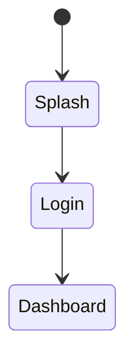

# Technical Document Layout Psychology

This document defines layout principles for IEC 62304 technical documents (SRS/SDD/SWD/STP/STC/SVV/RTM),
ensuring documents are easy to read, understand, and use, improving development efficiency across different reader roles.

## Core Concepts

Technical documents are not just carriers for recording requirements and designs, but also communication media for the team.
Good document layout should consider:

1. **Reader Diversity**: SA/SD/PG/QA/RA each have different reading purposes
2. **Cognitive Load**: Avoid information overload, progressive disclosure
3. **Reading Efficiency**: Support both quick lookup and deep reading modes
4. **Traceability**: Clear ID system, complete traceability chain

---

## 1. Reader Role Analysis

### 1.1 Reading Characteristics by Role

| Role | Abbr | Reading Purpose | Main Focus Documents/Sections | Reading Mode |
|------|------|-----------------|------------------------------|--------------|
| **System Analyst** | SA | Confirm requirement completeness | Full SRS, interview records | Comprehensive reading |
| **System Designer** | SD | Understand architecture and patterns | SRS functional requirements, SDD architecture | Structured reading |
| **Programmer** | PG | Implementation details, API | SDD module design, SWD classes | Jump-style lookup |
| **Quality Engineer** | QA | Test cases, verification | SRS AC, STC, SVV | Traceability reading |
| **Regulatory Specialist** | RA | Compliance evidence, traceability | RTM, SVV, all document covers | Audit-style checking |

### 1.2 Reading Mode Descriptions

| Reading Mode | Description | Document Layout Support |
|--------------|-------------|------------------------|
| **Comprehensive Reading** | Read from start to finish | Logical chapter order, clear TOC |
| **Structured Reading** | Read by architecture levels | Clear hierarchy, modular organization |
| **Jump-style Lookup** | Quickly find specific info | Clear IDs, searchable tables |
| **Traceability Reading** | Track from requirements to tests | Traceability IDs, hyperlinks |
| **Audit-style Checking** | Verify completeness and compliance | Overview tables, statistical summaries |

---

## 2. Document Reading Flow Design

### 2.1 Document Reading Order

```
Typical Development Team Reading Paths:

SA Reading Path:
Interview Records → Full SRS → RTM (verify completeness)

SD Reading Path:
SRS (Functional Requirements) → SDD (Architecture Design) → SDD (Module Design)

PG Reading Path:
SDD (Module Overview) → SDD (Detailed Design) → SWD (Class Design) → API Specs

QA Reading Path:
SRS (AC) → STC (Test Cases) → SVV (Verification Results) → RTM (Trace Verification)

RA Reading Path:
RTM → All Document Covers → SVV → Spot Check Documents
```

### 2.2 Single Document Reading Flow

```
Reader's mental model when reading a single document:

1. Cover/TOC ──→ Build overall cognition (What is this document about?)
       │
       ▼
2. Introduction/Overview ──→ Understand context (Why is this document needed?)
       │
       ▼
3. Overview Tables ──→ Grasp full picture (What items? How many?)
       │
       ▼
4. Detailed Content ──→ Deep understanding (Details of each item)
       │
       ▼
5. Traceability/Appendix ──→ Verify completeness (Is everything covered?)
```

---

## 3. Core Document Layout Principles

### 3.1 F-Pattern Reading

Users' eyes move in an F-pattern when reading web pages/documents:
- First scan horizontally across the top
- Move down, then scan horizontally again
- Scan vertically down the left side

**Layout Application:**

| Position | Content to Place | Example |
|----------|-----------------|---------|
| Top-left | Most important identification | Document title, ID |
| Top horizontal | Key summary info | Version, date, status |
| Left vertical | Navigation elements | Chapter titles, ID columns |

### 3.2 Visual Hierarchy

```
H1 (18pt) ─────────────── Document Title
    │
    ├── H2 (16pt) ──────── Major Chapter
    │       │
    │       ├── H3 (14pt) ─ Section
    │       │       │
    │       │       └── H4 (13pt) ─ Subsection
    │       │               │
    │       │               └── Body (11pt)
    │       │
    │       └── Table (11pt)
    │
    └── Footer (9pt)
```

### 3.3 Progressive Disclosure

**Principle:** Overview first, details later

```markdown
## 3. Module Design

### Module Overview Table ← Layer 1: Reader grasps full picture first

| Module | Design ID Count | Related Req Count | Description |
|--------|-----------------|-------------------|-------------|
| AUTH | 5 | 7 | Authentication module |
| TRAIN | 8 | 12 | Training module |

### 3.1 Authentication Module (AUTH) ← Layer 2: Module overview

| Design ID | Name | Related Requirement |
|-----------|------|---------------------|
| SDD-AUTH-001 | ... | REQ-AUTH-001 |

#### 3.1.1 Authentication Architecture Design ← Layer 3: Detailed content

[Detailed design content]
```

### 3.4 Chunking

**Miller's Law:** Human short-term memory capacity is about 7±2 (modern research: 4±1) items

| Application Scenario | Recommended Quantity | Layout Method |
|---------------------|---------------------|---------------|
| Chapter count | 5-7 chapters | Split into sub-documents if more |
| Table columns | ≤7 columns | Split tables if more |
| List items | 3-5 items | Group if more |
| Steps | ≤5 steps | Divide into phases if more |

### 3.5 Consistency

**Unified Format Specifications:**

| Item | Specification |
|------|---------------|
| ID format | `{Document}-{Module}-{Three digits}` |
| Date format | YYYY-MM-DD |
| Version format | X.Y (Major.Minor) |
| Terminology | Unified glossary |
| Table columns | Fixed column order |

---

## 4. SRS Document Layout Guide

### 4.1 Chapter Structure

```
SRS Standard Structure (Optimized for Different Readers)

## 1. Introduction ← SA/SD/RA: Build context
   - Document purpose
   - Scope
   - Terminology definitions

## 2. Overall Description ← SA/SD: Understand system overview
   - Product perspective (context diagram)
   - User characteristics (role table)
   - Constraints and assumptions

## 3. Functional Requirements ← SD/PG: Implementation basis
   ### 3.1 Module Overview Table ← Grasp full picture first
   ### 3.2 Module A
       #### REQ-A-001 ← Detailed requirement
   ### 3.3 Module B
       #### REQ-B-001

## 4. Non-Functional Requirements ← SD/QA: Quality metrics
   - Performance requirements (quantified)
   - Security requirements
   - Usability requirements

## 5. Appendix ← RA: Traceability verification
   - Glossary
   - Abbreviations
```

### 4.2 Requirement Item Layout

```markdown
##### REQ-AUTH-001 User Login ← ID + Name (quick identification)

**Statement:** ← One-sentence description
The system shall provide user login functionality, supporting Email and third-party login.

**Rationale:** ← Why needed (including psychology basis)
- **Security**: Ensure only authorized users can access the system
- **Convenience**: Third-party login reduces memory burden (Cognitive Load Theory)

**Acceptance Criteria:** ← Acceptance standards (QA focus)
- AC1: When user enters correct credentials and clicks login, system navigates to home
- AC2: When 5 consecutive login failures occur, system locks account for 15 minutes - Error Prevention

**Verification Method:** Test ← Verification method

**Trace:** ← Traceability info (RA focus)
- SDD: SDD-AUTH-001
- STC: STC-AUTH-001
```

### 4.3 Rationale Psychology Annotations

| Psychology Principle | Annotation Format | When to Use |
|---------------------|-------------------|-------------|
| Cognitive Load | **Cognitive Load Theory**: ... | Information presentation, step design |
| Working Memory | **Working Memory Limit**: ... | Step count, option count |
| F-Pattern | **F-Pattern Reading**: ... | Information position |
| Fitts' Law | **Fitts' Law**: ... | Button size, position |
| Hick's Law | **Hick's Law**: ... | Option quantity |
| Error Prevention | **Error Prevention**: ... | Fail-safe design |
| Progressive Disclosure | **Progressive Disclosure**: ... | Flow design |
| Spatial Orientation | **Spatial Orientation**: ... | Navigation design |

---

## 5. SDD Document Layout Guide

### 5.1 Chapter Structure

```
SDD Standard Structure (SD/PG Optimized)

## 1. Introduction ← SD: Design principles
   - Design principles (including psychology principles)
   - Architecture overview

## 2. System Architecture ← SD: Overall architecture
   - Layered architecture diagram (Mermaid)
   - Technology selection table

## 3. Module Design ← PG: Implementation reference
   ### 3.1 Module Overview ← Grasp full picture first
   ### 3.2 Authentication Module (AUTH)
       #### 3.2.1 Architecture Design ← Module-level architecture
       #### 3.2.2 Screen Design ← UI implementation reference

## 4. Data Design ← PG: Database
   - ER diagram
   - Entity definitions

## 5. Interface Design ← PG: API specs
   - API specifications (backend)
   - UI screens (frontend)
```

### 5.2 Module Internal Layout

```markdown
### 3.2 Authentication Module (AUTH)

| Design ID | Name | Related Requirements | Related Screens | Description |
|-----------|------|---------------------|-----------------|-------------|
| SDD-AUTH-001 | Auth Architecture | REQ-AUTH-001~003 | SCR-AUTH-001 | Auth flow |
| SDD-AUTH-002 | Token Management | REQ-AUTH-002 | - | JWT handling |

↑ Overview table: Lets PG quickly grasp module overview

#### 3.2.1 Authentication Architecture Design

**State Machine Design**



↑ Diagram: Visualize complex logic

**Service Interface**

```dart
abstract class AuthService {
  Future<Result> login(String email, String password);
}
```

↑ Code: PG direct reference

#### 3.2.2 Screen Design: SCR-AUTH-001 Login Screen

| Item | Content |
|------|---------|
| Screen ID | SCR-AUTH-001 |
| Related Design | SDD-AUTH-001 |
| Related Requirements | REQ-AUTH-001 |

↑ Property table: Quick lookup

**Wireframe**


↑ Wireframe: UI structure reference
```

---

## 6. SWD Document Layout Guide

### 6.1 PG-Oriented Layout

```
SWD Standard Structure (PG Optimized)

## 1. Module Overview ← Quick positioning

| Module | Class Count | Main Responsibility |
|--------|-------------|---------------------|
| Auth | 5 | Authentication logic |

## 2. Authentication Module (AUTH)
   ### 2.1 Class Overview Table ← List all classes first
   ### 2.2 AuthService Class ← Detailed design
       - Class diagram
       - Method signatures
       - Logic explanation
       - Code examples
```

### 6.2 Class Design Layout

```markdown
### 2.2 AuthService Class

**Class Info**

| Item | Content |
|------|---------|
| Class Name | AuthService |
| Responsibility | Handle user authentication logic |
| Related Design | SDD-AUTH-001 |
| Dependencies | UserRepository, TokenManager |

**Method Overview** ← PG quick API lookup

| Method | Parameters | Return | Description |
|--------|------------|--------|-------------|
| login | email, password | Result<User> | User login |
| logout | - | void | Logout |

**Method Detailed Design**

#### login(email: String, password: String): Result<User>

**Logic Flow:**

```mermaid
sequenceDiagram
    Client->>AuthService: login(email, pwd)
    AuthService->>Repository: findByEmail(email)
    ...
```

**Code Example:**

```dart
Future<Result<User>> login(String email, String password) async {
  // Implementation logic
}
```
```

---

## 7. Table Readability Design

### 7.1 Table Layout Principles

| Principle | Description | Implementation |
|-----------|-------------|----------------|
| **Column Order** | ID → Name → Details → Traceability | Follows F-pattern |
| **Column Width** | ID fixed narrow, description variable | Adjust based on content |
| **Header Style** | Bold, background color | Distinguish header from content |
| **Zebra Striping** | Alternating background for large tables | Improve readability |
| **Column Limit** | ≤7 columns | Avoid horizontal scrolling |
| **ID No Wrap** | ID column stays single line | Ensure copyable |

### 7.2 Common Table Formats

**Requirements Overview Table:**

| Requirement ID | Requirement Name | Priority | Status |
|----------------|------------------|----------|--------|

**Design Traceability Table:**

| Design ID | Name | Related Requirements | Related Screens | Description |
|-----------|------|---------------------|-----------------|-------------|

**Test Traceability Table:**

| Test ID | Test Name | Related Requirements | Result |
|---------|-----------|---------------------|--------|

---

## 8. Diagram Readability

### 8.1 Mermaid Diagram Direction

| Diagram Type | Recommended Direction | Reason |
|--------------|----------------------|--------|
| Flowchart | TB (Top-Bottom) | Matches reading habits |
| Architecture Diagram | TB | Clear layering |
| Sequence Diagram | box grouping | Reduce horizontal width |
| State Diagram | TB + grouping | Avoid being too wide |
| Class Diagram | TB + namespace | Logical grouping |
| ER Diagram | Auto | ER diagrams auto-adjust |

### 8.2 Diagram Size Guide

| Usage | Render Size | Max Display Width | Description |
|-------|-------------|-------------------|-------------|
| UI Wireframe | 800px | 500px | Suitable for mobile screens |
| Flowchart/Architecture | 1200px | 600px | Suitable for A4 |
| Sequence Diagram | 1200px | 600px | Suitable for A4 |
| ER Diagram | 1200px | 600px | Suitable for A4 |

### 8.3 Diagram Title Standards

```markdown
**Figure 3.1: Authentication Flow State Machine**


↑ Diagram title placed above the diagram, includes number
```

---

## 9. Document Layout Checklist

### 9.1 Structure Check

| Check Item | Pass Criteria | Notes |
|------------|---------------|-------|
| Cover complete? | Includes title, version, date, author | |
| TOC exists? | Lists all major chapters | |
| Introduction chapter? | Explains document purpose and scope | |
| Overview tables? | Each major chapter has overview table | Progressive disclosure |
| Hierarchy correct? | H1→H2→H3 progression | Visual hierarchy |

### 9.2 Format Check

| Check Item | Pass Criteria | Notes |
|------------|---------------|-------|
| ID format unified? | `{DOC}-{MOD}-{NNN}` | |
| IDs no wrap? | Single line display | |
| Date format? | YYYY-MM-DD | |
| Table column order? | ID in first column | F-pattern |
| Table column count? | ≤7 columns | |
| Diagram direction? | TB preferred | |

### 9.3 Traceability Check

| Check Item | Pass Criteria | Notes |
|------------|---------------|-------|
| Traceability ID exists? | Each item has traceability field | |
| Traceability ID correct? | Can map to target document | |
| 100% traceability? | RTM shows full coverage | |

### 9.4 Readability Check

| Check Item | Pass Criteria | Notes |
|------------|---------------|-------|
| Consistent terminology? | Unified wording | |
| Sentence length? | Single sentence ≤50 chars | |
| Paragraph length? | Single paragraph ≤5 sentences | |
| Key points marked? | Keywords bolded | |
| Diagrams clear? | Text readable, not too small | |

---

## 10. Reference Resources

### Academic Literature
- Nielsen, J. (2006). F-Shaped Pattern For Reading Web Content
- Miller, G. A. (1956). The Magical Number Seven, Plus or Minus Two
- Krug, S. (2014). Don't Make Me Think, Revisited

### Related Standards
- IEC 62304:2015 - Medical Device Software Life Cycle
- IEEE 1016:2009 - Software Design Description
- IEEE 830:1998 - Software Requirements Specification

### Related Skill Documents
- [design-psychology.md](design-psychology.md) - Design Psychology Principles
- [cognitive-psychology.md](cognitive-psychology.md) - Cognitive Psychology Principles
