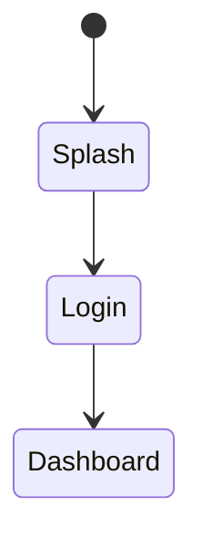

# 技術文件編排心理學 (Document Layout Psychology)

本文件定義 IEC 62304 技術文件 (SRS/SDD/SWD/STP/STC/SVV/RTM) 的編排原則，
確保文件易於閱讀、理解與使用，提升不同角色讀者的開發效率。

## 核心理念

技術文件不僅是記錄需求與設計的載體，更是團隊溝通的媒介。
良好的文件編排應考量：

1. **讀者多樣性**：SA/SD/PG/QA/RA 各有不同閱讀目的
2. **認知負荷**：避免資訊過載，漸進式揭露
3. **閱讀效率**：支援快速查找與深入閱讀兩種模式
4. **可追溯性**：ID 系統清晰，追溯鏈完整

---

## 1. 讀者角色分析 (Reader Role Analysis)

### 1.1 各角色閱讀特徵

| 角色 | 縮寫 | 閱讀目的 | 主要關注文件/章節 | 閱讀模式 |
|------|------|---------|------------------|---------|
| **系統分析師** | SA | 確認需求完整性 | SRS 全文、訪談紀錄 | 全面閱讀 |
| **系統設計師** | SD | 理解架構與模式 | SRS 功能需求、SDD 架構 | 結構化閱讀 |
| **程式設計師** | PG | 實作細節、API | SDD 模組設計、SWD 類別 | 跳躍式查閱 |
| **品質工程師** | QA | 測試案例、驗證 | SRS AC、STC、SVV | 追溯式閱讀 |
| **法規專員** | RA | 合規證據、追溯 | RTM、SVV、所有文件封面 | 稽核式檢查 |

### 1.2 閱讀模式說明

| 閱讀模式 | 說明 | 文件編排支援 |
|---------|------|------------|
| **全面閱讀** | 從頭到尾閱讀 | 邏輯章節順序、清楚目錄 |
| **結構化閱讀** | 按架構層級閱讀 | 明確層級、模組化組織 |
| **跳躍式查閱** | 快速找到特定資訊 | 清晰 ID、可搜尋表格 |
| **追溯式閱讀** | 從需求追蹤到測試 | 追溯 ID、超連結 |
| **稽核式檢查** | 驗證完整性與合規 | 總覽表、統計摘要 |

---

## 2. 文件閱讀流程設計

### 2.1 文件閱讀順序

```
典型開發團隊閱讀路徑：

SA 閱讀路徑：
訪談紀錄 → SRS 全文 → RTM (驗證完整)

SD 閱讀路徑：
SRS (功能需求) → SDD (架構設計) → SDD (模組設計)

PG 閱讀路徑：
SDD (模組總覽) → SDD (詳細設計) → SWD (類別設計) → API 規格

QA 閱讀路徑：
SRS (AC) → STC (測試案例) → SVV (驗證結果) → RTM (追溯驗證)

RA 閱讀路徑：
RTM → 所有文件封面 → SVV → 抽查各文件
```

### 2.2 單一文件閱讀流程

```
讀者閱讀單一文件時的心智模型：

1. 封面/目錄 ─→ 建立整體認知 (這份文件在講什麼？)
       │
       ▼
2. 簡介/總覽 ─→ 理解上下文 (為什麼需要這份文件？)
       │
       ▼
3. 總覽表格 ──→ 掌握全貌 (有哪些項目？多少項目？)
       │
       ▼
4. 詳細內容 ──→ 深入理解 (各項目的細節)
       │
       ▼
5. 追溯/附錄 ─→ 驗證完整 (是否涵蓋所有？)
```

---

## 3. 文件編排核心原則

### 3.1 F 型閱讀模式 (F-Pattern Reading)

使用者閱讀網頁/文件時，視線呈 F 型移動：
- 先橫向掃描頂部
- 向下移動，再橫向掃描
- 沿左側垂直向下掃描

**編排應用：**

| 位置 | 應放置內容 | 範例 |
|------|----------|------|
| 左上角 | 最重要的識別資訊 | 文件標題、ID |
| 頂部橫向 | 關鍵摘要資訊 | 版本、日期、狀態 |
| 左側垂直 | 導航元素 | 章節標題、ID 欄位 |

### 3.2 視覺層級 (Visual Hierarchy)

```
H1 (18pt) ─────────────── 文件標題
    │
    ├── H2 (16pt) ──────── 大章節
    │       │
    │       ├── H3 (14pt) ─ 小節
    │       │       │
    │       │       └── H4 (13pt) ─ 子節
    │       │               │
    │       │               └── 內文 (11pt)
    │       │
    │       └── 表格 (11pt)
    │
    └── 頁尾 (9pt)
```

### 3.3 漸進式揭露 (Progressive Disclosure)

**原則：** 先總覽，後詳細

```markdown
## 3. 模組設計

### 模組總覽表 ← 第一層：讀者先掌握全貌

| 模組 | 設計 ID 數 | 對應需求數 | 說明 |
|------|----------|----------|------|
| AUTH | 5 | 7 | 認證模組 |
| TRAIN | 8 | 12 | 訓練模組 |

### 3.1 認證模組 (AUTH) ← 第二層：模組總覽

| 設計 ID | 名稱 | 對應需求 |
|---------|------|---------|
| SDD-AUTH-001 | ... | REQ-AUTH-001 |

#### 3.1.1 認證架構設計 ← 第三層：詳細內容

[詳細設計內容]
```

### 3.4 分塊呈現 (Chunking)

**Miller's Law:** 人類短期記憶容量約 7±2 (現代研究：4±1) 項目

| 應用場景 | 建議數量 | 編排方式 |
|---------|---------|---------|
| 章節數 | 5-7 章 | 超過則分成子文件 |
| 表格欄數 | ≤7 欄 | 超過則拆分表格 |
| 列表項目 | 3-5 項 | 超過則分組 |
| 步驟數 | ≤5 步 | 超過則分階段 |

### 3.5 一致性 (Consistency)

**統一的格式規範：**

| 項目 | 規範 |
|------|------|
| ID 格式 | `{文件}-{模組}-{三位數}` |
| 日期格式 | YYYY-MM-DD |
| 版本格式 | X.Y (主版本.次版本) |
| 術語 | 統一術語表 |
| 表格欄位 | 固定欄位順序 |

---

## 4. SRS 文件編排指南

### 4.1 章節結構

```
SRS 標準結構 (針對不同讀者優化)

## 1. 簡介 ← SA/SD/RA: 建立上下文
   - 文件目的
   - 範圍
   - 術語定義

## 2. 總體描述 ← SA/SD: 理解系統全貌
   - 產品觀點 (上下文圖)
   - 使用者特徵 (角色表)
   - 約束與假設

## 3. 功能需求 ← SD/PG: 實作依據
   ### 3.1 模組總覽表 ← 先掌握全貌
   ### 3.2 模組 A
       #### REQ-A-001 ← 詳細需求
   ### 3.3 模組 B
       #### REQ-B-001

## 4. 非功能需求 ← SD/QA: 品質指標
   - 效能需求 (量化)
   - 安全需求
   - 可用性需求

## 5. 附錄 ← RA: 追溯驗證
   - 術語表
   - 縮寫表
```

### 4.2 需求項目編排

```markdown
##### REQ-AUTH-001 使用者登入 ← ID + 名稱 (快速識別)

**Statement:** ← 一句話描述
系統應提供使用者登入功能，支援 Email 與第三方登入。

**Rationale:** ← 為什麼需要 (含心理學依據)
- **安全性**：確保只有授權使用者可存取系統
- **便利性**：第三方登入減少記憶負擔 (認知負荷理論)

**Acceptance Criteria:** ← 驗收標準 (QA 關注)
- AC1: 當 使用者輸入正確帳密，點擊登入，並系統導向首頁
- AC2: 當 連續 5 次登入失敗，並系統鎖定帳戶 15 分鐘 - 錯誤預防

**Verification Method:** Test ← 驗證方式

**Trace:** ← 追溯資訊 (RA 關注)
- SDD: SDD-AUTH-001
- STC: STC-AUTH-001
```

### 4.3 Rationale 心理學標註

| 心理學原則 | 標註格式 | 使用時機 |
|-----------|---------|---------|
| 認知負荷 | **認知負荷理論**：... | 資訊呈現、步驟設計 |
| 工作記憶 | **工作記憶限制**：... | 步驟數、選項數 |
| F 型閱讀 | **F 型閱讀**：... | 資訊位置 |
| Fitts' Law | **Fitts' Law**：... | 按鈕尺寸、位置 |
| Hick's Law | **Hick's Law**：... | 選項數量 |
| 錯誤預防 | **錯誤預防**：... | 防呆設計 |
| 漸進揭露 | **漸進式揭露**：... | 流程設計 |
| 空間定向 | **空間定向**：... | 導航設計 |

---

## 5. SDD 文件編排指南

### 5.1 章節結構

```
SDD 標準結構 (SD/PG 優化)

## 1. 簡介 ← SD: 設計原則
   - 設計原則 (含心理學原則)
   - 架構概述

## 2. 系統架構 ← SD: 整體架構
   - 分層架構圖 (Mermaid)
   - 技術選型表

## 3. 模組設計 ← PG: 實作參考
   ### 3.1 模組總覽 ← 先掌握全貌
   ### 3.2 認證模組 (AUTH)
       #### 3.2.1 架構設計 ← 模組層級架構
       #### 3.2.2 畫面設計 ← UI 實作參考

## 4. 資料設計 ← PG: 資料庫
   - ER 圖
   - Entity 定義

## 5. 介面設計 ← PG: API 規格
   - API 規格 (後端)
   - UI 畫面 (前端)
```

### 5.2 模組內部編排

```markdown
### 3.2 認證模組 (AUTH)

| 設計 ID | 名稱 | 對應需求 | 對應畫面 | 說明 |
|---------|------|---------|----------|------|
| SDD-AUTH-001 | 認證架構 | REQ-AUTH-001~003 | SCR-AUTH-001 | 認證流程 |
| SDD-AUTH-002 | Token 管理 | REQ-AUTH-002 | - | JWT 處理 |

↑ 總覽表：讓 PG 快速掌握模組全貌

#### 3.2.1 認證架構設計

**狀態機設計**



↑ 圖表：視覺化複雜邏輯

**服務介面**

```dart
abstract class AuthService {
  Future<Result> login(String email, String password);
}
```

↑ 程式碼：PG 直接參考

#### 3.2.2 畫面設計：SCR-AUTH-001 登入畫面

| 項目 | 內容 |
|------|------|
| 畫面 ID | SCR-AUTH-001 |
| 對應設計 | SDD-AUTH-001 |
| 對應需求 | REQ-AUTH-001 |

↑ 屬性表：快速查閱

**Wireframe**


↑ Wireframe：UI 結構參考
```

---

## 6. SWD 文件編排指南

### 6.1 PG 導向編排

```
SWD 標準結構 (PG 優化)

## 1. 模組總覽 ← 快速定位

| 模組 | 類別數 | 主要職責 |
|------|--------|---------|
| Auth | 5 | 認證邏輯 |

## 2. 認證模組 (AUTH)
   ### 2.1 類別總覽表 ← 先列出所有類別
   ### 2.2 AuthService 類別 ← 詳細設計
       - 類別圖
       - 方法簽名
       - 邏輯說明
       - 程式碼範例
```

### 6.2 類別設計編排

```markdown
### 2.2 AuthService 類別

**類別資訊**

| 項目 | 內容 |
|------|------|
| 類別名稱 | AuthService |
| 職責 | 處理使用者認證邏輯 |
| 對應設計 | SDD-AUTH-001 |
| 依賴 | UserRepository, TokenManager |

**方法總覽** ← PG 快速查閱 API

| 方法 | 參數 | 回傳 | 說明 |
|------|------|------|------|
| login | email, password | Result<User> | 使用者登入 |
| logout | - | void | 登出 |

**方法詳細設計**

#### login(email: String, password: String): Result<User>

**邏輯流程：**

```mermaid
sequenceDiagram
    Client->>AuthService: login(email, pwd)
    AuthService->>Repository: findByEmail(email)
    ...
```

**程式碼範例：**

```dart
Future<Result<User>> login(String email, String password) async {
  // 實作邏輯
}
```
```

---

## 7. 表格設計可讀性

### 7.1 表格編排原則

| 原則 | 說明 | 實作方式 |
|------|------|---------|
| **欄位順序** | ID → 名稱 → 詳細 → 追溯 | 符合 F 型閱讀 |
| **欄寬比例** | ID 固定窄，說明可變寬 | 根據內容調整 |
| **表頭樣式** | 粗體、背景色 | 區分表頭與內容 |
| **斑馬條紋** | 大表格交替背景色 | 提升可讀性 |
| **欄數限制** | ≤7 欄 | 避免水平滾動 |
| **ID 不換行** | ID 欄位保持單行 | 確保可複製 |

### 7.2 常用表格格式

**需求總覽表：**

| 需求 ID | 需求名稱 | 優先級 | 狀態 |
|---------|---------|--------|------|

**設計追溯表：**

| 設計 ID | 名稱 | 對應需求 | 對應畫面 | 說明 |
|---------|------|---------|----------|------|

**測試追溯表：**

| 測試 ID | 測試名稱 | 對應需求 | 結果 |
|---------|---------|---------|------|

---

## 8. 圖表可讀性

### 8.1 Mermaid 圖表方向

| 圖表類型 | 建議方向 | 原因 |
|---------|---------|------|
| 流程圖 | TB (上到下) | 符合閱讀習慣 |
| 架構圖 | TB | 分層清晰 |
| 序列圖 | 分組 box | 減少橫向寬度 |
| 狀態圖 | TB + 分組 | 避免過寬 |
| 類別圖 | TB + namespace | 邏輯分組 |
| ER 圖 | 自動 | ER 圖會自動調整 |

### 8.2 圖表尺寸指南

| 用途 | 渲染尺寸 | 顯示最大寬度 | 說明 |
|------|---------|-------------|------|
| UI Wireframe | 800px | 500px | 適合手機畫面 |
| 流程圖/架構圖 | 1200px | 600px | 適合 A4 |
| 序列圖 | 1200px | 600px | 適合 A4 |
| ER 圖 | 1200px | 600px | 適合 A4 |

### 8.3 圖表標題規範

```markdown
**圖 3.1：認證流程狀態機**


↑ 圖表標題放在圖表上方，包含編號
```

---

## 9. 文件編排檢查清單

### 9.1 結構檢查

| 檢查項目 | 通過標準 | 備註 |
|---------|---------|------|
| 封面完整？ | 包含標題、版本、日期、作者 | |
| 目錄存在？ | 列出所有主要章節 | |
| 簡介章節？ | 說明文件目的與範圍 | |
| 總覽表格？ | 每大章有總覽表 | 漸進式揭露 |
| 層級正確？ | H1→H2→H3 遞進 | 視覺層級 |

### 9.2 格式檢查

| 檢查項目 | 通過標準 | 備註 |
|---------|---------|------|
| ID 格式統一？ | `{DOC}-{MOD}-{NNN}` | |
| ID 不換行？ | 單行顯示 | |
| 日期格式？ | YYYY-MM-DD | |
| 表格欄位順序？ | ID 在首欄 | F 型閱讀 |
| 表格欄數？ | ≤7 欄 | |
| 圖表方向？ | TB 優先 | |

### 9.3 追溯檢查

| 檢查項目 | 通過標準 | 備註 |
|---------|---------|------|
| 追溯 ID 存在？ | 每項目有追溯欄位 | |
| 追溯 ID 正確？ | 可對應到目標文件 | |
| 追溯 100%？ | RTM 顯示全部覆蓋 | |

### 9.4 可讀性檢查

| 檢查項目 | 通過標準 | 備註 |
|---------|---------|------|
| 術語一致？ | 統一用詞 | |
| 句子長度？ | 單句 ≤50 字 | |
| 段落長度？ | 單段 ≤5 句 | |
| 重點標示？ | 關鍵字粗體 | |
| 圖表清晰？ | 文字可讀、不過小 | |

---

## 10. 參考資源

### 學術文獻
- Nielsen, J. (2006). F-Shaped Pattern For Reading Web Content
- Miller, G. A. (1956). The Magical Number Seven, Plus or Minus Two
- Krug, S. (2014). Don't Make Me Think, Revisited

### 相關標準
- IEC 62304:2015 - Medical Device Software Life Cycle
- IEEE 1016:2009 - Software Design Description
- IEEE 830:1998 - Software Requirements Specification

### 相關 Skill 文件
- [design-psychology.md](design-psychology.md) - 設計心理學原則
- [cognitive-psychology.md](cognitive-psychology.md) - 認知心理學原則
