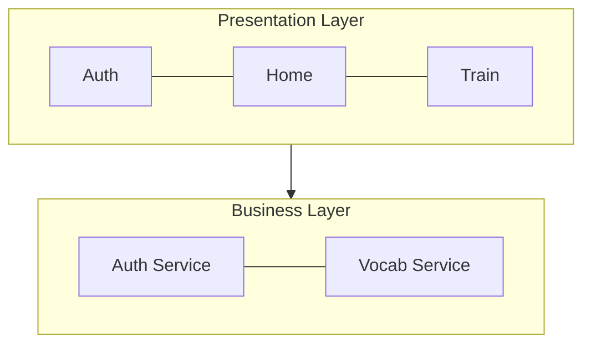

# IEC 62304 文件標準規範

本文件定義所有 IEC 62304 文件的統一格式規範，確保 SRS、SDD、SWD、STP、STC、SVV、RTM 等文件具有一致的外觀與品質。

---

## 1. 通用文件格式規範 (所有文件適用)

### 1.1 標準封面格式

所有 IEC 62304 文件必須包含以下封面資訊：

```markdown
# {Document-Type}-{ProjectName}-{Version}

## {文件類型中文名稱} ({Document Type English Name})

**文件編號：** {DOC-ID}
**版本：** {X.Y}
**建立日期：** {YYYY-MM-DD}
**最後更新：** {YYYY-MM-DD}
**專案名稱：** {Project Name}
**文件狀態：** {草稿/審核中/已核准}

---

### 文件核准

| 角色 | 姓名 | 日期 |
|------|------|------|
| 作者 | | |
| 審核者 | | |
| 核准者 | | |

---

## 目錄
```

> ⚠️ **格式注意事項：**
> - 文件資訊使用 **粗體標籤** 格式，不使用表格
> - 文件核准表格放在封面，文件結尾不再重複
> - 版本歷史作為第 1 章節，不在封面

### 1.2 文件類型對照表

| 縮寫 | 中文名稱 | 英文名稱 |
|------|----------|----------|
| SRS | 軟體需求規格書 | Software Requirements Specification |
| SDD | 軟體設計規格書 | Software Design Description |
| SWD | 軟體詳細設計文件 | Software Detailed Design |
| STP | 軟體測試計畫 | Software Test Plan |
| STC | 軟體測試案例 | Software Test Cases |
| SVV | 軟體驗證與確認 | Software Verification & Validation |
| RTM | 需求追溯矩陣 | Requirements Traceability Matrix |

### 1.3 雙向追蹤 (Bidirectional Traceability) ⚠️ MANDATORY

> **IEC 62304 要求 SRS 與 SDD 必須建立雙向追蹤**

| 方向 | 文件 | 欄位 | 範例 |
|------|------|------|------|
| SRS → SDD | SRS 需求表格 | `\| **SDD 追蹤** \| SCR-xxx \|` | `SCR-AUTH-001-login, SCR-AUTH-002-register` |
| SDD → SRS | SDD 畫面表格 | `\| **對應需求** \| REQ-xxx \|` | `REQ-AUTH-001, REQ-AUTH-002` |

**SRS 需求表格範例：**
```markdown
| 屬性 | 內容 |
|-----|------|
| **ID** | REQ-AUTH-001 |
| **描述** | 系統應允許使用者透過 Email 與密碼進行登入驗證 |
| **優先級** | P0 |
| **相關需求** | REQ-AUTH-005, REQ-AUTH-006 |
| **SDD 追蹤** | SCR-AUTH-001-login, SCR-AUTH-002-register |
```

**SDD 畫面表格範例：**
```markdown
| 屬性 | 內容 |
|-----|------|
| **畫面 ID** | SCR-AUTH-001-login |
| **畫面名稱** | 登入畫面 |
| **對應需求** | REQ-AUTH-001, REQ-AUTH-002 |
```

### 1.4 中文字型設定 (原 1.3)

DOCX 輸出時，字型設定如下：

| 字元類型 | 字型 |
|---------|------|
| 英文/半形 (ascii) | Arial |
| 中文/全形 (eastAsia) | 微軟正黑體 |
| 標題 | Arial + 微軟正黑體 (混合) |
| 程式碼 | Consolas |

### 1.5 字型大小設定 (原 1.4)

| 元素 | 大小 |
|------|------|
| H1 | 18pt |
| H2 | 16pt |
| H3 | 14pt |
| H4 | 13pt |
| H5 | 12pt |
| 內文 | 11pt |
| 表格 | 11pt |
| 頁尾 | 9pt |

### 1.6 Code Block 使用規則 (原 1.5)

**Code Block（```）僅用於實際程式碼**，DOCX 轉換時會套用等寬字體 + 灰色背景。

| 內容類型 | 是否使用 Code Block | 說明 |
|---------|-------------------|------|
| 程式碼 (SQL, JSON, Swift, Kotlin) | ✅ 使用 | 正確用法 |
| Mermaid 圖表 | ✅ 使用 ```mermaid | 必須標註語言 |
| Use Case (前置/後置條件、流程) | ❌ 禁止 | 使用粗體標籤 + 編號清單 |
| 一般說明文字 | ❌ 禁止 | 使用段落或清單 |
| **ASCII Art** | ❌ **嚴禁** | 改用 Mermaid |

---

## 2. Mermaid 圖表規範 (所有文件適用)

### 2.1 方向規則

> ⚠️ **重要：優先使用直式 (TB) 而非橫式 (LR)**

DOCX 輸出時，橫式圖表會被縮小導致文字難以閱讀。

| 圖表類型 | 推薦方向 | 說明 |
|---------|---------|------|
| 流程圖 (flowchart) | `TB` (Top-Bottom) | 直式，文字清晰 |
| 架構圖 | `TB` | 直式，層次分明 |
| 簡單連接 (≤3 節點) | `LR` 可接受 | 橫式仍可讀 |
| 時序圖 (sequence) | 無方向參數 | 自動直式 |

### 2.2 混合模式 (層間直式 + 層內橫式)

適用於多層架構圖，讓圖表變寬但變矮：



### 2.3 禁止格式

❌ **禁止使用 ASCII 製圖**

```
不允許：
+--------+     +--------+
| Box A  | --> | Box B  |
+--------+     +--------+
```

❌ **禁止純橫式流程圖**

```
不允許：flowchart LR
```

### 2.4 圖片格式要求

| 圖片類型 | 格式 | 說明 |
|---------|------|------|
| Mermaid 圖表 | **SVG** (強制) | 向量格式，無限縮放不失真 |
| UI 畫面設計 | **PNG** | 使用 `` 語法 |
| 外部匯入圖片 | **SVG** (優先) | 或高解析度 PNG |

### 2.5 圖片尺寸限制

- 最大寬度：550px (~6 吋，適合 A4)
- 最大高度：600px (防止溢出頁面)
- 最小尺寸：200px (避免過小)
- 所有圖片自動置中

---

## 3. 顏色標準 (所有文件適用)

### 3.1 Class Diagram 顏色 (Peter Coad Color UML)

| 類別 | 顏色 | Hex | 用途 |
|------|------|-----|------|
| Moment-Interval (MI) | 粉紅色 | #FFCCCC | 事件、交易、時間點 |
| Role | 黃色 | #FFFFCC | 角色、身份 |
| Thing | 綠色 | #CCFFCC | 實體、物件 |
| Description | 藍色 | #CCE5FF | 描述、類型定義 |

### 3.2 State Machine 顏色

| 狀態類型 | 顏色 | Hex |
|---------|------|-----|
| 初始狀態 | 淺灰 | #E0E0E0 |
| 處理中 | 淺藍 | #CCE5FF |
| 成功/完成 | 淺綠 | #CCFFCC |
| 失敗/錯誤 | 淺紅 | #FFCCCC |
| 警告/待處理 | 淺黃 | #FFFFCC |

### 3.3 C4 Model 架構圖顏色

| 元素 | 顏色 | Hex |
|------|------|-----|
| Person | 藍色 | #08427B |
| Software System | 深藍 | #1168BD |
| Container | 淺藍 | #438DD5 |
| Component | 更淺藍 | #85BBF0 |
| External System | 灰色 | #999999 |

---

## 4. SRS 專屬規範

### 4.1 章節結構

```markdown
## 1. 產品概述
## 2. 利害關係人分析
## 3. 功能需求
## 4. 非功能需求
## 5. 介面需求
## 6. 軟體安全分類
## 7. 附錄
```

### 4.2 需求 ID 格式

| 格式 | 範例 |
|------|------|
| REQ-{MODULE}-{NNN} | REQ-AUTH-001 |

### 4.3 需求表格格式

```markdown
| 需求 ID | 名稱 | 描述 | 優先級 | 驗收標準 |
|---------|------|------|--------|----------|
| REQ-AUTH-001 | 用戶註冊 | ... | P0 | ... |
```

### 4.4 使用者流程圖

必須使用 Mermaid `flowchart TB` 格式，禁止 ASCII Art。

---

## 5. SDD 專屬規範

### 5.1 章節結構

```markdown
## 1. 使用案例設計
## 2. 系統架構設計
## 3. 模組設計
## 4. 資料設計
## 5. 介面設計
## 6. 安全設計
## 7. 附錄
```

### 5.2 Use Case 格式

```markdown
#### UC-AUTH-001: 用戶登入

**前置條件：** 用戶已安裝 App

**主要流程：**
1. 用戶開啟 App
2. 系統顯示登入畫面
3. 用戶輸入帳號密碼
4. 系統驗證成功

**後置條件：** 用戶完成登入
```

### 5.3 畫面 ID 格式

| 格式 | 範例 |
|------|------|
| SCR-{MODULE}-{NNN}-{name} | SCR-AUTH-001-login |

### 5.4 SCR 區塊格式

```markdown
#### SCR-AUTH-001: Login Screen

**需求追溯：** REQ-AUTH-001, REQ-AUTH-002

**畫面說明：**
使用者登入畫面，支援 Email 和 Apple ID 登入。

**UI 元件：**

| 元件 | 類型 | 說明 |
|------|------|------|
| Email 輸入框 | TextField | 電子郵件輸入 |

**Button Navigation：**

| 按鈕 | 目標畫面 | 條件 |
|------|---------|------|
| 登入 | SCR-DASH-001 | 驗證成功 |

##### UI 原型參考

**iPad 版本：**


**iPhone 版本：**


```

> ⚠️ **UI 原型參考格式規範 (MANDATORY)**
> - **不使用表格**：直接嵌入圖片
> - **不保留 HTML 連結**：僅圖片，無連結
> - **圖片必須真實嵌入**：不能只是路徑文字
>
> ❌ 錯誤範例：
> ```markdown
> | iPad |  | [連結](../04-ui-flow/...) |
> ```
>
> ✅ 正確範例：
> ```markdown
> **iPad 版本：**
>
> 
> ```

### 5.5 設計心理學原則

| 原則 | 說明 | 驗證標準 |
|------|------|---------|
| 認知負荷 (Cognitive Load) | 限制單一畫面元素數量 | 主要選項 ≤7 |
| 漸進式揭露 (Progressive Disclosure) | 先簡後詳 | 有步驟指示器 |
| Fitts' Law | 常用按鈕要大且好按 | 按鈕 ≥44pt |
| Hick's Law | 減少選項數量 | 選項 ≤7 |

---

## 6. SWD 專屬規範

### 6.1 章節結構

```markdown
## 1. 元件設計
## 2. 類別設計
## 3. 介面定義
## 4. 演算法設計
## 5. 錯誤處理
```

### 6.2 元件 ID 格式

| 格式 | 範例 |
|------|------|
| SWD-{MODULE}-{NNN} | SWD-AUTH-001 |

---

## 7. STP 專屬規範

### 7.1 章節結構

```markdown
## 1. 測試範圍
## 2. 測試策略
## 3. 測試環境
## 4. 測試時程
## 5. 風險評估
```

---

## 8. STC 專屬規範

### 8.1 章節結構

```markdown
## 1. 單元測試案例
## 2. 整合測試案例
## 3. 系統測試案例
## 4. 驗收測試案例
```

### 8.2 測試案例 ID 格式

| 格式 | 範例 |
|------|------|
| STC-{REQ-ID} | STC-REQ-AUTH-001 |

### 8.3 測試案例表格格式

```markdown
| 測試案例 ID | 對應需求 | 測試步驟 | 預期結果 | 實際結果 | 狀態 |
|-------------|----------|----------|----------|----------|------|
| STC-REQ-AUTH-001 | REQ-AUTH-001 | 1. 開啟 App... | 顯示登入畫面 | - | 待測 |
```

---

## 9. SVV 專屬規範

### 9.1 章節結構

```markdown
## 1. 驗證計畫
## 2. 確認計畫
## 3. 驗證結果
## 4. 確認結果
## 5. 偏差處理
```

---

## 10. RTM 專屬規範

### 10.1 追溯矩陣格式

```markdown
| 需求 ID | 設計 ID | 實作 ID | 測試 ID | 狀態 |
|---------|---------|---------|---------|------|
| REQ-AUTH-001 | SDD-AUTH-001 | SWD-AUTH-001 | STC-REQ-AUTH-001 | ✅ |
```

### 10.2 追溯完整度要求

| 追溯方向 | 要求 |
|---------|------|
| SRS → SDD | 100% |
| SDD → SWD | 100% |
| SWD → STC | 100% |
| SRS → SCR | 100% |

---

## 11. 驗證腳本

### 11.1 ASCII Art 禁止驗證

```bash
#!/bin/bash
# ASCII Art 偵測驗證
echo "🔍 驗證是否有禁用的 ASCII Art..."

ERRORS=0
for FILE in 01-requirements/SRS-*.md 02-design/SDD-*.md; do
  if [ -f "$FILE" ]; then
    ASCII_BLOCKS=$(awk '/^```[^m]|^```$/{flag=1; next} /^```/{flag=0} flag && /[┌┐└┘│─├┤┬┴┼→←↑↓▶◀■□●○]/' "$FILE" | wc -l | tr -d ' ')
    if [ "$ASCII_BLOCKS" -gt 0 ]; then
      echo "❌ $FILE 含有 ASCII Art ($ASCII_BLOCKS 行)"
      ERRORS=$((ERRORS+1))
    fi
  fi
done

[ $ERRORS -eq 0 ] && echo "✅ 無 ASCII Art 違規" || { echo "⚠️ 請改用 Mermaid"; exit 1; }
```

### 11.2 Use Case 完整性驗證

```bash
#!/bin/bash
# Use Case 完整性驗證
SDD_FILE="02-design/SDD-*.md"

TABLE_COUNT=$(grep -E "^\| UC-" $SDD_FILE | wc -l | tr -d ' ')
DETAIL_COUNT=$(grep -c "^#### UC-" $SDD_FILE)

if [ "$TABLE_COUNT" != "$DETAIL_COUNT" ]; then
  echo "❌ Use Case 數量不一致: 總覽表 $TABLE_COUNT vs 詳細 $DETAIL_COUNT"
  exit 1
fi
echo "✅ Use Case 完整性驗證通過 ($TABLE_COUNT 個)"
```

---

## 12. 文件間參照

| 來源文件 | 應參照的標準 |
|---------|-------------|
| SRS | 第 1-3 節 (通用) + 第 4 節 (SRS 專屬) |
| SDD | 第 1-3 節 (通用) + 第 5 節 (SDD 專屬) |
| SWD | 第 1-3 節 (通用) + 第 6 節 (SWD 專屬) |
| STP | 第 1-3 節 (通用) + 第 7 節 (STP 專屬) |
| STC | 第 1-3 節 (通用) + 第 8 節 (STC 專屬) |
| SVV | 第 1-3 節 (通用) + 第 9 節 (SVV 專屬) |
| RTM | 第 1-3 節 (通用) + 第 10 節 (RTM 專屬) |
