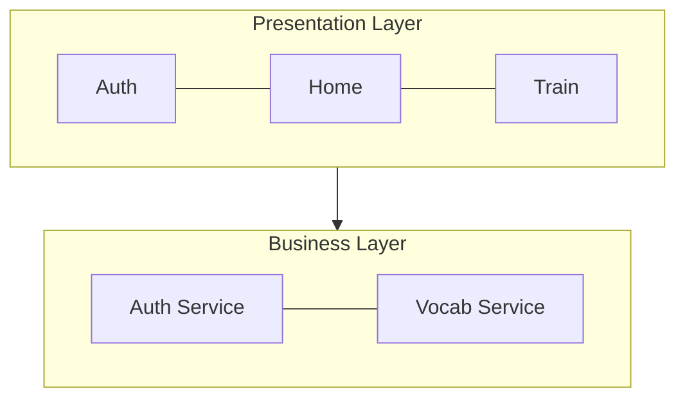

# IEC 62304 Document Standards

This document defines unified format specifications for all IEC 62304 documents, ensuring SRS, SDD, SWD, STP, STC, SVV, RTM, and other documents have consistent appearance and quality.

---

## 1. General Document Format Specifications (All Documents)

### 1.1 Standard Cover Format

All IEC 62304 documents must include the following cover information:

```markdown
# {Document-Type}-{ProjectName}-{Version}

## {Document Type Full Name} ({Document Type English Name})

**Document ID:** {DOC-ID}
**Version:** {X.Y}
**Created Date:** {YYYY-MM-DD}
**Last Updated:** {YYYY-MM-DD}
**Project Name:** {Project Name}
**Document Status:** {Draft/Under Review/Approved}

---

### Document Approval

| Role | Name | Date |
|------|------|------|
| Author | | |
| Reviewer | | |
| Approver | | |

---

## Table of Contents
```

> ⚠️ **Format Notes:**
> - Document info uses **bold label** format, not tables
> - Document approval table on cover, not repeated at end
> - Version history as Chapter 1, not on cover

### 1.2 Document Type Reference Table

| Abbreviation | Full Name |
|--------------|-----------|
| SRS | Software Requirements Specification |
| SDD | Software Design Description |
| SWD | Software Detailed Design |
| STP | Software Test Plan |
| STC | Software Test Cases |
| SVV | Software Verification & Validation |
| RTM | Requirements Traceability Matrix |

### 1.3 Bidirectional Traceability ⚠️ MANDATORY

> **IEC 62304 requires SRS and SDD to establish bidirectional traceability**

| Direction | Document | Field | Example |
|-----------|----------|-------|---------|
| SRS → SDD | SRS requirement table | `\| **SDD Traceability** \| SCR-xxx \|` | `SCR-AUTH-001-login, SCR-AUTH-002-register` |
| SDD → SRS | SDD screen table | `\| **Related Requirements** \| REQ-xxx \|` | `REQ-AUTH-001, REQ-AUTH-002` |

**SRS Requirement Table Example:**
```markdown
| Attribute | Content |
|-----------|---------|
| **ID** | REQ-AUTH-001 |
| **Description** | System shall allow users to authenticate via Email and password |
| **Priority** | P0 |
| **Related Requirements** | REQ-AUTH-005, REQ-AUTH-006 |
| **SDD Traceability** | SCR-AUTH-001-login, SCR-AUTH-002-register |
```

**SDD Screen Table Example:**
```markdown
| Attribute | Content |
|-----------|---------|
| **Screen ID** | SCR-AUTH-001-login |
| **Screen Name** | Login Screen |
| **Related Requirements** | REQ-AUTH-001, REQ-AUTH-002 |
```

### 1.4 Font Settings for DOCX Output

| Character Type | Font |
|----------------|------|
| English/ASCII (ascii) | Arial |
| CJK/Full-width (eastAsia) | Microsoft JhengHei |
| Headings | Arial + Microsoft JhengHei (mixed) |
| Code | Consolas |

### 1.5 Font Size Settings

| Element | Size |
|---------|------|
| H1 | 18pt |
| H2 | 16pt |
| H3 | 14pt |
| H4 | 13pt |
| H5 | 12pt |
| Body | 11pt |
| Table | 11pt |
| Footer | 9pt |

### 1.6 Code Block Usage Rules

**Code Block (```) is only for actual code**, DOCX conversion applies monospace font + gray background.

| Content Type | Use Code Block | Description |
|--------------|----------------|-------------|
| Code (SQL, JSON, Swift, Kotlin) | ✅ Use | Correct usage |
| Mermaid diagrams | ✅ Use ```mermaid | Must mark language |
| Use Case (pre/post conditions, flow) | ❌ Forbidden | Use bold labels + numbered lists |
| General description text | ❌ Forbidden | Use paragraphs or lists |
| **ASCII Art** | ❌ **Strictly Forbidden** | Use Mermaid instead |

---

## 2. Mermaid Diagram Specifications (All Documents)

### 2.1 Direction Rules

> ⚠️ **Important: Prefer vertical (TB) over horizontal (LR)**

Horizontal diagrams get shrunk in DOCX output, making text hard to read.

| Diagram Type | Recommended Direction | Description |
|--------------|----------------------|-------------|
| Flowchart | `TB` (Top-Bottom) | Vertical, clear text |
| Architecture Diagram | `TB` | Vertical, clear hierarchy |
| Simple connection (≤3 nodes) | `LR` acceptable | Horizontal still readable |
| Sequence Diagram | No direction parameter | Auto vertical |

### 2.2 Mixed Mode (Vertical Between Layers + Horizontal Within Layers)

Suitable for multi-layer architecture diagrams, making diagram wider but shorter:



### 2.3 Prohibited Formats

❌ **ASCII Art is Forbidden**

```
Not allowed:
+--------+     +--------+
| Box A  | --> | Box B  |
+--------+     +--------+
```

❌ **Pure Horizontal Flowcharts are Forbidden**

```
Not allowed: flowchart LR
```

### 2.4 Image Format Requirements

| Image Type | Format | Description |
|------------|--------|-------------|
| Mermaid diagrams | **SVG** (mandatory) | Vector format, infinite scaling without loss |
| UI screen designs | **PNG** | Use `` syntax |
| Externally imported images | **SVG** (preferred) | Or high-resolution PNG |

### 2.5 Image Size Limits

- Maximum width: 550px (~6 inches, suitable for A4)
- Maximum height: 600px (prevent page overflow)
- Minimum size: 200px (avoid too small)
- All images auto-centered

---

## 3. Color Standards (All Documents)

### 3.1 Class Diagram Colors (Peter Coad Color UML)

| Category | Color | Hex | Usage |
|----------|-------|-----|-------|
| Moment-Interval (MI) | Pink | #FFCCCC | Events, transactions, time points |
| Role | Yellow | #FFFFCC | Roles, identities |
| Thing | Green | #CCFFCC | Entities, objects |
| Description | Blue | #CCE5FF | Descriptions, type definitions |

### 3.2 State Machine Colors

| State Type | Color | Hex |
|------------|-------|-----|
| Initial State | Light Gray | #E0E0E0 |
| Processing | Light Blue | #CCE5FF |
| Success/Complete | Light Green | #CCFFCC |
| Failed/Error | Light Red | #FFCCCC |
| Warning/Pending | Light Yellow | #FFFFCC |

### 3.3 C4 Model Architecture Diagram Colors

| Element | Color | Hex |
|---------|-------|-----|
| Person | Blue | #08427B |
| Software System | Dark Blue | #1168BD |
| Container | Light Blue | #438DD5 |
| Component | Lighter Blue | #85BBF0 |
| External System | Gray | #999999 |

---

## 4. SRS-Specific Specifications

### 4.1 Chapter Structure

```markdown
## 1. Product Overview
## 2. Stakeholder Analysis
## 3. Functional Requirements
## 4. Non-Functional Requirements
## 5. Interface Requirements
## 6. Software Safety Classification
## 7. Appendix
```

### 4.2 Requirement ID Format

| Format | Example |
|--------|---------|
| REQ-{MODULE}-{NNN} | REQ-AUTH-001 |

### 4.3 Requirement Table Format

```markdown
| Requirement ID | Name | Description | Priority | Acceptance Criteria |
|----------------|------|-------------|----------|---------------------|
| REQ-AUTH-001 | User Registration | ... | P0 | ... |
```

### 4.4 User Flow Diagrams

Must use Mermaid `flowchart TB` format, ASCII Art is forbidden.

---

## 5. SDD-Specific Specifications

### 5.1 Chapter Structure

```markdown
## 1. Use Case Design
## 2. System Architecture Design
## 3. Module Design
## 4. Data Design
## 5. Interface Design
## 6. Security Design
## 7. Appendix
```

### 5.2 Use Case Format

```markdown
#### UC-AUTH-001: User Login

**Preconditions:** User has installed the App

**Main Flow:**
1. User opens App
2. System displays login screen
3. User enters credentials
4. System validates successfully

**Postconditions:** User completes login
```

### 5.3 Screen ID Format

| Format | Example |
|--------|---------|
| SCR-{MODULE}-{NNN}-{name} | SCR-AUTH-001-login |

### 5.4 SCR Section Format

```markdown
#### SCR-AUTH-001: Login Screen

**Requirements Traceability:** REQ-AUTH-001, REQ-AUTH-002

**Screen Description:**
User login screen, supports Email and Apple ID login.

**UI Components:**

| Component | Type | Description |
|-----------|------|-------------|
| Email Input | TextField | Email input field |

**Button Navigation:**

| Button | Target Screen | Condition |
|--------|---------------|-----------|
| Login | SCR-DASH-001 | Validation success |

##### UI Prototype Reference

**iPad Version:**


**iPhone Version:**


```

> ⚠️ **UI Prototype Reference Format Specification (MANDATORY)**
> - **No tables**: Embed images directly
> - **No HTML links**: Images only, no links
> - **Images must be actually embedded**: Cannot be just path text
>
> ❌ Wrong example:
> ```markdown
> | iPad |  | [Link](../04-ui-flow/...) |
> ```
>
> ✅ Correct example:
> ```markdown
> **iPad Version:**
>
> 
> ```

### 5.5 Design Psychology Principles

| Principle | Description | Validation Criteria |
|-----------|-------------|---------------------|
| Cognitive Load | Limit number of elements per screen | Primary options ≤7 |
| Progressive Disclosure | Simple first, detailed later | Has step indicator |
| Fitts' Law | Common buttons should be large and accessible | Buttons ≥44pt |
| Hick's Law | Reduce number of options | Options ≤7 |

---

## 6. SWD-Specific Specifications

### 6.1 Chapter Structure

```markdown
## 1. Component Design
## 2. Class Design
## 3. Interface Definition
## 4. Algorithm Design
## 5. Error Handling
```

### 6.2 Component ID Format

| Format | Example |
|--------|---------|
| SWD-{MODULE}-{NNN} | SWD-AUTH-001 |

---

## 7. STP-Specific Specifications

### 7.1 Chapter Structure

```markdown
## 1. Test Scope
## 2. Test Strategy
## 3. Test Environment
## 4. Test Schedule
## 5. Risk Assessment
```

---

## 8. STC-Specific Specifications

### 8.1 Chapter Structure

```markdown
## 1. Unit Test Cases
## 2. Integration Test Cases
## 3. System Test Cases
## 4. Acceptance Test Cases
```

### 8.2 Test Case ID Format

| Format | Example |
|--------|---------|
| STC-{REQ-ID} | STC-REQ-AUTH-001 |

### 8.3 Test Case Table Format

```markdown
| Test Case ID | Related Requirement | Test Steps | Expected Result | Actual Result | Status |
|--------------|---------------------|------------|-----------------|---------------|--------|
| STC-REQ-AUTH-001 | REQ-AUTH-001 | 1. Open App... | Display login screen | - | Pending |
```

---

## 9. SVV-Specific Specifications

### 9.1 Chapter Structure

```markdown
## 1. Verification Plan
## 2. Validation Plan
## 3. Verification Results
## 4. Validation Results
## 5. Deviation Handling
```

---

## 10. RTM-Specific Specifications

### 10.1 Traceability Matrix Format

```markdown
| Requirement ID | Design ID | Implementation ID | Test ID | Status |
|----------------|-----------|-------------------|---------|--------|
| REQ-AUTH-001 | SDD-AUTH-001 | SWD-AUTH-001 | STC-REQ-AUTH-001 | ✅ |
```

### 10.2 Traceability Completeness Requirements

| Traceability Direction | Requirement |
|------------------------|-------------|
| SRS → SDD | 100% |
| SDD → SWD | 100% |
| SWD → STC | 100% |
| SRS → SCR | 100% |

---

## 11. Validation Scripts

### 11.1 ASCII Art Prohibition Validation

```bash
#!/bin/bash
# ASCII Art detection validation
echo "🔍 Validating for prohibited ASCII Art..."

ERRORS=0
for FILE in 01-requirements/SRS-*.md 02-design/SDD-*.md; do
  if [ -f "$FILE" ]; then
    ASCII_BLOCKS=$(awk '/^```[^m]|^```$/{flag=1; next} /^```/{flag=0} flag && /[┌┐└┘│─├┤┬┴┼→←↑↓▶◀■□●○]/' "$FILE" | wc -l | tr -d ' ')
    if [ "$ASCII_BLOCKS" -gt 0 ]; then
      echo "❌ $FILE contains ASCII Art ($ASCII_BLOCKS lines)"
      ERRORS=$((ERRORS+1))
    fi
  fi
done

[ $ERRORS -eq 0 ] && echo "✅ No ASCII Art violations" || { echo "⚠️ Please convert to Mermaid"; exit 1; }
```

### 11.2 Use Case Completeness Validation

```bash
#!/bin/bash
# Use Case completeness validation
SDD_FILE="02-design/SDD-*.md"

TABLE_COUNT=$(grep -E "^\| UC-" $SDD_FILE | wc -l | tr -d ' ')
DETAIL_COUNT=$(grep -c "^#### UC-" $SDD_FILE)

if [ "$TABLE_COUNT" != "$DETAIL_COUNT" ]; then
  echo "❌ Use Case count mismatch: Overview table $TABLE_COUNT vs Detail $DETAIL_COUNT"
  exit 1
fi
echo "✅ Use Case completeness validation passed ($TABLE_COUNT cases)"
```

---

## 12. Document Cross-Reference

| Source Document | Standards to Reference |
|-----------------|------------------------|
| SRS | Sections 1-3 (General) + Section 4 (SRS-specific) |
| SDD | Sections 1-3 (General) + Section 5 (SDD-specific) |
| SWD | Sections 1-3 (General) + Section 6 (SWD-specific) |
| STP | Sections 1-3 (General) + Section 7 (STP-specific) |
| STC | Sections 1-3 (General) + Section 8 (STC-specific) |
| SVV | Sections 1-3 (General) + Section 9 (SVV-specific) |
| RTM | Sections 1-3 (General) + Section 10 (RTM-specific) |
