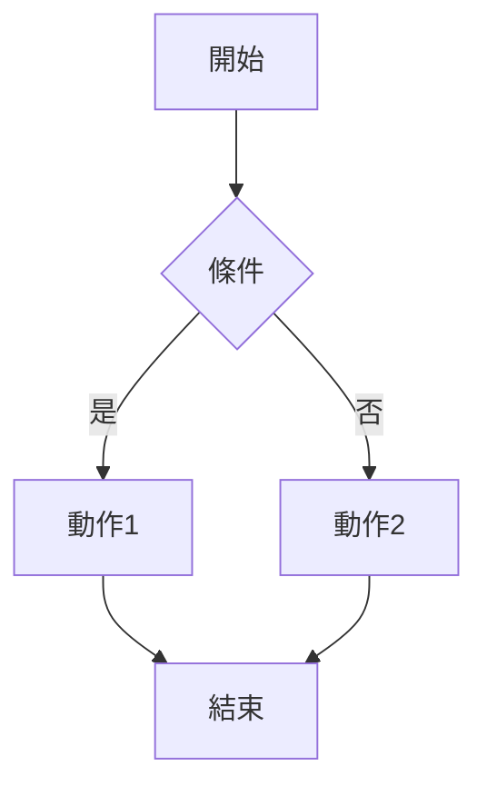
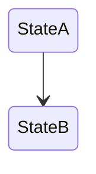
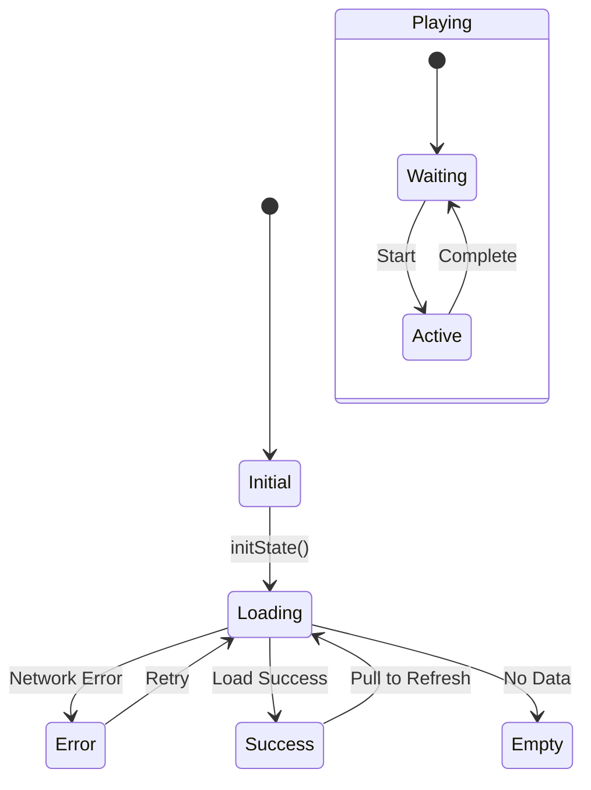
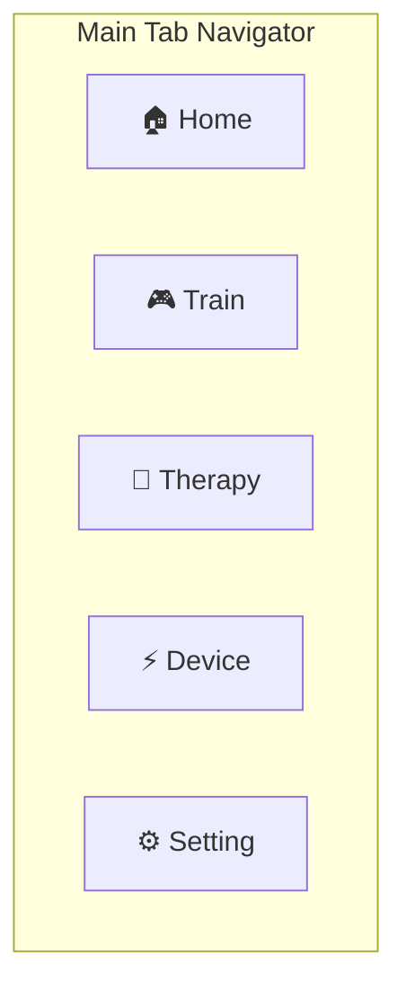
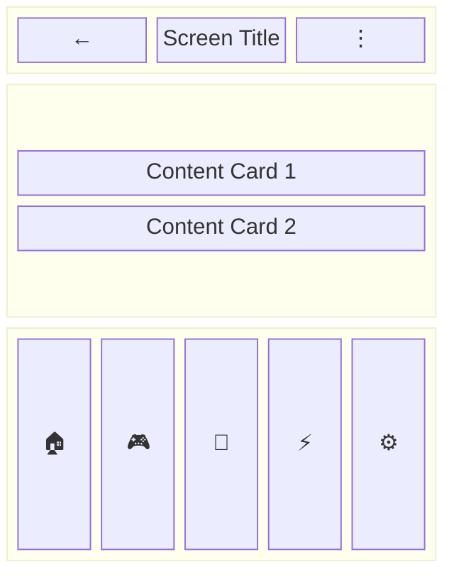

# MD 轉 DOCX 轉換器

本文件說明如何將 Markdown 文件轉換為專業格式的 Word (.docx) 文件。

**特色功能：**
- 自動識別 SRS/SWD 需求項目格式，轉換為專業表格式呈現
- 支援標題、表格、程式碼區塊、內嵌格式
- **支援 Mermaid 圖表自動渲染為圖片**
- 自動產生頁首/頁尾

## 使用方式

### 1. 安裝依賴

```bash
npm install docx
npm install -g @mermaid-js/mermaid-cli
```

> **注意：** Mermaid CLI (`mmdc`) 需要全域安裝，用於將 Mermaid 代碼渲染為 PNG 圖片。

### 2. 轉換腳本

建立 `md-to-docx.js` 檔案：

```javascript
const { Document, Packer, Paragraph, TextRun, Table, TableRow, TableCell,
        Header, Footer, AlignmentType, HeadingLevel, BorderStyle,
        WidthType, ShadingType, VerticalAlign, PageNumber, PageBreak,
        ImageRun, TableOfContents } = require('docx');
const fs = require('fs');
const path = require('path');
const { execSync } = require('child_process');
const crypto = require('crypto');

// ============================================
// 字型設定 - 中文使用圓黑體，英文使用 Arial
// ============================================
const FONT_CN = '圓黑體';  // 中文字體 (可改為 '微軟正黑體' 或 'Noto Sans TC')
const FONT_EN = 'Arial';   // 英文字體
const FONT_CODE = 'Courier New';  // 程式碼字體

// 字型大小設定 (單位: half-points, 24 = 12pt)
const FONT_SIZE = {
  H1: 36,        // 18pt - 主標題
  H2: 32,        // 16pt - 大章節
  H3: 28,        // 14pt - 小節
  H4: 26,        // 13pt - 子節
  H5: 24,        // 12pt - 細節
  BODY: 22,      // 11pt - 內文
  TABLE: 20,     // 10pt - 表格內文
  TABLE_HEADER: 20, // 10pt - 表格標題 (粗體)
  SMALL: 18,     // 9pt - 小字
  FOOTER: 18     // 9pt - 頁尾
};

/**
 * 檢測文字是否包含中文
 */
function containsChinese(text) {
  return /[\u4e00-\u9fff]/.test(text);
}

/**
 * 取得適合的字體（根據文字內容）
 */
function getFont(text) {
  return containsChinese(text) ? FONT_CN : FONT_EN;
}

// ============================================
// Mermaid 圖表渲染器
// ============================================

/**
 * 將 Mermaid 代碼渲染為 PNG 圖片
 * @param {string} mermaidCode - Mermaid 圖表代碼
 * @param {string} outputDir - 輸出目錄
 * @returns {string|null} - 圖片路徑或 null (失敗時)
 */
function renderMermaidToPng(mermaidCode, outputDir) {
  const hash = crypto.createHash('md5').update(mermaidCode).digest('hex').substring(0, 8);
  const tempDir = path.join(outputDir, '.mermaid-temp');
  const inputFile = path.join(tempDir, `mermaid-${hash}.mmd`);
  const outputFile = path.join(tempDir, `mermaid-${hash}.png`);

  // 建立暫存目錄
  if (!fs.existsSync(tempDir)) {
    fs.mkdirSync(tempDir, { recursive: true });
  }

  // 如果已存在快取圖片，直接回傳
  if (fs.existsSync(outputFile)) {
    return outputFile;
  }

  // 寫入 Mermaid 代碼
  fs.writeFileSync(inputFile, mermaidCode);

  try {
    // 使用 mermaid-cli 渲染
    execSync(`mmdc -i "${inputFile}" -o "${outputFile}" -b transparent -w 800`, {
      stdio: 'pipe',
      timeout: 30000
    });

    if (fs.existsSync(outputFile)) {
      return outputFile;
    }
  } catch (error) {
    console.warn(`Mermaid 渲染失敗: ${error.message}`);
  }

  return null;
}

/**
 * 讀取 PNG 圖片尺寸
 * PNG 檔案格式：前 8 bytes 為簽名，IHDR chunk 包含寬高資訊
 */
function getPngDimensions(buffer) {
  // PNG signature: 89 50 4E 47 0D 0A 1A 0A
  // IHDR chunk starts at byte 8, width at 16-19, height at 20-23
  if (buffer.length < 24) return null;

  const width = buffer.readUInt32BE(16);
  const height = buffer.readUInt32BE(20);

  return { width, height };
}

/**
 * 建立 Mermaid 圖片段落
 * 保持原始比例，最大寬度 450px，避免圖片變形
 */
function createMermaidImage(imagePath) {
  const imageBuffer = fs.readFileSync(imagePath);

  // 讀取實際圖片尺寸
  const dimensions = getPngDimensions(imageBuffer);

  let displayWidth, displayHeight;
  const maxWidth = 450;  // 最大寬度限制，保留適當邊距
  const maxHeight = 500; // 最大高度限制

  if (dimensions) {
    const { width, height } = dimensions;
    const aspectRatio = width / height;

    // 根據最大限制計算縮放後的尺寸
    if (width > maxWidth) {
      displayWidth = maxWidth;
      displayHeight = Math.round(maxWidth / aspectRatio);
    } else {
      displayWidth = width;
      displayHeight = height;
    }

    // 如果高度仍超過限制，再次縮放
    if (displayHeight > maxHeight) {
      displayHeight = maxHeight;
      displayWidth = Math.round(maxHeight * aspectRatio);
    }
  } else {
    // 無法讀取尺寸時使用預設值
    displayWidth = 400;
    displayHeight = 300;
  }

  return new Paragraph({
    alignment: AlignmentType.CENTER,
    spacing: { before: 240, after: 240 },
    children: [
      new ImageRun({
        data: imageBuffer,
        transformation: {
          width: displayWidth,
          height: displayHeight
        },
        type: 'png'
      })
    ]
  });
}

/**
 * 清理 Mermaid 暫存檔案
 */
function cleanupMermaidTemp(outputDir) {
  const tempDir = path.join(outputDir, '.mermaid-temp');
  if (fs.existsSync(tempDir)) {
    fs.rmSync(tempDir, { recursive: true, force: true });
  }
}

// ============================================
// 需求項目表格化轉換器
// ============================================

/**
 * 檢測是否為需求項目標題
 * 支援格式：
 *   - #### SRS-AUTH-001 使用者註冊 (舊格式)
 *   - ##### REQ-FUNC-001 使用者登入 (新格式，空格分隔)
 *   - #### REQ-FUNC-001: 使用者登入 (新格式，冒號分隔)
 */
function isRequirementHeading(line) {
  // 支援 SRS/SWD/SDD/STC/REQ 前綴，3-5個#
  return line.match(/^#{3,5}\s+(SRS|SWD|SDD|STC|REQ)-[A-Z]+-\d+/);
}

/**
 * 解析需求項目區塊，轉換為表格式結構
 * 支援多種輸入格式：
 *
 * 中文格式：
 *   #### SRS-AUTH-001 使用者註冊
 *   **描述：** 系統必須...
 *   **優先級：** 必要
 *   **驗收標準：**
 *   - AC1: 當使用者首次開啟 App，點選註冊，並系統顯示註冊表單
 *   - AC2: 當使用者填寫完整資訊，點選送出，並系統驗證資料格式並建立帳戶
 *
 * 英文格式：
 *   ##### REQ-FUNC-001 User Login
 *   **Statement:** The system shall...
 *   **Rationale:** To ensure...
 *   **Acceptance Criteria:**
 *   - AC1: Given the user has valid credentials, When submitting login, Then the system authenticates and redirects to home
 *   **Verification Method:** Test
 *
 * 驗收標準格式對照：
 *   中文：當 [前提條件]，[執行動作]，並 [預期結果]
 *   英文：Given [precondition], When [action], Then [expected result]
 */
function parseRequirementBlock(lines, startIndex) {
  const headerLine = lines[startIndex];

  // 嘗試匹配：ID + 空格 + 名稱，或 ID + 冒號 + 名稱
  let match = headerLine.match(/^#{3,5}\s+((SRS|SWD|SDD|STC|REQ)-[A-Z]+-\d+)[:：]?\s*(.+)/);

  if (!match) return null;

  const reqId = match[1];
  const reqName = match[3] ? match[3].trim() : '';

  const requirement = {
    id: reqId,
    name: reqName,
    // 支援中英文欄位
    description: '',      // 描述 (舊)
    statement: '',        // Statement (新)
    rationale: '',        // Rationale (新)
    priority: '',
    safetyClass: '',
    verificationMethod: '',
    acceptanceCriteria: [],
    otherFields: {}
  };

  let i = startIndex + 1;
  let inAcceptanceCriteria = false;
  let currentField = null;

  while (i < lines.length) {
    const line = lines[i].trim();

    // 遇到下一個標題或分隔線則結束
    if (line.startsWith('#') || line.match(/^-{3,}$/)) {
      break;
    }

    // 解析 **欄位：** 值 或 **欄位:** 值 格式
    const fieldMatch = line.match(/^\*\*(.+?)[:：]\*\*\s*(.*)$/);

    if (fieldMatch) {
      const fieldName = fieldMatch[1].trim();
      const fieldValue = fieldMatch[2].trim();

      // 中文欄位
      if (fieldName === '描述') {
        requirement.description = fieldValue;
        currentField = 'description';
        inAcceptanceCriteria = false;
      } else if (fieldName === '優先級') {
        requirement.priority = fieldValue;
        currentField = 'priority';
        inAcceptanceCriteria = false;
      } else if (fieldName === '安全分類') {
        requirement.safetyClass = fieldValue;
        currentField = 'safetyClass';
        inAcceptanceCriteria = false;
      } else if (fieldName === '驗收標準') {
        inAcceptanceCriteria = true;
        currentField = 'acceptanceCriteria';
      }
      // 英文欄位
      else if (fieldName === 'Statement') {
        requirement.statement = fieldValue;
        currentField = 'statement';
        inAcceptanceCriteria = false;
      } else if (fieldName === 'Rationale') {
        requirement.rationale = fieldValue;
        currentField = 'rationale';
        inAcceptanceCriteria = false;
      } else if (fieldName === 'Acceptance Criteria') {
        inAcceptanceCriteria = true;
        currentField = 'acceptanceCriteria';
      } else if (fieldName === 'Verification Method') {
        requirement.verificationMethod = fieldValue;
        currentField = 'verificationMethod';
        inAcceptanceCriteria = false;
      } else {
        requirement.otherFields[fieldName] = fieldValue;
        currentField = fieldName;
        inAcceptanceCriteria = false;
      }
    } else if (inAcceptanceCriteria && line.startsWith('- ')) {
      // 驗收標準項目
      requirement.acceptanceCriteria.push(line.substring(2));
    } else if (line && currentField) {
      // 延續上一個欄位的內容
      if (currentField === 'description') {
        requirement.description += ' ' + line;
      } else if (currentField === 'statement') {
        requirement.statement += ' ' + line;
      } else if (currentField === 'rationale') {
        requirement.rationale += ' ' + line;
      }
    }

    i++;
  }

  return { requirement, endIndex: i - 1 };
}

/**
 * 建立需求項目表格
 * 自動判斷使用中文或英文欄位標籤，並套用適當字體
 */
function createRequirementTable(req) {
  const tableBorder = { style: BorderStyle.SINGLE, size: 1, color: 'CCCCCC' };
  const cellBorders = { top: tableBorder, bottom: tableBorder, left: tableBorder, right: tableBorder };

  const labelWidth = 2200;  // 標籤欄寬度（加寬以容納中文）
  const valueWidth = 7160;  // 值欄寬度

  const rows = [];

  // 標題列 (合併儲存格效果用背景色區分)
  rows.push(new TableRow({
    children: [
      new TableCell({
        borders: cellBorders,
        width: { size: labelWidth, type: WidthType.DXA },
        shading: { fill: '4472C4', type: ShadingType.CLEAR },
        margins: { top: 60, bottom: 60, left: 100, right: 100 },
        children: [new Paragraph({
          children: [new TextRun({ text: req.id, bold: true, color: 'FFFFFF', size: FONT_SIZE.TABLE_HEADER, font: FONT_EN })]
        })]
      }),
      new TableCell({
        borders: cellBorders,
        width: { size: valueWidth, type: WidthType.DXA },
        shading: { fill: '4472C4', type: ShadingType.CLEAR },
        margins: { top: 60, bottom: 60, left: 100, right: 100 },
        children: [new Paragraph({
          children: [new TextRun({ text: req.name, bold: true, color: 'FFFFFF', size: FONT_SIZE.TABLE_HEADER, font: getFont(req.name) })]
        })]
      })
    ]
  }));

  // 新格式欄位 (Statement/Rationale)
  if (req.statement) {
    rows.push(createFieldRow('Statement', req.statement, labelWidth, valueWidth, cellBorders));
  }

  if (req.rationale) {
    rows.push(createFieldRow('Rationale', req.rationale, labelWidth, valueWidth, cellBorders));
  }

  // 舊格式欄位 (描述)
  if (req.description) {
    rows.push(createFieldRow('描述', req.description, labelWidth, valueWidth, cellBorders));
  }

  // 優先級
  if (req.priority) {
    rows.push(createFieldRow('優先級', req.priority, labelWidth, valueWidth, cellBorders));
  }

  // 安全分類
  if (req.safetyClass) {
    rows.push(createFieldRow('安全分類', req.safetyClass, labelWidth, valueWidth, cellBorders));
  }

  // 其他欄位
  for (const [key, value] of Object.entries(req.otherFields)) {
    rows.push(createFieldRow(key, value, labelWidth, valueWidth, cellBorders));
  }

  // 驗收標準 (Acceptance Criteria)
  if (req.acceptanceCriteria.length > 0) {
    // 判斷使用中文還是英文標籤
    const acLabel = req.statement ? 'Acceptance Criteria' : '驗收標準';
    const acParagraphs = req.acceptanceCriteria.map(ac =>
      new Paragraph({
        spacing: { after: 80 },
        children: [new TextRun({ text: '• ' + ac, size: FONT_SIZE.TABLE, font: getFont(ac) })]
      })
    );

    rows.push(new TableRow({
      children: [
        new TableCell({
          borders: cellBorders,
          width: { size: labelWidth, type: WidthType.DXA },
          shading: { fill: 'F2F2F2', type: ShadingType.CLEAR },
          verticalAlign: VerticalAlign.TOP,
          margins: { top: 60, bottom: 60, left: 100, right: 100 },
          children: [new Paragraph({
            children: [new TextRun({ text: acLabel, bold: true, size: FONT_SIZE.TABLE_HEADER, font: getFont(acLabel) })]
          })]
        }),
        new TableCell({
          borders: cellBorders,
          width: { size: valueWidth, type: WidthType.DXA },
          margins: { top: 60, bottom: 60, left: 100, right: 100 },
          children: acParagraphs
        })
      ]
    }));
  }

  // Verification Method (新格式)
  if (req.verificationMethod) {
    rows.push(createFieldRow('Verification', req.verificationMethod, labelWidth, valueWidth, cellBorders));
  }

  return new Table({
    columnWidths: [labelWidth, valueWidth],
    rows: rows
  });
}

function createFieldRow(label, value, labelWidth, valueWidth, cellBorders) {
  return new TableRow({
    children: [
      new TableCell({
        borders: cellBorders,
        width: { size: labelWidth, type: WidthType.DXA },
        shading: { fill: 'F2F2F2', type: ShadingType.CLEAR },
        verticalAlign: VerticalAlign.CENTER,
        margins: { top: 60, bottom: 60, left: 100, right: 100 },
        children: [new Paragraph({
          children: [new TextRun({ text: label, bold: true, size: FONT_SIZE.TABLE_HEADER, font: getFont(label) })]
        })]
      }),
      new TableCell({
        borders: cellBorders,
        width: { size: valueWidth, type: WidthType.DXA },
        margins: { top: 60, bottom: 60, left: 100, right: 100 },
        children: [new Paragraph({
          spacing: { after: 0 },
          children: [new TextRun({ text: value, size: FONT_SIZE.TABLE, font: getFont(value) })]
        })]
      })
    ]
  });
}

// ============================================
// 主要解析函式
// ============================================

/**
 * 檢查是否為「孤立標題群」的第一個標題
 * 當連續多個標題（沒有中間內容）最後接著需求表格時，只在第一個標題前分頁
 * 避免標題群落在頁尾，但又不會每個標題都分頁造成空頁
 */
function shouldBreakBeforeHeading(lines, currentIndex) {
  const currentLine = lines[currentIndex];

  // 檢查前一個非空行是否也是標題
  let prevIndex = currentIndex - 1;
  while (prevIndex >= 0 && lines[prevIndex].trim() === '') {
    prevIndex--;
  }

  // 如果前面也是標題，則不分頁（讓標題群保持在一起）
  if (prevIndex >= 0 && lines[prevIndex].startsWith('#')) {
    return false;
  }

  // 往後看，找到這個標題群的結尾
  let j = currentIndex + 1;
  let headingCount = 1;

  while (j < lines.length) {
    const line = lines[j].trim();

    if (line === '') {
      j++;
      continue;
    }

    // 如果是另一個標題，繼續往後看
    if (line.startsWith('#') && !isRequirementHeading(lines[j])) {
      headingCount++;
      j++;
      continue;
    }

    // 如果是需求項目或其他內容，停止
    break;
  }

  // 只有當有連續多個標題（標題群）時，才在第一個標題前分頁
  // 這樣可以避免標題群被分頁切開
  return headingCount > 1;
}

function parseMarkdown(content, outputDir = '.') {
  const lines = content.split('\n');
  const elements = [];
  let inCodeBlock = false;
  let codeBlockContent = [];
  let codeBlockLang = '';
  let inTable = false;
  let tableRows = [];
  let tableHeaders = [];
  let i = 0;

  while (i < lines.length) {
    const line = lines[i];

    // 處理程式碼區塊
    if (line.startsWith('```')) {
      if (inCodeBlock) {
        // 結束程式碼區塊
        if (codeBlockLang === 'mermaid') {
          // Mermaid 圖表 - 渲染為圖片
          const mermaidCode = codeBlockContent.join('\n');
          const imagePath = renderMermaidToPng(mermaidCode, outputDir);
          if (imagePath) {
            elements.push(createMermaidImage(imagePath));
          } else {
            // 渲染失敗時，fallback 為程式碼區塊
            console.warn('Mermaid 渲染失敗，使用程式碼區塊顯示');
            elements.push(createCodeBlock(mermaidCode));
          }
        } else {
          // 一般程式碼區塊
          elements.push(createCodeBlock(codeBlockContent.join('\n')));
        }
        codeBlockContent = [];
        codeBlockLang = '';
        inCodeBlock = false;
      } else {
        // 開始程式碼區塊，擷取語言
        codeBlockLang = line.substring(3).trim().toLowerCase();
        inCodeBlock = true;
      }
      i++;
      continue;
    }

    if (inCodeBlock) {
      codeBlockContent.push(line);
      i++;
      continue;
    }

    // 處理 Markdown 表格
    if (line.startsWith('|') && line.endsWith('|')) {
      if (!inTable) {
        inTable = true;
        tableHeaders = parseTableRow(line);
      } else if (line.includes('---')) {
        // Skip separator
      } else {
        tableRows.push(parseTableRow(line));
      }
      i++;
      continue;
    } else if (inTable) {
      if (tableHeaders.length > 0) {
        elements.push(createTable(tableHeaders, tableRows));
      }
      tableHeaders = [];
      tableRows = [];
      inTable = false;
    }

    // 檢查是否為需求項目標題 - 轉換為表格式
    if (isRequirementHeading(line)) {
      const result = parseRequirementBlock(lines, i);
      if (result) {
        elements.push(new Paragraph({ spacing: { before: 240 }, children: [] })); // 間距
        elements.push(createRequirementTable(result.requirement));
        elements.push(new Paragraph({ spacing: { after: 120 }, children: [] })); // 間距
        i = result.endIndex + 1;
        continue;
      }
    }

    // 標題處理
    // Heading 1 (# ) - 主標題
    if (line.startsWith('# ') && !line.startsWith('## ')) {
      elements.push(createHeading(line.substring(2), HeadingLevel.HEADING_1, true)); // 分頁
      i++;
      continue;
    }
    // Heading 2 (## ) - 大章節，每個大章節前分頁
    if (line.startsWith('## ')) {
      // 檢查是否為主要章節（如 "1. Introduction", "2. Product Overview" 等）
      const isMainSection = line.match(/^##\s+\d+[\.\s]/);
      elements.push(createHeading(line.substring(3), HeadingLevel.HEADING_2, isMainSection));
      i++;
      continue;
    }
    // Heading 3 (### ) - 小節
    if (line.startsWith('### ')) {
      // 檢查標題後是否緊接需求表格或只有空行，若是則在標題前分頁避免標題落單
      const shouldPageBreak = shouldBreakBeforeHeading(lines, i);
      elements.push(createHeading(line.substring(4), HeadingLevel.HEADING_3, shouldPageBreak));
      i++;
      continue;
    }
    // Heading 4 (#### )
    if (line.startsWith('#### ')) {
      // 檢查標題後是否緊接需求表格或只有空行，若是則在標題前分頁避免標題落單
      const shouldPageBreak = shouldBreakBeforeHeading(lines, i);
      elements.push(createHeading(line.substring(5), HeadingLevel.HEADING_4, shouldPageBreak));
      i++;
      continue;
    }
    // Heading 5 (##### )
    if (line.startsWith('##### ')) {
      elements.push(createHeading(line.substring(6), HeadingLevel.HEADING_5, false));
      i++;
      continue;
    }

    // 分隔線
    if (line.match(/^-{3,}$/) || line.match(/^\*{3,}$/)) {
      i++;
      continue;
    }

    // 空白行
    if (line.trim() === '') {
      i++;
      continue;
    }

    // 一般段落
    elements.push(createParagraph(line));
    i++;
  }

  // 關閉未結束的表格
  if (inTable && tableHeaders.length > 0) {
    elements.push(createTable(tableHeaders, tableRows));
  }

  return elements;
}

function parseTableRow(line) {
  return line.split('|').slice(1, -1).map(cell => cell.trim());
}

/**
 * 根據標題層級取得字型大小
 */
function getHeadingSize(level) {
  switch (level) {
    case HeadingLevel.HEADING_1: return FONT_SIZE.H1;
    case HeadingLevel.HEADING_2: return FONT_SIZE.H2;
    case HeadingLevel.HEADING_3: return FONT_SIZE.H3;
    case HeadingLevel.HEADING_4: return FONT_SIZE.H4;
    case HeadingLevel.HEADING_5: return FONT_SIZE.H5;
    default: return FONT_SIZE.BODY;
  }
}

/**
 * 建立標題段落
 * @param {string} text - 標題文字
 * @param {HeadingLevel} level - 標題層級
 * @param {boolean} pageBreakBefore - 是否在標題前分頁（用於大章節）
 */
function createHeading(text, level, pageBreakBefore = false) {
  const trimmedText = text.trim();
  const fontSize = getHeadingSize(level);

  return new Paragraph({
    heading: level,
    spacing: { before: pageBreakBefore ? 0 : 240, after: 120 },
    pageBreakBefore: pageBreakBefore,  // 大章節前分頁
    keepNext: true,  // 標題與下一段落保持在同一頁（避免標題落單）
    keepLines: true, // 標題本身不拆行
    children: [new TextRun({ text: trimmedText, bold: true, size: fontSize, font: getFont(trimmedText) })]
  });
}

function createParagraph(text) {
  const runs = parseInlineFormatting(text);
  return new Paragraph({ spacing: { after: 120 }, children: runs });
}

/**
 * 解析行內格式（粗體、程式碼）
 * @param {string} text - 原始文字
 * @param {number} fontSize - 字型大小，預設為 BODY 大小
 */
function parseInlineFormatting(text, fontSize = FONT_SIZE.BODY) {
  const runs = [];
  const boldRegex = /\*\*(.+?)\*\*/g;
  const codeRegex = /`([^`]+)`/g;
  const matches = [];
  let match;

  boldRegex.lastIndex = 0;
  while ((match = boldRegex.exec(text)) !== null) {
    matches.push({ index: match.index, end: match.index + match[0].length, text: match[1], type: 'bold' });
  }

  codeRegex.lastIndex = 0;
  while ((match = codeRegex.exec(text)) !== null) {
    matches.push({ index: match.index, end: match.index + match[0].length, text: match[1], type: 'code' });
  }

  matches.sort((a, b) => a.index - b.index);

  let lastIndex = 0;
  for (const m of matches) {
    if (m.index > lastIndex) {
      const segment = text.substring(lastIndex, m.index);
      runs.push(new TextRun({ text: segment, size: fontSize, font: getFont(segment) }));
    }
    if (m.type === 'bold') {
      runs.push(new TextRun({ text: m.text, bold: true, size: fontSize, font: getFont(m.text) }));
    } else if (m.type === 'code') {
      runs.push(new TextRun({ text: m.text, size: fontSize, font: FONT_CODE }));
    }
    lastIndex = m.end;
  }

  if (lastIndex < text.length) {
    const remaining = text.substring(lastIndex);
    runs.push(new TextRun({ text: remaining, size: fontSize, font: getFont(remaining) }));
  }

  if (runs.length === 0) {
    runs.push(new TextRun({ text, size: fontSize, font: getFont(text) }));
  }

  return runs;
}

function createCodeBlock(content) {
  return content.split('\n').map(line =>
    new Paragraph({
      spacing: { after: 0 },
      shading: { fill: 'F5F5F5', type: ShadingType.CLEAR },
      children: [new TextRun({ text: line || ' ', font: FONT_CODE, size: FONT_SIZE.TABLE })]
    })
  );
}

/**
 * 計算表格欄寬 - 根據內容長度智慧分配
 */
function calculateColumnWidths(headers, rows, totalWidth = 9360) {
  const numCols = headers.length;

  // 計算每欄最大內容長度
  const maxLengths = headers.map((h, i) => {
    let max = h.length;
    rows.forEach(row => {
      if (row[i]) {
        max = Math.max(max, row[i].length);
      }
    });
    return max;
  });

  const totalLength = maxLengths.reduce((a, b) => a + b, 0);

  // 根據內容長度比例分配寬度，但設定最小寬度
  const minWidth = 1200;  // 最小欄寬
  let widths = maxLengths.map(len => Math.max(minWidth, Math.floor((len / totalLength) * totalWidth)));

  // 調整總寬度
  const currentTotal = widths.reduce((a, b) => a + b, 0);
  if (currentTotal !== totalWidth) {
    const diff = totalWidth - currentTotal;
    widths[widths.length - 1] += diff;  // 最後一欄吸收差異
  }

  return widths;
}

function createTable(headers, rows) {
  const tableBorder = { style: BorderStyle.SINGLE, size: 1, color: 'CCCCCC' };
  const cellBorders = { top: tableBorder, bottom: tableBorder, left: tableBorder, right: tableBorder };
  const numCols = headers.length;
  const columnWidths = calculateColumnWidths(headers, rows);

  const tableRows = [
    new TableRow({
      tableHeader: true,
      children: headers.map((header, i) => new TableCell({
        borders: cellBorders,
        width: { size: columnWidths[i], type: WidthType.DXA },
        shading: { fill: 'D5E8F0', type: ShadingType.CLEAR },
        verticalAlign: VerticalAlign.CENTER,
        margins: { top: 40, bottom: 40, left: 80, right: 80 },
        children: [new Paragraph({
          alignment: AlignmentType.CENTER,
          children: [new TextRun({ text: header, bold: true, size: FONT_SIZE.TABLE_HEADER, font: getFont(header) })]
        })]
      }))
    }),
    ...rows.map(row => new TableRow({
      children: row.map((cell, i) => new TableCell({
        borders: cellBorders,
        width: { size: columnWidths[i], type: WidthType.DXA },
        margins: { top: 40, bottom: 40, left: 80, right: 80 },
        children: [new Paragraph({
          spacing: { after: 0 },
          children: parseInlineFormatting(cell, FONT_SIZE.TABLE)
        })]
      }))
    }))
  ];

  return new Table({ columnWidths: columnWidths, rows: tableRows });
}

/**
 * 解析文件結構，分離封面、目錄、修訂歷史與主要內容
 */
function parseDocumentStructure(content, outputDir) {
  const lines = content.split('\n');
  const structure = {
    coverInfo: { title: '', subtitle: '', version: '', author: '', organization: '', date: '' },
    tocLines: [],
    revisionHistory: [],
    mainContent: []
  };

  let section = 'cover';  // cover, toc, revision, main
  let i = 0;

  while (i < lines.length) {
    const line = lines[i];
    const trimmed = line.trim();

    // 檢測封面資訊（文件開頭到 Table of Contents 之前）
    if (section === 'cover') {
      if (trimmed.startsWith('# ')) {
        structure.coverInfo.title = trimmed.substring(2).trim();
      } else if (trimmed.startsWith('## For ') || trimmed.startsWith('**For ')) {
        structure.coverInfo.subtitle = trimmed.replace(/^##\s*For\s*|^\*\*For\s*|\*\*$/g, '').trim();
      } else if (trimmed.toLowerCase().includes('version')) {
        structure.coverInfo.version = trimmed.replace(/^Version\s*/i, '').trim();
      } else if (trimmed.toLowerCase().includes('prepared by')) {
        structure.coverInfo.author = trimmed.replace(/^Prepared by\s*/i, '').trim();
      } else if (trimmed.match(/^[A-Z].*\s+(Inc\.|Corp\.|Ltd\.|Co\.)$/i) || trimmed.match(/^SOMNICS/i)) {
        structure.coverInfo.organization = trimmed;
      } else if (trimmed.match(/^\d{4}-\d{2}-\d{2}$/)) {
        structure.coverInfo.date = trimmed;
      } else if (trimmed.toLowerCase().includes('table of contents') || trimmed.startsWith('## Table of Contents')) {
        section = 'toc';
      }
      i++;
      continue;
    }

    // 檢測目錄區塊
    if (section === 'toc') {
      if (trimmed.startsWith('## Revision History') || trimmed.toLowerCase().includes('revision history')) {
        section = 'revision';
        i++;
        continue;
      } else if (trimmed.startsWith('## 1') || trimmed.startsWith('## 1.')) {
        // 跳過目錄，進入主要內容
        section = 'main';
        continue;  // 不 i++，讓 main section 處理這行
      }
      structure.tocLines.push(line);
      i++;
      continue;
    }

    // 檢測修訂歷史
    if (section === 'revision') {
      if (trimmed.startsWith('## 1') || (trimmed.startsWith('## ') && !trimmed.toLowerCase().includes('revision'))) {
        section = 'main';
        continue;  // 不 i++，讓 main section 處理這行
      }
      if (trimmed.startsWith('|') && trimmed.endsWith('|')) {
        structure.revisionHistory.push(line);
      }
      i++;
      continue;
    }

    // 主要內容
    if (section === 'main') {
      structure.mainContent.push(line);
    }
    i++;
  }

  return structure;
}

/**
 * 建立封面頁元素
 */
function createCoverPage(coverInfo) {
  const elements = [];

  // 空白間距
  for (let i = 0; i < 6; i++) {
    elements.push(new Paragraph({ children: [] }));
  }

  // 主標題
  elements.push(new Paragraph({
    alignment: AlignmentType.CENTER,
    spacing: { after: 400 },
    children: [new TextRun({
      text: coverInfo.title || 'Document Title',
      bold: true,
      size: 56,
      font: getFont(coverInfo.title)
    })]
  }));

  // 副標題
  if (coverInfo.subtitle) {
    elements.push(new Paragraph({
      alignment: AlignmentType.CENTER,
      spacing: { after: 600 },
      children: [new TextRun({
        text: `For ${coverInfo.subtitle}`,
        size: 36,
        font: getFont(coverInfo.subtitle)
      })]
    }));
  }

  // 空白間距
  for (let i = 0; i < 4; i++) {
    elements.push(new Paragraph({ children: [] }));
  }

  // 版本
  if (coverInfo.version) {
    elements.push(new Paragraph({
      alignment: AlignmentType.CENTER,
      spacing: { after: 200 },
      children: [new TextRun({ text: `Version ${coverInfo.version}`, size: 28, font: FONT_EN })]
    }));
  }

  // 作者
  if (coverInfo.author) {
    elements.push(new Paragraph({
      alignment: AlignmentType.CENTER,
      spacing: { after: 200 },
      children: [new TextRun({ text: `Prepared by ${coverInfo.author}`, size: 28, font: FONT_EN })]
    }));
  }

  // 組織
  if (coverInfo.organization) {
    elements.push(new Paragraph({
      alignment: AlignmentType.CENTER,
      spacing: { after: 200 },
      children: [new TextRun({ text: coverInfo.organization, size: 28, font: FONT_EN })]
    }));
  }

  // 日期
  if (coverInfo.date) {
    elements.push(new Paragraph({
      alignment: AlignmentType.CENTER,
      spacing: { after: 200 },
      children: [new TextRun({ text: coverInfo.date, size: 28, font: FONT_EN })]
    }));
  }

  return elements;
}

/**
 * 從主要內容中提取標題結構
 */
function extractHeadings(mainContent) {
  const headings = [];
  const lines = mainContent.split('\n');

  for (const line of lines) {
    // 匹配 ## 到 #### 的標題（不含需求項目標題）
    const h2Match = line.match(/^##\s+(.+)$/);
    const h3Match = line.match(/^###\s+(.+)$/);
    const h4Match = line.match(/^####\s+(.+)$/);

    if (h2Match && !isRequirementHeading(line)) {
      headings.push({ level: 2, text: h2Match[1].trim() });
    } else if (h3Match && !isRequirementHeading(line)) {
      headings.push({ level: 3, text: h3Match[1].trim() });
    } else if (h4Match && !isRequirementHeading(line)) {
      headings.push({ level: 4, text: h4Match[1].trim() });
    }
  }

  return headings;
}

/**
 * 建立目錄頁元素
 * 使用 Word 原生 TOC 功能，開啟文件後需按 F9 或右鍵「更新欄位」以顯示頁碼
 */
function createTocPage() {
  const elements = [];

  // 目錄標題
  elements.push(new Paragraph({
    heading: HeadingLevel.HEADING_1,
    spacing: { after: 300 },
    children: [new TextRun({ text: 'Table of Contents', bold: true, size: FONT_SIZE.H1, font: FONT_EN })]
  }));

  // 使用 Word 原生目錄功能（包含頁碼）
  elements.push(new TableOfContents('Table of Contents', {
    hyperlink: true,
    headingStyleRange: '1-4',
    stylesWithLevels: [
      { styleName: 'Heading 1', level: 1 },
      { styleName: 'Heading 2', level: 2 },
      { styleName: 'Heading 3', level: 3 },
      { styleName: 'Heading 4', level: 4 }
    ]
  }));

  // 提示訊息
  elements.push(new Paragraph({
    spacing: { before: 400 },
    children: [new TextRun({
      text: '※ 請在 Word 中按 F9 或右鍵選擇「更新欄位」以顯示目錄內容與頁碼',
      italics: true,
      size: FONT_SIZE.SMALL,
      color: '888888',
      font: FONT_CN
    })]
  }));

  return elements;
}

/**
 * 建立修訂歷史頁
 */
function createRevisionHistoryPage(revisionLines) {
  const elements = [];

  elements.push(new Paragraph({
    heading: HeadingLevel.HEADING_1,
    spacing: { after: 300 },
    children: [new TextRun({ text: 'Revision History', bold: true, size: 32, font: FONT_EN })]
  }));

  if (revisionLines.length > 0) {
    // 解析修訂歷史表格
    const headers = [];
    const rows = [];
    let isHeader = true;

    for (const line of revisionLines) {
      if (line.includes('---')) {
        isHeader = false;
        continue;
      }
      const cells = line.split('|').slice(1, -1).map(c => c.trim());
      if (isHeader && headers.length === 0) {
        headers.push(...cells);
        isHeader = false;
      } else if (cells.length > 0) {
        rows.push(cells);
      }
    }

    if (headers.length > 0) {
      elements.push(createTable(headers, rows));
    }
  }

  return elements;
}

async function convertMdToDocx(inputPath, outputPath, docTitle) {
  console.log(`Converting ${inputPath}...`);
  const content = fs.readFileSync(inputPath, 'utf8');
  const outputDir = path.dirname(outputPath);

  // 解析文件結構
  const structure = parseDocumentStructure(content, outputDir);

  // 解析主要內容
  const mainContentText = structure.mainContent.join('\n');
  const mainElements = parseMarkdown(mainContentText, outputDir).flat();

  // 頁面邊距設定
  const pageMargins = { top: 1440, right: 1440, bottom: 1440, left: 1440 };

  // 建立頁首頁尾
  const defaultHeader = new Header({
    children: [new Paragraph({
      alignment: AlignmentType.RIGHT,
      children: [new TextRun({ text: docTitle, italics: true, size: FONT_SIZE.FOOTER, color: '666666', font: FONT_EN })]
    })]
  });

  const defaultFooter = new Footer({
    children: [new Paragraph({
      alignment: AlignmentType.CENTER,
      children: [
        new TextRun({ text: 'Page ', size: FONT_SIZE.FOOTER, font: FONT_EN }),
        new TextRun({ children: [PageNumber.CURRENT], size: FONT_SIZE.FOOTER }),
        new TextRun({ text: ' of ', size: FONT_SIZE.FOOTER, font: FONT_EN }),
        new TextRun({ children: [PageNumber.TOTAL_PAGES], size: FONT_SIZE.FOOTER })
      ]
    })]
  });

  const doc = new Document({
    features: { updateFields: true },  // 自動更新目錄
    styles: {
      default: { document: { run: { font: FONT_EN, size: 24 } } },
      paragraphStyles: [
        { id: 'Heading1', name: 'Heading 1', basedOn: 'Normal', next: 'Normal', quickFormat: true,
          run: { size: 32, bold: true }, paragraph: { spacing: { before: 360, after: 180 }, outlineLevel: 0 } },
        { id: 'Heading2', name: 'Heading 2', basedOn: 'Normal', next: 'Normal', quickFormat: true,
          run: { size: 28, bold: true }, paragraph: { spacing: { before: 300, after: 150 }, outlineLevel: 1 } },
        { id: 'Heading3', name: 'Heading 3', basedOn: 'Normal', next: 'Normal', quickFormat: true,
          run: { size: 26, bold: true }, paragraph: { spacing: { before: 240, after: 120 }, outlineLevel: 2 } },
        { id: 'Heading4', name: 'Heading 4', basedOn: 'Normal', next: 'Normal', quickFormat: true,
          run: { size: 24, bold: true }, paragraph: { spacing: { before: 200, after: 100 }, outlineLevel: 3 } },
        { id: 'Heading5', name: 'Heading 5', basedOn: 'Normal', next: 'Normal', quickFormat: true,
          run: { size: 22, bold: true }, paragraph: { spacing: { before: 160, after: 80 }, outlineLevel: 4 } }
      ]
    },
    sections: [
      // Section 1: 封面頁 (無頁首頁尾)
      {
        properties: { page: { margin: pageMargins } },
        children: createCoverPage(structure.coverInfo)
      },
      // Section 2: 目錄頁
      {
        properties: { page: { margin: pageMargins } },
        headers: { default: defaultHeader },
        footers: { default: defaultFooter },
        children: createTocPage()
      },
      // Section 3: 修訂歷史頁
      {
        properties: { page: { margin: pageMargins } },
        headers: { default: defaultHeader },
        footers: { default: defaultFooter },
        children: createRevisionHistoryPage(structure.revisionHistory)
      },
      // Section 4: 主要內容
      {
        properties: { page: { margin: pageMargins } },
        headers: { default: defaultHeader },
        footers: { default: defaultFooter },
        children: mainElements
      }
    ]
  });

  const buffer = await Packer.toBuffer(doc);
  fs.writeFileSync(outputPath, buffer);
  console.log(`Created ${outputPath} (${Math.round(buffer.length/1024)} KB)`);

  // 清理 Mermaid 暫存檔案
  cleanupMermaidTemp(outputDir);
}

// 使用範例
// convertMdToDocx('SRS-Project-1.0.md', 'SRS-Project-1.0.docx', 'SRS-Project-1.0');

module.exports = { convertMdToDocx, cleanupMermaidTemp };
```

### 3. 批次轉換

建立批次轉換腳本 `convert-all.js`：

```javascript
const { convertMdToDocx } = require('./md-to-docx');
const path = require('path');
const fs = require('fs');

const basePath = process.cwd();

const files = [
  { dir: '01-requirements/SRS', prefix: 'SRS' },
  { dir: '02-design/SDD', prefix: 'SDD' },
  { dir: '02-design/SWD', prefix: 'SWD' },
  { dir: '04-testing/STP', prefix: 'STP' },
  { dir: '04-testing/STC', prefix: 'STC' },
  { dir: '05-validation/SVV', prefix: 'SVV' },
  { dir: '05-validation/RTM', prefix: 'RTM' }
];

async function convertAll() {
  for (const file of files) {
    const dirPath = path.join(basePath, file.dir);
    if (!fs.existsSync(dirPath)) continue;

    const mdFiles = fs.readdirSync(dirPath).filter(f => f.endsWith('.md') && f.startsWith(file.prefix));

    for (const mdFile of mdFiles) {
      const mdPath = path.join(dirPath, mdFile);
      const docxPath = mdPath.replace('.md', '.docx');
      const docTitle = mdFile.replace('.md', '');

      // 檢查是否需要更新
      if (fs.existsSync(docxPath)) {
        const mdStat = fs.statSync(mdPath);
        const docxStat = fs.statSync(docxPath);
        if (docxStat.mtime >= mdStat.mtime) {
          console.log(`Skip ${mdFile} (已同步)`);
          continue;
        }
      }

      await convertMdToDocx(mdPath, docxPath, docTitle);
    }
  }
}

convertAll();
```

## 同步狀態檢查

檢查 MD 與 DOCX 是否同步：

```bash
# 檢查單一檔案
ls -la {文件}.md {文件}.docx

# 批次檢查
find . -name "*.md" -exec sh -c 'docx="${1%.md}.docx"; if [ -f "$docx" ]; then if [ "$1" -nt "$docx" ]; then echo "需更新: $docx"; fi; else echo "缺少: $docx"; fi' _ {} \;
```

## 文件格式規範

產生的 DOCX 文件包含：

| 元素 | 格式 |
|------|------|
| 標題 1 (H1) | 18pt Bold (中文: 圓黑體, 英文: Arial) |
| 標題 2 (H2) | 16pt Bold |
| 標題 3 (H3) | 14pt Bold |
| 標題 4 (H4) | 13pt Bold |
| 標題 5 (H5) | 12pt Bold |
| 內文 | 11pt |
| 表格內容 | 10pt |
| 表格標題 | 10pt Bold, 淺藍底 |
| 程式碼 | Courier New 10pt, 灰底 |
| 頁首/頁尾 | 9pt |
| 邊界 | 1 inch (上下左右) |
| **Mermaid 圖表** | PNG 圖片, 置中, 保持原始比例 (最大寬 450px) |

## Mermaid 圖表支援

轉換器會自動將 Markdown 中的 Mermaid 代碼區塊渲染為 PNG 圖片嵌入 DOCX 文件。

### 支援的 Mermaid 圖表類型

| 類型 | 範例 |
|------|------|
| 流程圖 | `flowchart TD`, `flowchart LR`, `graph TB` |
| 序列圖 | `sequenceDiagram` |
| 類別圖 | `classDiagram` |
| 狀態圖 | `stateDiagram-v2` |
| 甘特圖 | `gantt` |
| 圓餅圖 | `pie` |
| ER 圖 | `erDiagram` |

### 使用範例

在 Markdown 文件中：

````markdown

````

轉換後會在 DOCX 中顯示為圖片。

### 注意事項

1. **依賴安裝**：需要全域安裝 `@mermaid-js/mermaid-cli`
   ```bash
   npm install -g @mermaid-js/mermaid-cli
   ```

2. **渲染失敗處理**：若 Mermaid 渲染失敗（語法錯誤或環境問題），將 fallback 顯示為程式碼區塊

3. **暫存檔案**：轉換過程會在輸出目錄建立 `.mermaid-temp` 資料夾，完成後自動清理

4. **圖片尺寸**：自動讀取原始尺寸並保持比例，最大寬度 450px、最大高度 500px，避免圖片變形

---

## 方案二：Pandoc + SVG（推薦）

對於包含大量 Mermaid 圖表的文件，推薦使用 Pandoc 方案，可產生更高品質的向量圖形。

### 問題：SVG 文字不顯示

Mermaid 預設產生的 SVG 使用 `<foreignObject>` 嵌入 HTML 來渲染文字，但 **Microsoft Word 不支援 foreignObject**，導致圖表中的文字無法顯示。

### 解決方案：PDF→SVG 轉換流程

透過 PDF 作為中間格式，可將文字轉換為向量路徑，讓 Word 正確顯示：

```
Mermaid Code → PDF (mmdc --pdfFit) → SVG (pdf2svg) → Word Compatible
```

### 依賴安裝

```bash
# macOS
brew install pdf2svg
npm install -g @mermaid-js/mermaid-cli

# Ubuntu/Debian
sudo apt install pdf2svg
npm install -g @mermaid-js/mermaid-cli
```

### Hybrid 轉換腳本 (convert-hybrid.py)

此腳本根據圖表類型自動選擇最佳格式：
- **block-beta** 圖表 → PNG（較好的佈局渲染）
- **其他圖表** → SVG via PDF（向量文字，可縮放）

```python
#!/usr/bin/env python3
"""
MD to DOCX Converter with Hybrid Image Format.
- block-beta diagrams → PNG (better layout rendering)
- Other diagrams → SVG via PDF (native text for Word)
"""
import re
import subprocess
import os
from pathlib import Path

# PNG settings for block-beta wireframes (mobile wireframe size)
PNG_WIDTH = 375   # Mobile screen width
PNG_HEIGHT = 812  # Mobile screen height (iPhone X ratio)
PNG_SCALE = 3     # 3x for retina quality

def get_diagram_type(mermaid_code):
    """Detect mermaid diagram type."""
    code = mermaid_code.strip()
    if code.startswith('block-beta'):
        return 'block-beta'
    elif code.startswith('flowchart') or code.startswith('graph'):
        return 'flowchart'
    elif code.startswith('sequenceDiagram'):
        return 'sequence'
    elif code.startswith('classDiagram'):
        return 'class'
    elif code.startswith('stateDiagram'):
        return 'state'
    elif code.startswith('erDiagram'):
        return 'er'
    else:
        return 'other'

def extract_and_convert_mermaid(md_file, output_dir):
    """Extract mermaid blocks and convert based on diagram type."""
    Path(output_dir).mkdir(parents=True, exist_ok=True)

    with open(md_file, 'r', encoding='utf-8') as f:
        content = f.read()

    pattern = r'```mermaid\n(.*?)```'
    matches = re.findall(pattern, content, re.DOTALL)

    print(f"Found {len(matches)} mermaid diagrams")
    print(f"Strategy: block-beta → PNG, others → SVG (via PDF)")
    print("-" * 50)

    results = []  # Store (index, format, success)

    for i, mermaid_code in enumerate(matches, 1):
        diagram_type = get_diagram_type(mermaid_code)
        mmd_file = os.path.join(output_dir, f'diagram_{i:03d}.mmd')

        with open(mmd_file, 'w', encoding='utf-8') as f:
            f.write(mermaid_code.strip())

        if diagram_type == 'block-beta':
            # Use PNG for block-beta (wireframes)
            success = convert_to_png(mmd_file, output_dir, i)
            results.append((i, 'png', success))
        else:
            # Use SVG via PDF for other diagrams
            success = convert_to_svg_via_pdf(mmd_file, output_dir, i)
            results.append((i, 'svg', success))

        # Cleanup temp file
        if os.path.exists(mmd_file):
            os.remove(mmd_file)

    # Summary
    png_count = sum(1 for r in results if r[1] == 'png' and r[2])
    svg_count = sum(1 for r in results if r[1] == 'svg' and r[2])
    failed = sum(1 for r in results if not r[2])

    print("-" * 50)
    print(f"Results: {png_count} PNG + {svg_count} SVG = {png_count + svg_count} success, {failed} failed")

    return results

def convert_to_png(mmd_file, output_dir, index):
    """Convert mermaid to high-res PNG."""
    png_file = os.path.join(output_dir, f'diagram_{index:03d}.png')

    try:
        result = subprocess.run(
            [
                'mmdc', '-i', mmd_file, '-o', png_file,
                '-w', str(PNG_WIDTH),
                '-H', str(PNG_HEIGHT),
                '-s', str(PNG_SCALE),
                '-b', 'white'
            ],
            capture_output=True, text=True, timeout=60
        )

        if result.returncode == 0 and os.path.exists(png_file):
            size_kb = os.path.getsize(png_file) / 1024
            print(f"  [{index:03d}] ✓ PNG ({size_kb:.0f} KB) - block-beta")
            return True
        else:
            error = result.stderr[:50] if result.stderr else 'Unknown'
            print(f"  [{index:03d}] ✗ PNG failed: {error}")
            return False
    except Exception as e:
        print(f"  [{index:03d}] ✗ PNG error: {e}")
        return False

def convert_to_svg_via_pdf(mmd_file, output_dir, index):
    """Convert mermaid to SVG via PDF (native text)."""
    pdf_file = os.path.join(output_dir, f'diagram_{index:03d}.pdf')
    svg_file = os.path.join(output_dir, f'diagram_{index:03d}.svg')

    try:
        # Step 1: Generate PDF with pdfFit and larger page size for tall diagrams
        result = subprocess.run(
            ['mmdc', '-i', mmd_file, '-o', pdf_file, '-b', 'white',
             '-w', '800', '-H', '2000', '-f', '--pdfFit'],
            capture_output=True, text=True, timeout=30
        )

        if result.returncode != 0 or not os.path.exists(pdf_file):
            error = result.stderr[:50] if result.stderr else 'Unknown'
            print(f"  [{index:03d}] ✗ PDF failed: {error}")
            return False

        # Step 2: Convert PDF to SVG
        result2 = subprocess.run(
            ['pdf2svg', pdf_file, svg_file],
            capture_output=True, text=True, timeout=30
        )

        if result2.returncode == 0 and os.path.exists(svg_file):
            size_kb = os.path.getsize(svg_file) / 1024
            print(f"  [{index:03d}] ✓ SVG ({size_kb:.0f} KB)")
            os.remove(pdf_file)  # Cleanup PDF
            return True
        else:
            print(f"  [{index:03d}] ✗ SVG conversion failed")
            return False

    except Exception as e:
        print(f"  [{index:03d}] ✗ Error: {e}")
        return False

def replace_mermaid_with_images(md_file, output_dir, output_md, results):
    """Replace mermaid blocks with image references."""
    with open(md_file, 'r', encoding='utf-8') as f:
        content = f.read()

    pattern = r'```mermaid\n(.*?)```'
    result_iter = iter(results)

    def replace_with_image(match):
        try:
            idx, fmt, success = next(result_iter)
        except StopIteration:
            return match.group(0)

        if not success:
            return f'```\n[圖表 {idx}: 轉換失敗]\n```'

        img_file = f'mermaid-images/diagram_{idx:03d}.{fmt}'

        # Check file exists
        full_path = os.path.join(os.path.dirname(md_file), 'mermaid-images', f'diagram_{idx:03d}.{fmt}')
        if not os.path.exists(full_path):
            return f'```\n[圖表 {idx}: 檔案不存在]\n```'

        # Set appropriate width based on format
        if fmt == 'png':
            # PNG wireframes: mobile size (3 inches)
            return f'{{ width=3in }}'
        else:
            # SVG diagrams: check aspect ratio and set appropriate size
            try:
                import xml.etree.ElementTree as ET
                tree = ET.parse(full_path)
                root = tree.getroot()
                width = root.get('width', '100pt').replace('pt', '')
                height = root.get('height', '100pt').replace('pt', '')
                w, h = float(width), float(height)
                aspect = h / w if w > 0 else 1

                if aspect > 2:
                    # Tall diagram: use smaller width to fit page
                    return f'{{ width=3in }}'
                elif aspect > 1.2:
                    # Medium tall: moderate width
                    return f'{{ width=4in }}'
                else:
                    # Wide or square: full width
                    return f'{{ width=5.5in }}'
            except:
                return f'{{ width=5in }}'

    modified_content = re.sub(pattern, replace_with_image, content, flags=re.DOTALL)

    with open(output_md, 'w', encoding='utf-8') as f:
        f.write(modified_content)

    print(f"Created {output_md}")

def convert_to_docx(input_md, output_docx):
    """Convert markdown to docx using pandoc."""
    print(f"Converting to DOCX...")

    try:
        result = subprocess.run(
            [
                'pandoc', input_md,
                '-o', output_docx,
                '--from', 'markdown',
                '--to', 'docx',
                '--resource-path', os.path.dirname(input_md),
                '--standalone',
                '--toc',
                '--toc-depth=3'
            ],
            capture_output=True, text=True, timeout=180
        )
        if result.returncode == 0:
            size_mb = os.path.getsize(output_docx) / (1024 * 1024)
            print(f"✅ Created: {output_docx} ({size_mb:.1f} MB)")

            # Remove quarantine on macOS
            subprocess.run(
                ['xattr', '-d', 'com.apple.quarantine', output_docx],
                capture_output=True
            )
        else:
            print(f"❌ Pandoc error: {result.stderr[:200]}")
    except Exception as e:
        print(f"❌ Error: {e}")

def main():
    import sys
    if len(sys.argv) < 2:
        print("Usage: python convert-hybrid.py <markdown_file>")
        sys.exit(1)

    md_file = sys.argv[1]
    base_dir = os.path.dirname(os.path.abspath(md_file))
    base_name = os.path.splitext(os.path.basename(md_file))[0]

    output_dir = os.path.join(base_dir, 'mermaid-images')
    temp_md = os.path.join(base_dir, f'{base_name}_temp.md')
    output_docx = os.path.join(base_dir, f'{base_name}.docx')

    # Step 1: Convert mermaid diagrams
    print("=" * 60)
    print("Step 1: Converting Mermaid Diagrams (Hybrid Format)")
    print("=" * 60)
    results = extract_and_convert_mermaid(md_file, output_dir)

    # Step 2: Create modified markdown
    print("\n" + "=" * 60)
    print("Step 2: Creating Markdown with Image References")
    print("=" * 60)
    replace_mermaid_with_images(md_file, output_dir, temp_md, results)

    # Step 3: Convert to DOCX
    print("\n" + "=" * 60)
    print("Step 3: Converting to DOCX")
    print("=" * 60)
    convert_to_docx(temp_md, output_docx)

    # Cleanup
    if os.path.exists(temp_md):
        os.remove(temp_md)

    print("\n" + "=" * 60)
    print("✅ Done!")
    print("=" * 60)
    print(f"   Images: {output_dir}/")
    print(f"   DOCX: {output_docx}")

if __name__ == '__main__':
    main()
```

### 使用方式

```bash
# 轉換單一文件
python convert-hybrid.py SDD-Project-1.0.md

# 輸出：
#   mermaid-images/diagram_001.svg
#   mermaid-images/diagram_002.png
#   ...
#   SDD-Project-1.0.docx
```

---

## Mermaid 圖表最佳實踐

### 1. 避免使用 ASCII Art

**不要使用純文字 ASCII 圖表：**
```
┌─────────────┐     ┌─────────────┐
│   State A   │────>│   State B   │
└─────────────┘     └─────────────┘
```

**改用 Mermaid 語法：**


### 2. 狀態機使用 stateDiagram-v2



### 3. Tab 導航結構使用水平布局

**避免垂直拉長：**


### 4. Block-Beta Wireframe 最佳實踐



### 5. 圖表寬度建議

| 圖表類型 | 建議寬度 | 說明 |
|---------|---------|------|
| block-beta (wireframe) | 3 inches | 模擬手機螢幕寬度 |
| 高瘦圖表 (aspect > 2) | 3 inches | 避免過寬導致截斷 |
| 中等圖表 (aspect 1.2-2) | 4 inches | 平衡可讀性 |
| 寬圖表 (aspect < 1.2) | 5.5 inches | 利用頁面寬度 |

---

## 常見問題排解

### Q1: SVG 在 Word 中顯示空白

**原因：** Mermaid 預設使用 `<foreignObject>` 渲染文字，Word 不支援。

**解決：** 使用 PDF→SVG 轉換流程（見上方 convert-hybrid.py）。

### Q2: 圖表被裁切或拉伸

**原因：** 圖表太高或太寬，超出頁面範圍。

**解決：**
1. 在 Pandoc image syntax 中指定適當寬度
2. 使用 `--pdfFit` 參數讓 mmdc 自動調整 PDF 大小
3. 對於高瘦圖表，使用較小寬度（3-4 inches）

### Q3: macOS 無法開啟 DOCX（quarantine 警告）

**解決：**
```bash
xattr -d com.apple.quarantine <file>.docx
```

### Q4: block-beta 圖表佈局異常

**原因：** block-beta 對 columns 設定敏感。

**解決：**
1. 確保每個 block 的 columns 設定一致
2. 避免在 header 使用過多 columns（建議 3-5）
3. 使用 PNG 格式輸出 block-beta 圖表
