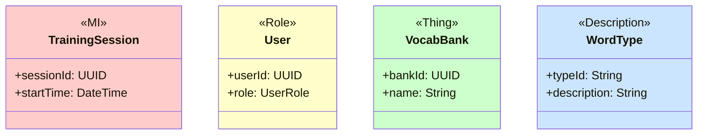
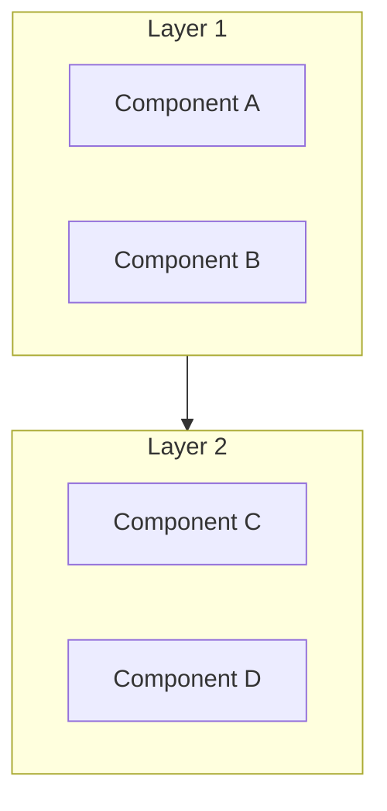
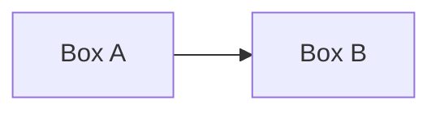

# SDD Standards and Specifications

This document contains detailed format and specifications for SDD (Software Design Description).

---

## Unified Document Format Specifications

### Standard Cover Format

```markdown
# Software Design Description
## For {Project Name}

Version {X.Y}
Prepared by {Author}
{Organization}
{Date}

## Table of Contents
<!-- TOC -->

## Revision History
| Name | Date | Reason For Changes | Version |
|------|------|--------------------|---------|
```

### Font Settings for CJK Support

For DOCX output, font settings are as follows:

| Character Type | Font |
|----------------|------|
| English/ASCII (ascii) | Arial |
| CJK/Full-width (eastAsia) | Microsoft JhengHei |
| Headings | Arial + Microsoft JhengHei (mixed) |
| Code | Consolas |

### Code Block Usage Rules

**Code Blocks (```) are only for actual code**. DOCX conversion applies monospace font + gray background.

| Content Type | Use Code Block | Notes |
|--------------|----------------|-------|
| Code (SQL, JSON, Swift, Kotlin) | ✅ Yes | Correct usage |
| Mermaid diagrams | ✅ Yes with ```mermaid | Must specify language |
| **Use Case (pre/post conditions, flow)** | ❌ No | Use bold labels + numbered lists |
| General description text | ❌ No | Use paragraphs or lists |
| ASCII Art | ❌ Avoid | Use Mermaid instead |

**Correct Use Case Format Example**:
```markdown
#### UC-001: User Login

**Preconditions:** User has installed the App

**Main Flow:**
1. User opens App
2. System displays login screen
3. User enters credentials
4. System validates successfully

**Postconditions:** User is logged in
```

### Mermaid Diagram Direction Rules

> ⚠️ **Important: Prefer vertical (TB) over horizontal (LR)**

In DOCX output, horizontal diagrams are scaled down making text hard to read. For readability:

| Diagram Type | Recommended Direction | Notes |
|--------------|----------------------|-------|
| Flowchart | `TB` (Top-Bottom) | Vertical, clear text |
| Architecture diagram | `TB` | Vertical, clear hierarchy |
| Simple connections (≤3 nodes) | `LR` acceptable | Horizontal still readable |
| Sequence diagram | No direction parameter | Automatically vertical |

**Correct Example (Vertical):**
```markdown
flowchart TB
    subgraph Online["Online Mode"]
        direction TB
        Cloud[Cloud Server]
        Cloud <--> Sync[Sync Manager]
        Sync <--> Local[Local Cache]
    end
```

**Mixed Mode (Vertical between layers + Horizontal within layers) - Suitable for multi-layer architecture:**
```markdown
flowchart TB
    subgraph Presentation["Presentation Layer"]
        direction LR
        AuthV[Auth] --- HomeV[Home] --- TrainV[Train]
    end

    subgraph Business["Business Layer"]
        direction LR
        AuthS[Auth Service] --- VocabS[Vocab Service]
    end

    Presentation --> Business
```
> This mode makes the diagram wider but shorter, suitable for placing on the same page as headings

**Avoid (Pure Horizontal):**
```markdown
flowchart LR
    Cloud --> Sync --> Local --> UI
```

### Font Size Settings

| Element | Size |
|---------|------|
| H1 | 18pt |
| H2 | 16pt |
| H3 | 14pt |
| H4 | 13pt |
| H5 | 12pt |
| Body | 11pt |
| Table | 11pt |
| Footer | 9pt |

---

## SDD Standard Screen Flow Specifications

### Design Psychology Principles

| Principle | Description | Validation Criteria |
|-----------|-------------|---------------------|
| Cognitive Load | Limit elements per screen | Main options ≤7 |
| Progressive Disclosure | Simple first, details later | Has step indicator |
| Spatial Orientation | Dashboard as navigation center | Cannot skip Dashboard |
| Fitts' Law | Frequently used buttons should be large and easy to tap | Buttons ≥44pt |
| Hick's Law | Reduce number of choices | Options ≤7 |

### Flow Sequence Rules

```
⚠️ Mandatory Sequence:

1. Splash → Login/Register → Profile Select/Create
2. Dashboard (spatial orientation center, cannot skip)
3. Feature modules (enter from Dashboard)
4. Settings (from Dashboard or Tab Bar)
```

---

## SDD Module Design Section Order Specifications

### Standard Section Structure

```markdown
## Module Design

### 3.1 Authentication Module (AUTH)
### 3.2 Dashboard Module (DASH)
### 3.3 Vocabulary Module (VOCAB)
### 3.4 Training Module (TRAIN)
### 3.5 Report Module (REPORT)
### 3.6 Settings Module (SETTING)
```

### Module Internal Structure

Each module must include:

```markdown
### 3.X Module Name (MODULE_CODE)

#### Module Overview
- Module description
- Main features
- Related requirements traceability

#### Screen Designs
- SCR-{MODULE}-001: Screen name
- SCR-{MODULE}-002: Screen name

#### Data Models
- Data structure definitions

#### API Endpoints
- Interface definitions
```

---

## Screen Design Section Standard Format

### SCR Block Format

```markdown
##### SCR-AUTH-001: Login Screen

**Requirements Traceability:** REQ-AUTH-001, REQ-AUTH-002

**Screen Description:**
User login screen supporting Email and Apple ID login.

**UI Prototype:**

| Device | Prototype File |
|--------|----------------|
| iPad | [`auth/SCR-AUTH-001-login.html`](../04-ui-flow/generated-ui/auth/SCR-AUTH-001-login.html) |
| iPhone | [`iphone/SCR-AUTH-001-login.html`](../04-ui-flow/generated-ui/iphone/SCR-AUTH-001-login.html) |

| iPad | iPhone |
|------|--------|
|  |  |

**UI Components:**

| Component | Type | Description |
|-----------|------|-------------|
| Email input | TextField | Email address input |
| Password input | SecureField | Password input (masked) |
| Login button | Button | Primary action button |
| Apple login | SignInWithAppleButton | Apple ID login |

**Button Navigation:**

| Button | Target Screen | Condition |
|--------|---------------|-----------|
| Login | SCR-DASH-001 | Validation success |
| Register | SCR-AUTH-002 | - |
| Forgot Password | SCR-AUTH-003 | - |
```

---

## Class Diagram Color Standards (Peter Coad Color UML)

| Category | Color | Hex | Usage |
|----------|-------|-----|-------|
| Moment-Interval (MI) | Pink | #FFCCCC | Events, transactions, moments |
| Role | Yellow | #FFFFCC | Roles, identities |
| Thing | Green | #CCFFCC | Entities, objects |
| Description | Blue | #CCE5FF | Descriptions, type definitions |

### Mermaid Syntax



---

## State Machine Color Standards

| State Type | Color | Hex |
|------------|-------|-----|
| Initial state | Light gray | #E0E0E0 |
| Processing | Light blue | #CCE5FF |
| Success/Complete | Light green | #CCFFCC |
| Failure/Error | Light red | #FFCCCC |
| Warning/Pending | Light yellow | #FFFFCC |

---

## C4 Model Architecture Diagram Color Standards

| Element | Color | Hex |
|---------|-------|-----|
| Person | Blue | #08427B |
| Software System | Dark blue | #1168BD |
| Container | Light blue | #438DD5 |
| Component | Lighter blue | #85BBF0 |
| External System | Gray | #999999 |

---

## Mermaid Diagram Adaptive Specifications

### Vertical Layering Principle



### Prohibited Diagram Formats

❌ **Do not use ASCII art**

```
Not allowed:
+--------+     +--------+
| Box A  | --> | Box B  |
+--------+     +--------+
```

✅ **Must use Mermaid**



---

## Image Embedding Specifications

### Image Format Requirements

| Image Type | Format | Notes |
|------------|--------|-------|
| Mermaid diagrams | **SVG** (mandatory) | Vector format, scales without loss |
| UI screen designs | **PNG** | Use `` syntax |
| External imported images | **SVG** (preferred) | Or high-resolution PNG |

### Markdown Embedding Syntax

```markdown

```

### Image Size Limits

- Maximum width: 550px (~6 inches, fits A4)
- Maximum height: 600px (prevents page overflow)
- Minimum size: 200px (avoids too small)
- All images automatically centered
