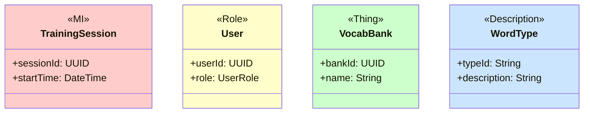
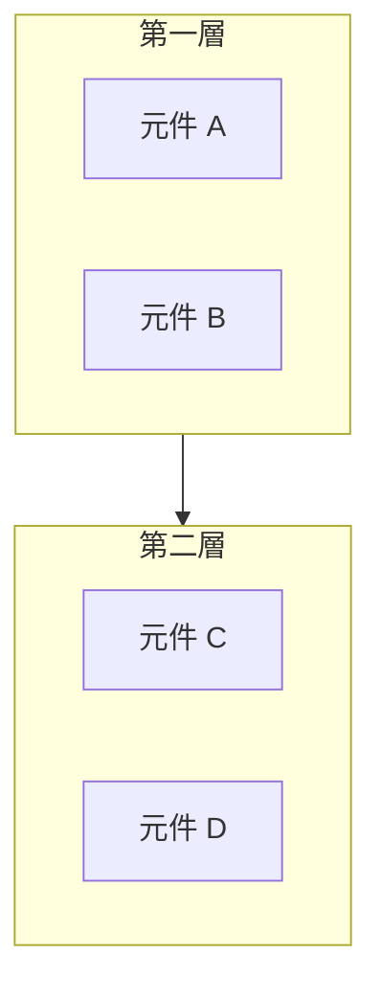
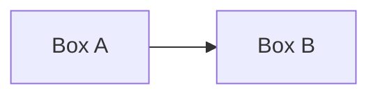

# SDD 標準規範

本文件包含 SDD (軟體設計規格書) 的詳細格式與規範。

---

## 統一文件格式規範

### 標準封面格式

```markdown
# Software Design Description
## For {Project Name}

Version {X.Y}
Prepared by {Author}
{Organization}
{Date}

## Table of Contents
<!-- TOC -->

## Revision History
| Name | Date | Reason For Changes | Version |
|------|------|--------------------|---------|
```

### 中文字型設定

DOCX 輸出時，字型設定如下：

| 字元類型 | 字型 |
|---------|------|
| 英文/半形 (ascii) | Arial |
| 中文/全形 (eastAsia) | 微軟正黑體 |
| 標題 | Arial + 微軟正黑體 (混合) |
| 程式碼 | Consolas |

### Code Block 使用規則

**Code Block（```）僅用於實際程式碼**，DOCX 轉換時會套用等寬字體 + 灰色背景。

| 內容類型 | 是否使用 Code Block | 說明 |
|---------|-------------------|------|
| 程式碼 (SQL, JSON, Swift, Kotlin) | ✅ 使用 | 正確用法 |
| Mermaid 圖表 | ✅ 使用 ```mermaid | 必須標註語言 |
| **Use Case (前置/後置條件、流程)** | ❌ 禁止 | 使用粗體標籤 + 編號清單 |
| 一般說明文字 | ❌ 禁止 | 使用段落或清單 |
| ASCII Art | ❌ 避免 | 改用 Mermaid |

**Use Case 正確格式範例**：
```markdown
#### UC-001: 用戶登入

**前置條件：** 用戶已安裝 App

**主要流程：**
1. 用戶開啟 App
2. 系統顯示登入畫面
3. 用戶輸入帳號密碼
4. 系統驗證成功

**後置條件：** 用戶完成登入
```

### Mermaid 圖表方向規則

> ⚠️ **重要：優先使用直式 (TB) 而非橫式 (LR)**

DOCX 輸出時，橫式圖表會被縮小導致文字難以閱讀。為確保可讀性：

| 圖表類型 | 推薦方向 | 說明 |
|---------|---------|------|
| 流程圖 (flowchart) | `TB` (Top-Bottom) | 直式，文字清晰 |
| 架構圖 | `TB` | 直式，層次分明 |
| 簡單連接 (≤3 節點) | `LR` 可接受 | 橫式仍可讀 |
| 時序圖 (sequence) | 無方向參數 | 自動直式 |

**正確範例 (直式)：**
```markdown
flowchart TB
    subgraph Online["Online Mode"]
        direction TB
        Cloud[Cloud Server]
        Cloud <--> Sync[Sync Manager]
        Sync <--> Local[Local Cache]
    end
```

**混合模式 (層間直式 + 層內橫式) - 適用於多層架構圖：**
```markdown
flowchart TB
    subgraph Presentation["Presentation Layer"]
        direction LR
        AuthV[Auth] --- HomeV[Home] --- TrainV[Train]
    end

    subgraph Business["Business Layer"]
        direction LR
        AuthS[Auth Service] --- VocabS[Vocab Service]
    end

    Presentation --> Business
```
> 此模式讓圖表變寬但變矮，適合與標題放在同一頁

**避免使用 (純橫式)：**
```markdown
flowchart LR
    Cloud --> Sync --> Local --> UI
```

### 字型大小設定

| 元素 | 大小 |
|------|------|
| H1 | 18pt |
| H2 | 16pt |
| H3 | 14pt |
| H4 | 13pt |
| H5 | 12pt |
| 內文 | 11pt |
| 表格 | 11pt |
| 頁尾 | 9pt |

---

## SDD 標準畫面流程規範

### 設計心理學原則

| 原則 | 說明 | 驗證標準 |
|------|------|---------|
| 認知負荷 (Cognitive Load) | 限制單一畫面元素數量 | 主要選項 ≤7 |
| 漸進式揭露 (Progressive Disclosure) | 先簡後詳 | 有步驟指示器 |
| 空間定向 (Spatial Orientation) | Dashboard 作為中心導航 | 不可跳過 Dashboard |
| Fitts' Law | 常用按鈕要大且好按 | 按鈕 ≥44pt |
| Hick's Law | 減少選項數量 | 選項 ≤7 |

### 流程順序規則

```
⚠️ 強制順序：

1. Splash → Login/Register → Profile Select/Create
2. Dashboard (空間定向中心，不可跳過)
3. 功能模組 (從 Dashboard 進入)
4. Settings (從 Dashboard 或 Tab Bar)
```

---

## SDD 模組設計章節順序規範

### 標準章節結構

```markdown
## Module Design

### 3.1 認證模組 (AUTH)
### 3.2 首頁模組 (DASH)
### 3.3 字庫模組 (VOCAB)
### 3.4 訓練模組 (TRAIN)
### 3.5 報告模組 (REPORT)
### 3.6 設定模組 (SETTING)
```

### 模組內部結構

每個模組必須包含：

```markdown
### 3.X 模組名稱 (MODULE_CODE)

#### Module Overview
- 模組描述
- 主要功能
- 相關需求追溯

#### Screen Designs
- SCR-{MODULE}-001: 畫面名稱
- SCR-{MODULE}-002: 畫面名稱

#### Data Models
- 資料結構定義

#### API Endpoints
- 介面定義
```

---

## 畫面設計章節標準格式

### SCR 區塊格式

```markdown
##### SCR-AUTH-001: Login Screen

**需求追溯：** REQ-AUTH-001, REQ-AUTH-002

**畫面說明：**
使用者登入畫面，支援 Email 和 Apple ID 登入。

**UI 原型：**

| 裝置 | 原型檔案 |
|------|---------|
| iPad | [`auth/SCR-AUTH-001-login.html`](../04-ui-flow/generated-ui/auth/SCR-AUTH-001-login.html) |
| iPhone | [`iphone/SCR-AUTH-001-login.html`](../04-ui-flow/generated-ui/iphone/SCR-AUTH-001-login.html) |

| iPad | iPhone |
|------|--------|
|  |  |

**UI 元件：**

| 元件 | 類型 | 說明 |
|------|------|------|
| Email 輸入框 | TextField | 電子郵件輸入 |
| 密碼輸入框 | SecureField | 密碼輸入 (遮罩) |
| 登入按鈕 | Button | 主要動作按鈕 |
| Apple 登入 | SignInWithAppleButton | Apple ID 登入 |

**Button Navigation：**

| 按鈕 | 目標畫面 | 條件 |
|------|---------|------|
| 登入 | SCR-DASH-001 | 驗證成功 |
| 註冊 | SCR-AUTH-002 | - |
| 忘記密碼 | SCR-AUTH-003 | - |
```

---

## Class Diagram 顏色標準 (Peter Coad Color UML)

| 類別 | 顏色 | Hex | 用途 |
|------|------|-----|------|
| Moment-Interval (MI) | 粉紅色 | #FFCCCC | 事件、交易、時間點 |
| Role | 黃色 | #FFFFCC | 角色、身份 |
| Thing | 綠色 | #CCFFCC | 實體、物件 |
| Description | 藍色 | #CCE5FF | 描述、類型定義 |

### Mermaid 語法



---

## State Machine 顏色標準

| 狀態類型 | 顏色 | Hex |
|---------|------|-----|
| 初始狀態 | 淺灰 | #E0E0E0 |
| 處理中 | 淺藍 | #CCE5FF |
| 成功/完成 | 淺綠 | #CCFFCC |
| 失敗/錯誤 | 淺紅 | #FFCCCC |
| 警告/待處理 | 淺黃 | #FFFFCC |

---

## C4 Model 架構圖顏色標準

| 元素 | 顏色 | Hex |
|------|------|-----|
| Person | 藍色 | #08427B |
| Software System | 深藍 | #1168BD |
| Container | 淺藍 | #438DD5 |
| Component | 更淺藍 | #85BBF0 |
| External System | 灰色 | #999999 |

---

## Mermaid 圖表自適應規範

### 垂直分層原則



### 禁止的圖表格式

❌ **禁止使用 ASCII 製圖**

```
不允許：
+--------+     +--------+
| Box A  | --> | Box B  |
+--------+     +--------+
```

✅ **必須使用 Mermaid**



---

## 圖片嵌入規範

### 圖片格式要求

| 圖片類型 | 格式 | 說明 |
|---------|------|------|
| Mermaid 圖表 | **SVG** (強制) | 向量格式，無限縮放不失真 |
| UI 畫面設計 | **PNG** | 使用 `` 語法 |
| 外部匯入圖片 | **SVG** (優先) | 或高解析度 PNG |

### Markdown 嵌入語法

```markdown

```

### 圖片尺寸限制

- 最大寬度：550px (~6 吋，適合 A4)
- 最大高度：600px (防止溢出頁面)
- 最小尺寸：200px (避免過小)
- 所有圖片自動置中
