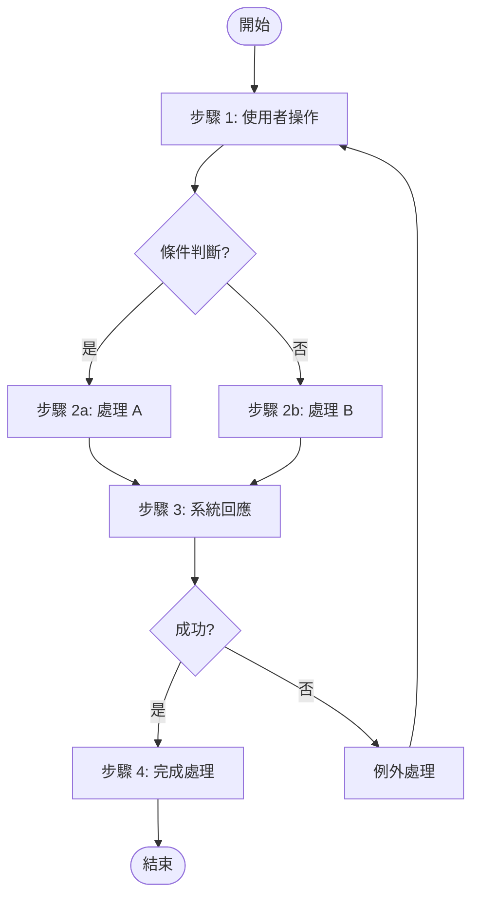

# SDD 軟體設計規格書範本
## Software Design Description Template

符合 IEC 62304 標準

---

## 目錄

1. [文件資訊](#1-文件資訊)
2. [使用案例設計](#2-使用案例設計-use-case-specifications)
3. [系統架構設計](#3-系統架構設計)
4. [模組設計](#4-模組設計)
5. [資料設計](#5-資料設計)
6. [介面設計](#6-介面設計)
7. [共用設計元素](#7-共用設計元素)
8. [安全設計考量](#8-安全設計考量)
9. [附錄](#9-附錄)

---

## 1. 文件資訊

| 項目 | 內容 |
|-----|------|
| 文件編號 | SDD-[專案代碼]-[版本號] |
| 文件名稱 | [產品名稱] 軟體設計規格書 |
| 版本 | [X.X] |
| 建立日期 | [YYYY-MM-DD] |
| 最後修改日期 | [YYYY-MM-DD] |
| 作者 | [姓名] |
| 審核者 | [姓名] |
| 核准者 | [姓名] |

### 1.1 版本歷史

| 版本 | 日期 | 修改內容 | 作者 |
|-----|------|---------|------|
| 1.0 | [YYYY-MM-DD] | 初版建立 | [姓名] |

### 1.2 參考文件

| 文件編號 | 文件名稱 | 版本 |
|---------|---------|------|
| SRS-xxx | 軟體需求規格書 | [版本] |

### 1.3 需求追溯對照

| 設計項目 ID | 對應需求 ID |
|------------|------------|
| SDD-001 | SRS-001 |
| SDD-002 | SRS-002 |

---

## 2. 使用案例設計 (Use Case Specifications)

> **說明**：本章節定義系統的使用案例規格，包含案例簡述、基本事件流、替代事件流、及活動圖。
> 每個使用案例應對應 SRS 中的功能需求。

### 2.1 使用案例總覽

| 用例 ID | 用例名稱 | 參與者 | 對應需求 | 優先級 |
|--------|---------|--------|---------|--------|
| UC-001 | [用例名稱] | [參與者] | SRS-xxx | P1 |
| UC-002 | [用例名稱] | [參與者] | SRS-xxx | P2 |

### 2.2 使用案例詳細規格

---

#### UC-001 [用例名稱]

| 屬性 | 內容 |
|-----|------|
| **用例 ID** | UC-001 |
| **用例名稱** | [用例名稱] |
| **參與者 (Actor)** | [主要參與者] |
| **對應需求** | SRS-xxx, SRS-xxx |
| **優先級** | P1 |

**用例簡述 (Brief Description)**：
[一段話描述此用例的目的與預期結果，約 2-3 句]

**前置條件 (Preconditions)**：
1. [前置條件 1]
2. [前置條件 2]

**後置條件 (Postconditions)**：
1. [後置條件 1：成功時的系統狀態]
2. [後置條件 2]

**基本事件流 (Basic Flow)**：

| 步驟 | 參與者動作 | 系統回應 |
|-----|-----------|---------|
| 1 | [使用者操作] | [系統處理與回應] |
| 2 | [使用者操作] | [系統處理與回應] |
| 3 | [使用者操作] | [系統處理與回應] |
| 4 | - | [系統完成處理] |

**替代事件流 (Alternative Flows)**：

| 流程 ID | 分支點 | 條件 | 步驟 |
|--------|--------|-----|------|
| A1 | 步驟 2 | [條件描述] | [替代步驟說明] |
| A2 | 步驟 3 | [條件描述] | [替代步驟說明] |

**例外事件流 (Exception Flows)**：

| 流程 ID | 分支點 | 錯誤條件 | 處理方式 |
|--------|--------|---------|---------|
| E1 | 步驟 2 | [錯誤條件] | [錯誤處理與訊息] |
| E2 | 步驟 3 | [錯誤條件] | [錯誤處理與訊息] |

**活動圖 (Activity Diagram)**：



**補充說明**：
- [其他需要說明的事項]
- [業務規則或限制]

---

## 3. 系統架構設計

### 3.1 架構概述

[描述整體系統架構設計理念]

### 3.2 架構圖

```
┌─────────────────────────────────────────────────────────┐
│                    Presentation Layer                    │
│  ┌─────────────┐  ┌─────────────┐  ┌─────────────┐     │
│  │    View     │  │  Controller │  │   ViewModel │     │
│  └─────────────┘  └─────────────┘  └─────────────┘     │
├─────────────────────────────────────────────────────────┤
│                    Business Layer                        │
│  ┌─────────────┐  ┌─────────────┐  ┌─────────────┐     │
│  │   Service   │  │   UseCase   │  │   Handler   │     │
│  └─────────────┘  └─────────────┘  └─────────────┘     │
├─────────────────────────────────────────────────────────┤
│                    Data Layer                            │
│  ┌─────────────┐  ┌─────────────┐  ┌─────────────┐     │
│  │ Repository  │  │    DAO      │  │   Entity    │     │
│  └─────────────┘  └─────────────┘  └─────────────┘     │
└─────────────────────────────────────────────────────────┘
```

### 3.3 分層說明

| 層級 | 名稱 | 職責 | 主要元件 |
|-----|------|------|---------|
| 1 | Presentation Layer | UI 呈現與使用者互動 | View, Controller |
| 2 | Business Layer | 業務邏輯處理 | Service, UseCase |
| 3 | Data Layer | 資料存取與管理 | Repository, DAO |

### 3.4 軟體單元架構

| 單元 ID | 單元名稱 | 所屬層級 | 安全分類 |
|--------|---------|---------|---------|
| SDD-UNIT-001 | [單元名稱] | [層級] | [A/B/C] |

---

## 4. 模組設計

> **說明**：每個模組設計包含功能說明、處理邏輯、以及相關的畫面設計 (UI/UX)，
> 將設計與畫面整合呈現，便於完整理解模組功能。

### 4.1 模組總覽

| ID | 模組名稱 | 對應需求 | 安全分類 | 說明 |
|----|---------|---------|---------|------|
| SDD-001 | [模組名稱] | SRS-001 | [A/B/C] | [簡述] |
| SDD-002 | [模組名稱] | SRS-002 | [A/B/C] | [簡述] |

---

### 4.2 SDD-001 [模組名稱]

| 屬性 | 內容 |
|-----|------|
| **ID** | SDD-001 |
| **名稱** | [模組名稱] |
| **對應需求** | SRS-001, SRS-002 |
| **安全分類** | [Class A/B/C] |
| **所屬層級** | [層級名稱] |
| **職責** | [描述模組職責] |

#### 4.2.1 功能說明

[描述此模組的主要功能與業務邏輯]

#### 4.2.2 輸入/輸出

**輸入**：
| 參數 | 類型 | 說明 |
|-----|------|------|
| [參數名] | [類型] | [說明] |

**輸出**：
| 參數 | 類型 | 說明 |
|-----|------|------|
| [參數名] | [類型] | [說明] |

#### 4.2.3 處理邏輯

1. [步驟1]
2. [步驟2]
3. [步驟3]

#### 4.2.4 相依模組

- SDD-002: [相依說明]

#### 4.2.5 錯誤處理

| 錯誤碼 | 錯誤說明 | 處理方式 |
|--------|---------|---------|
| [代碼] | [說明] | [處理方式] |

#### 4.2.6 畫面設計

##### SCR-XXX-001 [畫面名稱]

| 屬性 | 內容 |
|-----|------|
| **畫面 ID** | SCR-XXX-001 |
| **畫面名稱** | [畫面名稱] |
| **對應需求** | SRS-001 |
| **Figma 連結** | [連結]() |

**1. 程式介面**

```
┌────────────────────────────────────────────────┐
│                   [標題列]                       │
├────────────────────────────────────────────────┤
│                                                │
│   ┌────────────────────────────────────┐      │
│   │ [輸入欄位 1]                        │      │
│   └────────────────────────────────────┘      │
│                                                │
│   ┌────────────────────────────────────┐      │
│   │ [輸入欄位 2]                        │      │
│   └────────────────────────────────────┘      │
│                                                │
│   ┌────────────────────────────────────┐      │
│   │         [主要按鈕]                  │      │
│   └────────────────────────────────────┘      │
│                                                │
└────────────────────────────────────────────────┘
```

**2. 功能說明**

[描述此畫面的主要功能與操作流程]

- 啟動時，系統會在左側列表顯示所有資料
- 選擇列表項目後，資料會自動顯示在右側修改區
- 修改資料後點擊「修改」按鈕即可儲存變更
- 點擊「刪除」按鈕可刪除選中的記錄
- 點擊「清空」按鈕可清除修改區的內容
- 在新增區填入資料後點擊「新增」按鈕可新增記錄

**3. UI 元件規格**

| 元件 ID | 元件類型 | 規格 | 對應需求 |
|---------|---------|------|----------|
| lst_data | ListView | 顯示所有資料列表 | SRS-001 |
| txt_field1 | TextField | 輸入欄位 1 | SRS-001 |
| txt_field2 | TextField | 輸入欄位 2 | SRS-001 |
| btn_modify | Button | 修改按鈕 | SRS-001 |
| btn_delete | Button | 刪除按鈕 | SRS-001 |
| btn_clear | Button | 清空按鈕 | - |
| btn_add | Button | 新增按鈕 | SRS-002 |

**4. 互動規格**

| 互動事件 | 觸發元件 | 行為 | 動畫/效果 |
|---------|---------|------|----------|
| 選擇列表項目 | lst_data | 載入資料至修改區 | 高亮選中項 |
| 點擊修改 | btn_modify | 儲存修改並更新列表 | 成功提示 |
| 點擊刪除 | btn_delete | 刪除記錄並更新列表 | 確認對話框 |
| 點擊新增 | btn_add | 新增記錄並更新列表 | 成功提示 |

**5. 錯誤處理 UI**

| 錯誤類型 | 錯誤訊息 | UI 位置 | 樣式 |
|---------|---------|---------|------|
| 欄位為空 | 請填寫必填欄位 | 欄位下方 | 紅字 |
| 資料重複 | 此資料已存在 | 表單上方 | 紅色警告框 |

---

##### SCR-XXX-002 [另一個畫面名稱]

| 屬性 | 內容 |
|-----|------|
| **畫面 ID** | SCR-XXX-002 |
| **畫面名稱** | [畫面名稱] |
| **對應需求** | SRS-002 |

**1. 程式介面**

[畫面布局圖]

**2. 功能說明**

[功能描述]

---

### 4.3 SDD-002 [另一個模組名稱]

| 屬性 | 內容 |
|-----|------|
| **ID** | SDD-002 |
| **名稱** | [模組名稱] |
| **對應需求** | SRS-003 |
| **安全分類** | [Class A/B/C] |
| **所屬層級** | [層級名稱] |
| **職責** | [描述模組職責] |

#### 4.3.1 功能說明

[描述此模組的主要功能]

#### 4.3.2 輸入/輸出

**輸入**：
| 參數 | 類型 | 說明 |
|-----|------|------|
| [參數名] | [類型] | [說明] |

**輸出**：
| 參數 | 類型 | 說明 |
|-----|------|------|
| [參數名] | [類型] | [說明] |

#### 4.3.3 畫面設計

[此模組的相關畫面設計]

---

## 5. 資料設計

### 5.1 資料模型

```
┌─────────────────┐       ┌─────────────────┐
│     Entity A    │       │     Entity B    │
├─────────────────┤       ├─────────────────┤
│ - id: String    │ 1   * │ - id: String    │
│ - name: String  ├───────┤ - entityAId: FK │
│ - createdAt     │       │ - value: Int    │
└─────────────────┘       └─────────────────┘
```

### 5.2 資料實體定義

#### 5.2.1 [實體名稱]

| 欄位 | 類型 | 必填 | 說明 |
|-----|------|------|------|
| id | String | Y | 主鍵 |
| name | String | Y | 名稱 |
| createdAt | DateTime | Y | 建立時間 |

### 5.3 資料流程

```
[輸入來源] → [處理模組] → [儲存位置]
```

### 5.4 資料安全

| 資料類型 | 敏感等級 | 加密方式 | 存取控制 |
|---------|---------|---------|---------|
| [類型] | [高/中/低] | [加密演算法] | [控制方式] |

---

## 6. 介面設計

### 6.1 內部介面

#### SDD-INT-001 [介面名稱]

| 屬性 | 內容 |
|-----|------|
| **ID** | SDD-INT-001 |
| **名稱** | [介面名稱] |
| **類型** | [API/Event/Message] |
| **提供者** | [模組 ID] |
| **使用者** | [模組 ID] |

**介面定義**：
```
interface [InterfaceName] {
    method1(param1: Type): ReturnType
    method2(param2: Type): ReturnType
}
```

### 6.2 外部介面

#### SDD-EXT-001 [外部介面名稱]

| 屬性 | 內容 |
|-----|------|
| **ID** | SDD-EXT-001 |
| **名稱** | [介面名稱] |
| **對應需求** | SRS-HW-001 |
| **通訊協定** | [協定名稱] |
| **資料格式** | [JSON/XML/Binary] |

**訊息格式**：
```json
{
    "field1": "string",
    "field2": 123
}
```

---

## 7. 共用設計元素

> **說明**：本章節定義跨模組共用的設計元素，包含色彩系統、字型系統、共用元件、動畫規格等。

### 7.1 色彩系統

| 色彩名稱 | HEX 值 | 用途 |
|---------|--------|------|
| Primary | #[XXXXXX] | 主要按鈕、強調色 |
| Primary Dark | #[XXXXXX] | 按下狀態 |
| Secondary | #[XXXXXX] | 次要元素 |
| Success | #[XXXXXX] | 成功狀態 |
| Warning | #[XXXXXX] | 警告狀態 |
| Error | #[XXXXXX] | 錯誤狀態 |
| Background | #[XXXXXX] | 背景色 |
| Surface | #[XXXXXX] | 卡片/表面 |
| Text Primary | #[XXXXXX] | 主要文字 |
| Text Secondary | #[XXXXXX] | 次要文字 |

### 7.2 字型系統

| 樣式名稱 | 字型 | 大小 | 行高 | 字重 | 用途 |
|---------|------|------|------|------|------|
| Headline Large | [字型] | 32px | 40px | Bold | 頁面標題 |
| Headline Medium | [字型] | 28px | 36px | Bold | 區塊標題 |
| Title Large | [字型] | 22px | 28px | Medium | 卡片標題 |
| Body Large | [字型] | 16px | 24px | Regular | 內文 |
| Body Medium | [字型] | 14px | 20px | Regular | 次要內文 |
| Label Large | [字型] | 14px | 20px | Medium | 按鈕文字 |
| Caption | [字型] | 12px | 16px | Regular | 輔助說明 |

### 7.3 共用元件庫

| 元件名稱 | 變體 | 說明 |
|---------|------|------|
| Button | Primary, Secondary, Disabled, Loading | 按鈕元件 |
| TextField | Default, Focused, Error, Disabled | 文字輸入 |
| Card | Default, Elevated, Outlined | 卡片容器 |
| Alert | Info, Success, Warning, Error | 提示訊息 |
| Loading | Small, Medium, Large | 載入動畫 |

### 7.4 動畫與轉場設計

#### 7.4.1 頁面轉場

| 轉場類型 | 動畫效果 | 時長 | 緩動曲線 | 使用情境 |
|---------|---------|------|---------|---------|
| Push | 從右滑入 | 300ms | ease-out | 進入下一層頁面 |
| Pop | 向右滑出 | 250ms | ease-in | 返回上一層 |
| Modal | 從底部彈出 | 300ms | ease-out | 彈出選單/表單 |
| Fade | 淡入淡出 | 200ms | linear | Tab 切換 |

#### 7.4.2 元件動畫

| 動畫 ID | 動畫名稱 | 格式 | 用途 | 觸發條件 |
|---------|---------|------|------|---------|
| ANI-001 | loading_spinner | Lottie | 載入中 | API 呼叫時 |
| ANI-002 | success_check | Lottie | 操作成功 | 提交成功後 |
| ANI-003 | error_shake | CSS | 錯誤提示 | 驗證失敗時 |

### 7.5 響應式設計

| 斷點名稱 | 螢幕寬度 | 設備類型 | Layout 調整 |
|---------|---------|---------|------------|
| Compact | < 600dp | 手機 (直立) | 單欄佈局 |
| Medium | 600-840dp | 手機 (橫向) / 小平板 | 雙欄可選 |
| Expanded | > 840dp | 平板 / 桌面 | 多欄佈局 |

### 7.6 無障礙設計 (Accessibility)

| 項目 | 要求 | 驗證方法 |
|-----|------|---------|
| 色彩對比 | WCAG AA (4.5:1) | Contrast 檢查工具 |
| 觸控目標 | 最小 44×44 pt | 設計審查 |
| 焦點順序 | 邏輯順序 | 鍵盤導航測試 |
| 替代文字 | 所有圖片/圖示 | 程式碼審查 |

---

## 8. 安全設計考量

### 8.1 風險緩解設計

| 風險 ID | 風險描述 | 緩解設計 | 對應模組 |
|--------|---------|---------|---------|
| RISK-001 | [風險描述] | [緩解措施] | SDD-001 |

### 8.2 錯誤處理策略

| 錯誤類型 | 處理策略 | 恢復機制 |
|---------|---------|---------|
| [類型] | [策略] | [機制] |

### 8.3 安全關鍵模組

| 模組 ID | 安全分類 | 安全措施 |
|--------|---------|---------|
| SDD-001 | [A/B/C] | [措施說明] |

---

## 9. 附錄

### 9.1 設計決策記錄

| 決策 ID | 主題 | 決策內容 | 理由 | 日期 |
|--------|------|---------|------|------|
| DEC-001 | [主題] | [決策] | [理由] | [日期] |

### 9.2 術語定義

| 術語 | 定義 |
|-----|------|
| [術語] | [定義] |

### 9.3 縮寫

| 縮寫 | 全稱 |
|-----|------|
| SDD | Software Design Description |
| DAO | Data Access Object |

---

## 簽核

| 角色 | 姓名 | 簽名 | 日期 |
|-----|------|------|------|
| 作者 | | | |
| 審核者 | | | |
| 核准者 | | | |
