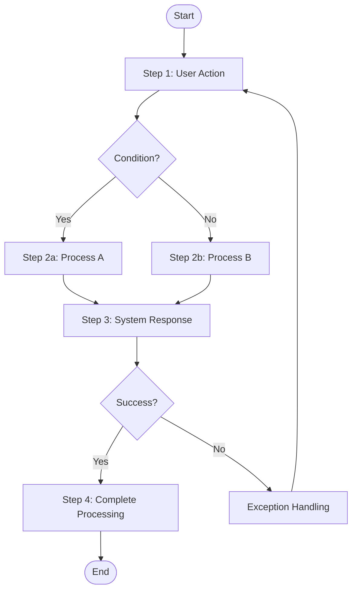

# SDD-{{PROJECT_CODE}}-1.0

## Software Design Description

**Document ID:** SDD-{{PROJECT_CODE}}-1.0
**Version:** 1.0
**Created Date:** {{DATE}}
**Last Updated:** {{DATE}}
**Project Name:** {{PROJECT_NAME}}
**Document Status:** Draft

---

### Document Approval

| Role | Name | Date |
|------|------|------|
| Author | | |
| Reviewer | | |
| Approver | | |

---

## Table of Contents

1. [Revision History](#1-revision-history)
2. [Use Case Specifications](#2-use-case-specifications)
3. [System Architecture Design](#3-system-architecture-design)
4. [Module Design](#4-module-design)
5. [Data Design](#5-data-design)
6. [Interface Design](#6-interface-design)
7. [Common Design Elements](#7-common-design-elements)
8. [Safety Design Considerations](#8-safety-design-considerations)
9. [Appendix](#9-appendix)

---

## 1. Revision History

| Version | Date | Changes | Author |
|---------|------|---------|--------|
| 1.0 | {{DATE}} | Initial version | |

### 1.1 Reference Documents

| Document ID | Document Name | Version |
|-------------|---------------|---------|
| SRS-{{PROJECT_CODE}}-1.0 | Software Requirements Specification | 1.0 |

### 1.2 Requirements Traceability

| Design Item ID | Corresponding Requirement ID |
|----------------|------------------------------|
| SDD-001 | REQ-XXX-001 |
| SDD-002 | REQ-XXX-002 |

---

## 2. Use Case Specifications

> **Description**: This section defines system use case specifications, including case summaries, basic event flows, alternative event flows, and activity diagrams.
> Each use case should correspond to functional requirements in the SRS.

### 2.1 Use Case Overview

| Use Case ID | Use Case Name | Actor | Related Requirements | Priority |
|-------------|---------------|-------|---------------------|----------|
| UC-001 | [Use Case Name] | [Actor] | SRS-xxx | P1 |
| UC-002 | [Use Case Name] | [Actor] | SRS-xxx | P2 |

### 2.2 Detailed Use Case Specifications

---

#### UC-001 [Use Case Name]

| Attribute | Content |
|-----------|---------|
| **Use Case ID** | UC-001 |
| **Use Case Name** | [Use Case Name] |
| **Actor** | [Primary Actor] |
| **Related Requirements** | SRS-xxx, SRS-xxx |
| **Priority** | P1 |

**Brief Description**:
[A paragraph describing the purpose and expected outcome of this use case, approximately 2-3 sentences]

**Preconditions**:
1. [Precondition 1]
2. [Precondition 2]

**Postconditions**:
1. [Postcondition 1: System state on success]
2. [Postcondition 2]

**Basic Flow**:

| Step | Actor Action | System Response |
|------|--------------|-----------------|
| 1 | [User action] | [System processing and response] |
| 2 | [User action] | [System processing and response] |
| 3 | [User action] | [System processing and response] |
| 4 | - | [System completes processing] |

**Alternative Flows**:

| Flow ID | Branch Point | Condition | Steps |
|---------|--------------|-----------|-------|
| A1 | Step 2 | [Condition description] | [Alternative step description] |
| A2 | Step 3 | [Condition description] | [Alternative step description] |

**Exception Flows**:

| Flow ID | Branch Point | Error Condition | Handling |
|---------|--------------|-----------------|----------|
| E1 | Step 2 | [Error condition] | [Error handling and message] |
| E2 | Step 3 | [Error condition] | [Error handling and message] |

**Activity Diagram**:



**Additional Notes**:
- [Other items requiring explanation]
- [Business rules or constraints]

---

## 3. System Architecture Design

### 3.1 Architecture Overview

[Describe overall system architecture design philosophy]

### 3.2 Architecture Diagram

```
┌─────────────────────────────────────────────────────────┐
│                    Presentation Layer                    │
│  ┌─────────────┐  ┌─────────────┐  ┌─────────────┐     │
│  │    View     │  │  Controller │  │   ViewModel │     │
│  └─────────────┘  └─────────────┘  └─────────────┘     │
├─────────────────────────────────────────────────────────┤
│                    Business Layer                        │
│  ┌─────────────┐  ┌─────────────┐  ┌─────────────┐     │
│  │   Service   │  │   UseCase   │  │   Handler   │     │
│  └─────────────┘  └─────────────┘  └─────────────┘     │
├─────────────────────────────────────────────────────────┤
│                    Data Layer                            │
│  ┌─────────────┐  ┌─────────────┐  ┌─────────────┐     │
│  │ Repository  │  │    DAO      │  │   Entity    │     │
│  └─────────────┘  └─────────────┘  └─────────────┘     │
└─────────────────────────────────────────────────────────┘
```

### 3.3 Layer Description

| Layer | Name | Responsibility | Main Components |
|-------|------|----------------|-----------------|
| 1 | Presentation Layer | UI presentation and user interaction | View, Controller |
| 2 | Business Layer | Business logic processing | Service, UseCase |
| 3 | Data Layer | Data access and management | Repository, DAO |

### 3.4 Software Unit Architecture

| Unit ID | Unit Name | Layer | Safety Class |
|---------|-----------|-------|--------------|
| SDD-UNIT-001 | [Unit Name] | [Layer] | [A/B/C] |

---

## 4. Module Design

> **Description**: Each module design includes functional description, processing logic, and related screen design (UI/UX),
> integrating design and screens for complete understanding of module functionality.

### 4.1 Module Overview

| ID | Module Name | Related Requirements | Safety Class | Description |
|----|-------------|---------------------|--------------|-------------|
| SDD-001 | [Module Name] | SRS-001 | [A/B/C] | [Brief description] |
| SDD-002 | [Module Name] | SRS-002 | [A/B/C] | [Brief description] |

---

### 4.2 SDD-001 [Module Name]

| Attribute | Content |
|-----------|---------|
| **ID** | SDD-001 |
| **Name** | [Module Name] |
| **Related Requirements** | SRS-001, SRS-002 |
| **Safety Class** | [Class A/B/C] |
| **Layer** | [Layer Name] |
| **Responsibility** | [Describe module responsibility] |

#### 4.2.1 Functional Description

[Describe the main functions and business logic of this module]

#### 4.2.2 Input/Output

**Input**:
| Parameter | Type | Description |
|-----------|------|-------------|
| [Parameter Name] | [Type] | [Description] |

**Output**:
| Parameter | Type | Description |
|-----------|------|-------------|
| [Parameter Name] | [Type] | [Description] |

#### 4.2.3 Processing Logic

1. [Step 1]
2. [Step 2]
3. [Step 3]

#### 4.2.4 Dependencies

- SDD-002: [Dependency description]

#### 4.2.5 Error Handling

| Error Code | Error Description | Handling |
|------------|-------------------|----------|
| [Code] | [Description] | [Handling method] |

#### 4.2.6 Screen Design

##### SCR-XXX-001 [Screen Name]

| Attribute | Content |
|-----------|---------|
| **Screen ID** | SCR-XXX-001 |
| **Screen Name** | [Screen Name] |
| **Related Requirements** | SRS-001 |
| **Figma Link** | [Link]() |

**1. Interface Layout**

```
┌────────────────────────────────────────────────┐
│                   [Header]                       │
├────────────────────────────────────────────────┤
│                                                │
│   ┌────────────────────────────────────┐      │
│   │ [Input Field 1]                     │      │
│   └────────────────────────────────────┘      │
│                                                │
│   ┌────────────────────────────────────┐      │
│   │ [Input Field 2]                     │      │
│   └────────────────────────────────────┘      │
│                                                │
│   ┌────────────────────────────────────┐      │
│   │         [Primary Button]            │      │
│   └────────────────────────────────────┘      │
│                                                │
└────────────────────────────────────────────────┘
```

**2. Functional Description**

[Describe the main functions and operation flow of this screen]

- On launch, the system displays all data in the left list
- After selecting a list item, data automatically displays in the right edit area
- After editing, click "Modify" button to save changes
- Click "Delete" button to delete selected record
- Click "Clear" button to clear the edit area
- Fill in data in the add area and click "Add" to create a new record

**3. UI Component Specifications**

| Component ID | Component Type | Specification | Related Requirement |
|--------------|----------------|---------------|---------------------|
| lst_data | ListView | Display all data list | SRS-001 |
| txt_field1 | TextField | Input field 1 | SRS-001 |
| txt_field2 | TextField | Input field 2 | SRS-001 |
| btn_modify | Button | Modify button | SRS-001 |
| btn_delete | Button | Delete button | SRS-001 |
| btn_clear | Button | Clear button | - |
| btn_add | Button | Add button | SRS-002 |

**4. Interaction Specifications**

| Interaction Event | Trigger Component | Behavior | Animation/Effect |
|-------------------|-------------------|----------|------------------|
| Select list item | lst_data | Load data to edit area | Highlight selected |
| Click modify | btn_modify | Save changes and update list | Success prompt |
| Click delete | btn_delete | Delete record and update list | Confirmation dialog |
| Click add | btn_add | Add record and update list | Success prompt |

**5. Button Navigation** ⚠️ MANDATORY

> **Important:** This table is the key data source for `app-uiux-designer.skill` to generate UI Flow.
> Every clickable element (buttons, links, tabs) must specify a clear `Target Screen`.

| Element ID | Element Text | Type | Target Screen | Condition |
|------------|--------------|------|---------------|-----------|
| btn_modify | Modify | Button | (current) | Data validation passed |
| btn_delete | Delete | Button | (current) | After delete confirmation |
| btn_add | Add | Button | (current) | Data validation passed |
| btn_back | Back | Button | SCR-XXX-001 | - |
| lnk_detail | View Details | Link | SCR-XXX-003 | - |

> **Target Screen Value Description:**
> - `SCR-XXX-001` - Navigate to specified screen
> - `(current)` - Stay on current screen (data update only)
> - `(modal)` - Show dialog/bottom sheet
> - `(back)` - Return to previous page
> - `(external)` - Open external link

**6. UI Prototype Reference** (Phase 3 Backfill)

> ⚠️ **Format Specification:** Do not use tables, embed images directly. Backfilled by `app-uiux-designer.skill` in 07-feedback phase.

**iPad Version:**


**iPhone Version:**


**7. Error Handling UI**

| Error Type | Error Message | UI Location | Style |
|------------|---------------|-------------|-------|
| Empty field | Please fill in required fields | Below field | Red text |
| Duplicate data | This data already exists | Above form | Red warning box |

---

##### SCR-XXX-002 [Another Screen Name]

| Attribute | Content |
|-----------|---------|
| **Screen ID** | SCR-XXX-002 |
| **Screen Name** | [Screen Name] |
| **Related Requirements** | SRS-002 |

**1. Interface Layout**

[Screen layout diagram]

**2. Functional Description**

[Functional description]

---

### 4.3 SDD-002 [Another Module Name]

| Attribute | Content |
|-----------|---------|
| **ID** | SDD-002 |
| **Name** | [Module Name] |
| **Related Requirements** | SRS-003 |
| **Safety Class** | [Class A/B/C] |
| **Layer** | [Layer Name] |
| **Responsibility** | [Describe module responsibility] |

#### 4.3.1 Functional Description

[Describe the main functions of this module]

#### 4.3.2 Input/Output

**Input**:
| Parameter | Type | Description |
|-----------|------|-------------|
| [Parameter Name] | [Type] | [Description] |

**Output**:
| Parameter | Type | Description |
|-----------|------|-------------|
| [Parameter Name] | [Type] | [Description] |

#### 4.3.3 Screen Design

[Related screen designs for this module]

---

## 5. Data Design

### 5.1 Data Model

```
┌─────────────────┐       ┌─────────────────┐
│     Entity A    │       │     Entity B    │
├─────────────────┤       ├─────────────────┤
│ - id: String    │ 1   * │ - id: String    │
│ - name: String  ├───────┤ - entityAId: FK │
│ - createdAt     │       │ - value: Int    │
└─────────────────┘       └─────────────────┘
```

### 5.2 Data Entity Definitions

#### 5.2.1 [Entity Name]

| Field | Type | Required | Description |
|-------|------|----------|-------------|
| id | String | Y | Primary key |
| name | String | Y | Name |
| createdAt | DateTime | Y | Creation time |

### 5.3 Data Flow

```
[Input Source] → [Processing Module] → [Storage Location]
```

### 5.4 Data Security

| Data Type | Sensitivity Level | Encryption | Access Control |
|-----------|-------------------|------------|----------------|
| [Type] | [High/Medium/Low] | [Encryption algorithm] | [Control method] |

---

## 6. Interface Design

### 6.1 Internal Interfaces

#### SDD-INT-001 [Interface Name]

| Attribute | Content |
|-----------|---------|
| **ID** | SDD-INT-001 |
| **Name** | [Interface Name] |
| **Type** | [API/Event/Message] |
| **Provider** | [Module ID] |
| **Consumer** | [Module ID] |

**Interface Definition**:
```
interface [InterfaceName] {
    method1(param1: Type): ReturnType
    method2(param2: Type): ReturnType
}
```

### 6.2 External Interfaces

#### SDD-EXT-001 [External Interface Name]

| Attribute | Content |
|-----------|---------|
| **ID** | SDD-EXT-001 |
| **Name** | [Interface Name] |
| **Related Requirements** | SRS-HW-001 |
| **Protocol** | [Protocol Name] |
| **Data Format** | [JSON/XML/Binary] |

**Message Format**:
```json
{
    "field1": "string",
    "field2": 123
}
```

---

## 7. Common Design Elements

> **Description**: This section defines cross-module common design elements, including color system, typography, common components, animation specifications, etc.

### 7.1 Color System

| Color Name | HEX Value | Usage |
|------------|-----------|-------|
| Primary | #[XXXXXX] | Primary buttons, accent color |
| Primary Dark | #[XXXXXX] | Pressed state |
| Secondary | #[XXXXXX] | Secondary elements |
| Success | #[XXXXXX] | Success state |
| Warning | #[XXXXXX] | Warning state |
| Error | #[XXXXXX] | Error state |
| Background | #[XXXXXX] | Background color |
| Surface | #[XXXXXX] | Cards/surfaces |
| Text Primary | #[XXXXXX] | Primary text |
| Text Secondary | #[XXXXXX] | Secondary text |

### 7.2 Typography System

| Style Name | Font | Size | Line Height | Weight | Usage |
|------------|------|------|-------------|--------|-------|
| Headline Large | [Font] | 32px | 40px | Bold | Page titles |
| Headline Medium | [Font] | 28px | 36px | Bold | Section titles |
| Title Large | [Font] | 22px | 28px | Medium | Card titles |
| Body Large | [Font] | 16px | 24px | Regular | Body text |
| Body Medium | [Font] | 14px | 20px | Regular | Secondary text |
| Label Large | [Font] | 14px | 20px | Medium | Button text |
| Caption | [Font] | 12px | 16px | Regular | Helper text |

### 7.3 Common Component Library

| Component Name | Variants | Description |
|----------------|----------|-------------|
| Button | Primary, Secondary, Disabled, Loading | Button component |
| TextField | Default, Focused, Error, Disabled | Text input |
| Card | Default, Elevated, Outlined | Card container |
| Alert | Info, Success, Warning, Error | Alert messages |
| Loading | Small, Medium, Large | Loading animation |

### 7.4 Animation and Transition Design

#### 7.4.1 Page Transitions

| Transition Type | Animation Effect | Duration | Easing | Use Case |
|-----------------|------------------|----------|--------|----------|
| Push | Slide in from right | 300ms | ease-out | Enter next level page |
| Pop | Slide out to right | 250ms | ease-in | Return to previous level |
| Modal | Slide up from bottom | 300ms | ease-out | Popup menu/form |
| Fade | Fade in/out | 200ms | linear | Tab switching |

#### 7.4.2 Component Animations

| Animation ID | Animation Name | Format | Usage | Trigger |
|--------------|----------------|--------|-------|---------|
| ANI-001 | loading_spinner | Lottie | Loading | On API call |
| ANI-002 | success_check | Lottie | Success | After submit success |
| ANI-003 | error_shake | CSS | Error prompt | On validation failure |

### 7.5 Responsive Design

| Breakpoint | Screen Width | Device Type | Layout Adjustment |
|------------|--------------|-------------|-------------------|
| Compact | < 600dp | Phone (portrait) | Single column layout |
| Medium | 600-840dp | Phone (landscape) / Small tablet | Dual column optional |
| Expanded | > 840dp | Tablet / Desktop | Multi-column layout |

### 7.6 Accessibility Design

| Item | Requirement | Validation Method |
|------|-------------|-------------------|
| Color contrast | WCAG AA (4.5:1) | Contrast checking tool |
| Touch target | Minimum 44×44 pt | Design review |
| Focus order | Logical order | Keyboard navigation test |
| Alt text | All images/icons | Code review |

---

## 8. Safety Design Considerations

### 8.1 Risk Mitigation Design

| Risk ID | Risk Description | Mitigation Design | Related Module |
|---------|------------------|-------------------|----------------|
| RISK-001 | [Risk description] | [Mitigation measures] | SDD-001 |

### 8.2 Error Handling Strategy

| Error Type | Handling Strategy | Recovery Mechanism |
|------------|-------------------|-------------------|
| [Type] | [Strategy] | [Mechanism] |

### 8.3 Safety-Critical Modules

| Module ID | Safety Class | Safety Measures |
|-----------|--------------|-----------------|
| SDD-001 | [A/B/C] | [Measure description] |

---

## 9. Appendix

### 9.1 Design Decision Records

| Decision ID | Topic | Decision | Rationale | Date |
|-------------|-------|----------|-----------|------|
| DEC-001 | [Topic] | [Decision] | [Rationale] | [Date] |

### 9.2 Terminology Definitions

| Term | Definition |
|------|------------|
| [Term] | [Definition] |

### 9.3 Abbreviations

| Abbreviation | Full Name |
|--------------|-----------|
| SDD | Software Design Description |
| DAO | Data Access Object |

---

> **End of Document**
