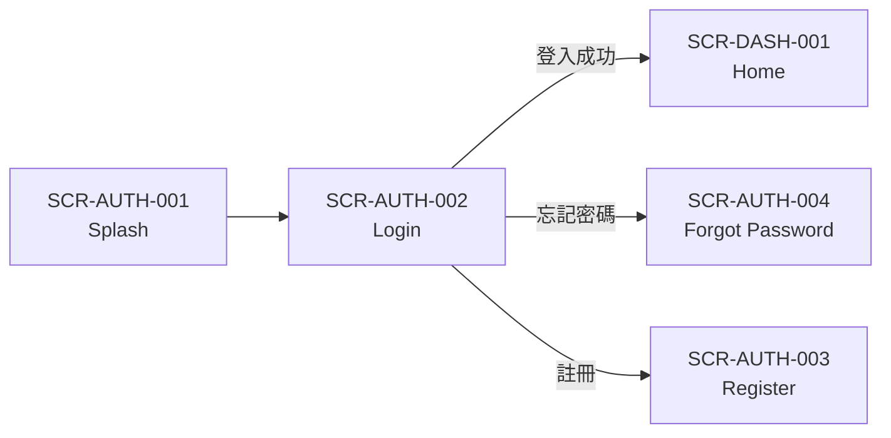
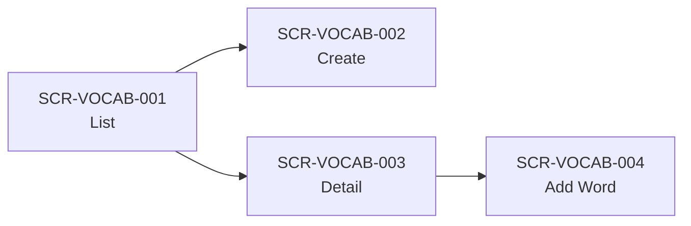

# UI/UX Designer Skill

Enterprise-grade App & Web UI/UX design guide covering the complete design-to-delivery workflow.

**Core Capabilities:** SRS/SDD → Batch UI Generation + 100% Coverage Validation | Visual Style Extraction | Production-Ready Asset Output
**Advanced Features:** **App Theme Style Designer** | Motion Design | Dark Mode | UX Writing | Data Visualization | i18n Localization | Design Review
**Platform Guidelines:** iOS HIG | Android Material 3 | Web WCAG | Figma | 18 Professional Reference Docs

---

## Defaults

### Platform Defaults
- **Default Platform:** Mobile App UI/UX (iOS/Android guidelines prioritized)
- **Default Dimensions:** iPhone 14 Pro (390 x 844 pt) / Android Medium (360 x 800 dp)
- **Default Format:** HTML + Tailwind CSS (browser-previewable)

### 🎨 App Theme Style Designer Rule

**CRITICAL:** When the request involves App style design, Theme design, or color scheme design, **you MUST first ask the user the following questions**:

```
┌─────────────────────────────────────────────────────────────────┐
│  🎨 App Theme Style Discovery                                    │
│                                                                   │
│  To design the best style for your App, please answer:           │
├─────────────────────────────────────────────────────────────────┤
│                                                                   │
│  1️⃣ Target User Age Group?                                       │
│     □ Children (3-12)      □ Teenagers (13-19)                   │
│     □ Young Adults (20-35) □ Middle-aged (36-55)                 │
│     □ Seniors (55+)        □ All Ages                            │
│                                                                   │
│  2️⃣ App Type / Industry?                                         │
│     □ Healthcare      □ Finance       □ Education                │
│     □ Social/Entertainment  □ E-commerce   □ Productivity        │
│     □ Travel/Lifestyle     □ Kids Games   □ Enterprise/B2B       │
│                                                                   │
│  3️⃣ Desired Visual Style?                                        │
│     □ Minimalist              □ Warm & Friendly                  │
│     □ Professional/Corporate  □ Playful                          │
│     □ Luxury/Elegant          □ Futuristic/Tech                  │
│     □ Organic/Natural         □ Retro/Vintage                    │
│                                                                   │
│  4️⃣ Brand Color Preference?                                      │
│     □ Blue (Trust, Professional)    □ Green (Health, Growth)     │
│     □ Purple (Creative, Luxury)     □ Orange (Energy, Passion)   │
│     □ Pink (Gentle, Caring)         □ Neutral (Black/White/Gray) │
│     □ Existing brand color: #______                              │
│                                                                   │
│  5️⃣ Primary Language / Region?                                   │
│     □ English           □ Chinese (Traditional)                  │
│     □ Chinese (Simplified)  □ Japanese                           │
│     □ Korean            □ Arabic (RTL)                           │
│     □ Multi-language support                                     │
│                                                                   │
│  6️⃣ Dark Mode Required?                                          │
│     □ Yes (Light + Dark)  □ No (Light only)  □ Dark Mode only    │
│                                                                   │
└─────────────────────────────────────────────────────────────────┘
```

#### Post-Discovery Output

After collecting user responses, automatically generate:
1. **Design Token JSON** - Complete color, typography, spacing, border-radius definitions
2. **{project}-theme.css** - Design System in CSS variables format
3. **Style Guide Documentation** - Design rationale and usage guidelines
4. **Color Psychology Explanation** - Why this color scheme was chosen

#### Age-Specific Design Guidelines

| Age Group | Font Size | Button Size | Colors | Special Considerations |
|-----------|-----------|-------------|--------|------------------------|
| Children | 18-24px+ | 60px+ | Bright, high saturation | Rounded corners, illustrations, reward animations |
| Teenagers | 14-16px | 44px | Trendy gradients | Dark Mode, gesture interactions |
| Adults | 14-17px | 44-48px | Professional, harmonious | Efficiency-oriented, standard components |
| Seniors | 18-24px+ | 60px+ | High contrast (7:1+) | Large spacing, confirmation dialogs |

#### Detailed Reference

See full guide: [references/app-theme-style-designer.md](references/app-theme-style-designer.md)

---

### 🔄 Mandatory SRS/SDD Feedback Rule (回補規則)

**CRITICAL:** After UI Flow generation completes, **you MUST automatically execute the SRS/SDD feedback process**:

#### Trigger Condition
When any of the following events occur:
1. UI Flow generation completes (all screens created)
2. `generated-ui/` directory is populated with HTML screens
3. User explicitly requests "回補" or "feedback to docs"

#### Mandatory Feedback Steps
```
After UI Flow Generation Completes:
     ↓
1. 📸 Generate Screenshots (Puppeteer)
   - Install: npm install puppeteer --save-dev (in 04-ui-flow/)
   - Customize capture-screenshots.js with project screen list
   - Run: node capture-screenshots.js
   - Output: 02-design/SDD/images/iphone/*.png, images/ipad/*.png
     ↓
2. 📝 Update SDD.md
   - Add "**UI 原型：**" section to each SCR-* block
   - Add image references: 
   - Keep original Wireframe as "**Wireframe (參考)：**"
   - Update Revision History
     ↓
3. 📋 Update SRS.md (⚠️ MANDATORY - 強制執行)
   - Add Screen References section mapping REQ-* to SCR-*
   - Add inferred requirements from button navigation
   - Update User Flows with actual navigation paths
   - Add Acceptance Criteria for button operations
   - Update Revision History
     ↓
4. 🔗 Update RTM (if exists)
   - Map SRS requirements to SCR screen IDs
   - Add new traceability entries
     ↓
5. 📄 Regenerate DOCX (using md-to-docx.js)
   - Remove manual heading numbers from MD
   - Convert SDD: node ~/.claude/skills/medical-software-requirements-skill/md-to-docx.js SDD-*.md
   - Convert SRS: node ~/.claude/skills/medical-software-requirements-skill/md-to-docx.js SRS-*.md
   - Verify images embedded (check file size > 500KB indicates images included)
```

> **⚠️ Prerequisites for DOCX Generation:**
> ```bash
> # Install docx library (first time only)
> cd ~/.claude/skills/medical-software-requirements-skill
> npm install docx
> ```

#### SDD UI Prototype Section Format
```markdown
**UI 原型：**

| 裝置 | 原型檔案 |
|------|---------|
| iPad | [`auth/SCR-AUTH-001-login.html`](../04-ui-flow/generated-ui/auth/SCR-AUTH-001-login.html) |
| iPhone | [`iphone/SCR-AUTH-001-login.html`](../04-ui-flow/generated-ui/iphone/SCR-AUTH-001-login.html) |

| iPad | iPhone |
|------|--------|
|  |  |
```

#### SRS Feedback Section Format (⚠️ MANDATORY)

> **重要：SDD 回補完成後，必須立即執行 SRS 回補，不可跳過！**

**1. 新增 Screen References 章節**

在 SRS 的 Functional Requirements 章節後新增：

```markdown
## Screen References

本章節記錄 SRS 需求與 UI 畫面 (SCR-*) 的對應關係。

| 需求 ID | 需求名稱 | 對應畫面 | 說明 |
|---------|---------|---------|------|
| REQ-AUTH-001 | 使用者登入 | SCR-AUTH-002-login | 登入畫面實作此需求 |
| REQ-AUTH-002 | 使用者註冊 | SCR-AUTH-003-register | 註冊畫面實作此需求 |
| REQ-VOCAB-001 | 字庫列表顯示 | SCR-VOCAB-001-list | 字庫列表畫面 |
| ... | ... | ... | ... |
```

**2. 新增/更新 Inferred Requirements (從 UI 推斷的需求)**

```markdown
### Inferred Requirements from UI Flow

以下需求從 UI Flow 按鈕導航推斷產生：

#### REQ-NAV-001: 登入成功導航
| 欄位 | 內容 |
|------|------|
| ID | REQ-NAV-001 |
| 來源 | UI Flow Inference (SCR-AUTH-002 → SCR-DASH-001) |
| 描述 | 登入成功後，系統應自動導航至首頁 Dashboard |
| 驗收條件 | AC1: 點擊「登入」按鈕且驗證通過後，畫面切換至 SCR-DASH-001 |
| 追溯 | SCR-AUTH-002-login, SDD-AUTH-002 |

#### REQ-NAV-002: 返回上一頁
| 欄位 | 內容 |
|------|------|
| ID | REQ-NAV-002 |
| 來源 | UI Flow Inference (通用返回按鈕) |
| 描述 | 所有畫面的返回按鈕應返回上一個瀏覽的畫面 |
| 驗收條件 | AC1: 點擊返回按鈕後，返回前一畫面 |
| 追溯 | 全部 SCR-* 畫面 |
```

**3. 更新 User Flows 章節**

```markdown
### User Flows (Updated from UI Flow)

#### UF-001: 登入流程


#### UF-002: 字庫管理流程

```

**4. 更新 Revision History**

```markdown
| Name | Date | Reason For Changes | Version |
|------|------|--------------------|---------|
| AI Assistant | 2025-12-24 | UI Flow 回補：新增 Screen References、Inferred Requirements、User Flows 更新 | 1.1 |
```

#### Feedback Report Output
After feedback completes, output summary:
```markdown
## 回補完成報告

### SDD 回補
| 項目 | 數量 | 狀態 |
|------|------|------|
| SCR 畫面更新 | 18 | ✅ 完成 |
| 圖片參考新增 (iPad + iPhone) | 36 | ✅ 完成 |
| Revision History | 已更新 | ✅ 完成 |

### SRS 回補 (⚠️ 強制)
| 項目 | 數量 | 狀態 |
|------|------|------|
| Screen References 對應 | 18 | ✅ 完成 |
| Inferred Requirements 新增 | 5 | ✅ 完成 |
| User Flows 更新 | 6 | ✅ 完成 |
| Acceptance Criteria 新增 | 12 | ✅ 完成 |
| Revision History | 已更新 | ✅ 完成 |

### DOCX 產生
| 項目 | 狀態 |
|------|------|
| SDD.docx | ✅ 完成 |
| SRS.docx | ✅ 完成 |
```

> **⚠️ 完成檢查清單：**
> - [ ] SDD.md 已更新所有 SCR-* 區塊
> - [ ] SRS.md 已新增 Screen References 章節
> - [ ] SRS.md 已新增 Inferred Requirements
> - [ ] SRS.md 已更新 User Flows
> - [ ] 兩份文件的 Revision History 都已更新
> - [ ] SDD.docx 和 SRS.docx 都已重新產生

---

### 🚀 Auto HTML UI Flow Generation Rule

**CRITICAL:** When the request involves any of the following, **you MUST automatically generate HTML UI Flow**:

| Trigger | Description | Auto Generate |
|---------|-------------|---------------|
| UI Flow | User requests UI Flow, User Flow, App Flow design | ✅ Required |
| Screen / Page | User requests Screen, Page design | ✅ Required |
| Wireframe | User requests Wireframe | ✅ Required |
| Prototype | User requests Prototype | ✅ Required |
| Screen Flow | User describes flow relationships between screens | ✅ Required |

#### Auto-Generated Content
When triggered, **generate without asking**:
1. **HTML Interactive Prototype** - One HTML file per screen
2. **index.html Navigation Page** - Directory of all screens
3. **ui-flow-diagram.html** - Interactive screen flow diagram (zoomable, draggable)
4. **Complete Navigation Links** - All buttons and links clickable

#### Example Trigger Phrases
```
✅ "Design the login UI Flow" → Auto-generate HTML UI Flow
✅ "I need a shopping cart screen" → Auto-generate HTML Screen + Flow
✅ "Design the Onboarding flow" → Auto-generate HTML UI Flow
✅ "Plan the main pages of the App" → Auto-generate HTML Screens + Flow
✅ "Map out the flow from login to checkout" → Auto-generate HTML UI Flow
```

---

## 📦 Official UI Flow Template

> ### ⚠️ Mandatory Rule: All UI Flow / Screen output must follow this Template
>
> This Template is the universal enterprise-grade UI/UX output standard,
> ensuring consistency, traceability, and professional quality.
>
> **Template Location:** `templates/ui-flow/` (complete working HTML templates)

### 📱 iPhone/iPad Dual Platform Support

**CRITICAL:** All UI Flow output must support both iPhone and iPad devices:

| Platform | Dimensions | Screen Directory | Screenshot Directory | Flow Diagram |
|----------|------------|------------------|---------------------|--------------|
| **iPad** | 1194 x 834 | `auth/`, `dash/`, etc. | `screenshots/auth/` | `docs/ui-flow-diagram-ipad.html` |
| **iPhone** | 393 x 852 | `iphone/` | `screenshots/iphone/` | `docs/ui-flow-diagram-iphone.html` |

#### index.html Integration

The `index.html` UI Flow Diagram section must include iPhone/iPad toggle:

```html
<!-- Device Mode Switcher -->
<div class="flex items-center gap-2 bg-gray-100 rounded-full p-1">
  <button id="btn-flow-iphone" onclick="setFlowDevice('iphone')" class="active">iPhone</button>
  <button id="btn-flow-ipad" onclick="setFlowDevice('ipad')">iPad</button>
</div>

<!-- Embedded Flow Diagrams -->
<iframe id="flow-iframe-iphone" src="docs/ui-flow-diagram-iphone.html"></iframe>
<iframe id="flow-iframe-ipad" src="docs/ui-flow-diagram-ipad.html" class="hidden"></iframe>
```

### Template Directory Structure

```
📁 generated-ui/
├── 📄 README.md                    # Project documentation
├── 📄 index.html                   # Screen overview navigation (required, with iPhone/iPad toggle)
├── 📄 device-preview.html          # Device simulator preview (iPad/iPad Mini/iPhone)
├── 📁 docs/
│   ├── ui-flow-diagram-iphone.html # iPhone interactive flow diagram (required)
│   ├── ui-flow-diagram-ipad.html   # iPad interactive flow diagram (required)
│   └── APP-FLOW-DIAGRAMS.md        # Mermaid format flowcharts
├── 📁 shared/                      # Shared resources
│   ├── {project}-theme.css         # Design System CSS (required)
│   ├── notify-parent.js            # iframe parent notification script
│   └── navigation.js               # Navigation logic
├── 📁 screenshots/                 # Screen captures (for SDD embedding)
│   ├── auth/                       # iPad: SCR-AUTH-*.png
│   ├── iphone/                     # iPhone: SCR-AUTH-*.png
│   ├── dash/                       # iPad: SCR-DASH-*.png
│   └── [modules]/                  # Module screenshots
├── 📁 assets/                      # Design resources
│   ├── backgrounds/                # Background images
│   ├── icons/                      # Icons
│   └── illustrations/              # Illustration assets
├── 📁 platform-assets/             # Platform assets
│   ├── ios/                        # iOS Assets.xcassets
│   ├── android/                    # Android drawable/mipmap
│   └── design-tokens.json          # Design Tokens
├── 📁 auth/                        # iPad authentication module screens
│   ├── SCR-AUTH-001-login.html
│   ├── SCR-AUTH-002-register.html
│   └── ...
├── 📁 iphone/                      # iPhone version of all screens
│   ├── SCR-AUTH-001-login.html
│   ├── SCR-DASH-001-home.html
│   └── ...
├── 📁 onboard/                     # iPad onboarding module screens
├── 📁 dash/                        # iPad Dashboard module
├── 📁 [custom-modules]/            # Project-specific modules
├── 📁 setting/                     # Settings module
├── 📁 scripts/                     # Helper scripts
│   └── capture-screenshots.js      # Screenshot capture script (Puppeteer)
└── 📄 package.json                  # npm dependencies (puppeteer)
```

### 📸 Screenshot Generation Tool (Puppeteer)

**CRITICAL:** After UI Flow HTML prototypes are complete, screenshots MUST be generated for SDD embedding.

#### Prerequisites

```bash
# Navigate to project's 04-ui-flow directory
cd ./04-ui-flow

# Install Puppeteer (required for screenshot generation)
npm init -y  # If package.json doesn't exist
npm install puppeteer --save-dev
```

#### capture-screenshots.js Template

Create `capture-screenshots.js` in the `04-ui-flow/` directory:

```javascript
const puppeteer = require('puppeteer');
const fs = require('fs');
const path = require('path');

const BASE_DIR = './generated-ui';
const SDD_IMAGES_DIR = '../02-design/SDD/images';

// Screen configurations - customize per project
const screens = {
  iphone: {
    width: 393,
    height: 852,
    files: [
      // List all iPhone HTML files (without .html extension)
      'SCR-AUTH-001-splash',
      'SCR-AUTH-002-login',
      'SCR-DASH-001-home',
      // ... add all screen files
    ],
    sourceDir: 'iphone'
  },
  ipad: {
    width: 1194,
    height: 834,
    files: [
      // List iPad files with their module directory
      { name: 'SCR-AUTH-001-login', dir: 'auth' },
      { name: 'SCR-DASH-001-home', dir: 'dash' },
      // ... add all screen files
    ]
  }
};

async function captureScreenshots() {
  // Ensure output directories exist
  const iphoneDir = path.join(SDD_IMAGES_DIR, 'iphone');
  const ipadDir = path.join(SDD_IMAGES_DIR, 'ipad');

  if (!fs.existsSync(iphoneDir)) fs.mkdirSync(iphoneDir, { recursive: true });
  if (!fs.existsSync(ipadDir)) fs.mkdirSync(ipadDir, { recursive: true });

  const browser = await puppeteer.launch({
    headless: true,
    args: ['--no-sandbox', '--disable-setuid-sandbox']
  });

  try {
    // Capture iPhone screenshots
    console.log('📱 Capturing iPhone screenshots...');
    const iphonePage = await browser.newPage();
    await iphonePage.setViewport({ width: screens.iphone.width, height: screens.iphone.height });

    for (const file of screens.iphone.files) {
      const htmlPath = path.join(BASE_DIR, screens.iphone.sourceDir, `${file}.html`);
      const pngPath = path.join(iphoneDir, `${file}.png`);

      if (fs.existsSync(htmlPath)) {
        await iphonePage.goto(`file://${path.resolve(htmlPath)}`, { waitUntil: 'networkidle0', timeout: 10000 });
        await iphonePage.screenshot({ path: pngPath, fullPage: false });
        console.log(`  ✅ ${file}.png`);
      } else {
        console.log(`  ⚠️ ${file}.html not found`);
      }
    }

    // Capture iPad screenshots
    console.log('\n📱 Capturing iPad screenshots...');
    const ipadPage = await browser.newPage();
    await ipadPage.setViewport({ width: screens.ipad.width, height: screens.ipad.height });

    for (const item of screens.ipad.files) {
      const htmlPath = path.join(BASE_DIR, item.dir, `${item.name}.html`);
      const pngPath = path.join(ipadDir, `${item.name}.png`);

      if (fs.existsSync(htmlPath)) {
        await ipadPage.goto(`file://${path.resolve(htmlPath)}`, { waitUntil: 'networkidle0', timeout: 10000 });
        await ipadPage.screenshot({ path: pngPath, fullPage: false });
        console.log(`  ✅ ${item.name}.png`);
      } else {
        console.log(`  ⚠️ ${item.name}.html not found`);
      }
    }

    console.log('\n✅ Screenshot capture complete!');

    // Count results
    const iphoneCount = fs.readdirSync(iphoneDir).filter(f => f.endsWith('.png')).length;
    const ipadCount = fs.readdirSync(ipadDir).filter(f => f.endsWith('.png')).length;
    console.log(`   iPhone: ${iphoneCount} screenshots`);
    console.log(`   iPad: ${ipadCount} screenshots`);

  } catch (error) {
    console.error('Error:', error);
  } finally {
    await browser.close();
  }
}

captureScreenshots();
```

#### Running Screenshot Capture

```bash
# From the 04-ui-flow directory
node capture-screenshots.js
```

#### Output Location

Screenshots are saved to SDD images directory for direct embedding:

```
02-design/SDD/images/
├── iphone/
│   ├── SCR-AUTH-001-splash.png
│   ├── SCR-AUTH-002-login.png
│   └── ...
└── ipad/
    ├── SCR-AUTH-001-login.png
    ├── SCR-DASH-001-home.png
    └── ...
```

### index.html Template (Screen Overview Navigation)

```html
<!DOCTYPE html>
<html lang="en">
<head>
  <meta charset="UTF-8">
  <meta name="viewport" content="width=device-width, initial-scale=1.0">
  <title>{ProjectName} UI/UX - Screen Overview</title>
  <script src="https://cdn.tailwindcss.com"></script>
  <link rel="stylesheet" href="shared/{project}-theme.css">
  <style>
    .module-card { transition: all 0.3s ease; }
    .module-card:hover { transform: translateY(-4px); box-shadow: 0 12px 40px rgba(0,0,0,0.15); }
    .screen-link { transition: all 0.2s ease; }
    .screen-link:hover { background-color: #EBF5FF; transform: translateX(4px); }
    .status-done { background-color: #4CAF50; }
    .status-pending { background-color: #FFC107; }
  </style>
</head>
<body class="bg-gradient-to-br from-slate-50 via-blue-50 to-indigo-100 min-h-screen">
  <!-- Header -->
  <header class="bg-white/90 backdrop-blur-lg shadow-sm sticky top-0 z-50 border-b border-gray-200">
    <div class="max-w-7xl mx-auto px-6 py-4">
      <div class="flex items-center justify-between">
        <div class="flex items-center gap-4">
          <!-- App Icon (SVG placeholder) -->
          <div class="w-12 h-12 rounded-xl bg-gradient-to-br from-indigo-500 to-purple-600 flex items-center justify-center shadow-lg">
            <svg class="w-7 h-7 text-white" fill="none" stroke="currentColor" viewBox="0 0 24 24">
              <path stroke-linecap="round" stroke-linejoin="round" stroke-width="2" d="M4 5a1 1 0 011-1h14a1 1 0 011 1v2a1 1 0 01-1 1H5a1 1 0 01-1-1V5zM4 13a1 1 0 011-1h6a1 1 0 011 1v6a1 1 0 01-1 1H5a1 1 0 01-1-1v-6zM16 13a1 1 0 011-1h2a1 1 0 011 1v6a1 1 0 01-1 1h-2a1 1 0 01-1-1v-6z"/>
            </svg>
          </div>
          <div>
            <h1 class="text-2xl font-bold text-gray-800">{ProjectName} UI/UX</h1>
            <p class="text-sm text-gray-500">Interactive Prototype Overview</p>
          </div>
        </div>
        <div class="flex items-center gap-4">
          <a href="device-preview.html" class="flex items-center gap-2 px-4 py-2 bg-gradient-to-r from-indigo-500 to-purple-600 text-white rounded-full font-medium hover:shadow-lg transition-all">
            <svg class="w-5 h-5" fill="none" stroke="currentColor" viewBox="0 0 24 24">
              <rect x="5" y="2" width="14" height="20" rx="3" stroke-width="2"/>
            </svg>
            Device Preview
          </a>
          <div class="text-right">
            <p class="text-sm text-gray-500">UI/UX Coverage</p>
            <p class="text-xl font-bold text-green-600">{coverage}%</p>
          </div>
        </div>
      </div>
    </div>
  </header>

  <main class="max-w-7xl mx-auto px-6 py-8">
    <!-- UI Flow Diagram Embed -->
    <div class="mb-10 bg-white/80 backdrop-blur-sm rounded-2xl p-6 shadow-lg border border-gray-100">
      <div class="flex items-center justify-between mb-4">
        <h2 class="text-xl font-bold text-gray-800">📱 UI Flow Diagram ({totalScreens} screens)</h2>
        <a href="docs/ui-flow-diagram.html" target="_blank" class="px-4 py-2 bg-blue-500 text-white text-sm rounded-lg hover:bg-blue-600 transition-colors">Open in New Window</a>
      </div>
      <iframe src="docs/ui-flow-diagram.html" class="w-full border-0 rounded-xl border border-gray-200" style="height: 600px;"></iframe>
    </div>

    <!-- Module Cards Grid -->
    <div class="grid grid-cols-1 md:grid-cols-2 lg:grid-cols-3 gap-6">
      <!-- Template: Repeat for each module -->
      <div class="module-card bg-white rounded-2xl shadow-lg overflow-hidden border border-gray-100">
        <div class="bg-gradient-to-r from-{module-color}-500 to-{module-color}-600 px-6 py-4">
          <div class="flex items-center gap-3">
            <div class="w-10 h-10 rounded-full bg-white/20 flex items-center justify-center">
              <!-- Module Icon SVG -->
            </div>
            <div>
              <h2 class="text-xl font-bold text-white">{MODULE} {ModuleName}</h2>
              <p class="text-white/80 text-sm">{count}/{total} screens | {percentage}%</p>
            </div>
          </div>
        </div>
        <div class="p-4 space-y-2 max-h-80 overflow-y-auto">
          <!-- Screen links -->
          <a href="device-preview.html?screen={module}/SCR-{MODULE}-001-{name}.html" class="screen-link flex items-center gap-3 p-3 rounded-lg">
            <span class="w-2 h-2 rounded-full status-done"></span>
            <span class="flex-1 text-gray-700">SCR-{MODULE}-001 {ScreenName}</span>
            <svg class="w-4 h-4 text-gray-400" fill="none" stroke="currentColor" viewBox="0 0 24 24">
              <path stroke-linecap="round" stroke-linejoin="round" stroke-width="2" d="M9 5l7 7-7 7"/>
            </svg>
          </a>
        </div>
      </div>
    </div>

    <!-- Coverage Summary -->
    <div class="mt-12 bg-white/80 backdrop-blur-sm rounded-2xl p-8 shadow-lg border border-gray-100">
      <h2 class="text-2xl font-bold text-gray-800 mb-6">Screen Coverage Statistics</h2>
      <div class="grid grid-cols-2 md:grid-cols-4 lg:grid-cols-6 gap-4">
        <!-- Per module stats card -->
        <div class="text-center p-4 bg-{module-color}-50 rounded-xl">
          <p class="text-3xl font-bold text-{module-color}-600">{count}</p>
          <p class="text-sm text-gray-500">{MODULE}</p>
          <p class="text-xs text-green-600">{percentage}%</p>
        </div>
      </div>
    </div>
  </main>

  <footer class="bg-white/60 backdrop-blur-sm mt-12 py-6 border-t border-gray-200">
    <div class="max-w-7xl mx-auto px-6 text-center text-gray-500 text-sm">
      <p>{ProjectName} UI/UX Design System v1.0</p>
      <p>Based on SRS-{ProjectName}-1.0 | Generated: {date}</p>
    </div>
  </footer>
</body>
</html>
```

### Screen HTML Template

```html
<!DOCTYPE html>
<html lang="en">
<head>
  <meta charset="UTF-8">
  <meta name="viewport" content="width=device-width, initial-scale=1.0">
  <title>{ProjectName} - {ScreenTitle}</title>
  <script src="https://cdn.tailwindcss.com"></script>
  <link rel="stylesheet" href="../shared/{project}-theme.css">
  <style>
    .glass-card {
      background: rgba(255, 255, 255, 0.85);
      backdrop-filter: blur(12px);
      -webkit-backdrop-filter: blur(12px);
      border: 1px solid rgba(255, 255, 255, 0.3);
    }
  </style>
</head>
<body class="min-h-screen bg-gradient-to-br from-slate-100 via-blue-50 to-indigo-100">
  <!-- Screen Container (iPad Landscape: 1194x834 / iPhone: 393x852) -->
  <div class="w-full max-w-[1194px] min-h-[834px] mx-auto relative overflow-hidden">

    <!-- Header / Navigation Bar -->
    <header class="flex items-center justify-between p-4 bg-white/90 backdrop-blur-lg border-b border-gray-200">
      <button onclick="history.back()" class="p-2 rounded-full hover:bg-gray-100 transition-colors">
        <svg class="w-6 h-6 text-gray-600" fill="none" stroke="currentColor" viewBox="0 0 24 24">
          <path stroke-linecap="round" stroke-linejoin="round" stroke-width="2" d="M15 19l-7-7 7-7"/>
        </svg>
      </button>
      <h1 class="text-lg font-bold text-gray-800">{ScreenTitle}</h1>
      <div class="w-10"></div>
    </header>

    <!-- Main Content -->
    <main class="p-6">
      <!-- Screen Content Here -->
    </main>

    <!-- Bottom Navigation (if applicable) -->
    <nav class="fixed bottom-0 left-0 right-0 h-20 bg-white/95 backdrop-blur-lg shadow-lg border-t border-gray-200 flex justify-around items-center">
      <a href="../dash/SCR-DASH-001-home.html" class="flex flex-col items-center gap-1 text-gray-500 hover:text-indigo-600 transition-colors">
        <svg class="w-6 h-6" fill="none" stroke="currentColor" viewBox="0 0 24 24">
          <path stroke-linecap="round" stroke-linejoin="round" stroke-width="2" d="M3 12l2-2m0 0l7-7 7 7M5 10v10a1 1 0 001 1h3m10-11l2 2m-2-2v10a1 1 0 01-1 1h-3m-6 0a1 1 0 001-1v-4a1 1 0 011-1h2a1 1 0 011 1v4a1 1 0 001 1m-6 0h6"/>
        </svg>
        <span class="text-xs">Home</span>
      </a>
      <!-- More nav items -->
    </nav>
  </div>

  <!-- iframe Parent Notification (for device-preview.html sync) -->
  <script src="../shared/notify-parent.js"></script>
</body>
</html>
```

### Design System CSS Template ({project}-theme.css)

```css
/**
 * {ProjectName} Design System
 * Version: 1.0
 * Style: Modern Minimal / Professional
 */

:root {
  /* Primary Colors - Indigo/Purple Theme */
  --color-primary: #6366F1;
  --color-primary-dark: #4F46E5;
  --color-primary-light: #818CF8;
  --color-secondary: #10B981;
  --color-accent: #8B5CF6;

  /* Background Colors - Subtle Gradient */
  --color-bg-primary: #F8FAFC;
  --color-bg-secondary: #EEF2FF;
  --color-bg-gradient: linear-gradient(135deg, #F8FAFC 0%, #EEF2FF 50%, #E0E7FF 100%);

  /* Surface Colors */
  --color-surface-white: #FFFFFF;
  --color-surface-glass: rgba(255, 255, 255, 0.85);
  --color-surface-card: rgba(255, 255, 255, 0.95);
  --color-surface-muted: #F1F5F9;

  /* Text Colors */
  --color-text-primary: #1E293B;
  --color-text-secondary: #64748B;
  --color-text-muted: #94A3B8;
  --color-text-on-primary: #FFFFFF;

  /* Semantic Colors */
  --color-success: #10B981;
  --color-warning: #F59E0B;
  --color-error: #EF4444;
  --color-info: #3B82F6;

  /* Spacing Scale */
  --spacing-xs: 4px;
  --spacing-sm: 8px;
  --spacing-md: 16px;
  --spacing-lg: 24px;
  --spacing-xl: 32px;
  --spacing-2xl: 48px;

  /* Border Radius */
  --radius-sm: 8px;
  --radius-md: 12px;
  --radius-lg: 16px;
  --radius-xl: 24px;
  --radius-pill: 9999px;

  /* Shadows */
  --shadow-sm: 0 1px 2px rgba(0, 0, 0, 0.05);
  --shadow-md: 0 4px 6px -1px rgba(0, 0, 0, 0.1), 0 2px 4px -1px rgba(0, 0, 0, 0.06);
  --shadow-lg: 0 10px 15px -3px rgba(0, 0, 0, 0.1), 0 4px 6px -2px rgba(0, 0, 0, 0.05);
  --shadow-xl: 0 20px 25px -5px rgba(0, 0, 0, 0.1), 0 10px 10px -5px rgba(0, 0, 0, 0.04);

  /* Typography */
  --font-family: -apple-system, BlinkMacSystemFont, 'SF Pro Text', 'Inter', 'Roboto', sans-serif;
  --font-size-xs: 12px;
  --font-size-sm: 14px;
  --font-size-md: 16px;
  --font-size-lg: 18px;
  --font-size-xl: 20px;
  --font-size-2xl: 24px;
  --font-size-3xl: 30px;

  /* Animation */
  --transition-fast: 150ms ease;
  --transition-normal: 250ms ease;
  --transition-slow: 350ms ease;
}

/* Base Styles */
* { margin: 0; padding: 0; box-sizing: border-box; }

body {
  font-family: var(--font-family);
  font-size: var(--font-size-md);
  color: var(--color-text-primary);
  line-height: 1.6;
  background: var(--color-bg-gradient);
  -webkit-font-smoothing: antialiased;
}

/* Glass Card Effect */
.glass-card {
  background: var(--color-surface-glass);
  backdrop-filter: blur(12px);
  -webkit-backdrop-filter: blur(12px);
  border: 1px solid rgba(255, 255, 255, 0.4);
  border-radius: var(--radius-lg);
  box-shadow: var(--shadow-md);
}

/* Modern Button Styles */
.btn {
  display: inline-flex;
  align-items: center;
  justify-content: center;
  gap: var(--spacing-sm);
  padding: var(--spacing-md) var(--spacing-xl);
  font-size: var(--font-size-md);
  font-weight: 600;
  border: none;
  border-radius: var(--radius-lg);
  cursor: pointer;
  transition: all var(--transition-normal);
  min-height: 48px;
}

.btn-primary {
  background: linear-gradient(135deg, var(--color-primary) 0%, var(--color-primary-dark) 100%);
  color: var(--color-text-on-primary);
  box-shadow: 0 4px 14px rgba(99, 102, 241, 0.4);
}

.btn-primary:hover {
  transform: translateY(-2px);
  box-shadow: 0 6px 20px rgba(99, 102, 241, 0.5);
}

.btn-secondary {
  background: var(--color-surface-white);
  color: var(--color-primary);
  border: 2px solid var(--color-primary);
}

.btn-ghost {
  background: transparent;
  color: var(--color-text-secondary);
}

.btn-ghost:hover {
  background: var(--color-surface-muted);
}

/* Input Styles */
.input-field {
  width: 100%;
  padding: var(--spacing-md);
  font-size: var(--font-size-md);
  border: 2px solid #E2E8F0;
  border-radius: var(--radius-md);
  background: var(--color-surface-white);
  transition: all var(--transition-fast);
}

.input-field:focus {
  outline: none;
  border-color: var(--color-primary);
  box-shadow: 0 0 0 3px rgba(99, 102, 241, 0.1);
}

/* Card Styles */
.card {
  background: var(--color-surface-white);
  border-radius: var(--radius-lg);
  box-shadow: var(--shadow-md);
  padding: var(--spacing-lg);
  border: 1px solid rgba(0, 0, 0, 0.05);
}

.card:hover {
  box-shadow: var(--shadow-lg);
  transform: translateY(-2px);
  transition: all var(--transition-normal);
}

/* Bottom Navigation */
.bottom-nav {
  position: fixed;
  bottom: 0;
  left: 0;
  right: 0;
  height: 80px;
  background: var(--color-surface-glass);
  backdrop-filter: blur(12px);
  display: flex;
  justify-content: space-around;
  align-items: center;
  border-top: 1px solid rgba(0, 0, 0, 0.05);
  box-shadow: 0 -4px 20px rgba(0, 0, 0, 0.05);
  padding-bottom: env(safe-area-inset-bottom);
}

.nav-item {
  display: flex;
  flex-direction: column;
  align-items: center;
  gap: 4px;
  color: var(--color-text-secondary);
  text-decoration: none;
  font-size: var(--font-size-xs);
  padding: var(--spacing-sm);
  transition: color var(--transition-fast);
}

.nav-item.active,
.nav-item:hover {
  color: var(--color-primary);
}

/* Utility Classes */
.text-gradient {
  background: linear-gradient(135deg, var(--color-primary) 0%, var(--color-accent) 100%);
  -webkit-background-clip: text;
  -webkit-text-fill-color: transparent;
  background-clip: text;
}

/* Animations */
@keyframes fadeIn {
  from { opacity: 0; transform: translateY(10px); }
  to { opacity: 1; transform: translateY(0); }
}

@keyframes pulse {
  0%, 100% { opacity: 1; }
  50% { opacity: 0.5; }
}

.animate-fadeIn { animation: fadeIn 0.5s ease forwards; }
.animate-pulse { animation: pulse 2s ease-in-out infinite; }
```

### ui-flow-diagram Template (Interactive Flow Diagram)

> **Important:** UI Flow Diagram must generate both iPhone and iPad versions
>
> Full templates located at: `templates/ui-flow/docs/`

#### iPhone Version (ui-flow-diagram-iphone.html)

- **Card Size:** 120 x 260 px (portrait iPhone appearance)
- **Dynamic Island:** CSS ::before simulation
- **Screenshot Path:** `../screenshots/iphone/SCR-*.png`
- **Screen Links:** `../iphone/SCR-*.html`

#### iPad Version (ui-flow-diagram-ipad.html)

- **Card Size:** 200 x 140 px (landscape iPad appearance)
- **Screenshot Path:** `../screenshots/auth/SCR-*.png` (per module directory)
- **Screen Links:** `../auth/SCR-*.html` (per module directory)

#### Common Features

- **Zoom:** Mouse wheel + Ctrl/Cmd zoom
- **Pan:** Click and drag to pan
- **Module Colors:** Different modules use different color indicators
- **Connection Lines:** SVG paths show flow direction

#### Screen Card Template

```html
<!-- iPhone Card -->
<a href="../iphone/SCR-AUTH-001-login.html" class="screen-card module-auth" style="left: 60px; top: 100px;">
  <div class="iphone-frame">
    <div class="screen-id">AUTH-001</div>
    
  </div>
  <div class="screen-label">SCR-AUTH-001 Login</div>
</a>

<!-- iPad Card -->
<a href="../auth/SCR-AUTH-001-login.html" class="screen-card module-auth" style="left: 60px; top: 200px;">
  <div class="ipad-frame">
    <div class="screen-id">AUTH-001</div>
    
  </div>
  <div class="screen-label">SCR-AUTH-001 Login</div>
</a>
```

#### Connection Line SVG Template

```html
<svg class="connection-svg" viewBox="0 0 4000 3000">
  <defs>
    <marker id="arrow-auth" markerWidth="10" markerHeight="7" refX="9" refY="3.5" orient="auto">
      <polygon points="0 0, 10 3.5, 0 7" fill="#6366F1"/>
    </marker>
  </defs>
  <!-- Horizontal connection -->
  <path d="M 268 270 L 312 270" stroke="#6366F1" stroke-width="2.5" fill="none" marker-end="url(#arrow-auth)"/>
  <!-- Vertical connection -->
  <path d="M 160 348 L 160 442" stroke="#6366F1" stroke-width="2.5" fill="none" marker-end="url(#arrow-auth)"/>
  <!-- Curved connection -->
  <path d="M 940 598 Q 550 660 160 702" stroke="#6366F1" stroke-width="2" fill="none" stroke-dasharray="6,4" marker-end="url(#arrow-auth)"/>
</svg>
```

### README.md Template

```markdown
# {ProjectName} Generated UI Assets

**Version:** 1.0
**Date:** {date}
**Format:** HTML + Tailwind CSS
**Based on:** SRS-{ProjectName}-1.0, SDD-{ProjectName}-1.0

---

## Quick Start

1. Open `index.html` to view screen overview
2. Use `device-preview.html` to simulate device preview (iPad/iPhone)
3. Open `docs/ui-flow-diagram.html` to view interactive flow diagram

---

## Directory Structure

```
generated-ui/
├── README.md
├── index.html
├── device-preview.html
├── docs/
│   └── ui-flow-diagram.html
├── shared/
│   └── {project}-theme.css
├── screenshots/
├── assets/
├── platform-assets/
└── {modules}/
```

---

## Design System

### Color Palette
| Token | Hex | Usage |
|-------|-----|-------|
| Primary | `#6366F1` | Primary buttons, links, emphasis |
| Secondary | `#10B981` | Success states, positive feedback |
| Accent | `#8B5CF6` | Accents, secondary emphasis |

### Typography
- **iOS:** SF Pro Display / SF Pro Text
- **Android:** Roboto / Inter
- **Web:** Inter / System UI

### Spacing
- xs: 4px | sm: 8px | md: 16px | lg: 24px | xl: 32px | 2xl: 48px

---

## Screen Coverage

| Module | Generated | Total Required | Coverage |
|--------|-----------|----------------|----------|
| AUTH | {n} | {total} | {%}% |
| ONBOARD | {n} | {total} | {%}% |
| DASH | {n} | {total} | {%}% |
| ... | | | |
| **Total** | **{n}** | **{total}** | **{%}%** |

---

## Usage Notes

1. **Preview:** Open HTML files directly in browser
2. **Interactive Navigation:** All buttons have onclick navigation implemented
3. **Responsive:** Screens support iPad / iPhone dual dimensions
4. **No Dependencies:** Only requires Tailwind CDN, no other dependencies

---

*Generated by app-uiux-designer skill*
```

### Module Color Palette

| Module | Color Code | Tailwind Class | Usage |
|--------|------------|----------------|-------|
| AUTH | `#6366F1` | `from-indigo-500 to-indigo-600` | Authentication module |
| ONBOARD | `#8B5CF6` | `from-purple-500 to-purple-600` | Onboarding flow |
| DASH | `#F59E0B` | `from-amber-500 to-amber-600` | Dashboard |
| FEATURE | `#10B981` | `from-emerald-500 to-emerald-600` | Core features |
| PROFILE | `#EC4899` | `from-pink-500 to-pink-600` | User profile |
| REPORT | `#3B82F6` | `from-blue-500 to-blue-600` | Reports & analytics |
| SETTING | `#64748B` | `from-slate-500 to-slate-600` | Settings |
| COMMERCE | `#EF4444` | `from-red-500 to-red-600` | E-commerce |
| SOCIAL | `#14B8A6` | `from-teal-500 to-teal-600` | Social interactions |
| MEDIA | `#F97316` | `from-orange-500 to-orange-600` | Media content |

---

### UI Review Output Defaults
When performing UI/UX Review, default outputs include:
1. **Interactive HTML Prototype** - All screens as standalone HTML files
2. **index.html Entry Page** - Complete navigation directory
3. **ui-flow-diagram.html** - Interactive screen flow diagram (Wireflow)
4. **Full Page Links** - All Buttons & Links clickable with proper navigation
5. **Mobile Frame Preview** - Device frame simulation preview

### Screen ID Standard Format (Synced with medical-software-requirements-skill) 🆔

To ensure traceability with IEC 62304 documents (SDD/RTM), all screens must use the **SCR-* standard format**:

```
ID Format: SCR-{MODULE_CODE}-{3-DIGIT_NUMBER}

Module Code Reference:
├── AUTH    → Authentication (Login/Register/Forgot Password/Profile)
├── ONBOARD → Onboarding (Product Intro/Tutorial)
├── DASH    → Dashboard/Home
├── TRAIN   → Training Module
├── REWARD  → Rewards Module
├── REPORT  → Reports Module
├── DEVICE  → Device Module
├── SETTING → Settings Module
└── COM     → Common Components

Examples:
├── SCR-AUTH-001   → Login Screen
├── SCR-AUTH-007   → Create Profile
├── SCR-ONBOARD-001 → Product Introduction
├── SCR-DASH-001   → Home Screen
└── SCR-TRAIN-001  → Training Center
```

**File Naming Convention:**
```
HTML Files: SCR-{MODULE}-{NUMBER}-{description}.html
Screenshot Files: SCR-{MODULE}-{NUMBER}-{description}.png
SVG Files: SCR-{MODULE}-{NUMBER}-{description}.svg

Examples:
├── SCR-AUTH-001-login.html
├── SCR-AUTH-001-login.png
└── SCR-AUTH-001-login.svg
```

### Interactive Navigation Standards
Generated HTML UI must follow:
```
📁 generated-ui/
├── 📄 index.html              # Entry page - Screen overview & navigation (embeds ui-flow-diagram)
├── 📄 nav.html                # Shared navigation component (embeddable)
├── 📁 docs/
│   ├── ui-flow-diagram.html   # Interactive Wireflow diagram (zoomable, draggable)
│   └── flow-diagram.md        # Mermaid format flowchart (embeddable in SDD)
├── 📁 shared/
│   ├── theme.css              # Design System CSS
│   └── navigation.js          # Navigation logic
├── 📁 screenshots/            # Module screen captures (for ui-flow-diagram & SDD)
│   ├── auth/                  # SCR-AUTH-001-login.png...
│   ├── onboard/               # SCR-ONBOARD-001-product-intro.png...
│   └── [modules]/
├── 📁 auth/
│   ├── SCR-AUTH-001-login.html
│   ├── SCR-AUTH-002-register.html
│   └── SCR-AUTH-003-forgot-password.html
├── 📁 onboard/
│   ├── SCR-ONBOARD-001-product-intro.html → SCR-ONBOARD-002 → ... → SCR-DASH-001
└── 📁 [other-modules]/
    └── SCR-{MODULE}-{NUMBER}-{description}.html
```

### Button/Link Navigation Rules
All interactive elements must implement actual navigation:
- **Primary Button (Next/Confirm):** `onclick="location.href='next-page.html'"`
- **Secondary Button (Back):** `onclick="history.back()"` or explicit link
- **Text Link:** `<a href="target.html">Link text</a>`
- **Tab Bar / Bottom Nav:** Each tab links to corresponding page
- **Card Click:** Links to detail page
- **List Item:** Links to corresponding detail or action page

### Link Validation Workflow 🔗
After generating UI, link validation must be performed to ensure all navigation works:

**Step 1: Scan All Links**
```bash
# List all href and onclick links
grep -roh "href=['\"][^'\"]*\.html['\"]" --include="*.html" | sort | uniq -c | sort -rn
grep -roh "location.href=['\"][^'\"]*\.html['\"]" --include="*.html" | sort | uniq -c | sort -rn
```

**Step 2: Check Non-existent File Links**
```bash
# Search for common error patterns (non-existent filenames)
grep -r "href=.*DEVICE-004-list\|REPORT-002-sleep-log\|REPORT-004-weekly" --include="*.html"
```

**Step 3: Common Link Errors**
| Error Type | Example | Fix |
|------------|---------|-----|
| Wrong module path | `../report/DASH-002.html` | Change to `DASH-002.html` (same module) |
| Non-existent file | `DEVICE-004-list.html` | Change to `DEVICE-001-status.html` |
| Wrong number | `REPORT-004-weekly.html` | Change to `REPORT-002-weekly.html` |

**Step 4: Back Button Rules in iframes**
When UI is embedded in iframe (e.g., device-preview.html):
- ❌ Avoid: `<a href="../index.html">` (loads index inside iframe)
- ✅ Correct: `<button onclick="history.back()">Back</button>` (properly returns to previous page)

**Step 5: Image Path Validation**
Files in module folders (auth/, device/, dash/, etc.) referencing assets:
- ✅ Correct: `src="../assets/icons/app-logo.png"` (one level up)
- ❌ Wrong: `src="../../assets/icons/app-logo.png"` (two levels up - incorrect path)

```bash
# Check for incorrect image paths
grep -r 'src="../../assets/' --include="*.html"
```

**Step 6: Validation Checklist**
- [ ] All href targets exist
- [ ] All onclick location.href targets exist
- [ ] Back buttons in iframes use `history.back()`
- [ ] Cross-module link paths correct (../module/file.html)
- [ ] Same-module links have no extra path (file.html)
- [ ] Image path levels correct (../assets/ not ../../assets/)

## Core Capabilities

### 1. Spec-Driven Batch UI Generation 📋
Read SRS/SDD/PRD spec documents, auto-parse requirements and batch generate complete UI screen series. See [references/spec-driven-generation.md](references/spec-driven-generation.md)
- **Supported File Formats:** .md / .docx / .pdf / .txt
- **Parseable Document Types:** SRS (Software Requirements), SDD (Design Document), PRD (Product Requirements), FSD (Functional Spec)
- **Auto-extraction:** Functional requirements, user stories, use cases, screen specs, data models
- **Batch Generation:** Module-based, generate all screens at once
- **Output Directory:** Structured directory with README and screen list
- **Generation Report:** Auto-generate summary and follow-up recommendations

### 2. 100% Coverage Validation ✅
Validate UI/UX output against SRS/SDD spec documents for complete mapping, ensuring 100% Coverage. See [references/coverage-validation.md](references/coverage-validation.md)
- **Requirements Traceability Matrix (RTM):** Map each requirement ID to UI screens and components
- **Coverage Calculation:** Functional coverage, screen coverage, component coverage
- **Gap Analysis:** Auto-identify uncovered requirements, generate remediation plan
- **Code Annotation:** Annotate @requirements in generated UI code
- **Validation Reports:** COVERAGE-REPORT.md, TRACEABILITY-MATRIX.md, GAP-ANALYSIS.md
- **JSON Output:** requirements-map.json, coverage-summary.json
- **Coverage Certification:** Generate formal verification certificate upon 100% coverage

### 3. Auto UI Screen Generation 🖥️
Auto-generate complete executable UI screen code from requirements description. See [references/ui-generation.md](references/ui-generation.md)
- **HTML/Tailwind** - Browser-previewable interactive prototypes
- **React/Next.js** - Complete React components (styled-components/Tailwind)
- **Angular** - Complete Angular components (Standalone Components/SCSS)
- **iOS SwiftUI** - Native iOS/macOS UI code
- **Android Compose** - Native Android UI code
- **SVG** - Vector mockups (importable to Figma/Sketch)
- **Figma JSON** - Structured data directly importable to Figma
- Support 30+ page type templates (Login, Home, List, Detail, Cart...)
- Auto-apply extracted styles for consistent UI

### 4. Visual Style Extraction & Replication 🎨
Extract visual styles from reference images and auto-apply to UI generation. See [references/style-extraction.md](references/style-extraction.md)
- Color analysis and palette extraction
- Font identification and alternative suggestions
- Shape style analysis (border-radius, density)
- Effect extraction (Glassmorphism/Neumorphism/shadows)
- Auto-generate style tokens
- Figma Styles/Variables output

### 5. Asset Extraction & Production-Ready Output 📦
Identify and extract Icons, illustrations, UI components from images, generate platform-ready asset directories. See [references/asset-extraction.md](references/asset-extraction.md)
- Icon identification and style analysis (Outlined/Filled/Duotone)
- Illustration element extraction and categorization
- UI component spec extraction (Button/Card/Input)
- **Production-Ready Output:**
  - Android: drawable-ldpi/mdpi/hdpi/xhdpi/xxhdpi/xxxhdpi + Vector Drawable + Adaptive Icon
  - iOS: Assets.xcassets (@1x/@2x/@3x) + AppIcon.appiconset + Contents.json
  - Web: SVG/PNG + Complete Favicon set + PWA manifest + OG Images
- Copy directly to project, ready to use
- Figma Asset Library creation
- React/iOS/Android Icon Component generation
- **Auto App Icon Generation:** Use `scripts/generate-app-icons.sh` to batch generate all icon sizes

### 6. Platform Design Guidelines
- **iOS**: Human Interface Guidelines (HIG), see [references/ios-guidelines.md](references/ios-guidelines.md)
- **Android**: Material Design 3, see [references/android-guidelines.md](references/android-guidelines.md)
- **Web**: Responsive Design & Web Standards, see [references/web-guidelines.md](references/web-guidelines.md)

### 7. Flow Prediction & Completion 🔮
Intelligently predict app flows when spec documents are incomplete. See [references/flow-prediction.md](references/flow-prediction.md)
- Spec gap analysis and identification
- **Button Navigation Auto-inference** (Button Flow Inference)
- Universal flow patterns (Auth, CRUD, Checkout, Settings)
- Industry-specific flow templates (E-commerce, Social, Finance, Health)
- Screen state prediction (Empty/Loading/Error/Success)
- Flow output (Mermaid, Figma, JSON)

### 8. Figma Design Output
Complete Figma workflow and output standards. See [references/figma-guidelines.md](references/figma-guidelines.md)
- Auto Layout setup and best practices
- Components and Variants architecture
- Design Tokens / Variables system
- Multi-format export (CSS, iOS Swift, Android Kotlin, JSON)

### 9. Design System
Build scalable design systems. See [references/design-system.md](references/design-system.md)
- Design Tokens (colors, fonts, spacing, border-radius)
- Component library architecture
- Design-to-code sync strategy

### 10. User Research
Complete UX research methodology. See [references/ux-research.md](references/ux-research.md)
- User interviews and Personas
- Competitive analysis
- User journey maps

### 11. Accessibility Design
WCAG 2.1 compliant. See [references/accessibility.md](references/accessibility.md)

### 12. Motion Design 🎬
Complete animation and micro-interactions design guide. See [references/motion-design.md](references/motion-design.md)
- Duration and easing standards
- Transition animation patterns
- Micro-interactions design
- Lottie/Rive animation output
- Reduced Motion accessibility

### 13. Dark Mode 🌙
Complete Dark Mode design system. See [references/dark-mode.md](references/dark-mode.md)
- Surface levels and color system
- Contrast and text opacity
- Component adaptation and image handling
- Tri-state toggle (Light/Dark/System)
- Platform implementation (iOS/Android/Web)

### 14. UX Writing ✍️
UX copy design guide. See [references/ux-writing.md](references/ux-writing.md)
- Voice & Tone brand voice
- Buttons, headings, forms, error messages
- Empty state, loading state copy
- Terminology consistency and glossary
- Character limits and i18n considerations

### 15. Data Visualization 📊
Charts and Dashboard design guide. See [references/data-visualization.md](references/data-visualization.md)
- Chart type selection guide
- Color usage and color-blind friendly design
- Dashboard layout patterns
- Interaction design and Tooltips
- Code output (Chart.js/SwiftUI/Compose)

### 16. Internationalization Design 🌍
i18n/L10n internationalization design guide. See [references/localization.md](references/localization.md)
- Text expansion strategies
- RTL layout support
- Date/number/currency formatting
- Cultural considerations and imagery
- Pseudo-localization testing

### 17. Design Review 🔍
Design quality and review workflow. See [references/design-review.md](references/design-review.md)
- Nielsen 10 Heuristic Evaluation
- Design QA checklist
- Design debt tracking
- Design Decision Records (DDR)
- Developer acceptance workflow

### 18. Psychology Validation 🧠 (Integrated with medical-software-requirements-skill)
Validate UI design against design psychology principles. See [references/psychology-validation.md](references/psychology-validation.md)

#### Validation Items
| Psychology Principle | Validation Content | Source |
|---------------------|-------------------|--------|
| **Cognitive Load** | Elements per page, options ≤7 | design-psychology.md |
| **Progressive Disclosure** | Step indicators, pagination | design-psychology.md |
| **Prerequisites** | Logical flow order (Dashboard first) | design-psychology.md |
| **Fitts' Law** | Button size ≥44px, reasonable position | design-psychology.md |
| **Hick's Law** | Primary options ≤7 | design-psychology.md |
| **Mental Model** | Platform conventions (iOS/Android) | cognitive-psychology.md |
| **Error Prevention** | Confirmation dialog for dangerous actions | cognitive-psychology.md |
| **Feedback** | Visual/text feedback after actions | cognitive-psychology.md |

#### Validation Commands
```bash
# Validate generated UI
validate-psychology ./generated-ui/

# Output report
validate-psychology ./generated-ui/ --output ./reports/psychology-report.md
```

#### Validation Report
```markdown
## Psychology Validation Report

### Summary
| Principle | Status | Issues |
|-----------|--------|--------|
| Cognitive Load | ✅ Pass | 0 |
| Fitts' Law | ⚠️ Warning | 2 |
| Error Prevention | ❌ Fail | 1 |

### Detailed Issues
1. **SCR-SETTING-001** - Fitts' Law Violation
   - Issue: Logout button too small (32px < 44px)
   - Recommendation: Increase button height to 44px or above

2. **SCR-DEVICE-002** - Error Prevention Violation
   - Issue: Device reset has no confirmation dialog
   - Recommendation: Add confirmation Modal
```

### 19. SRS/SDD Feedback 📝 (Integrated with medical-software-requirements-skill)
Auto-sync UI generation results back to SRS and SDD documents, ensuring IEC 62304 traceability completeness. See [references/sdd-feedback.md](references/sdd-feedback.md)

#### Feedback Items
| Item | Description | SRS | SDD | RTM |
|------|-------------|:---:|:---:|:---:|
| **Button Navigation** | Auto-inferred button navigation | ✅ | ✅ | ✅ |
| **User Flows** | Inferred screen transition flows | ✅ | ✅ | - |
| **UI Screenshots** | SCR-*.png/svg screen captures | - | ✅ | - |
| **Mermaid Flowcharts** | Screen flow diagrams | ✅ | ✅ | - |
| **Requirements Supplement** | Inferred new requirements | ✅ | - | ✅ |
| **Acceptance Criteria** | Button operation ACs | ✅ | - | - |
| **Traceability Updates** | SRS↔SCR ID mapping | - | - | ✅ |

#### Feedback Workflow
```
After UI generation completes:
1. Scan generated-ui/ outputs
2. Parse Button Navigation (with inference markers)
3. Collect screenshots/
4. Generate Mermaid flowcharts
5. Read SDD.md and locate target sections
6. Update SDD (screenshots, flowcharts, Button Navigation)
7. Read SRS.md and locate target sections
8. Update SRS (requirements, user flows, acceptance criteria)
9. Update RTM (SRS↔SDD↔SCR traceability)
10. Regenerate SRS.docx and SDD.docx
```

#### SRS Feedback Details

Inferred UI flows are fed back to the following SRS sections:

| SRS Section | Feedback Content | Example |
|-------------|------------------|---------|
| **Functional Requirements** | Add inferred requirements | `SRS-AUTH-015: Navigate to onboarding after profile creation` |
| **User Flows** | Update User Flow description | `Create file → Enter Onboarding flow` |
| **Acceptance Criteria** | Button operation ACs | `AC: Clicking "Create File" should navigate to ONBOARD-001` |
| **Screen Requirements** | SCR ID to SRS mapping | `SCR-AUTH-007 maps to SRS-AUTH-010~015` |

#### Feedback Commands
```bash
# Full feedback (SRS + SDD + RTM)
feedback-docs --srs ./docs/SRS.md --sdd ./docs/SDD.md --rtm ./docs/RTM.md --from ./generated-ui/

# SDD only
feedback-sdd ./docs/SDD.md --from ./generated-ui/

# SRS only (requirements and acceptance criteria)
feedback-srs ./docs/SRS.md --from ./generated-ui/

# Specific items only
feedback-sdd ./docs/SDD.md --screenshots-only
feedback-srs ./docs/SRS.md --requirements-only
feedback-srs ./docs/SRS.md --acceptance-criteria-only
```

#### Feedback Report
```markdown
## SRS/SDD Feedback Report

### Summary
- Updated: 2024-XX-XX HH:MM
- Source Directory: ./generated-ui/
- Target Documents: SRS.md, SDD.md, RTM.md

### SRS Updates
| Item | Status | Count |
|------|--------|-------|
| Requirements Supplement | ✅ Updated | 5 items |
| User Flows | ✅ Updated | 8 flows |
| Acceptance Criteria | ✅ Updated | 12 items |

### SDD Updates
| Item | Status | Count |
|------|--------|-------|
| Button Navigation | ✅ Updated | 45 items |
| UI Screenshots | ✅ Updated | 51 images |
| Mermaid Flowcharts | ✅ Updated | 8 modules |

### RTM Updates
| Item | Status | Count |
|------|--------|-------|
| SRS↔SCR Mapping | ✅ Updated | 51 items |
| New Traceability Items | ✅ Updated | 5 items |

### Inferred Items (Requires Manual Review)
| Screen | Button | Inferred Target | Suggested SRS | Confidence |
|--------|--------|-----------------|---------------|------------|
| SCR-AUTH-007 | Create File | SCR-ONBOARD-001 | SRS-AUTH-015 | 🟡 Medium |
| SCR-TRAIN-010 | Complete | SCR-DASH-001 | SRS-TRAIN-020 | 🟡 Medium |

### New SRS Requirement Template
Suggested requirements to add to SRS:

#### SRS-AUTH-015 (Suggested)
| Field | Content |
|-------|---------|
| Requirement ID | SRS-AUTH-015 |
| Description | After creating child profile, system should auto-navigate to onboarding flow |
| Source | UI Flow Inference (SCR-AUTH-007 → SCR-ONBOARD-001) |
| Acceptance Criteria | AC1: After clicking "Create File", auto-navigate to ONBOARD-001 |
| Traceability | SCR-AUTH-007, SDD-AUTH-007 |

### Follow-up Actions
- [ ] Confirm inferred Button Navigation
- [ ] Review and add suggested SRS requirements
- [ ] Regenerate SRS.docx and SDD.docx
- [ ] Verify RTM 100% traceability
```

### 20. Auto Platform Asset Generation 📱🤖
After UI generation completes, automatically generate all assets needed for iOS and Android platforms.

#### Auto Trigger Conditions
When user requests "generate platform assets" or similar, automatically execute the following workflow:

#### Auto Generation Workflow
```
After generated-ui/ completes
     ↓
1. Scan shared/theme.css to extract Design Tokens
2. Scan assets/ to identify existing materials
3. Generate App Icon (from SVG or PNG source)
4. Generate iOS Assets.xcassets structure
5. Generate Android drawable/mipmap structure
6. Output Design Tokens (JSON/Swift/Kotlin)
7. Generate README documentation
```

#### App Icon Auto-Generation Script
```bash
# Location: scripts/generate-app-icons.sh

# Usage
./generate-app-icons.sh [source_image] [output_dir]

# Examples
./generate-app-icons.sh app-icon.svg ./platform-assets
./generate-app-icons.sh app-icon-1024.png
```

#### Generated Asset Structure
```
📁 platform-assets/
├── 📄 README.md                    # Integration documentation
├── 📄 design-tokens.json           # Design Tokens
├── 📁 app-icon/
│   ├── app-icon-source.svg         # Source SVG
│   └── app-icon-1024.png           # Source PNG
├── 📁 ios/
│   ├── Assets.xcassets/
│   │   ├── AppIcon.appiconset/     # 18 PNGs + Contents.json
│   │   ├── Colors/                 # Color assets (with Dark Mode)
│   │   └── *.imageset/             # Image assets
│   ├── {ProjectName}Colors.swift   # SwiftUI Color Extension
│   └── {ProjectName}Icons.swift    # SF Symbols + Icons
└── 📁 android/
    ├── drawable/                   # Vector Drawable (XML)
    ├── mipmap-ldpi ~ xxxhdpi/      # App Icons (PNG)
    ├── mipmap-anydpi-v26/          # Adaptive Icon (XML)
    ├── playstore/                  # Play Store (512x512)
    ├── values/
    │   ├── colors.xml
    │   ├── dimens.xml
    │   └── themes.xml
    └── {ProjectName}Theme.kt       # Jetpack Compose Theme
```

#### iOS App Icon Sizes
| Filename | Size | Usage |
|----------|------|-------|
| Icon-20@2x.png | 40x40 | iPhone Notification |
| Icon-20@3x.png | 60x60 | iPhone Notification |
| Icon-29@2x.png | 58x58 | Settings |
| Icon-29@3x.png | 87x87 | Settings |
| Icon-40@2x.png | 80x80 | Spotlight |
| Icon-40@3x.png | 120x120 | Spotlight |
| Icon-60@2x.png | 120x120 | iPhone App |
| Icon-60@3x.png | 180x180 | iPhone App |
| Icon-76.png | 76x76 | iPad App |
| Icon-76@2x.png | 152x152 | iPad App |
| Icon-83.5@2x.png | 167x167 | iPad Pro |
| Icon-1024.png | 1024x1024 | App Store |

#### Android Mipmap Sizes
| Directory | Size | DPI |
|-----------|------|-----|
| mipmap-ldpi | 36x36 | 120 |
| mipmap-mdpi | 48x48 | 160 |
| mipmap-hdpi | 72x72 | 240 |
| mipmap-xhdpi | 96x96 | 320 |
| mipmap-xxhdpi | 144x144 | 480 |
| mipmap-xxxhdpi | 192x192 | 640 |
| playstore | 512x512 | - |

#### Required Tools
- **macOS:** `sips` (built-in)
- **SVG Conversion:** `rsvg-convert` (brew install librsvg) or `ImageMagick`

---

## Visual Style Extraction 🎨

### Style Analysis Dimensions

```
Extract from reference images:

🎨 Colors → Primary/Palette/Semantic
🔤 Typography → Font family/Weight/Scale
📐 Shapes → Border-radius/Density/Spacing
✨ Effects → Shadows/Blur/Borders
🖼️ Imagery → Photography/Illustration/Icon style
🎭 Mood → Modern/Classic/Playful/Professional
```

### Supported Style Types

| Style | Characteristics | Extracted Elements |
|-------|-----------------|-------------------|
| **Flat** | Flat, no shadows | Color blocks, lines |
| **Material** | Layered, shadows | Elevation, Motion |
| **Glassmorphism** | Glass, blur | Transparency, backdrop-filter |
| **Neumorphism** | Raised, recessed | Dual-direction shadows |
| **Gradient** | Gradients, rich | Color transitions |
| **Dark Mode** | Dark backgrounds | Contrast, glow effects |
| **Minimal** | Minimalist, whitespace | Spacing, typography |

### Style Extraction Output Example

**Input:** Upload reference image

**Output:**
```
🎨 Style Extraction Report

Overall Style: Dark Glassmorphism + Gradient
Mood: Modern tech, Professional, Energetic

┌─────────────────────────────────────────┐
│ Color Extraction                         │
├─────────────────────────────────────────┤
│ Primary:   #6366F1 (Indigo)             │
│ Secondary: #EC4899 (Pink)               │
│ Background: #0F172A (Slate 900)         │
│ Surface:   #1E293B (Slate 800)          │
│ Text:      #F8FAFC (Slate 50)           │
│ Scheme:    Complementary (Blue-purple + Pink) │
└─────────────────────────────────────────┘

┌─────────────────────────────────────────┐
│ Typography Extraction                    │
├─────────────────────────────────────────┤
│ Heading: Geometric Sans → Poppins       │
│ Body:    Neo-Grotesque → Inter          │
│ Scale:   1.25 (Major Third)             │
└─────────────────────────────────────────┘

┌─────────────────────────────────────────┐
│ Shape Extraction                         │
├─────────────────────────────────────────┤
│ Border-radius: Medium-Large (16-24px)   │
│ Buttons: Full-round (Pill)              │
│ Density: Standard (16-24px spacing)     │
└─────────────────────────────────────────┘

┌─────────────────────────────────────────┐
│ Effect Extraction                        │
├─────────────────────────────────────────┤
│ Type: Glassmorphism                      │
│ Background: rgba(255,255,255,0.1)       │
│ Blur: backdrop-filter: blur(10px)       │
│ Border: 1px solid rgba(255,255,255,0.2) │
│ Shadow: Colored glow (Primary color)    │
└─────────────────────────────────────────┘
```

### Generate Consistent Style UI

Auto-generate based on extraction results:

```
┌─────────────────────────────────────────┐
│ Figma Output                             │
├─────────────────────────────────────────┤
│ ✅ Color Styles (12)                     │
│ ✅ Text Styles (9)                       │
│ ✅ Effect Styles (5)                     │
│ ✅ Variables Collection                  │
│ ✅ Sample Components (Button, Card, Input) │
└─────────────────────────────────────────┘

┌─────────────────────────────────────────┐
│ Code Output                              │
├─────────────────────────────────────────┤
│ ✅ CSS Variables                         │
│ ✅ Tailwind Config                       │
│ ✅ Design Token JSON                     │
│ ✅ iOS Swift Colors                      │
│ ✅ Android Compose Theme                 │
└─────────────────────────────────────────┘
```

---

## Flow Prediction

### Button Navigation Auto-inference (Button Flow Inference) 🔗

When SDD spec doesn't explicitly define button navigation, auto-infer targets based on button text and screen context:

#### Inference Rules

| Button Text | Inferred Target | Confidence | Notes |
|-------------|-----------------|------------|-------|
| Back, Previous | `history.back()` | 🟢 High | Return to previous page |
| Next, Continue | Next screen in module | 🟢 High | Flow step |
| Confirm, Submit | Complete flow → Success/Home | 🟢 High | Form submission |
| Cancel | `history.back()` or close Modal | 🟢 High | - |
| Sign In, Login | Home (DASH/HOME-001) | 🟢 High | Auth success |
| Sign Up, Register | Registration flow start | 🟢 High | - |
| Forgot Password | AUTH-*-forgot-password | 🟢 High | - |
| Create, Add, New | Next flow or Onboarding | 🟡 Medium | Context-dependent |
| Save | Return to list or detail | 🟡 Medium | Edit complete |
| Delete, Remove | Confirm Modal → Return to list | 🟡 Medium | Requires confirmation |
| Settings | SETTING-001-home | 🟡 Medium | - |
| Home | DASH-001-home | 🟢 High | - |

#### Inference Logic

```
1. Parse screen ID → Determine module and flow position
2. Scan all Button/Link elements
3. Match button text to inference rules
4. Adjust target based on screen context:
   - Onboarding flow → Continue to next step
   - Form page → Proceed to next stage on success
   - List page → Click item for detail
   - Detail page → Return to list or edit
5. Generate complete navigation links
```

#### Auto-completion Check Flow

Auto-execute after UI generation:

```bash
# 1. Scan buttons without navigation
grep -rh "button\|Button" --include="*.html" | grep -v "onclick\|href"

# 2. List all screen-to-screen links
grep -roh "location.href=['\"][^'\"]*" --include="*.html" | sort | uniq

# 3. Check orphan screens (no entry point)
# 4. Verify flow completeness (each flow has clear endpoint)
```

#### Inference Result Markers

Mark inference source in generated HTML:

```html
<!-- Explicit spec -->
<button onclick="location.href='next.html'">Next</button>

<!-- Auto-inferred (marked with data-inferred) -->
<button onclick="location.href='AUTH-006.html'" data-inferred="button-text:Back">
  Back
</button>
```

### Prediction Confidence Levels

```
🟢 High Confidence: Industry standard flows (Login, Register, Checkout)
🟡 Medium Confidence: Common UX patterns (Onboarding, Settings)
🟠 Low Confidence: Business logic related (needs confirmation)
```

### Spec Gap Auto-identification

```
Analyze input specs
     ↓
Identify gap types
├── Flow gaps (Entry/Branch/Exception)
├── Screen gaps (Undefined states)
├── Interaction gaps (Feedback/Gestures)
└── Platform gaps (iOS/Android differences)
     ↓
Apply flow templates
     ↓
Generate predictions
     ↓
Mark "Predicted" vs "Confirmed"
```

### Universal Flow Patterns

| Flow | Predicted Screens | Confidence |
|------|-------------------|------------|
| Auth (Login/Register) | 8-12 pages | 🟢 High |
| Onboarding | 3-5 pages | 🟢 High |
| CRUD (Create/Read/Update/Delete) | 6-10 pages | 🟢 High |
| Checkout/Purchase | 8-12 pages | 🟢 High |
| Settings | 5-8 pages | 🟡 Medium |
| Profile | 4-6 pages | 🟡 Medium |

### Industry-specific Flow Templates

| Industry | Core Flows | Predicted Screens |
|----------|------------|-------------------|
| E-commerce | Browse, Cart, Order, Membership | 25-35 pages |
| Social | Feed, Post, Interaction, Profile | 30-45 pages |
| Finance | Account, Transaction, History, Verification | 25-40 pages |
| Health | Dashboard, Records, Training, Analytics | 20-30 pages |
| Productivity | Workspace, Tasks, Calendar, Collaboration | 20-30 pages |

### Screen State Prediction

Auto-predict following states for each functional screen:

```
List Page:
├── Default (with data)
├── Empty (empty state)
├── Loading
├── Error
└── Load More

Form Page:
├── Default (blank)
├── Filled (with data)
├── Validation Error
├── Submitting
└── Submit Error

Detail Page:
├── Default (success)
├── Loading
└── Error (data not found)
```

### Prediction Output Example

**Input Spec (incomplete):**
```
Feature: User Login
- Support Email login
- Support Google login
```

**Prediction Output:**
```
🔮 Flow Prediction Report

Identified Gaps:
├── ⚠️ Forgot password flow undefined
├── ⚠️ Registration flow not mentioned
├── ⚠️ Error handling not specified
└── ⚠️ Session expiration handling undefined

Prediction (Confidence: 🟢 High):

Screen List:
├── Login Page
│   ├── Default
│   ├── Loading
│   ├── Error - Wrong password
│   └── Error - Account not found
├── Register Page [Predicted]
│   ├── Step 1: Account
│   ├── Step 2: Info
│   └── Step 3: Verification
├── Forgot Password [Predicted]
│   ├── Enter Email
│   ├── Email Sent
│   └── Reset Password
└── Google OAuth [Predicted]
    └── Authorization Confirm

Flowchart: (Mermaid)
...
```

---

## Figma Output Format

### Supported Output Types

| Output Type | Description |
|-------------|-------------|
| **Figma Structure** | Page organization, Frame naming, Layer conventions |
| **Auto Layout** | Spacing, alignment, resizing settings |
| **Components** | Component architecture, Variants, Properties |
| **Variables** | Design Tokens, Modes (theme switching) |
| **CSS** | CSS Variables, style specs |
| **iOS Swift** | SwiftUI / UIKit code |
| **Android Kotlin** | Jetpack Compose code |
| **JSON** | Figma API format, Token JSON |
| **Flow Diagram** | Predicted flowcharts |

### Figma Component Output Example

```
Button Component Spec:

Properties:
├── Size: Large (48px) | Medium (40px) | Small (32px)
├── Variant: Primary | Secondary | Outline | Ghost
├── State: Default | Hover | Focus | Active | Disabled
├── IconLeft: Boolean
└── IconRight: Boolean

Auto Layout:
├── Direction: Horizontal
├── Gap: 8px
├── Padding: 12px 16px
└── Alignment: Center

Variables:
├── bg-color: {semantic.interactive.primary}
├── text-color: {semantic.text.on-primary}
├── border-radius: {primitives.radius.md}
└── font: {typography.label.large}
```

---

## Design Process

```
Discover → Define → Design → Test → Deliver
            ↑
    Flow Prediction 🔮
```

### Phase 1: Discovery
1. Stakeholder interviews
2. User research
3. Competitive analysis
4. Technical constraints assessment

### Phase 2: Define
1. Persona creation
2. User journey maps
3. Information Architecture (IA)
4. Feature prioritization (MoSCoW)
5. **🔮 Spec gap analysis & prediction**

### Phase 3: Design
1. Low-fidelity Wireframes
2. High-fidelity Mockups (Figma)
3. Interactive Prototypes
4. Design System creation

### Phase 4: Test
1. Usability testing (5-user principle)
2. A/B testing
3. Heuristic evaluation
4. Iteration and refinement

### Phase 5: Handoff
1. Figma Dev Mode specs
2. Asset export (@1x, @2x, @3x)
3. Design Tokens export
4. Code specification docs

---

## Design Deliverables Checklist

### Flow Prediction Outputs
- [ ] Spec gap analysis report
- [ ] User Flow diagrams (Mermaid/Figma)
- [ ] Predicted screen list
- [ ] Items pending confirmation

### Figma Deliverables
- [ ] Component Library
- [ ] Design Tokens (Variables)
- [ ] Auto Layout specs
- [ ] Prototype interactions
- [ ] Dev Mode annotations

### App Deliverables
- [ ] Design mockups (@1x, @2x, @3x)
- [ ] Asset exports (PNG/SVG/PDF)
- [ ] Design specification docs
- [ ] Interactive prototype link
- [ ] Design Tokens documentation

### Web Deliverables
- [ ] Responsive designs (Mobile/Tablet/Desktop)
- [ ] Asset exports (SVG/WebP/PNG)
- [ ] CSS Variables / Design Tokens
- [ ] Component specification docs
- [ ] Interactive prototype link

---

## Quick Reference

### Platform Comparison

| Item | iOS | Android | Web |
|------|-----|---------|-----|
| Navigation | Tab Bar | Bottom Nav / Drawer | Navbar / Sidebar |
| Back | Top-left / Gesture | System back button | Browser back / Breadcrumb |
| Typography | SF Pro | Roboto | System / Custom |
| Icons | SF Symbols | Material Icons | Custom / Icon Library |
| Buttons | Rounded rectangle | FAB / Filled | Varied |
| Units | pt | dp/sp | px/rem/em |

### Common Dimensions

**iOS:**
- iPhone SE: 375 x 667 pt
- iPhone 14: 390 x 844 pt
- iPhone 14 Pro Max: 430 x 932 pt

**Android:**
- Compact: < 600 dp
- Medium: 600-839 dp
- Expanded: ≥ 840 dp

**Web Breakpoints:**
- Mobile: 320px - 767px
- Tablet: 768px - 1023px
- Desktop: 1024px - 1439px
- Large Desktop: ≥ 1440px

---

## Spec-Driven Batch UI Generation 📋

### Quick Start

Provide SRS or SDD spec documents, and I can auto-generate complete UI screen series:

```
Please read ./docs/SRS-MyProject-1.0.md
and generate complete UI screens

Output settings:
- Directory: ./generated-ui/MyProject/
- Format: HTML + React
- Style: Modern minimal, primary color #6366F1
```

### Supported Spec Documents

| Document Type | Extension | Extracted Content |
|---------------|-----------|-------------------|
| **SRS** | .md / .docx | Functional requirements, user stories, use cases |
| **SDD** | .md / .docx | Screen specs, navigation structure, data models |
| **PRD** | .md / .docx | Product vision, feature list, priorities |
| **FSD** | .md / .docx | Detailed functional specs, business rules |

### Output Directory Structure

```
📁 generated-ui/{ProjectName}/
├── 📄 README.md              # Generation report
├── 📄 SCREENS.md             # Screen specification list
├── 📁 html/                  # HTML + Tailwind
│   ├── auth/login.html
│   ├── auth/register.html
│   ├── home/home.html
│   └── ...
├── 📁 react/                 # React components
│   └── src/screens/...
├── 📁 swiftui/               # SwiftUI (optional)
└── 📁 compose/               # Compose (optional)
```

### Generation Flow

```
1. Parse spec documents → Extract functional requirements
2. Requirements analysis → Derive screen list
3. Scope confirmation → User confirmation
4. Batch generation → Generate screens by module
5. Output report → README + Screen list
```

---

## Auto UI Screen Generation 🖥️

### Quick Start

Tell me the page you want, and I can auto-generate complete executable UI code:

```
Please generate a login page with:
- Email/password inputs
- Google and Apple social login
- Forgot password link
- Register link

Style: Modern minimal, primary color #6366F1
Output format: React + Tailwind
```

### Supported Output Formats

| Format | Description | Use Case |
|--------|-------------|----------|
| **HTML + Tailwind** | Directly openable HTML files | Quick prototypes, Demos |
| **React** | Complete React components | Web frontend development |
| **Angular** | Complete Angular components (Standalone) | Web frontend development |
| **SwiftUI** | iOS/macOS native UI | iOS App development |
| **Jetpack Compose** | Android native UI | Android App development |
| **SVG** | Vector mockups | Import to design tools |
| **Figma JSON** | Figma structured data | Import to Figma |

### Supported Page Types

```
📱 Auth: Login, Register, Forgot Password, OTP Verification, Onboarding
🏠 Home: Dashboard, Feed, Explore, Search Results
📋 Lists: Product List, Article List, Card Grid, Message List
📄 Details: Product Detail, Article Detail, Profile, Settings
🛒 E-commerce: Cart, Checkout, Order Confirmation, Order History
📝 Forms: Data Edit, Multi-step Forms, Filters
💬 Social: Feed, Post Detail, Chat Room, Comments
⚙️ States: Empty State, Loading, Error Page, Success Page
```

### Style Integration

Combine with "Visual Style Extraction" to auto-apply styles from reference images:

```
1. Upload reference image first, extract style
2. When requesting UI generation, specify "apply extracted style"
3. Generated UI will automatically use extracted colors, fonts, border-radius, effects
```

---

## Reference Guide (18 Reference Documents)

### Specs & Generation
- 📋 [spec-driven-generation.md](references/spec-driven-generation.md) - SRS/SDD → Batch UI Generation
- ✅ [coverage-validation.md](references/coverage-validation.md) - 100% Coverage Validation
- 🖥️ [ui-generation.md](references/ui-generation.md) - Auto UI Screen Generation

### Visual & Assets
- 🎨 [style-extraction.md](references/style-extraction.md) - Visual Style Extraction
- 📦 [asset-extraction.md](references/asset-extraction.md) - Production-Ready Assets
- 🌙 [dark-mode.md](references/dark-mode.md) - Dark Mode Design
- 🎭 [app-theme-style-designer.md](references/app-theme-style-designer.md) - **App Theme Style Designer (NEW)**

### Design Expertise
- 🎬 [motion-design.md](references/motion-design.md) - Motion Design
- ✍️ [ux-writing.md](references/ux-writing.md) - UX Writing
- 📊 [data-visualization.md](references/data-visualization.md) - Data Visualization
- 🌍 [localization.md](references/localization.md) - i18n/RTL Localization
- 🔍 [design-review.md](references/design-review.md) - Design Review

### Platform Guidelines
- 🍎 [ios-guidelines.md](references/ios-guidelines.md) - iOS HIG
- 🤖 [android-guidelines.md](references/android-guidelines.md) - Material Design 3
- 🌐 [web-guidelines.md](references/web-guidelines.md) - Web Responsive

### Systems & Workflows
- 🎨 [figma-guidelines.md](references/figma-guidelines.md) - Figma Output
- 🧱 [design-system.md](references/design-system.md) - Design System
- 🔮 [flow-prediction.md](references/flow-prediction.md) - Flow Prediction
- 🔬 [ux-research.md](references/ux-research.md) - User Research
- ♿ [accessibility.md](references/accessibility.md) - WCAG Accessibility

### Templates
- 📱 [templates/ui-flow/](templates/ui-flow/) - UI Flow Template (iPhone/iPad)
