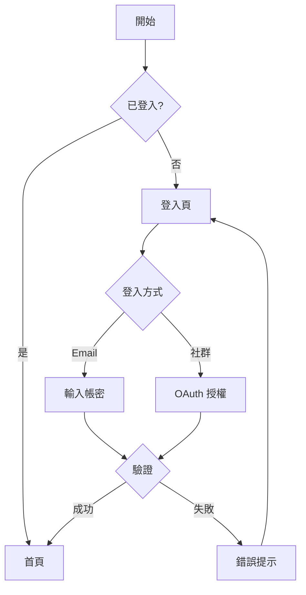

# App 流程預測與規格補齊指南

當規格文件不完整時，本指南提供智能預測 App 流程的方法論與模板。

## 目錄
1. [流程預測方法論](#流程預測方法論)
2. [規格缺口分析](#規格缺口分析)
3. [通用流程模式](#通用流程模式)
4. [產業別流程模板](#產業別流程模板)
5. [畫面預測邏輯](#畫面預測邏輯)
6. [流程輸出格式](#流程輸出格式)

---

## 流程預測方法論

### 預測流程步驟

```
1. 分析現有規格
   ↓
2. 識別缺口與不完整區域
   ↓
3. 判斷 App 類型與產業
   ↓
4. 套用對應流程模板
   ↓
5. 預測缺失畫面與互動
   ↓
6. 產出完整流程建議
   ↓
7. 標記「預測」vs「確認」內容
```

### 預測信心等級

```
🟢 高信心 (High Confidence)
   - 業界標準流程
   - 法規要求畫面
   - 平台規範元件
   範例: 登入流程、結帳流程、權限請求

🟡 中信心 (Medium Confidence)
   - 常見 UX 模式
   - 產業慣例
   - 競品分析推斷
   範例: 首次使用引導、個人化設定

🟠 低信心 (Low Confidence)
   - 業務邏輯相關
   - 特定功能細節
   - 需求方確認
   範例: 特殊審核流程、客製化功能
```

### 預測原則

```
1. 最小驚訝原則
   遵循使用者既有心智模型

2. 漸進式揭露
   複雜流程分步驟呈現

3. 容錯設計
   預設包含錯誤處理流程

4. 無障礙考量
   預設包含替代路徑

5. 平台一致性
   iOS/Android 各有其慣例
```

---

## 按鈕導航推斷 (Button Flow Inference)

當 SDD 規格未明確定義按鈕導航時，根據以下規則自動推斷目標畫面。

### 推斷規則總表

#### 高信心推斷 (🟢 自動套用)

| 按鈕文字 (中/英) | 動作類型 | 推斷目標 | 適用上下文 |
|------------------|----------|----------|------------|
| 返回、Back、← | back | `history.back()` | 任何畫面 |
| 取消、Cancel | back/dismiss | `history.back()` 或關閉 Modal | 表單/Modal |
| 關閉、Close、✕ | dismiss | 關閉 Modal/Overlay | Modal |
| 下一步、Next、繼續、Continue | navigate | 同模組下一序號畫面 | 多步驟流程 |
| 完成、Done、Finish | navigate | 流程結束頁或首頁 | 流程最後步驟 |
| 登入、Sign In、Login | navigate | `DASH-001` 或 `HOME-001` | 登入頁 |
| 註冊、Sign Up、Register | navigate | 註冊流程第一頁 | 登入頁 |
| 忘記密碼、Forgot Password | navigate | `AUTH-*-forgot-password` | 登入頁 |
| 首頁、Home | navigate | `DASH-001` 或 `HOME-001` | Tab Bar |
| 設定、Settings | navigate | `SETTING-001` | 任何畫面 |

#### 中信心推斷 (🟡 建議套用，可標記待確認)

| 按鈕文字 (中/英) | 動作類型 | 推斷目標 | 適用上下文 |
|------------------|----------|----------|------------|
| 建立、Create、新增、Add | navigate | 表單頁 → 成功頁/列表頁 | 表單提交後 |
| 儲存、Save | navigate | 返回上一頁或詳情頁 | 編輯表單 |
| 確認、Confirm、確定、OK | navigate | 下一步或關閉 | Modal/表單 |
| 提交、Submit | navigate | 成功頁 | 表單頁 |
| 編輯、Edit | navigate | 對應的編輯表單頁 | 詳情頁 |
| 刪除、Delete | modal | 確認對話框 → 列表頁 | 詳情頁 |
| 查看、View、詳情 | navigate | 詳情頁 | 列表項目 |
| 重試、Retry | action | 重新執行上一動作 | 錯誤頁 |

#### 上下文推斷規則

```
1. 模組內流程推斷
   AUTH-001 → AUTH-002 → AUTH-003 (同模組序號遞增)

2. Onboarding 流程推斷
   ONBOARD-001 → ONBOARD-002 → ... → DASH-001 (最後進入首頁)

3. 表單提交推斷
   表單頁 --成功--> 成功頁/詳情頁/列表頁
   表單頁 --失敗--> 顯示錯誤訊息 (留在原頁)

4. 詳情頁推斷
   列表頁 --點擊項目--> 詳情頁
   詳情頁 --編輯--> 編輯表單頁
   詳情頁 --返回--> 列表頁

5. Modal 推斷
   任何頁 --觸發 Modal--> Modal 開啟
   Modal --確認/取消--> Modal 關閉 (返回原頁)
```

### 畫面類型與按鈕預設

#### 認證模組 (AUTH)

```
AUTH-*-login:
├── btn_login → 成功: DASH-001, 失敗: 顯示錯誤
├── lnk_register → AUTH-*-register
├── lnk_forgot → AUTH-*-forgot-password
└── btn_social_* → OAuth 流程 → DASH-001

AUTH-*-register:
├── btn_register/submit → 成功: AUTH-*-verify 或 DASH-001
├── btn_back → AUTH-*-login
└── lnk_login → AUTH-*-login

AUTH-*-forgot-password:
├── btn_submit → AUTH-*-otp 或 成功提示
└── btn_back → AUTH-*-login

AUTH-*-profile-select:
├── card_profile_* → DASH-001 (選擇 Profile)
├── btn_add_profile → AUTH-*-create-profile
└── btn_edit → AUTH-*-edit-profile

AUTH-*-create-profile:
├── btn_create/submit → ONBOARD-001 (新用戶) 或 DASH-001
└── btn_back → AUTH-*-profile-select
```

#### Onboarding 模組 (ONBOARD)

```
ONBOARD-* (任何步驟):
├── btn_next → ONBOARD-{n+1} 或 DASH-001 (最後步驟)
├── btn_skip → DASH-001 (略過整個引導)
└── btn_back → ONBOARD-{n-1} 或 history.back()

ONBOARD-*-complete (完成頁):
└── btn_start/begin → DASH-001
```

#### Dashboard 模組 (DASH)

```
DASH-001-home:
├── tab_home → DASH-001 (當前)
├── tab_training → TRAIN-001
├── tab_reward → REWARD-001
├── tab_report → REPORT-001
├── tab_device → DEVICE-001
├── btn_settings → SETTING-001
└── card_* → 對應詳情頁

DASH-*-log:
├── btn_add → 新增紀錄表單
├── item_* → 紀錄詳情
└── btn_back → DASH-001
```

#### 設定模組 (SETTING)

```
SETTING-001-home:
├── item_notification → SETTING-*-notification
├── item_device → SETTING-*-device
├── item_language → SETTING-*-language
├── item_about → SETTING-*-about
├── btn_logout → AUTH-001 (確認後)
└── btn_back → DASH-001

SETTING-* (子頁):
├── toggle_* → 即時生效 (無導航)
├── btn_save → history.back() + Toast
└── btn_back → SETTING-001
```

### 推斷流程圖

```
                    ┌─────────────────────┐
                    │   解析畫面 ID        │
                    │ (模組、序號、類型)    │
                    └──────────┬──────────┘
                               │
                    ┌──────────▼──────────┐
                    │   掃描所有按鈕/連結   │
                    │ (button, a, onclick) │
                    └──────────┬──────────┘
                               │
         ┌─────────────────────┼─────────────────────┐
         ▼                     ▼                     ▼
┌─────────────────┐   ┌─────────────────┐   ┌─────────────────┐
│  按鈕文字匹配    │   │   上下文推斷     │   │   模組規則      │
│  (高信心規則)    │   │  (中信心規則)    │   │  (低信心)       │
└────────┬────────┘   └────────┬────────┘   └────────┬────────┘
         │                     │                     │
         └─────────────────────┼─────────────────────┘
                               ▼
                    ┌─────────────────────┐
                    │   產生導航目標       │
                    │ onclick/href        │
                    └──────────┬──────────┘
                               │
                    ┌──────────▼──────────┐
                    │   標記推斷來源       │
                    │ data-inferred="..." │
                    └─────────────────────┘
```

### 驗證與報告

生成 UI 後，自動產生按鈕導航報告：

```markdown
## 按鈕導航分析報告

### 統計
- 總按鈕數: 45
- 已定義導航: 12 (27%)
- 自動推斷: 28 (62%)
- 無法推斷: 5 (11%)

### 自動推斷清單

| 畫面 | 元素 | 按鈕文字 | 推斷目標 | 信心度 |
|------|------|----------|----------|--------|
| AUTH-007 | btn_back | 返回 | AUTH-006 | 🟢 |
| AUTH-007 | btn_create | 建立檔案 | ONBOARD-001 | 🟡 |

### 待確認清單

| 畫面 | 元素 | 按鈕文字 | 建議目標 | 需確認原因 |
|------|------|----------|----------|------------|
| DASH-002 | btn_export | 匯出 | ? | 無法推斷目標 |

### 無導航按鈕 (可能為 action-only)

| 畫面 | 元素 | 按鈕文字 | 說明 |
|------|------|----------|------|
| TRAIN-001 | btn_start | 開始 | 可能為啟動動作 |
```

---

## 規格缺口分析

### 缺口類型識別

```
┌─────────────────────────────────────────────────────────┐
│                    規格缺口類型                          │
├─────────────────────────────────────────────────────────┤
│                                                         │
│  📋 流程缺口              🖼️ 畫面缺口                   │
│  ├── 入口點不明           ├── 空狀態未定義              │
│  ├── 分支路徑缺失         ├── 錯誤狀態未設計            │
│  ├── 異常處理未說明       ├── 載入狀態未說明            │
│  └── 結束點不清楚         └── 過渡畫面缺失              │
│                                                         │
│  🔄 互動缺口              📱 平台缺口                   │
│  ├── 操作回饋未定義       ├── iOS 版本未設計            │
│  ├── 手勢支援不明         ├── Android 版本未設計        │
│  ├── 動畫規格缺失         ├── 平板適配未考慮            │
│  └── 鍵盤互動未說明       └── 橫向模式未規劃            │
│                                                         │
└─────────────────────────────────────────────────────────┘
```

### 缺口分析檢查清單

**流程完整性:**
```
□ 進入點 (Entry Points)
  - 如何進入此功能?
  - 有哪些入口?

□ 主要路徑 (Happy Path)
  - 正常流程步驟?
  - 每步驟的輸入/輸出?

□ 分支路徑 (Branch Paths)
  - 條件判斷點?
  - 不同使用者類型?

□ 異常路徑 (Exception Paths)
  - 錯誤情況處理?
  - 網路異常?
  - 權限被拒?

□ 結束點 (Exit Points)
  - 流程如何結束?
  - 返回何處?
```

**畫面完整性:**
```
□ 基本狀態
  - Default (預設)
  - Empty (空狀態)
  - Loading (載入中)
  - Error (錯誤)
  - Success (成功)

□ 互動狀態
  - Hover (懸停)
  - Pressed (按下)
  - Focused (聚焦)
  - Disabled (禁用)
  - Selected (選中)

□ 資料狀態
  - 首次使用
  - 有資料
  - 資料過多 (分頁/載入更多)
  - 搜尋無結果
```

### 缺口報告範本

```markdown
## 規格缺口分析報告

### 文件資訊
- 分析日期: YYYY-MM-DD
- 文件版本: X.X
- 分析範圍: [功能名稱]

### 缺口摘要
| 類型 | 缺口數 | 嚴重度 |
|------|--------|--------|
| 流程缺口 | X | 🔴 高 |
| 畫面缺口 | X | 🟡 中 |
| 互動缺口 | X | 🟢 低 |

### 詳細缺口清單

#### 🔴 高優先級
1. **[缺口名稱]**
   - 描述: ...
   - 影響: ...
   - 建議: ...

#### 🟡 中優先級
...

### 預測補齊建議
[列出可自動補齊的內容]
```

---

## 通用流程模式

### 認證流程 (Authentication)

```
┌─────────────────────────────────────────────────────────┐
│                     認證流程                            │
└─────────────────────────────────────────────────────────┘

Entry Points:
├── App 啟動 (未登入)
├── 登入按鈕
└── Session 過期

                    ┌──────────┐
                    │  啟動頁   │
                    └────┬─────┘
                         │
              ┌──────────┴──────────┐
              ▼                     ▼
        ┌──────────┐          ┌──────────┐
        │ 已登入    │          │ 未登入    │
        └────┬─────┘          └────┬─────┘
             │                      │
             ▼                      ▼
        ┌──────────┐          ┌──────────┐
        │   首頁    │          │  登入頁   │
        └──────────┘          └────┬─────┘
                                   │
                    ┌──────────────┼──────────────┐
                    ▼              ▼              ▼
              ┌──────────┐  ┌──────────┐  ┌──────────┐
              │ Email 登入│  │ 社群登入  │  │   註冊   │
              └────┬─────┘  └────┬─────┘  └────┬─────┘
                   │              │              │
                   ▼              ▼              ▼
              ┌──────────┐  ┌──────────┐  ┌──────────┐
              │ 忘記密碼  │  │ 授權畫面  │  │ 填寫資料  │
              │ (分支)    │  │ (外部)   │  │          │
              └──────────┘  └──────────┘  └────┬─────┘
                                               │
                                               ▼
                                         ┌──────────┐
                                         │ Email驗證│
                                         └────┬─────┘
                                               │
                                               ▼
                                         ┌──────────┐
                                         │   首頁    │
                                         └──────────┘

預測畫面清單:
├── 啟動頁 (Splash)
├── 登入頁 (Login)
│   ├── Default
│   ├── Error (密碼錯誤)
│   ├── Error (帳號不存在)
│   └── Loading
├── 註冊頁 (Register)
│   ├── Step 1: 帳號資訊
│   ├── Step 2: 個人資料
│   └── Step 3: 驗證
├── 忘記密碼 (Forgot Password)
│   ├── 輸入 Email
│   ├── 發送成功
│   └── 重設密碼
├── Email 驗證
│   ├── 等待驗證
│   ├── 驗證成功
│   └── 重新發送
└── 社群登入
    ├── 選擇平台
    └── 授權同意
```

### 首次使用引導 (Onboarding)

```
┌─────────────────────────────────────────────────────────┐
│                   Onboarding 流程                       │
└─────────────────────────────────────────────────────────┘

                    ┌──────────┐
                    │ 首次啟動  │
                    └────┬─────┘
                         │
                         ▼
                    ┌──────────┐
                    │ 歡迎頁 1  │ ←── 功能介紹
                    └────┬─────┘
                         │ (滑動/下一步)
                         ▼
                    ┌──────────┐
                    │ 歡迎頁 2  │ ←── 價值主張
                    └────┬─────┘
                         │
                         ▼
                    ┌──────────┐
                    │ 歡迎頁 3  │ ←── 行動呼籲
                    └────┬─────┘
                         │
              ┌──────────┴──────────┐
              ▼                     ▼
        ┌──────────┐          ┌──────────┐
        │  略過     │          │ 開始使用  │
        └────┬─────┘          └────┬─────┘
             │                      │
             │               ┌──────┴──────┐
             │               ▼             ▼
             │         ┌──────────┐  ┌──────────┐
             │         │ 權限請求  │  │ 個人化   │
             │         │ (通知)   │  │ 設定     │
             │         └────┬─────┘  └────┬─────┘
             │               │             │
             └───────────────┴──────┬──────┘
                                    ▼
                              ┌──────────┐
                              │   首頁    │
                              └──────────┘

預測頁數: 3-5 頁
預測元素:
├── 進度指示器 (Dots/Progress Bar)
├── 略過按鈕
├── 下一步/完成按鈕
└── 插圖/動畫區域
```

### CRUD 流程 (Create/Read/Update/Delete)

```
┌─────────────────────────────────────────────────────────┐
│                     CRUD 流程                           │
└─────────────────────────────────────────────────────────┘

                         ┌──────────┐
                         │  列表頁   │
                         └────┬─────┘
                              │
        ┌─────────────────────┼─────────────────────┐
        ▼                     ▼                     ▼
  ┌──────────┐          ┌──────────┐          ┌──────────┐
  │   新增    │          │   查看    │          │   搜尋    │
  │  (Create) │          │  (Read)   │          │ (Filter)  │
  └────┬─────┘          └────┬─────┘          └────┬─────┘
       │                      │                      │
       ▼                      ▼                      │
  ┌──────────┐          ┌──────────┐                │
  │  表單頁   │          │  詳細頁   │                │
  └────┬─────┘          └────┬─────┘                │
       │                      │                      │
       │               ┌──────┴──────┐               │
       │               ▼             ▼               │
       │         ┌──────────┐  ┌──────────┐         │
       │         │   編輯    │  │   刪除    │         │
       │         │ (Update)  │  │ (Delete)  │         │
       │         └────┬─────┘  └────┬─────┘         │
       │               │             │               │
       │               ▼             ▼               │
       │         ┌──────────┐  ┌──────────┐         │
       │         │  表單頁   │  │ 確認對話框 │         │
       │         └────┬─────┘  └────┬─────┘         │
       │               │             │               │
       └───────────────┴──────┬──────┴───────────────┘
                              ▼
                        ┌──────────┐
                        │ 更新列表  │
                        │ + Toast  │
                        └──────────┘

預測狀態:
├── 列表頁
│   ├── 有資料
│   ├── 空狀態 (首次/搜尋無結果)
│   ├── 載入中
│   ├── 載入更多
│   └── 錯誤
├── 詳細頁
│   ├── 載入中
│   ├── 成功
│   └── 錯誤 (資料不存在)
├── 表單頁
│   ├── 空白 (新增)
│   ├── 有資料 (編輯)
│   ├── 驗證錯誤
│   ├── 提交中
│   └── 提交失敗
└── 刪除
    ├── 確認對話框
    ├── 刪除中
    └── 刪除失敗
```

### 購買/結帳流程 (Checkout)

```
┌─────────────────────────────────────────────────────────┐
│                    結帳流程                             │
└─────────────────────────────────────────────────────────┘

        ┌──────────┐
        │  購物車   │
        └────┬─────┘
             │
             ▼
        ┌──────────┐     ┌──────────┐
        │ 確認商品  │ ←── │ 編輯數量  │
        └────┬─────┘     └──────────┘
             │
             ▼
        ┌──────────┐     ┌──────────┐
        │ 收件資訊  │ ←── │ 地址管理  │
        └────┬─────┘     └──────────┘
             │
             ▼
        ┌──────────┐     ┌──────────┐
        │ 配送方式  │ ←── │ 配送說明  │
        └────┬─────┘     └──────────┘
             │
             ▼
        ┌──────────┐     ┌──────────┐
        │ 付款方式  │ ←── │ 新增卡片  │
        └────┬─────┘     └──────────┘
             │
             ▼
        ┌──────────┐     ┌──────────┐
        │ 套用優惠  │ ←── │ 優惠碼輸入 │
        └────┬─────┘     └──────────┘
             │
             ▼
        ┌──────────┐
        │ 訂單確認  │
        └────┬─────┘
             │
             ▼
        ┌──────────┐     ┌──────────┐
        │  付款中   │ ──→ │ 3D 驗證   │
        └────┬─────┘     └──────────┘
             │
       ┌─────┴─────┐
       ▼           ▼
  ┌──────────┐ ┌──────────┐
  │ 付款成功  │ │ 付款失敗  │
  └────┬─────┘ └────┬─────┘
       │            │
       ▼            ▼
  ┌──────────┐ ┌──────────┐
  │ 訂單完成  │ │ 重新付款  │
  └──────────┘ └──────────┘

預測元素:
├── 步驟指示器 (Step Indicator)
├── 價格摘要 (固定底部)
├── 安全付款標示
└── 返回修改功能
```

### 設定流程 (Settings)

```
┌─────────────────────────────────────────────────────────┐
│                    設定流程                             │
└─────────────────────────────────────────────────────────┘

                    ┌──────────┐
                    │  設定首頁  │
                    └────┬─────┘
                         │
    ┌────────────────────┼────────────────────┐
    ▼                    ▼                    ▼
┌─────────┐        ┌─────────┐         ┌─────────┐
│ 帳號設定 │        │ App 設定 │         │ 其他    │
├─────────┤        ├─────────┤         ├─────────┤
│ 個人資料 │        │ 通知設定 │         │ 關於我們 │
│ 密碼變更 │        │ 外觀設定 │         │ 隱私政策 │
│ 綁定帳號 │        │ 語言設定 │         │ 服務條款 │
│ 隱私設定 │        │ 儲存空間 │         │ 意見回饋 │
│ 登出    │        │ 清除快取 │         │ 評價 App │
│ 刪除帳號 │        │          │         │ 版本資訊 │
└─────────┘        └─────────┘         └─────────┘

預測互動:
├── 列表項目 → 子頁面
├── 開關 (Toggle) → 即時生效
├── 選擇 → 底部選單/新頁面
└── 危險操作 → 確認對話框
```

---

## 產業別流程模板

### 電商 App (E-commerce)

```
核心流程:
├── 瀏覽商品
│   ├── 首頁 (推薦/促銷)
│   ├── 分類瀏覽
│   ├── 搜尋
│   └── 商品詳細
│
├── 購物車
│   ├── 加入購物車
│   ├── 購物車管理
│   └── 結帳流程
│
├── 訂單管理
│   ├── 訂單列表
│   ├── 訂單詳情
│   ├── 物流追蹤
│   └── 退貨退款
│
├── 會員中心
│   ├── 個人資料
│   ├── 地址管理
│   ├── 付款方式
│   ├── 優惠券
│   └── 收藏清單
│
└── 客服
    ├── 常見問題
    ├── 線上客服
    └── 問題回報

預測畫面數: 25-35 頁
```

### 社群 App (Social)

```
核心流程:
├── 動態牆
│   ├── 首頁動態
│   ├── 貼文詳細
│   ├── 按讚/留言
│   └── 分享
│
├── 發布內容
│   ├── 文字貼文
│   ├── 圖片/影片
│   ├── 限時動態
│   └── 直播
│
├── 社交互動
│   ├── 追蹤/好友
│   ├── 訊息/聊天
│   ├── 通知
│   └── @提及
│
├── 個人檔案
│   ├── 我的頁面
│   ├── 他人頁面
│   ├── 編輯資料
│   └── 隱私設定
│
└── 探索
    ├── 推薦內容
    ├── 熱門話題
    └── 搜尋

預測畫面數: 30-45 頁
```

### 工具/生產力 App (Productivity)

```
核心流程:
├── 工作區
│   ├── 專案列表
│   ├── 專案詳細
│   └── 成員管理
│
├── 任務管理
│   ├── 任務列表 (多檢視)
│   ├── 任務詳細
│   ├── 新增/編輯任務
│   └── 子任務
│
├── 日曆/排程
│   ├── 日曆檢視
│   ├── 事件詳細
│   └── 新增事件
│
├── 協作
│   ├── 評論/討論
│   ├── 檔案附件
│   ├── 活動紀錄
│   └── 通知
│
└── 報表
    ├── 進度總覽
    ├── 統計圖表
    └── 匯出

預測畫面數: 20-30 頁
```

### 金融 App (Finance)

```
核心流程:
├── 帳戶總覽
│   ├── 資產總覽
│   ├── 帳戶列表
│   └── 帳戶詳細
│
├── 交易
│   ├── 轉帳
│   ├── 付款
│   ├── 收款
│   └── 交易確認
│
├── 交易紀錄
│   ├── 交易列表
│   ├── 交易詳細
│   ├── 篩選/搜尋
│   └── 匯出
│
├── 安全驗證
│   ├── 生物辨識
│   ├── OTP 驗證
│   └── 密碼驗證
│
└── 理財
    ├── 記帳
    ├── 預算
    ├── 報表分析
    └── 理財目標

預測畫面數: 25-40 頁

⚠️ 特殊考量:
├── 安全性驗證流程
├── 法規遵循畫面
├── 交易限額提示
└── 錯誤處理必須完整
```

### 健康/運動 App (Health & Fitness)

```
核心流程:
├── 儀表板
│   ├── 今日摘要
│   ├── 目標進度
│   └── 快速記錄
│
├── 活動記錄
│   ├── 運動記錄
│   ├── 飲食記錄
│   ├── 睡眠記錄
│   └── 身體數據
│
├── 訓練
│   ├── 訓練計畫
│   ├── 運動進行中
│   ├── 運動完成
│   └── 歷史紀錄
│
├── 數據分析
│   ├── 趨勢圖表
│   ├── 週/月報表
│   └── 成就徽章
│
└── 社群
    ├── 排行榜
    ├── 挑戰
    └── 分享成果

預測畫面數: 20-30 頁
```

---

## 畫面預測邏輯

### 畫面類型預測規則

```python
def predict_screens(feature_name, feature_type):
    """
    根據功能類型預測所需畫面
    """
    base_screens = []

    # 列表型功能
    if feature_type == "list":
        base_screens = [
            f"{feature_name}_list",           # 列表頁
            f"{feature_name}_list_empty",     # 空狀態
            f"{feature_name}_list_loading",   # 載入中
            f"{feature_name}_detail",         # 詳細頁
            f"{feature_name}_create",         # 新增
            f"{feature_name}_edit",           # 編輯
        ]

    # 表單型功能
    elif feature_type == "form":
        base_screens = [
            f"{feature_name}_form",           # 表單頁
            f"{feature_name}_form_error",     # 驗證錯誤
            f"{feature_name}_form_loading",   # 提交中
            f"{feature_name}_success",        # 成功
            f"{feature_name}_error",          # 失敗
        ]

    # 設定型功能
    elif feature_type == "settings":
        base_screens = [
            f"{feature_name}_index",          # 設定首頁
            f"{feature_name}_detail",         # 設定項目
            f"{feature_name}_confirm",        # 確認變更
        ]

    return base_screens
```

### 狀態預測矩陣

```
功能類型 × 狀態類型 = 預測畫面

┌─────────────┬─────────┬─────────┬─────────┬─────────┐
│             │ Default │ Loading │  Empty  │  Error  │
├─────────────┼─────────┼─────────┼─────────┼─────────┤
│ 列表        │   ✅    │   ✅    │   ✅    │   ✅    │
│ 詳細        │   ✅    │   ✅    │   ⚠️    │   ✅    │
│ 表單        │   ✅    │   ✅    │   -     │   ✅    │
│ 設定        │   ✅    │   ⚠️    │   -     │   ⚠️    │
│ 儀表板      │   ✅    │   ✅    │   ✅    │   ✅    │
└─────────────┴─────────┴─────────┴─────────┴─────────┘

✅ 必要  ⚠️ 建議  - 不適用
```

### 互動預測

```
輸入元素:
├── 文字輸入 → 鍵盤類型預測
│   ├── Email → email keyboard
│   ├── 電話 → phone keyboard
│   ├── 密碼 → secure + show/hide
│   └── 數字 → number keyboard
│
├── 選擇輸入 → 互動類型預測
│   ├── 2-5 選項 → Segmented / Radio
│   ├── 6+ 選項 → Dropdown / Bottom Sheet
│   └── 多選 → Checkbox / Chips
│
└── 操作按鈕 → 回饋類型預測
    ├── 主要操作 → Loading + Success/Error
    ├── 次要操作 → 確認對話框 (可選)
    └── 破壞操作 → 確認對話框 (必要)
```

---

## 流程輸出格式

### User Flow 文字格式

```markdown
## [功能名稱] User Flow

### 概述
- 目的: [使用者要完成什麼]
- 入口: [從哪裡進入]
- 前置條件: [需要什麼狀態]

### 流程步驟

#### Step 1: [步驟名稱]
- 畫面: [畫面名稱]
- 使用者操作: [做什麼]
- 系統回應: [發生什麼]
- 下一步: [去哪裡]

#### Step 2: [步驟名稱]
...

### 分支路徑

#### 分支 A: [條件]
- 觸發條件: [什麼情況]
- 流程: Step X → Step Y
- 結果: [結束在哪]

### 異常處理

#### 錯誤 1: [錯誤類型]
- 觸發: [什麼情況]
- 處理: [如何處理]
- 恢復: [如何繼續]
```

### Mermaid 流程圖格式



### Figma 流程圖格式

```
Frame 結構:
├── Flow_[功能名稱]
│   ├── Start (綠色圓形)
│   ├── Screen_01 (預覽縮圖)
│   ├── Decision_01 (菱形)
│   ├── Screen_02
│   ├── Screen_03
│   ├── End (紅色圓形)
│   └── Connectors (箭頭)

連接線顏色:
├── 主要路徑: Primary Color
├── 分支路徑: Gray
├── 錯誤路徑: Red
└── 選擇性路徑: Dashed
```

### JSON 流程定義格式

```json
{
  "flow": {
    "name": "User Registration",
    "version": "1.0",
    "screens": [
      {
        "id": "screen_01",
        "name": "Welcome",
        "type": "onboarding",
        "next": ["screen_02"],
        "components": ["illustration", "title", "subtitle", "button_primary"]
      },
      {
        "id": "screen_02",
        "name": "Register Form",
        "type": "form",
        "next": ["screen_03", "screen_error"],
        "components": ["input_email", "input_password", "button_submit"],
        "validations": ["email_format", "password_strength"]
      }
    ],
    "transitions": [
      {
        "from": "screen_01",
        "to": "screen_02",
        "trigger": "button_tap",
        "animation": "push"
      }
    ],
    "error_states": [
      {
        "id": "screen_error",
        "type": "error",
        "recovery": "screen_02"
      }
    ]
  }
}
```

---

## 預測輸出範本

### 完整預測報告

```markdown
# [App 名稱] 流程預測報告

## 📋 規格分析

### 已提供規格
- ✅ [已確認功能 1]
- ✅ [已確認功能 2]

### 規格缺口
- ⚠️ [缺失功能 1] - 已預測補齊
- ⚠️ [缺失功能 2] - 需確認

## 🔮 預測內容

### 預測流程 (信心等級: 🟢高/🟡中/🟠低)

#### 1. [流程名稱] 🟢
[流程描述與圖示]

#### 2. [流程名稱] 🟡
[流程描述與圖示]

### 預測畫面清單

| 畫面 | 類型 | 狀態 | 信心 | 備註 |
|------|------|------|------|------|
| Login | 認證 | 預測 | 🟢 | 標準流程 |
| Home | 首頁 | 確認 | - | 已提供 |
| Profile | 個人 | 預測 | 🟡 | 需確認欄位 |

## ✅ 待確認事項

1. [ ] [需要確認的問題 1]
2. [ ] [需要確認的問題 2]

## 📎 附件

- Figma 流程圖連結
- 畫面清單 Excel
```
