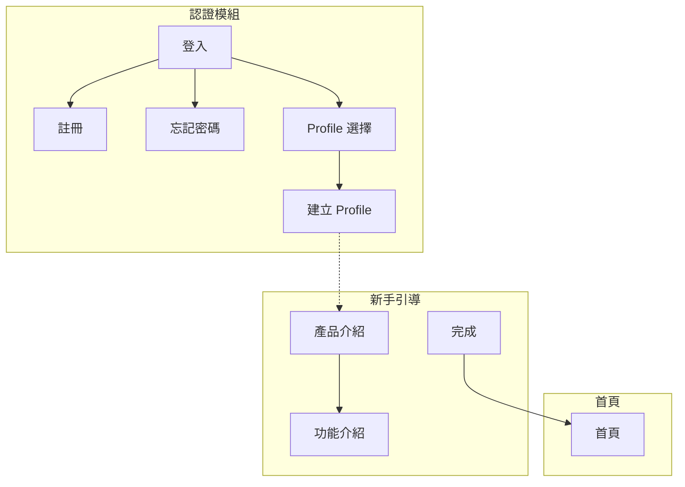
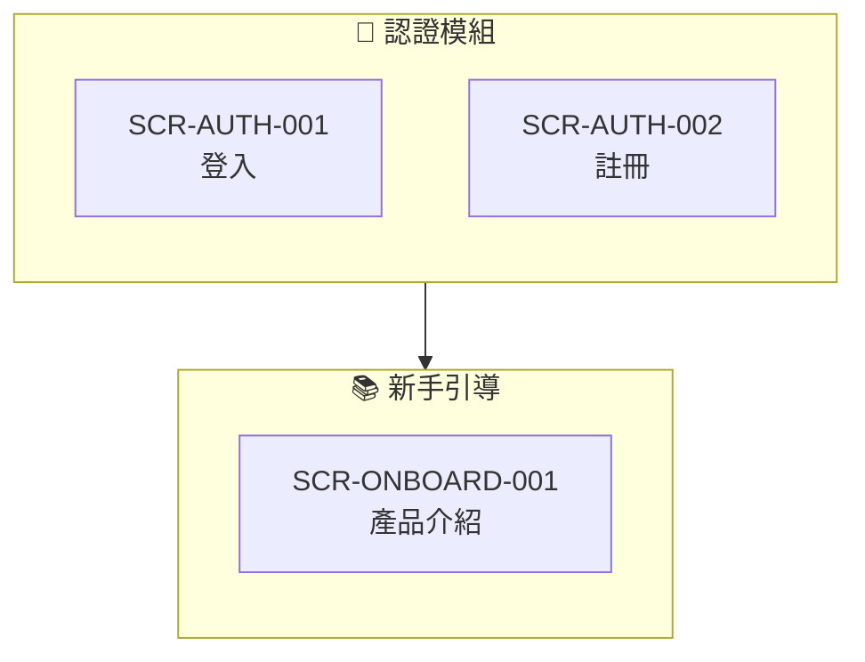

# SRS/SDD 回補功能指南

將 UI 生成結果自動回補至 SRS 與 SDD 文件，確保 IEC 62304 追溯完整性。

## 目錄
1. [概述](#概述)
2. [回補項目](#回補項目)
3. [SRS 回補流程](#srs-回補流程)
4. [SDD 回補流程](#sdd-回補流程)
5. [Mermaid 流程圖產生](#mermaid-流程圖產生)
6. [截圖嵌入規範](#截圖嵌入規範)
7. [RTM 追溯更新](#rtm-追溯更新)
8. [回補報告格式](#回補報告格式)

---

## 概述

### 目的
解決 `app-uiux-designer.skill` 與 `medical-software-requirements-skill` 之間的單向資料流問題，實現雙向同步：

```
┌─────────────────────────────────────────────────────────────┐
│                    SRS/SDD 雙向同步流程                      │
├─────────────────────────────────────────────────────────────┤
│                                                             │
│   SRS.md (功能需求)          SDD.md (Button Navigation)     │
│        │                          │                         │
│        │ ① 讀取需求               │ ② 讀取規格              │
│        ▼                          ▼                         │
│   ┌─────────────────────────────────────────────┐           │
│   │         app-uiux-designer.skill             │           │
│   │  ③ 生成 UI + 推斷缺失流程 + 推斷新需求       │           │
│   └─────────────────────────────────────────────┘           │
│                          │                                  │
│                          ▼                                  │
│   generated-ui/                                             │
│   ├── HTML UI 檔案                                          │
│   ├── screenshots/                                          │
│   ├── ui-flow-diagram.html                                  │
│   └── flow-diagram.md (Mermaid)                             │
│                          │                                  │
│           ┌──────────────┴──────────────┐                   │
│           │ ④ 回補 (本功能)              │                   │
│           ▼                              ▼                   │
│   SRS.md (更新版)               SDD.md (更新版)              │
│   ├── 新增功能需求 (推斷)       ├── Button Navigation       │
│   ├── 驗收標準 (AC)            ├── 嵌入 UI 截圖             │
│   └── RTM 對應                 ├── Mermaid 流程圖           │
│           │                    └── 畫面狀態清單              │
│           │                              │                   │
│           └──────────────┬───────────────┘                   │
│                          ▼                                  │
│   ⑤ 重新產生文件                                            │
│   ├── SRS.docx (含新需求)                                   │
│   ├── SDD.docx (含截圖)                                     │
│   └── RTM.md (100% 追溯)                                    │
│                                                             │
└─────────────────────────────────────────────────────────────┘
```

### 觸發時機
- UI 生成完成後自動觸發
- 手動執行回補命令
- SDD 審查前的同步檢查

---

## 回補項目

### 1. Button Navigation 表格

**來源：** `generated-ui/**/*.html` 中的 `onclick` 和 `href` 屬性
**目標：** SDD 各畫面規格的「按鈕導航」區塊

#### 解析規則

```javascript
// 從 HTML 解析 Button Navigation
const buttons = document.querySelectorAll('button[onclick], a[href]');
buttons.forEach(btn => {
  const navigation = {
    elementId: btn.id || btn.className,
    text: btn.innerText.trim(),
    actionType: btn.hasAttribute('onclick') ? 'navigate' : 'link',
    target: extractTarget(btn),
    inferred: btn.hasAttribute('data-inferred')
  };
});
```

#### 輸出格式 (Markdown 表格)

```markdown
### 按鈕導航 (Button Navigation)

| 元素 ID | 元素文字 | 動作類型 | 目標畫面 | 條件/備註 |
|---------|----------|----------|----------|-----------|
| btn_login | 登入 | navigate | SCR-DASH-001 | 驗證成功時 |
| btn_back | 返回 | back | history.back() | - |
| btn_create | 建立檔案 | navigate | SCR-ONBOARD-001 | ⚠️ 推斷 |
```

### 2. UI 截圖嵌入

**來源：** `generated-ui/screenshots/{module}/SCR-*.png`
**目標：** SDD 畫面設計章節

#### 嵌入格式

```markdown
#### SCR-AUTH-001 登入畫面


**畫面說明：**
- 支援帳號密碼登入
- 支援社群登入 (Google/Apple)
- 提供忘記密碼連結
```

#### 檔案複製規則

```bash
# 從 generated-ui 複製到 SDD images 目錄
cp generated-ui/screenshots/**/*.png docs/SDD/images/
cp generated-ui/screenshots/**/*.svg docs/SDD/images/

# SVG 優先 (IEC 62304 建議)
for f in docs/SDD/images/*.png; do
  svg="${f%.png}.svg"
  [ -f "$svg" ] && rm "$f"  # 有 SVG 就刪除 PNG
done
```

### 3. Mermaid 流程圖

**來源：** `generated-ui/` 目錄結構 + Button Navigation
**目標：** SDD 畫面流程章節

#### 產生邏輯

```python
def generate_mermaid_flow(screens, navigations):
    """
    從畫面清單和導航資訊產生 Mermaid flowchart
    """
    mermaid = ["flowchart TB"]

    # 分組 (subgraph)
    modules = group_by_module(screens)
    for module, module_screens in modules.items():
        mermaid.append(f'    subgraph {module}["{module} 模組"]')
        for scr in module_screens:
            mermaid.append(f'        {scr.id}["{scr.name}"]')
        mermaid.append('    end')

    # 連線 (從 Button Navigation)
    for nav in navigations:
        if nav.target and nav.target != 'history.back()':
            style = '-->' if not nav.inferred else '-.->'
            mermaid.append(f'    {nav.source} {style} {nav.target}')

    return '\n'.join(mermaid)
```

#### 輸出範例



### 4. 畫面狀態清單

**來源：** 掃描 `generated-ui/**/*.html` 檔名
**目標：** SDD 畫面狀態表

#### 狀態識別規則

| 檔名模式 | 識別為狀態 |
|----------|------------|
| `*-empty.html` | Empty 空狀態 |
| `*-loading.html` | Loading 載入中 |
| `*-error.html` | Error 錯誤 |
| `*-success.html` | Success 成功 |

#### 輸出格式

```markdown
### 畫面狀態清單

| 畫面 ID | Default | Empty | Loading | Error | Success |
|---------|:-------:|:-----:|:-------:|:-----:|:-------:|
| SCR-AUTH-001 | ✅ | - | ✅ | ✅ | - |
| SCR-DASH-001 | ✅ | ✅ | ✅ | ✅ | - |
```

---

## SRS 回補流程

從 UI 流程推斷出缺失的 SRS 需求，確保 IEC 62304 需求追溯完整性。

### SRS 回補項目

| 項目 | 來源 | 說明 |
|------|------|------|
| **功能需求** | Button Navigation | 按鈕操作隱含的功能 |
| **驗收標準 (AC)** | UI 狀態變化 | 畫面切換的預期行為 |
| **畫面對應** | SCR ID | SRS 對應的畫面編號 |
| **使用者操作** | UI 元素 | 使用者可執行的動作 |

### 需求推斷規則

#### 1. 從按鈕推斷功能需求

```python
def infer_requirements_from_buttons(navigations):
    """從 Button Navigation 推斷 SRS 功能需求"""
    inferred_srs = []

    for nav in navigations:
        # 規則 1: 表單提交 → 資料處理需求
        if nav['text'] in ['儲存', '提交', '確認', '建立', '更新', '刪除']:
            srs = {
                'type': 'FUNC',
                'description': f'系統應提供{nav["text"]}功能',
                'source_screen': nav['source'],
                'target_screen': nav['target'],
                'priority': 'MUST',
                'inferred': True
            }
            inferred_srs.append(srs)

        # 規則 2: 導航按鈕 → 畫面存取需求
        if nav['action_type'] == 'navigate':
            srs = {
                'type': 'FUNC',
                'description': f'使用者應能從 {nav["source"]} 導航至 {nav["target"]}',
                'source_screen': nav['source'],
                'target_screen': nav['target'],
                'priority': 'SHOULD',
                'inferred': True
            }
            inferred_srs.append(srs)

        # 規則 3: 返回按鈕 → 返回機制需求
        if nav['text'] in ['返回', '取消', '上一步']:
            srs = {
                'type': 'FUNC',
                'description': f'系統應提供返回上一畫面功能',
                'source_screen': nav['source'],
                'priority': 'MUST',
                'inferred': True
            }
            inferred_srs.append(srs)

    return deduplicate(inferred_srs)
```

#### 2. 從畫面狀態推斷需求

```python
def infer_requirements_from_states(screen_states):
    """從畫面狀態推斷 SRS 需求"""
    inferred_srs = []

    for screen in screen_states:
        # Loading 狀態 → 載入指示需求
        if 'loading' in screen['states']:
            inferred_srs.append({
                'type': 'UI',
                'description': f'{screen["id"]} 應顯示載入進度指示',
                'screen': screen['id'],
                'priority': 'SHOULD'
            })

        # Empty 狀態 → 空狀態處理需求
        if 'empty' in screen['states']:
            inferred_srs.append({
                'type': 'UI',
                'description': f'{screen["id"]} 應提供空狀態提示與指引',
                'screen': screen['id'],
                'priority': 'SHOULD'
            })

        # Error 狀態 → 錯誤處理需求
        if 'error' in screen['states']:
            inferred_srs.append({
                'type': 'ERR',
                'description': f'{screen["id"]} 應顯示錯誤訊息並提供恢復操作',
                'screen': screen['id'],
                'priority': 'MUST'
            })

    return inferred_srs
```

### 驗收標準 (AC) 產生

從 Button Navigation 自動產生驗收標準：

```python
def generate_acceptance_criteria(nav):
    """從導航資訊產生驗收標準"""
    ac_list = []

    # AC1: 按鈕可見性
    ac_list.append(f'Given 使用者在 {nav["source"]} 畫面')
    ac_list.append(f'Then 應能看到「{nav["text"]}」按鈕')

    # AC2: 按鈕功能
    ac_list.append(f'When 點擊「{nav["text"]}」按鈕')
    if nav['action_type'] == 'navigate':
        ac_list.append(f'Then 應導航至 {nav["target"]} 畫面')
    elif nav['action_type'] == 'back':
        ac_list.append(f'Then 應返回上一畫面')
    elif nav['action_type'] == 'action':
        ac_list.append(f'Then 應執行對應操作並顯示回饋')

    return ac_list
```

### SRS 輸出格式

```markdown
## 功能需求 (新增 - UI 推斷)

### SRS-UI-001 Profile 建立流程

**來源：** UI 流程推斷 (SCR-AUTH-007)
**信心度：** 🟡 中 (需人工確認)

**需求描述：**
使用者完成 Profile 建立後，系統應導航至新手引導流程。

**驗收標準：**
1. Given 使用者在 Profile 建立畫面 (SCR-AUTH-007)
2. And 已填寫必要資訊
3. When 點擊「建立檔案」按鈕
4. Then 應導航至產品介紹畫面 (SCR-ONBOARD-001)
5. And Profile 資料應被儲存

**對應畫面：** SCR-AUTH-007, SCR-ONBOARD-001
**對應 SDD：** SDD-AUTH-007
**追溯 ID：** RTM-UI-001

---

### SRS-UI-002 返回功能

**來源：** UI 流程推斷 (SCR-AUTH-007)
**信心度：** 🟢 高

**需求描述：**
系統應提供返回上一畫面功能。

**驗收標準：**
1. Given 使用者在 Profile 建立畫面 (SCR-AUTH-007)
2. When 點擊「返回」按鈕
3. Then 應返回 Profile 選擇畫面 (SCR-AUTH-006)
4. And 已填寫的資料應被保留/清除 (依需求)

**對應畫面：** SCR-AUTH-007, SCR-AUTH-006
```

### SRS 回補執行步驟

#### 步驟 1: 收集 UI 流程資訊

```bash
# 掃描 generated-ui 收集所有導航資訊
node scripts/scan-navigations.js ./generated-ui/ > navigations.json

# 輸出格式
{
  "navigations": [
    {
      "source": "SCR-AUTH-007",
      "target": "SCR-ONBOARD-001",
      "text": "建立檔案",
      "inferred": true,
      "confidence": "medium"
    }
  ],
  "screens": [...],
  "states": [...]
}
```

#### 步驟 2: 比對現有 SRS

```python
def compare_with_existing_srs(inferred_srs, existing_srs):
    """比對推斷需求與現有 SRS"""

    new_requirements = []
    updates = []

    for inferred in inferred_srs:
        match = find_matching_srs(inferred, existing_srs)

        if match:
            # 檢查是否需要更新
            if needs_update(match, inferred):
                updates.append({
                    'existing': match,
                    'update': inferred,
                    'fields': ['screen_mapping', 'acceptance_criteria']
                })
        else:
            # 新需求
            new_requirements.append(inferred)

    return new_requirements, updates
```

#### 步驟 3: 更新 SRS.md

```python
def update_srs(srs_path, new_requirements, updates):
    """更新 SRS 文件"""

    with open(srs_path) as f:
        content = f.read()

    # 在「功能需求」章節末尾添加新需求
    if new_requirements:
        new_section = generate_srs_section(new_requirements)
        content = insert_after_section(
            content,
            '## 功能需求',
            new_section,
            marker='### UI 推斷需求 (需審查)'
        )

    # 更新現有需求的 SCR 對應
    for update in updates:
        content = update_srs_field(
            content,
            update['existing']['id'],
            'screen_mapping',
            update['update']['screens']
        )

    with open(srs_path, 'w') as f:
        f.write(content)
```

#### 步驟 4: 更新 RTM

```python
def update_rtm_with_srs(rtm_path, new_srs_items):
    """更新 RTM 加入新的 SRS 項目"""

    with open(rtm_path) as f:
        content = f.read()

    for srs in new_srs_items:
        new_row = f"| {srs['id']} | - | {srs['screen']} | - | ⚠️ 待補 |"
        content = append_to_table(content, 'RTM', new_row)

    with open(rtm_path, 'w') as f:
        f.write(content)
```

### SRS 回補報告

```markdown
# SRS 回補報告

## 執行摘要

| 項目 | 值 |
|------|-----|
| 執行時間 | 2024-XX-XX HH:MM:SS |
| 來源目錄 | ./generated-ui/ |
| 目標 SRS | ./docs/SRS.md |
| 執行結果 | ✅ 成功 |

## 回補統計

| 項目 | 數量 | 狀態 |
|------|------|------|
| 新增功能需求 | 5 筆 | ⚠️ 需審查 |
| 更新畫面對應 | 12 筆 | ✅ |
| 新增驗收標準 | 8 筆 | ⚠️ 需審查 |
| RTM 更新 | 5 筆 | ✅ |

## 新增需求清單 (需人工審查)

| 推斷 ID | 需求描述 | 來源畫面 | 信心度 | 審查 |
|---------|----------|----------|--------|------|
| SRS-UI-001 | Profile 建立流程導航 | SCR-AUTH-007 | 🟡 中 | [ ] |
| SRS-UI-002 | 返回上一畫面功能 | SCR-AUTH-007 | 🟢 高 | [ ] |
| SRS-UI-003 | 新手引導完成後導航 | SCR-ONBOARD-010 | 🟡 中 | [ ] |

## 審查建議

1. **SRS-UI-001**: 確認「建立檔案」後是否應先驗證資料再導航
2. **SRS-UI-002**: 確認返回時資料是否需要保留
3. **SRS-UI-003**: 確認新手引導完成後應跳至首頁或其他畫面

## 後續動作

- [ ] 審查新增的 5 筆功能需求
- [ ] 確認驗收標準是否完整
- [ ] 補充 SDD 對應章節
- [ ] 重新產生 SRS.docx
```

---

## SDD 回補流程

### 步驟 1: 掃描產出物

```python
def scan_generated_ui(base_path):
    """掃描 generated-ui 目錄"""
    result = {
        'html_files': glob(f'{base_path}/**/*.html'),
        'screenshots': glob(f'{base_path}/screenshots/**/*.png'),
        'svg_files': glob(f'{base_path}/screenshots/**/*.svg'),
    }
    return result
```

### 步驟 2: 解析 Button Navigation

```python
def parse_navigation(html_files):
    """從 HTML 解析所有導航資訊"""
    navigations = []
    for html_file in html_files:
        soup = BeautifulSoup(open(html_file), 'html.parser')

        # 解析 onclick
        for btn in soup.find_all(['button', 'a']):
            onclick = btn.get('onclick', '')
            href = btn.get('href', '')

            if 'location.href' in onclick or href:
                nav = {
                    'source': extract_screen_id(html_file),
                    'element_text': btn.get_text(strip=True),
                    'target': extract_target(onclick or href),
                    'inferred': btn.has_attr('data-inferred')
                }
                navigations.append(nav)

    return navigations
```

### 步驟 3: 讀取 SDD 並定位目標

```python
def locate_sdd_sections(sdd_path):
    """定位 SDD 中需要更新的章節"""
    with open(sdd_path) as f:
        content = f.read()

    sections = {
        'ui_design': find_section(content, r'## UI/UX 設計'),
        'screen_flow': find_section(content, r'### 畫面流程'),
        'screen_specs': find_section(content, r'### 畫面規格'),
    }
    return sections
```

### 步驟 4: 更新 SDD 內容

```python
def update_sdd(sdd_path, updates):
    """更新 SDD 文件"""
    with open(sdd_path) as f:
        content = f.read()

    # 更新 Mermaid 流程圖
    content = replace_mermaid_block(content, updates['mermaid'])

    # 更新 Button Navigation 表格
    for screen_id, nav_table in updates['navigations'].items():
        content = insert_navigation_table(content, screen_id, nav_table)

    # 更新截圖連結
    for screen_id, img_path in updates['screenshots'].items():
        content = update_screenshot_link(content, screen_id, img_path)

    with open(sdd_path, 'w') as f:
        f.write(content)
```

### 步驟 5: 重新產生 DOCX

```bash
# 使用 medical-software-requirements-skill 的轉換腳本
node ~/.claude/skills/medical-software-requirements-skill/md-to-docx.js \
    docs/SDD.md \
    docs/SDD.docx
```

### 步驟 6: 更新 RTM

```python
def update_rtm(rtm_path, screen_mappings):
    """更新追溯矩陣"""
    with open(rtm_path) as f:
        content = f.read()

    for srs_id, screen_id in screen_mappings.items():
        # 更新 SCR 欄位
        content = update_rtm_cell(content, srs_id, 'SCR', screen_id)

    with open(rtm_path, 'w') as f:
        f.write(content)
```

---

## Mermaid 流程圖產生

### 自適應分行原則

依照 `medical-software-requirements-skill` 的 Mermaid 規範：

```
1. 垂直優先 (flowchart TB)
2. 單行最多 3-4 個節點
3. 使用 subgraph 分組
4. 推斷連線使用虛線 (-.->)
5. 確認連線使用實線 (-->)
```

### 模組分組規則



---

## 截圖嵌入規範

### 格式優先順序

1. **SVG** (強制優先) - 向量格式，無限縮放
2. **PNG @2x** - 點陣備用

### 嵌入語法

```markdown
<!-- SDD 畫面設計章節 -->

#### SCR-AUTH-001 登入畫面


| 項目 | 說明 |
|------|------|
| 畫面 ID | SCR-AUTH-001 |
| 對應需求 | SRS-AUTH-001, SRS-AUTH-002 |
| 狀態 | Default, Loading, Error |
```

### 自動轉換腳本

```bash
#!/bin/bash
# convert-screenshots-to-svg.sh
# 將 PNG 截圖轉換為 SVG (使用 potrace 或保持 PNG)

for png in screenshots/**/*.png; do
    # 檢查是否已有 SVG
    svg="${png%.png}.svg"
    if [ ! -f "$svg" ]; then
        # 使用 ImageMagick 嵌入 PNG 到 SVG
        convert "$png" "$svg"
    fi
done
```

---

## RTM 追溯更新

### 追溯矩陣格式

```markdown
## 追溯矩陣 (RTM)

| SRS ID | SDD ID | SCR ID | STC ID | 狀態 |
|--------|--------|--------|--------|------|
| SRS-AUTH-001 | SDD-AUTH-001 | SCR-AUTH-001 | STC-AUTH-001 | ✅ |
| SRS-AUTH-002 | SDD-AUTH-001 | SCR-AUTH-001 | STC-AUTH-002 | ✅ |
| SRS-TRAIN-001 | SDD-TRAIN-001 | SCR-TRAIN-001 | STC-TRAIN-001 | ✅ |
```

### 自動對應規則

```python
def auto_map_scr_to_srs(screens, srs_items):
    """自動對應 SCR 到 SRS"""
    mappings = {}

    for screen in screens:
        # 規則 1: 模組名稱匹配
        module = screen.id.split('-')[1]  # AUTH, TRAIN, etc.
        matching_srs = [s for s in srs_items if module in s.id]

        # 規則 2: 功能關鍵字匹配
        for srs in matching_srs:
            if keyword_match(screen.name, srs.description):
                mappings[srs.id] = screen.id

    return mappings
```

---

## 回補報告格式

### 完整報告範本

```markdown
# SDD 回補報告

## 執行摘要

| 項目 | 值 |
|------|-----|
| 執行時間 | 2024-XX-XX HH:MM:SS |
| 來源目錄 | ./generated-ui/ |
| 目標 SDD | ./docs/SDD.md |
| 執行結果 | ✅ 成功 |

## 回補統計

| 回補項目 | 數量 | 狀態 |
|----------|------|------|
| Button Navigation | 45 筆 | ✅ |
| UI 截圖 | 51 張 | ✅ |
| Mermaid 流程圖 | 8 模組 | ✅ |
| 畫面狀態 | 51 畫面 | ✅ |
| RTM 對應 | 51 筆 | ✅ |

## 推斷項目 (需人工確認)

以下按鈕導航為自動推斷，建議人工確認：

| 畫面 | 按鈕文字 | 推斷目標 | 信心度 | 確認 |
|------|----------|----------|--------|------|
| SCR-AUTH-007 | 建立檔案 | SCR-ONBOARD-001 | 🟡 中 | [ ] |
| SCR-TRAIN-010 | 完成 | SCR-DASH-001 | 🟡 中 | [ ] |

## 變更清單

### SDD.md 變更

```diff
## UI/UX 設計

### 畫面流程

+ ```mermaid
+ flowchart TB
+     subgraph AUTH["認證模組"]
+         SCR-AUTH-001["登入"]
+         ...
+     end
+ ```

### SCR-AUTH-007 建立 Profile

+ ### 按鈕導航
+ | 元素 | 目標 | 備註 |
+ |------|------|------|
+ | 返回 | SCR-AUTH-006 | - |
+ | 建立檔案 | SCR-ONBOARD-001 | ⚠️ 推斷 |
```

## 後續動作

- [ ] 確認推斷的 Button Navigation (2 筆)
- [ ] 重新產生 SDD.docx
- [ ] 執行 RTM 100% 追溯驗證
- [ ] 提交變更至版本控制
```

---

## 與 medical-software-requirements-skill 整合

### 觸發條件

當 `medical-software-requirements-skill` 偵測到以下情況時，建議執行回補：

1. SDD UI/UX 章節缺少截圖
2. Button Navigation 表格不完整
3. RTM 的 SCR 欄位有空值
4. 流程圖與實際畫面不一致

### 整合命令

```bash
# 在 medical-software-requirements-skill 中呼叫
執行 UI Review 並回補 SDD ./docs/SDD.md

# 等同於
1. app-uiux-designer.skill 生成 UI
2. 執行回補 SDD
3. 重新產生 DOCX
4. 驗證 RTM 追溯
```
