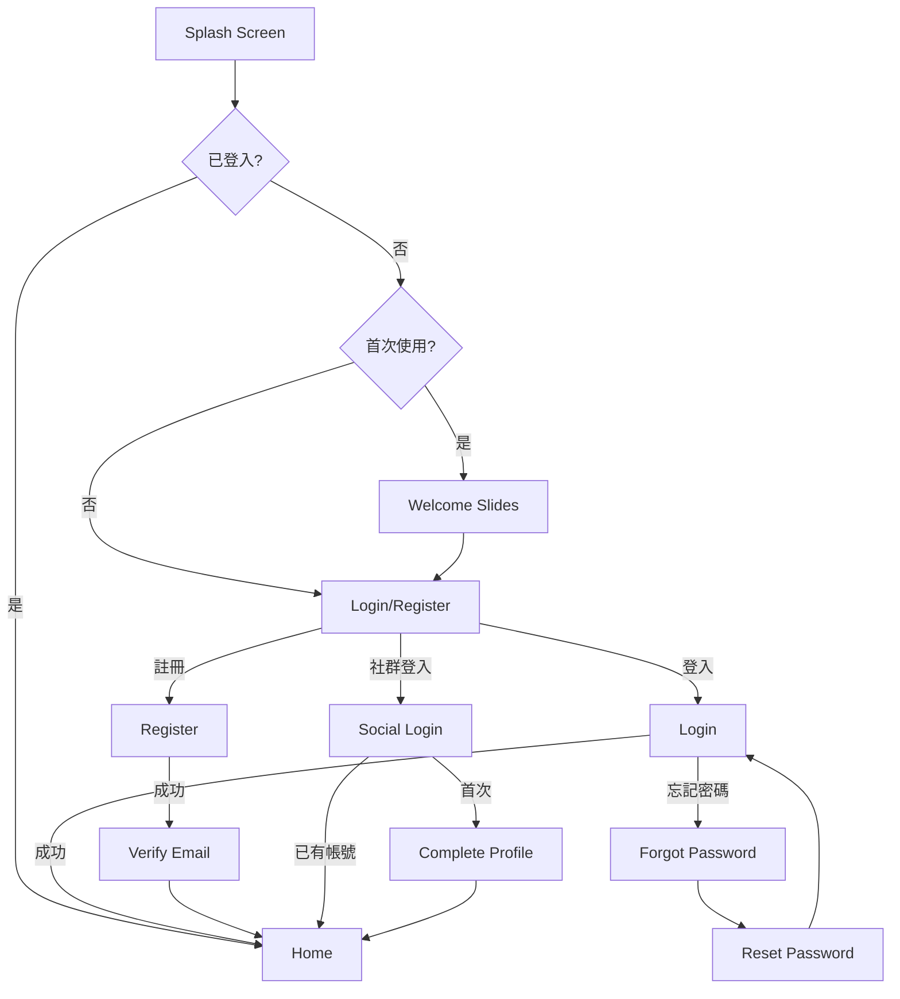
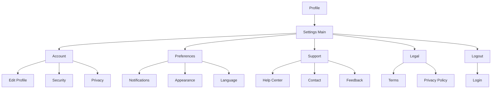

# 標準 App 畫面參考指南

本文件提供業界標準 App 畫面清單，供 UI/UX 設計師在規劃新專案時參考。

---

## Quick Reference - 畫面估算

### 最小可行產品 (MVP) - 15~20 畫面

| 優先級 | 類別 | 畫面數 | 必要性 |
|--------|------|--------|--------|
| P0 | 啟動 | 1 | ★★★ |
| P0 | 認證 | 4-7 | ★★★ |
| P0 | 首頁 | 1-2 | ★★★ |
| P0 | 設定 | 2-4 | ★★★ |
| P0 | 狀態畫面 | 3-4 | ★★★ |
| P1 | Onboarding | 3-5 | ★★☆ |
| P1 | 個人檔案 | 2-3 | ★★☆ |
| P1 | 法律 | 2 | ★★☆ |
| P2 | 幫助支援 | 2-3 | ★☆☆ |
| P2 | 通知 | 1-2 | ★☆☆ |
| P2 | 搜尋 | 2-3 | ★☆☆ |

### 標準 App 估算

| App 類型 | 畫面範圍 | 說明 |
|----------|----------|------|
| 簡單工具 App | 15-25 | 單一功能，如計算機、手電筒 |
| 標準消費 App | 30-50 | 電商、內容瀏覽、社群 |
| 企業級 App | 50-100+ | 複雜流程、多角色、報表 |

### P0 必要認證畫面 (MANDATORY AUTH Screens)

⚠️ **強制要求**: 以下 AUTH 畫面為所有 App 必備項目：

| 畫面 ID | 畫面名稱 | 必要性 | 說明 |
|---------|----------|--------|------|
| SCR-AUTH-001 | 登入畫面 | ★★★ 強制 | 用戶登入入口 |
| SCR-AUTH-002 | 註冊畫面 | ★★★ 強制 | 新用戶註冊 |
| SCR-AUTH-003 | 忘記密碼 | ★★★ 強制 | 密碼重設請求 |
| SCR-AUTH-003a | 重設郵件已發送 | ★★★ 強制 | 確認重設郵件已發送 |
| SCR-AUTH-004 | 角色選擇 | ★★☆ 視需求 | 多角色 App 必要 |
| SCR-AUTH-005 | Email 驗證 | ★★☆ 視需求 | 需要郵件驗證時 |
| SCR-AUTH-006 | MFA 驗證 | ★☆☆ 可選 | 多因素認證 |

**驗證規則:**
- 登入畫面的「忘記密碼」連結 **必須** 導向 SCR-AUTH-003
- 禁止使用 `alert()` 替代實際畫面
- 忘記密碼流程必須包含確認畫面 (SCR-AUTH-003a)

---

## 1. 啟動模組 (LAUNCH)

### 1.1 Splash Screen (SCR-LAUNCH-001)

**用途:** App 啟動時的品牌展示畫面

**必要元件:**
- App Logo (置中)
- App 名稱 (可選)
- 品牌標語 (可選)
- Loading 指示器 (可選)

**設計規範:**
```
┌─────────────────────┐
│                     │
│                     │
│      [App Logo]     │
│       App Name      │
│                     │
│      ○ ○ ○ ...     │
│                     │
└─────────────────────┘
```

**平台差異:**
| 平台 | 特性 |
|------|------|
| iOS | Launch Screen Storyboard，禁止動態內容 |
| Android | 支援 Animated Vector Drawable |

**停留時間:** 1.5-3 秒 (不超過 3 秒)

**Best Practices:**
- 背景色與 App 主題一致
- Logo 尺寸約佔螢幕 20-30%
- 避免過多文字
- iOS 需提供 Launch Screen Storyboard

---

## 2. 認證模組 (AUTH)

### 2.1 登入畫面 (SCR-AUTH-001-login)

**用途:** 已註冊用戶登入

**必要元件:**
| 元件 | 必要性 | 說明 |
|------|--------|------|
| Logo/Brand | ★★☆ | 頂部品牌識別 |
| Email/Username 輸入框 | ★★★ | 主要登入識別 |
| Password 輸入框 | ★★★ | 密碼，含顯示/隱藏切換 |
| Login 按鈕 | ★★★ | 主要 CTA |
| Forgot Password 連結 | ★★★ | 密碼重設入口 |
| Sign Up 連結 | ★★★ | 新用戶註冊入口 |
| Social Login 區塊 | ★★☆ | 第三方登入選項 |
| Remember Me | ★☆☆ | 記住登入狀態 |
| Biometric Login | ★★☆ | Face ID / Touch ID / 指紋 |

**社群登入配置:**
```
┌─────────────────────────────────────────┐
│           ──── or continue with ────    │
│                                         │
│  ┌─────────────────────────────────┐   │
│  │  🍎  Sign in with Apple         │   │  ← iOS 必要
│  └─────────────────────────────────┘   │
│  ┌─────────────────────────────────┐   │
│  │  G   Continue with Google       │   │
│  └─────────────────────────────────┘   │
│  ┌─────────────────────────────────┐   │
│  │  f   Continue with Facebook     │   │  ← 可選
│  └─────────────────────────────────┘   │
└─────────────────────────────────────────┘
```

**平台差異 - 社群登入按鈕順序:**
| 平台 | 順序 | 原因 |
|------|------|------|
| iOS | Apple → Google → Facebook | Apple 第一 (App Store 規定) |
| Android | Google → Facebook → Apple | Google 第一 (使用者習慣) |

**Apple Sign-In 強制規定:**
> ⚠️ **iOS App Store 審核規定**: 若 App 提供任何第三方登入 (Google, Facebook 等)，必須同時提供 Sign in with Apple

**Best Practices:**
- 密碼輸入框提供顯示/隱藏切換
- 即時驗證 Email 格式
- 錯誤訊息明確指出問題
- 登入失敗後不清空輸入內容
- 支援鍵盤 Return 鍵提交

**錯誤狀態設計:**
| 錯誤類型 | 提示訊息 |
|----------|----------|
| Email 格式錯誤 | "請輸入有效的 Email 地址" |
| 帳號不存在 | "此帳號尚未註冊" |
| 密碼錯誤 | "密碼錯誤，請重試" |
| 帳號鎖定 | "帳號已鎖定，請稍後再試或重設密碼" |
| 網路錯誤 | "網路連線失敗，請檢查網路設定" |

---

### 2.2 註冊畫面 (SCR-AUTH-002-register)

**用途:** 新用戶建立帳號

**必填欄位:**
| 欄位 | 驗證規則 |
|------|----------|
| 姓名 | 2-50 字元 |
| Email | 有效 Email 格式 |
| 密碼 | 8+ 字元，含大小寫與數字 |
| 確認密碼 | 與密碼一致 |

**可選欄位:**
| 欄位 | 使用情境 |
|------|----------|
| 電話號碼 | 需要 SMS 驗證時 |
| 使用者名稱 | 社群類 App |
| 生日 | 年齡限制 App |
| 頭像 | 社群類 App |
| 邀請碼 | 推薦機制 |

**必要元件:**
| 元件 | 必要性 | 說明 |
|------|--------|------|
| 表單欄位 | ★★★ | 如上所列 |
| Register 按鈕 | ★★★ | 主要 CTA |
| Terms 同意勾選 | ★★★ | 法律要求 |
| Login 連結 | ★★★ | "已有帳號？登入" |
| Social Signup | ★★☆ | 快速註冊選項 |
| 密碼強度指示器 | ★★☆ | 即時密碼強度回饋 |

**Terms 同意機制:**
```
□ 我同意 [服務條款] 及 [隱私權政策]

□ 我同意接收行銷資訊 (可選)
```

**密碼強度指示:**
```
密碼強度: [====----] 中等

要求:
✓ 至少 8 個字元
✓ 包含大寫字母
✗ 包含數字
✗ 包含特殊符號
```

---

### 2.3 忘記密碼 (SCR-AUTH-003-forgot-password) ⚠️ MANDATORY

**用途:** 請求密碼重設

**⚠️ 強制要求:** 此畫面為 App 必備項目，禁止使用 `alert()` 替代。

**必要元件:**
| 元件 | 必要性 | 說明 |
|------|--------|------|
| 返回按鈕 | ★★★ | 返回登入畫面 |
| 標題 | ★★★ | "忘記密碼" 或 "重設密碼" |
| 說明文字 | ★★★ | "請輸入您的 Email，我們將發送重設連結" |
| Email 輸入框 | ★★★ | 已註冊的 Email |
| Submit 按鈕 | ★★★ | "發送重設連結" |
| Logo/插圖 | ★★☆ | 品牌識別或情境插圖 |

**畫面結構:**
```
┌─────────────────────┐
│ ← 返回              │
│                     │
│      [🔐 Icon]      │
│                     │
│    忘記密碼？       │
│                     │
│  請輸入您註冊時的   │
│  Email 地址，我們   │
│  會寄送密碼重設連結 │
│                     │
│  ┌───────────────┐  │
│  │ 📧 請輸入Email │  │
│  └───────────────┘  │
│                     │
│  [   發送重設連結  ]│
│                     │
│  記起密碼了？登入   │
│                     │
└─────────────────────┘
```

**iPad HTML 模板:**
```html
<!-- SCR-AUTH-003-forgot-password.html -->
<!DOCTYPE html>
<html lang="zh-TW">
<head>
  <meta charset="UTF-8">
  <meta name="viewport" content="width=1194, height=834">
  <title>忘記密碼</title>
  <script src="https://cdn.tailwindcss.com"></script>
  <link rel="stylesheet" href="../shared/project-theme.css">
</head>
<body class="bg-gradient-to-br from-cyan-50 via-white to-teal-50">
  <div class="w-[1194px] h-[834px] mx-auto flex">
    <!-- Left Panel - Branding -->
    <div class="w-1/2 flex flex-col items-center justify-center p-12">
      
      <h1 class="text-4xl font-bold text-gray-800">AppName</h1>
      <p class="text-gray-600 mt-2">品牌標語</p>
    </div>

    <!-- Right Panel - Form -->
    <div class="w-1/2 flex flex-col items-center justify-center p-12">
      <div class="w-full max-w-md">
        <!-- Back Button -->
        <button onclick="location.href='SCR-AUTH-001-login.html'"
                class="mb-8 flex items-center gap-2 text-gray-600 hover:text-gray-800">
          <svg class="w-5 h-5" fill="none" stroke="currentColor" viewBox="0 0 24 24">
            <path stroke-linecap="round" stroke-linejoin="round" stroke-width="2" d="M15 19l-7-7 7-7"/>
          </svg>
          返回登入
        </button>

        <!-- Icon -->
        <div class="w-20 h-20 bg-cyan-100 rounded-full flex items-center justify-center mx-auto mb-6">
          <svg class="w-10 h-10 text-cyan-600" fill="currentColor" viewBox="0 0 24 24">
            <path d="M18 8h-1V6c0-2.76-2.24-5-5-5S7 3.24 7 6v2H6c-1.1 0-2 .9-2 2v10c0 1.1.9 2 2 2h12c1.1 0 2-.9 2-2V10c0-1.1-.9-2-2-2zM12 17c-1.1 0-2-.9-2-2s.9-2 2-2 2 .9 2 2-.9 2-2 2z"/>
          </svg>
        </div>

        <!-- Title -->
        <h2 class="text-2xl font-bold text-center text-gray-800 mb-2">忘記密碼？</h2>
        <p class="text-center text-gray-500 mb-8">請輸入您註冊時的 Email 地址，<br>我們會寄送密碼重設連結給您</p>

        <!-- Email Input -->
        <div class="mb-6">
          <label class="block text-sm font-medium text-gray-700 mb-2">電子郵件</label>
          <div class="relative">
            <span class="absolute left-4 top-1/2 -translate-y-1/2 text-gray-400">
              <svg class="w-5 h-5" fill="none" stroke="currentColor" viewBox="0 0 24 24">
                <path stroke-linecap="round" stroke-linejoin="round" stroke-width="2" d="M3 8l7.89 5.26a2 2 0 002.22 0L21 8M5 19h14a2 2 0 002-2V7a2 2 0 00-2-2H5a2 2 0 00-2 2v10a2 2 0 002 2z"/>
              </svg>
            </span>
            <input type="email" placeholder="請輸入電子郵件"
                   class="w-full pl-12 pr-4 py-3 border border-gray-200 rounded-xl focus:ring-2 focus:ring-cyan-500 focus:border-transparent">
          </div>
        </div>

        <!-- Submit Button -->
        <button onclick="location.href='SCR-AUTH-003a-forgot-sent.html'"
                class="w-full py-4 bg-cyan-500 text-white font-semibold rounded-xl hover:bg-cyan-600 transition">
          發送重設連結
        </button>

        <!-- Back to Login Link -->
        <p class="text-center text-gray-500 mt-6">
          記起密碼了？<button onclick="location.href='SCR-AUTH-001-login.html'" class="text-cyan-600 font-medium">登入</button>
        </p>
      </div>
    </div>
  </div>
</body>
</html>
```

**成功畫面 (SCR-AUTH-003a-forgot-sent) ⚠️ MANDATORY:**
```
┌─────────────────────┐
│                     │
│       ✉️ ✓         │
│                     │
│  Email 已發送！     │
│                     │
│  請檢查您的信箱     │
│  user@email.com     │
│                     │
│  [開啟信箱 App]     │
│                     │
│  沒收到？重新發送   │
│                     │
│  [返回登入]         │
│                     │
└─────────────────────┘
```

**成功畫面 HTML 模板:**
```html
<!-- SCR-AUTH-003a-forgot-sent.html -->
<!-- 必要元件: 成功圖示、確認訊息、Email 顯示、重送按鈕、返回登入 -->
<div class="text-center">
  <div class="w-24 h-24 bg-green-100 rounded-full flex items-center justify-center mx-auto mb-6">
    <svg class="w-12 h-12 text-green-600" fill="none" stroke="currentColor" viewBox="0 0 24 24">
      <path stroke-linecap="round" stroke-linejoin="round" stroke-width="2" d="M5 13l4 4L19 7"/>
    </svg>
  </div>
  <h2 class="text-2xl font-bold text-gray-800 mb-2">Email 已發送！</h2>
  <p class="text-gray-500 mb-4">請檢查您的信箱</p>
  <p class="text-cyan-600 font-medium mb-8">user@example.com</p>
  <button class="text-gray-500">沒收到？<span class="text-cyan-600 font-medium">重新發送</span></button>
  <button onclick="location.href='SCR-AUTH-001-login.html'" class="block mx-auto mt-6 text-cyan-600 font-medium">
    返回登入
  </button>
</div>
```

**錯誤狀態設計:**
| 錯誤類型 | 提示訊息 |
|----------|----------|
| Email 格式錯誤 | "請輸入有效的 Email 地址" |
| 帳號不存在 | "此 Email 尚未註冊" |
| 發送過於頻繁 | "請稍後再試，{N} 秒後可重新發送" |
| 網路錯誤 | "網路連線失敗，請檢查網路設定" |

---

### 2.4 重設密碼 (SCR-AUTH-004-reset-password)

**用途:** 設定新密碼 (從 Email 連結進入)

**必要元件:**
| 元件 | 說明 |
|------|------|
| 新密碼輸入框 | 含強度指示 |
| 確認新密碼 | 需一致 |
| Submit 按鈕 | 確認重設 |
| 密碼要求說明 | 清楚列出規則 |

**成功後動作:** 自動導向登入畫面或直接登入

---

### 2.5 Email 驗證 (SCR-AUTH-005-verify-email)

**用途:** 驗證用戶 Email 真實性

**畫面狀態:**

**等待驗證狀態:**
```
┌─────────────────────┐
│                     │
│       ✉️            │
│                     │
│  請驗證您的 Email   │
│                     │
│  我們已發送驗證信至 │
│  user@email.com     │
│                     │
│  [開啟信箱 App]     │
│                     │
│  [重新發送驗證信]   │
│                     │
│  輸入錯誤？更改Email│
│                     │
└─────────────────────┘
```

**驗證成功狀態:**
```
┌─────────────────────┐
│                     │
│       ✓             │
│                     │
│  Email 驗證成功！   │
│                     │
│  [開始使用]         │
│                     │
└─────────────────────┘
```

---

### 2.6 MFA 驗證 (SCR-AUTH-006-mfa)

**用途:** 多因素認證輸入

**類型:**
| 類型 | 畫面元件 |
|------|----------|
| SMS OTP | 6 位數字輸入框 + 重送按鈕 |
| Email OTP | 6 位數字輸入框 + 重送按鈕 |
| Authenticator App | 6 位數字輸入框 |
| 備用碼 | 8 位英數混合輸入框 |

**OTP 輸入設計:**
```
┌─────────────────────┐
│                     │
│   輸入驗證碼        │
│                     │
│   已發送至          │
│   +886 912****56    │
│                     │
│   ┌─┐ ┌─┐ ┌─┐ ┌─┐ ┌─┐ ┌─┐  │
│   │1│ │2│ │3│ │4│ │5│ │_│  │
│   └─┘ └─┘ └─┘ └─┘ └─┘ └─┘  │
│                     │
│   59 秒後可重新發送 │
│                     │
│   [使用其他驗證方式]│
│                     │
└─────────────────────┘
```

**Best Practices:**
- 自動跳至下一格
- 支援貼上整串驗證碼
- 倒數計時顯示
- 提供替代驗證方式

---

### 2.7 社群登入整合畫面 (SCR-AUTH-007-social)

**用途:** 處理第三方登入流程

**Apple Sign-In 流程:**
```
1. 點擊 "Sign in with Apple"
2. 系統彈出 Apple 授權視窗
3. 用戶選擇資訊分享選項 (隱藏 Email 或分享)
4. Face ID / Touch ID 確認
5. 回到 App 完成登入
```

**首次社群登入補充資料畫面 (SCR-AUTH-007a):**
```
┌─────────────────────┐
│                     │
│  完成您的個人資料   │
│                     │
│  名稱: [已自動填入] │
│  Email: [已自動填入]│
│                     │
│  使用者名稱: [    ] │  ← 若 App 需要
│  電話號碼:   [    ] │  ← 若 App 需要
│                     │
│  [完成註冊]         │
│                     │
└─────────────────────┘
```

---

### 2.8 生物辨識登入 (SCR-AUTH-008-biometric)

**用途:** 快速登入 (Face ID / Touch ID / 指紋)

**觸發時機:**
- App 啟動時 (若已登入過)
- Session 過期需重新驗證

**畫面設計:**
```
┌─────────────────────┐
│                     │
│   Welcome Back      │
│   user@email.com    │
│                     │
│      [Face ID]      │
│                     │
│   [使用密碼登入]    │
│                     │
│   [切換帳號]        │
│                     │
└─────────────────────┘
```

---

## 3. Onboarding 模組 (ONBOARD)

### 3.1 歡迎畫面 (SCR-ONBOARD-001~003)

**用途:** 首次使用 App 的功能介紹

**建議頁數:** 3-5 頁 (不超過 5 頁)

**標準結構:**
```
┌─────────────────────┐
│                     │
│    [插圖/動畫]      │  40-50% 畫面
│                     │
├─────────────────────┤
│                     │
│   功能標題          │  大字
│                     │
│   簡短說明文字      │  2-3 行
│   最多 50 字        │
│                     │
├─────────────────────┤
│   ○ ● ○ ○ ○        │  頁面指示器
│                     │
│   [下一步]          │
│   跳過              │
│                     │
└─────────────────────┘
```

**常見 Onboarding 主題:**
| 頁面 | 標題範例 | 說明 |
|------|----------|------|
| 1 | 歡迎使用 | App 核心價值主張 |
| 2 | 主要功能 A | 最重要的功能介紹 |
| 3 | 主要功能 B | 次要功能介紹 |
| 4 | 開始使用 | CTA 引導註冊/登入 |

**Best Practices:**
- 可跳過 (Skip 按鈕)
- 支援滑動切換
- 最後一頁換成 "開始使用"
- 首次使用才顯示

---

### 3.2 權限請求畫面 (SCR-ONBOARD-004-permissions)

**用途:** 說明並請求系統權限

**常見權限:**
| 權限 | 說明時機 | 說明範例 |
|------|----------|----------|
| 通知 | Onboarding 或首次需要時 | "開啟通知以接收重要提醒" |
| 位置 | 功能需要時 | "允許位置存取以顯示附近店家" |
| 相機 | 功能需要時 | "允許相機存取以拍攝照片" |
| 相簿 | 功能需要時 | "允許相簿存取以選擇照片" |
| 麥克風 | 功能需要時 | "允許麥克風以進行語音輸入" |
| 聯絡人 | 功能需要時 | "允許存取聯絡人以邀請好友" |
| 健康資料 | 功能需要時 | "允許存取健康資料以追蹤運動" |

**權限請求畫面設計:**
```
┌─────────────────────┐
│                     │
│      🔔             │
│                     │
│   開啟通知          │
│                     │
│   開啟通知以接收：  │
│   • 訂單更新        │
│   • 促銷活動        │
│   • 重要提醒        │
│                     │
│   [開啟通知]  ←主按鈕│
│   [稍後再說]        │
│                     │
└─────────────────────┘
```

**Best Practices:**
- 先顯示自訂說明畫面，再觸發系統權限彈窗
- 說明為何需要此權限
- 提供 "稍後再說" 選項
- 權限被拒後，引導至設定頁面

---

### 3.3 個人化設定 (SCR-ONBOARD-005-personalization)

**用途:** 收集使用者偏好以客製化體驗

**常見個人化選項:**
| 類型 | 範例 |
|------|------|
| 興趣偏好 | 選擇喜歡的主題/類別 |
| 目標設定 | 設定每日/每週目標 |
| 通知偏好 | 選擇接收通知類型 |
| 外觀設定 | Light / Dark / System |
| 語言選擇 | 介面語言 |

**興趣選擇畫面範例:**
```
┌─────────────────────┐
│                     │
│   選擇您感興趣的主題│
│   (至少選擇 3 個)   │
│                     │
│  ┌─────┐ ┌─────┐   │
│  │ 科技 │ │ 財經 │   │
│  └─────┘ └─────┘   │
│  ┌─────┐ ┌─────┐   │
│  │ 運動 │ │ 美食 │   │
│  └─────┘ └─────┘   │
│  ┌─────┐ ┌─────┐   │
│  │ 旅遊 │ │ 音樂 │   │
│  └─────┘ └─────┘   │
│                     │
│   [繼續] (3/3)      │
│                     │
└─────────────────────┘
```

---

## 4. 首頁/導航模組 (DASH/NAV)

### 4.1 Dashboard / 首頁 (SCR-DASH-001-home)

**用途:** App 的主要進入點

**常見配置:**
| 元件 | 位置 | 說明 |
|------|------|------|
| Header | 頂部 | Logo、標題、通知/設定圖示 |
| 搜尋框 | 頂部/Header 下 | 快速搜尋入口 |
| Banner/Carousel | 上方 | 促銷/公告輪播 |
| 快捷功能 | 中上 | Grid 或橫向滾動 |
| 內容列表 | 主體 | 依 App 類型變化 |
| Bottom Tab | 底部 | 主要導航 |

**Header 設計變體:**
```
變體 A - 簡潔:
┌─────────────────────────┐
│ Logo        🔔  👤      │
└─────────────────────────┘

變體 B - 搜尋優先:
┌─────────────────────────┐
│ 🔍 搜尋...         🔔   │
└─────────────────────────┘

變體 C - 大標題:
┌─────────────────────────┐
│ 首頁                🔔  │
│ Good morning, User      │
└─────────────────────────┘
```

---

### 4.2 Bottom Tab Bar (SCR-NAV-001-tabs)

**用途:** 主要導航

**標準配置:**
| Tab 數量 | 建議 | 說明 |
|----------|------|------|
| 3 | ★★★ | 簡單 App |
| 4 | ★★★ | 標準配置 |
| 5 | ★★☆ | 最大建議數量 |
| 6+ | ★☆☆ | 避免，使用 More Tab |

**常見 Tab 組合:**
```
電商類:
┌────┬────┬────┬────┬────┐
│ 🏠 │ 📂 │ 🛒 │ ❤️ │ 👤 │
│首頁│分類│購物車│收藏│我的│
└────┴────┴────┴────┴────┘

社群類:
┌────┬────┬────┬────┬────┐
│ 🏠 │ 🔍 │ ➕ │ ❤️ │ 👤 │
│首頁│探索│發布│通知│個人│
└────┴────┴────┴────┴────┘

工具類:
┌──────┬──────┬──────┐
│  🏠  │  📊  │  ⚙️  │
│ 首頁 │ 統計 │ 設定 │
└──────┴──────┴──────┘
```

**平台差異:**
| 平台 | 位置 | 高度 | 特性 |
|------|------|------|------|
| iOS | 底部 | 49pt + Safe Area | 半透明模糊背景 |
| Android | 底部 | 56dp | Material 風格，可含 FAB |

---

### 4.3 Side Menu / Drawer (SCR-NAV-002-drawer)

**用途:** 次要導航或功能分組

**觸發方式:**
- Hamburger 圖示 (☰)
- 從螢幕邊緣滑入

**標準結構:**
```
┌─────────────────────┐
│ ┌──────────────────┐│
│ │  👤 User Name    ││  Header
│ │  user@email.com  ││
│ └──────────────────┘│
├─────────────────────┤
│ 🏠 首頁             │  Navigation
│ 📂 分類             │
│ 📜 訂單             │
│ ❤️ 收藏             │
├─────────────────────┤
│ ⚙️ 設定             │  Footer
│ ❓ 幫助             │
│ 🚪 登出             │
└─────────────────────┘
```

---

## 5. 個人檔案模組 (PROFILE)

### 5.1 個人檔案檢視 (SCR-PROFILE-001-view)

**用途:** 顯示用戶資料

**必要元件:**
| 元件 | 說明 |
|------|------|
| 頭像 | 圓形，可點擊放大 |
| 用戶名稱 | 主要識別 |
| Email | 聯絡方式 |
| 編輯按鈕 | 進入編輯模式 |

**可選元件:**
| 元件 | 使用情境 |
|------|----------|
| 會員等級 | 會員制 App |
| 積分/餘額 | 電商/獎勵系統 |
| 統計數據 | 社群類 (追蹤者/按讚數) |
| 個人簡介 | 社群類 |
| 功能列表 | 快捷入口 |

**畫面設計:**
```
┌─────────────────────┐
│        ⚙️          │
│    ┌─────────┐     │
│    │  👤     │     │
│    │  頭像   │     │
│    └─────────┘     │
│    User Name       │
│    user@email.com  │
│    [編輯個人資料]  │
├─────────────────────┤
│ 📜 我的訂單         │
│ ❤️ 我的收藏         │
│ 🎁 優惠券           │
│ 📍 地址管理         │
│ 💳 付款方式         │
├─────────────────────┤
│ ⚙️ 設定             │
│ ❓ 幫助中心         │
└─────────────────────┘
```

---

### 5.2 個人檔案編輯 (SCR-PROFILE-002-edit)

**用途:** 修改用戶資料

**可編輯欄位:**
| 欄位 | 編輯方式 |
|------|----------|
| 頭像 | 點擊 → 選擇相簿/拍照 |
| 名稱 | 文字輸入 |
| 使用者名稱 | 文字輸入 (檢查唯一性) |
| 電話 | 電話輸入 (可能需驗證) |
| 生日 | 日期選擇器 |
| 性別 | 選項選擇 |
| 個人簡介 | 多行文字 |

**畫面設計:**
```
┌─────────────────────┐
│ ✕  編輯個人資料  儲存│
├─────────────────────┤
│    ┌─────────┐     │
│    │  👤 📷  │     │
│    │  頭像   │     │
│    └─────────┘     │
│    更換頭像         │
├─────────────────────┤
│ 名稱               │
│ ┌─────────────────┐│
│ │ John Doe        ││
│ └─────────────────┘│
│                     │
│ Email              │
│ ┌─────────────────┐│
│ │ user@email.com 🔒│ ← 不可編輯
│ └─────────────────┘│
│                     │
│ 電話號碼           │
│ ┌─────────────────┐│
│ │ +886 912345678  ││
│ └─────────────────┘│
└─────────────────────┘
```

**儲存行為:**
- 即時儲存 (自動儲存)
- 或明確儲存按鈕 + 確認

---

### 5.3 頭像編輯 (SCR-PROFILE-003-avatar)

**用途:** 更換/編輯頭像

**來源選項:**
| 選項 | 說明 |
|------|------|
| 拍照 | 開啟相機 |
| 相簿選擇 | 開啟相簿 |
| 預設頭像 | 系統提供的選項 |
| 移除頭像 | 恢復預設 |

**編輯功能:**
- 裁切 (正方形/圓形)
- 縮放
- 旋轉 (可選)

---

## 6. 設定模組 (SETTING)

### 6.1 設定主頁 (SCR-SETTING-001-main)

**用途:** 所有設定項目的入口

**標準分組:**
```
┌─────────────────────┐
│ ←  設定             │
├─────────────────────┤
│ 帳號               │
│ ├ 個人資料         │
│ ├ 帳號安全         │
│ └ 隱私設定         │
├─────────────────────┤
│ 偏好設定           │
│ ├ 通知             │
│ ├ 外觀             │
│ └ 語言             │
├─────────────────────┤
│ 支援               │
│ ├ 幫助中心         │
│ ├ 聯繫客服         │
│ └ 關於             │
├─────────────────────┤
│ 法律               │
│ ├ 服務條款         │
│ └ 隱私權政策       │
├─────────────────────┤
│ [登出]             │
│                     │
│ App 版本 1.0.0     │
└─────────────────────┘
```

---

### 6.2 通知設定 (SCR-SETTING-002-notifications)

**用途:** 管理 App 通知偏好

**常見選項:**
| 選項 | 類型 | 說明 |
|------|------|------|
| 推播通知 | Toggle | 總開關 |
| 訂單更新 | Toggle | 交易類 |
| 促銷活動 | Toggle | 行銷類 |
| 社群互動 | Toggle | 留言/按讚/追蹤 |
| 系統公告 | Toggle | 重要更新 |
| 免打擾時段 | 時間選擇 | 夜間靜音 |

**畫面設計:**
```
┌─────────────────────┐
│ ←  通知設定         │
├─────────────────────┤
│ 推播通知    [====●] │
├─────────────────────┤
│ 通知類型           │
│                     │
│ 訂單更新    [====●] │
│ 訂單狀態變更時通知  │
│                     │
│ 促銷活動    [●====] │
│ 優惠券與活動通知    │
│                     │
│ 社群互動    [====●] │
│ 留言、按讚、追蹤    │
├─────────────────────┤
│ 免打擾               │
│                     │
│ 啟用免打擾  [●====] │
│ 22:00 - 08:00      │
└─────────────────────┘
```

---

### 6.3 隱私設定 (SCR-SETTING-003-privacy)

**用途:** 管理隱私相關選項

**常見選項:**
| 選項 | 說明 |
|------|------|
| 個人檔案可見性 | 公開/好友/私人 |
| 線上狀態 | 顯示/隱藏 |
| 已讀回執 | 開啟/關閉 |
| 資料收集 | 分析資料收集同意 |
| 廣告追蹤 | 個人化廣告 |
| 封鎖名單 | 管理封鎖的用戶 |
| 下載我的資料 | GDPR 要求 |
| 刪除帳號 | 永久刪除 |

---

### 6.4 外觀設定 (SCR-SETTING-004-appearance)

**用途:** 視覺偏好設定

**選項:**
| 選項 | 類型 | 選項 |
|------|------|------|
| 主題 | 單選 | 淺色 / 深色 / 跟隨系統 |
| 文字大小 | 滑桿 | 小 / 中 / 大 / 超大 |
| 字體 | 選擇 | 系統 / 自訂字體 |

**畫面設計:**
```
┌─────────────────────┐
│ ←  外觀設定         │
├─────────────────────┤
│ 主題               │
│                     │
│ ○ 淺色模式 ☀️      │
│ ● 深色模式 🌙      │
│ ○ 跟隨系統         │
├─────────────────────┤
│ 文字大小           │
│                     │
│ A ────●───── A     │
│       中等          │
│                     │
│ 預覽文字範例        │
└─────────────────────┘
```

---

### 6.5 語言設定 (SCR-SETTING-005-language)

**用途:** 介面語言選擇

**畫面設計:**
```
┌─────────────────────┐
│ ←  語言             │
├─────────────────────┤
│ ● 繁體中文 ✓       │
│ ○ 简体中文         │
│ ○ English          │
│ ○ 日本語           │
│ ○ 한국어           │
└─────────────────────┘
```

**Best Practices:**
- 以該語言顯示語言名稱
- 變更後可能需重啟 App
- 考慮跟隨系統語言選項

---

### 6.6 帳號安全 (SCR-SETTING-006-security)

**用途:** 安全相關設定

**選項:**
| 選項 | 說明 |
|------|------|
| 變更密碼 | 修改登入密碼 |
| 雙重驗證 | 啟用/管理 MFA |
| 生物辨識 | Face ID / Touch ID |
| 登入裝置 | 查看/管理已登入裝置 |
| 登入記錄 | 查看登入歷史 |
| App 鎖定 | 開啟 App 需驗證 |

---

### 6.6a 變更密碼 (SCR-SETTING-006a-password)

**用途:** 變更登入密碼

**必要元件:**
| 元件 | 必要性 | 說明 |
|------|--------|------|
| 目前密碼輸入框 | ★★★ | 驗證身份 |
| 新密碼輸入框 | ★★★ | 含顯示/隱藏切換 |
| 確認新密碼輸入框 | ★★★ | 需與新密碼一致 |
| 密碼強度指示器 | ★★☆ | 即時密碼強度回饋 |
| 密碼要求清單 | ★★☆ | 列出密碼規則 |
| 確認變更按鈕 | ★★★ | 主要 CTA |

**畫面設計:**
```
┌─────────────────────┐
│ ←  變更密碼         │
├─────────────────────┤
│ ⚠️ 密碼安全提示     │
│ 建議使用 8 位以上...│
├─────────────────────┤
│ 目前密碼           │
│ ┌─────────────────┐│
│ │ ••••••••     👁 ││
│ └─────────────────┘│
│                     │
│ 新密碼             │
│ ┌─────────────────┐│
│ │ ••••••••     👁 ││
│ └─────────────────┘│
│ [====▓===] 密碼強度：良好│
│                     │
│ 確認新密碼         │
│ ┌─────────────────┐│
│ │ ••••••••     👁 ││
│ └─────────────────┘│
├─────────────────────┤
│ 密碼要求           │
│ ✓ 至少 8 個字元    │
│ ✓ 包含大寫字母     │
│ ✓ 包含數字         │
│ ○ 包含特殊符號(選填)│
├─────────────────────┤
│ [取消]  [確認變更] │
└─────────────────────┘
```

**密碼強度計算:**
| 強度 | 條件 | 顏色 |
|------|------|------|
| 弱 | < 8 字元 | 紅色 |
| 中等 | 符合 2 項規則 | 黃色 |
| 良好 | 符合 3 項規則 | 綠色 |
| 強 | 符合所有規則 | 藍色 |

**成功後動作:**
- 顯示成功提示
- 返回安全設定畫面
- (可選) 登出所有其他裝置

---

### 6.6b 登入裝置 (SCR-SETTING-006b-devices)

**用途:** 管理已登入的裝置

**必要元件:**
| 元件 | 必要性 | 說明 |
|------|--------|------|
| 目前裝置區塊 | ★★★ | 標示目前使用的裝置 |
| 其他裝置列表 | ★★★ | 列出所有其他已登入裝置 |
| 個別登出按鈕 | ★★★ | 可登出單一裝置 |
| 登出所有裝置按鈕 | ★★☆ | 一次登出所有其他裝置 |
| 安全提示 | ★★☆ | 提醒用戶注意可疑裝置 |

**裝置項目資訊:**
| 資訊 | 說明 |
|------|------|
| 裝置名稱 | iPhone 14 Pro / iPad Pro / MacBook Air |
| 裝置類型 | 手機/平板/電腦 (不同圖示) |
| 作業系統 | iOS 17.2 / Android 14 / macOS 14.2 |
| App 版本 | VocabKids v2.1.0 |
| 登入位置 | 台北市 / 新北市 (城市等級) |
| 登入時間 | 現在使用中 / 3 小時前 / 1 天前 |

**畫面設計:**
```
┌─────────────────────┐
│ ←  登入裝置   [登出所有]│
├─────────────────────┤
│ 目前裝置 ✓         │
│ ┌─────────────────┐│
│ │ 💻 iPad Pro     ││
│ │ iPadOS 17.2     ││
│ │ 台北市 • 現在使用中││
│ └─────────────────┘│
├─────────────────────┤
│ 其他登入裝置       │
│ ┌─────────────────┐│
│ │ 📱 iPhone 14 Pro││
│ │ iOS 17.2        ││
│ │ 台北市 • 3 小時前 │ [登出]│
│ └─────────────────┘│
│ ┌─────────────────┐│
│ │ 💻 MacBook Air  ││
│ │ macOS 14.2      ││
│ │ 新北市 • 1 天前  │ [登出]│
│ └─────────────────┘│
│ ┌─────────────────┐│
│ │ 📱 Samsung Tab  ││
│ │ Android 14      ││
│ │ 高雄市 • 5 天前  │ [登出]│
│ └─────────────────┘│
├─────────────────────┤
│ ⚠️ 安全提示        │
│ 如果發現不認識的裝置│
│ 請立即登出並變更密碼│
└─────────────────────┘
```

**裝置圖示:**
| 裝置類型 | 圖示 | 背景色 |
|----------|------|--------|
| iPad/平板 | 💻 | 紫色 |
| iPhone/手機 | 📱 | 綠色 |
| Mac/電腦 | 🖥️ | 灰色 |
| Android 手機 | 📱 | 青色 |
| Android 平板 | 📱 | 橙色 |
| 未知裝置 | ❓ | 紅色 |

**登出確認:**
```
┌─────────────────────┐
│     確定要登出      │
│   iPhone 14 Pro？   │
│                     │
│ 該裝置將需要重新登入│
│                     │
│ [取消]   [確定登出] │
└─────────────────────┘
```

---

## 7. 狀態畫面模組 (STATE)

### 7.1 Loading 狀態 (SCR-STATE-001-loading)

**類型:**

**Spinner Loading:**
```
┌─────────────────────┐
│                     │
│                     │
│         ◠          │
│        ◜ ◝         │
│                     │
│     載入中...       │
│                     │
│                     │
└─────────────────────┘
```

**Skeleton Loading (推薦):**
```
┌─────────────────────┐
│ ▓▓▓▓▓▓▓   ▓▓▓      │
├─────────────────────┤
│ ▓▓▓▓▓▓▓▓▓▓▓▓▓▓▓▓  │
│ ▓▓▓▓▓▓▓▓▓▓▓▓       │
│ ▓▓▓▓▓▓▓▓▓          │
├─────────────────────┤
│ ▓▓▓▓▓▓▓▓▓▓▓▓▓▓▓▓  │
│ ▓▓▓▓▓▓▓▓▓▓▓▓       │
│ ▓▓▓▓▓▓▓▓▓          │
└─────────────────────┘
```

**Progress Loading:**
```
┌─────────────────────┐
│                     │
│   上傳中 45%        │
│   ▓▓▓▓▓▓▓▓░░░░░░░  │
│                     │
│   正在處理圖片...   │
│                     │
└─────────────────────┘
```

---

### 7.2 Empty State (SCR-STATE-002-empty)

**用途:** 無內容時的佔位顯示

**必要元件:**
| 元件 | 說明 |
|------|------|
| 插圖/Icon | 視覺化呈現空狀態 |
| 標題 | 說明目前狀態 |
| 說明文字 | 解釋為何是空的 |
| CTA 按鈕 | 引導用戶行動 |

**常見 Empty State:**
```
購物車空白:
┌─────────────────────┐
│                     │
│       🛒           │
│                     │
│   購物車是空的     │
│                     │
│   快去逛逛吧！     │
│                     │
│   [開始購物]       │
│                     │
└─────────────────────┘

搜尋無結果:
┌─────────────────────┐
│                     │
│       🔍           │
│                     │
│   找不到結果       │
│                     │
│   試試其他關鍵字   │
│   或調整篩選條件   │
│                     │
│   [清除篩選]       │
│                     │
└─────────────────────┘

無通知:
┌─────────────────────┐
│                     │
│       🔔           │
│                     │
│   沒有新通知       │
│                     │
│   您的通知會顯示   │
│   在這裡           │
│                     │
└─────────────────────┘
```

---

### 7.3 Error State - 網路錯誤 (SCR-STATE-003-no-internet)

**用途:** 無網路連線時顯示

**畫面設計:**
```
┌─────────────────────┐
│                     │
│       📡 ✕         │
│                     │
│   無網路連線       │
│                     │
│   請檢查您的網路   │
│   設定後重試       │
│                     │
│   [重試]           │
│                     │
│   [離線模式]  ← 若支援
│                     │
└─────────────────────┘
```

---

### 7.4 Error State - 伺服器錯誤 (SCR-STATE-004-server-error)

**用途:** 伺服器錯誤 (5xx) 時顯示

**畫面設計:**
```
┌─────────────────────┐
│                     │
│       ⚠️           │
│                     │
│   伺服器發生錯誤   │
│                     │
│   我們正在處理中   │
│   請稍後再試       │
│                     │
│   [重試]           │
│                     │
│   錯誤代碼: 500    │  ← 可選
│                     │
└─────────────────────┘
```

---

### 7.5 Error State - 404 頁面不存在 (SCR-STATE-005-not-found)

**用途:** 請求的資源不存在

**畫面設計:**
```
┌─────────────────────┐
│                     │
│       🔍 ✕         │
│                     │
│   頁面不存在       │
│                     │
│   您要找的頁面     │
│   可能已被移除     │
│                     │
│   [返回首頁]       │
│                     │
└─────────────────────┘
```

---

## 8. 搜尋模組 (SEARCH)

### 8.1 搜尋畫面 (SCR-SEARCH-001-main)

**用途:** 內容搜尋

**畫面狀態:**

**初始狀態 (搜尋前):**
```
┌─────────────────────┐
│ 🔍 搜尋...      取消 │
├─────────────────────┤
│ 搜尋歷史           │
│ ├ 關鍵字 A    ✕    │
│ ├ 關鍵字 B    ✕    │
│ └ 關鍵字 C    ✕    │
│                     │
│ 清除搜尋歷史        │
├─────────────────────┤
│ 熱門搜尋           │
│ ┌───┐ ┌───┐ ┌───┐ │
│ │熱1│ │熱2│ │熱3│ │
│ └───┘ └───┘ └───┘ │
│ ┌───┐ ┌───┐       │
│ │熱4│ │熱5│       │
│ └───┘ └───┘       │
└─────────────────────┘
```

**輸入中 (自動完成):**
```
┌─────────────────────┐
│ 🔍 iph...       取消 │
├─────────────────────┤
│ 🔍 iPhone 15        │
│ 🔍 iPhone 15 Pro    │
│ 🔍 iPhone 手機殼    │
│ 🔍 iPhone 充電器    │
└─────────────────────┘
```

---

### 8.2 搜尋結果 (SCR-SEARCH-002-results)

**用途:** 顯示搜尋結果

**畫面設計:**
```
┌─────────────────────┐
│ 🔍 iPhone       取消 │
│ 找到 156 個結果     │
├─────────────────────┤
│ 排序 ▼  篩選 ≡     │
├─────────────────────┤
│ ┌─────────────────┐│
│ │ 結果項目 1      ││
│ └─────────────────┘│
│ ┌─────────────────┐│
│ │ 結果項目 2      ││
│ └─────────────────┘│
│ ┌─────────────────┐│
│ │ 結果項目 3      ││
│ └─────────────────┘│
│        ...         │
└─────────────────────┘
```

---

### 8.3 篩選 (SCR-SEARCH-003-filters)

**用途:** 進階篩選條件

**呈現方式:**
- Bottom Sheet (推薦)
- 全頁面
- 側邊滑出

**畫面設計 (Bottom Sheet):**
```
┌─────────────────────┐
│ 篩選條件    [重置] │
├─────────────────────┤
│ 價格範圍           │
│ $0 ─────●───── $1000│
│                     │
│ 分類               │
│ □ 分類 A           │
│ ☑ 分類 B           │
│ □ 分類 C           │
│                     │
│ 品牌               │
│ ☑ 品牌 X  □ 品牌 Y │
│                     │
├─────────────────────┤
│ [套用 (156)]       │
└─────────────────────┘
```

---

## 9. 通知模組 (NOTIFY)

### 9.1 通知列表 (SCR-NOTIFY-001-list)

**用途:** 顯示所有通知

**畫面設計:**
```
┌─────────────────────┐
│ ←  通知     全部已讀 │
├─────────────────────┤
│ 今天               │
│ ┌─────────────────┐│
│ │● 訂單已出貨     ││
│ │  您的訂單 #123  ││
│ │  10 分鐘前      ││
│ └─────────────────┘│
│ ┌─────────────────┐│
│ │○ 促銷活動       ││
│ │  限時優惠 50%   ││
│ │  2 小時前       ││
│ └─────────────────┘│
├─────────────────────┤
│ 昨天               │
│ ┌─────────────────┐│
│ │○ 系統通知       ││
│ │  App 已更新     ││
│ │  昨天 14:30     ││
│ └─────────────────┘│
└─────────────────────┘
```

**通知項目元素:**
| 元素 | 說明 |
|------|------|
| 已讀/未讀指示 | 圓點或背景色 |
| 圖示/頭像 | 通知類型視覺化 |
| 標題 | 通知主旨 |
| 內容預覽 | 1-2 行說明 |
| 時間 | 相對或絕對時間 |

---

### 9.2 通知詳情 (SCR-NOTIFY-002-detail)

**用途:** 通知完整內容 (若需要)

---

## 10. 幫助支援模組 (HELP)

### 10.1 幫助中心 (SCR-HELP-001-center)

**用途:** 自助服務入口

**畫面設計:**
```
┌─────────────────────┐
│ ←  幫助中心         │
├─────────────────────┤
│ 🔍 搜尋問題...      │
├─────────────────────┤
│ 常見問題           │
│                     │
│ 📦 訂單相關    →   │
│ 💳 付款問題    →   │
│ 🚚 配送問題    →   │
│ ↩️ 退換貨      →   │
│ 👤 帳號問題    →   │
├─────────────────────┤
│ 還是有問題？       │
│                     │
│ [💬 聯繫客服]      │
└─────────────────────┘
```

---

### 10.2 FAQ 詳情 (SCR-HELP-002-faq)

**用途:** 常見問題解答

**畫面設計:**
```
┌─────────────────────┐
│ ←  訂單相關         │
├─────────────────────┤
│ ▼ 如何查詢訂單？   │
│   您可以在「我的訂 │
│   單」中查看所有訂 │
│   單狀態...        │
│                     │
│ ▶ 如何取消訂單？   │
│                     │
│ ▶ 訂單多久會出貨？ │
│                     │
│ ▶ 可以更改訂單嗎？ │
├─────────────────────┤
│ 沒有找到答案？     │
│ [聯繫客服]         │
└─────────────────────┘
```

---

### 10.3 聯繫客服 (SCR-HELP-003-contact)

**用途:** 人工客服聯繫

**聯繫方式:**
| 方式 | 說明 |
|------|------|
| 線上客服 | 即時聊天 |
| Email | 發送郵件 |
| 電話 | 撥打客服電話 |
| 社群媒體 | Facebook/LINE |

**畫面設計:**
```
┌─────────────────────┐
│ ←  聯繫客服         │
├─────────────────────┤
│                     │
│ 💬 線上客服         │
│    平均等待 < 5 分鐘│
│    [開始對話]       │
│                     │
├─────────────────────┤
│ 📧 Email           │
│    support@app.com │
│    [發送郵件]       │
│                     │
├─────────────────────┤
│ 📞 客服電話         │
│    0800-123-456    │
│    服務時間:        │
│    週一至週五 9-18  │
│    [撥打電話]       │
│                     │
└─────────────────────┘
```

---

### 10.4 意見回饋 (SCR-HELP-004-feedback)

**用途:** 收集用戶意見

**畫面設計:**
```
┌─────────────────────┐
│ ←  意見回饋         │
├─────────────────────┤
│                     │
│ 您的意見對我們很重要│
│                     │
│ 評分                │
│ 😞 😐 😊 😃 🤩     │
│                     │
│ 回饋類型           │
│ ○ 功能建議         │
│ ○ 問題回報         │
│ ● 使用體驗         │
│ ○ 其他             │
│                     │
│ 詳細說明           │
│ ┌─────────────────┐│
│ │                 ││
│ │                 ││
│ └─────────────────┘│
│                     │
│ [提交]             │
└─────────────────────┘
```

---

## 11. 法律模組 (LEGAL)

### 11.1 服務條款 (SCR-LEGAL-001-terms)

**用途:** 顯示服務條款

**畫面設計:**
```
┌─────────────────────┐
│ ←  服務條款         │
├─────────────────────┤
│                     │
│ 服務條款           │
│ 最後更新: 2024/1/1 │
│                     │
│ 1. 接受條款        │
│                     │
│ 當您使用本服務時，│
│ 即表示您同意...    │
│                     │
│ 2. 服務說明        │
│ ...                │
│                     │
│ 3. 用戶責任        │
│ ...                │
│                     │
└─────────────────────┘
```

---

### 11.2 隱私權政策 (SCR-LEGAL-002-privacy)

**用途:** 顯示隱私權政策

**必要章節:**
| 章節 | 說明 |
|------|------|
| 資料收集 | 收集哪些資料 |
| 資料使用 | 如何使用資料 |
| 資料分享 | 與誰分享 |
| 資料保護 | 如何保護資料 |
| Cookie | Cookie 使用說明 |
| 用戶權利 | GDPR 權利說明 |
| 聯繫方式 | 隱私問題聯繫 |

---

## 12. 內容顯示模組 (CONTENT)

### 12.1 列表檢視 (SCR-CONTENT-001-list)

**用途:** 以列表方式顯示內容

**列表項目變體:**
```
簡單列表:
┌─────────────────────┐
│ 項目標題       →   │
└─────────────────────┘

圖文列表:
┌─────────────────────┐
│ ┌───┐              │
│ │ 📷│ 標題         │
│ │   │ 說明文字     │
│ └───┘              │
└─────────────────────┘

卡片列表:
┌─────────────────────┐
│ ┌─────────────────┐│
│ │      圖片       ││
│ ├─────────────────┤│
│ │ 標題           ││
│ │ 說明  $價格    ││
│ └─────────────────┘│
└─────────────────────┘
```

---

### 12.2 詳情頁 (SCR-CONTENT-002-detail)

**用途:** 單一項目的完整資訊

**通用結構:**
```
┌─────────────────────┐
│ ←          ❤️ 📤    │
├─────────────────────┤
│                     │
│   [主要圖片/媒體]   │
│                     │
├─────────────────────┤
│ 標題               │
│ 副標題/分類        │
│                     │
│ 描述文字...        │
│ ...                │
│                     │
├─────────────────────┤
│ 相關資訊           │
│ ...                │
├─────────────────────┤
│ [主要 CTA 按鈕]    │
└─────────────────────┘
```

---

### 12.3 Grid/Gallery 檢視 (SCR-CONTENT-003-grid)

**用途:** 以網格方式顯示內容 (圖片為主)

**Grid 配置:**
| 欄數 | 使用情境 |
|------|----------|
| 2 欄 | 標準產品 Grid |
| 3 欄 | 相簿、社群媒體 |
| 4 欄 | 縮圖瀏覽 |

---

## 13. 訊息模組 (MSG)

### 13.1 對話列表 (SCR-MSG-001-list)

**用途:** 顯示所有對話

**畫面設計:**
```
┌─────────────────────┐
│ 訊息            ✏️  │
├─────────────────────┤
│ 🔍 搜尋...          │
├─────────────────────┤
│ ┌─────────────────┐│
│ │👤 User A     ● 2││
│ │   最後訊息...   ││
│ │   剛剛          ││
│ └─────────────────┘│
│ ┌─────────────────┐│
│ │👤 User B       ││
│ │   最後訊息...   ││
│ │   昨天          ││
│ └─────────────────┘│
└─────────────────────┘
```

---

### 13.2 對話畫面 (SCR-MSG-002-chat)

**用途:** 單一對話的訊息串

**畫面設計:**
```
┌─────────────────────┐
│ ← User Name    ⋮   │
├─────────────────────┤
│                     │
│        [對方訊息]   │
│                     │
│ [我的訊息]         │
│                     │
│        [對方訊息]   │
│        已讀 14:30   │
│                     │
├─────────────────────┤
│ ➕ │ 輸入訊息... │📷│
└─────────────────────┘
```

---

## 14. 交易模組 (COMMERCE)

### 14.1 購物車 (SCR-COMMERCE-001-cart)

**用途:** 管理購物車商品

**畫面設計:**
```
┌─────────────────────┐
│ ←  購物車 (3)       │
├─────────────────────┤
│ ☑ 全選     [清空]  │
├─────────────────────┤
│ ☑ ┌───┐            │
│   │ 📷│ 商品名稱   │
│   │   │ 規格       │
│   └───┘ $999   [-1+]│
│                 [🗑]│
├─────────────────────┤
│ ☑ ┌───┐            │
│   │ 📷│ 商品名稱   │
│   │   │ 規格       │
│   └───┘ $599   [-2+]│
│                 [🗑]│
├─────────────────────┤
│                     │
│ 小計: $2,597       │
│ 運費: $60          │
│ ─────────────────  │
│ 總計: $2,657       │
│                     │
│ [前往結帳]         │
└─────────────────────┘
```

---

### 14.2 結帳 (SCR-COMMERCE-002-checkout)

**用途:** 確認訂單並付款

**流程步驟:**
```
1. 配送資訊 → 2. 付款方式 → 3. 確認訂單 → 4. 完成
```

**畫面設計:**
```
┌─────────────────────┐
│ ←  結帳             │
├─────────────────────┤
│ 配送資訊         ✏️ │
│ ├ 收件人: John     │
│ ├ 電話: 0912...    │
│ └ 地址: 台北市...  │
├─────────────────────┤
│ 付款方式         ✏️ │
│ └ 信用卡 **** 1234 │
├─────────────────────┤
│ 訂單明細           │
│ ├ 商品小計  $2,597 │
│ ├ 運費        $60  │
│ ├ 折扣      -$100  │
│ └ 應付金額  $2,557 │
├─────────────────────┤
│ 優惠碼             │
│ [輸入優惠碼]  [套用]│
├─────────────────────┤
│ [確認付款 $2,557]  │
└─────────────────────┘
```

---

### 14.3 付款 (SCR-COMMERCE-003-payment)

**用途:** 選擇/管理付款方式

**常見付款方式:**
| 方式 | 說明 |
|------|------|
| 信用卡 | Visa, MasterCard, JCB |
| Apple Pay | iOS |
| Google Pay | Android |
| LINE Pay | 台灣市場 |
| ATM 轉帳 | 虛擬帳號 |
| 超商付款 | 7-11, 全家 |
| 貨到付款 | 現金 |

---

### 14.4 訂單確認 (SCR-COMMERCE-004-confirmation)

**用途:** 訂單成功建立後的確認畫面

**畫面設計:**
```
┌─────────────────────┐
│                     │
│         ✓          │
│                     │
│   訂單成功！       │
│                     │
│   訂單編號         │
│   #ORD-20240115001 │
│                     │
│   感謝您的購買     │
│   我們將盡快處理   │
│                     │
│   [查看訂單]       │
│   [繼續購物]       │
│                     │
└─────────────────────┘
```

---

## 15. 關於模組 (ABOUT)

### 15.1 關於 App (SCR-ABOUT-001-app)

**用途:** App 資訊與版權

**畫面設計:**
```
┌─────────────────────┐
│ ←  關於             │
├─────────────────────┤
│                     │
│      [App Logo]     │
│       App Name      │
│      版本 1.0.0     │
│                     │
├─────────────────────┤
│ 更新日誌         → │
│ 開發團隊         → │
│ 開源授權         → │
│ 鳴謝             → │
├─────────────────────┤
│ 服務條款         → │
│ 隱私權政策       → │
├─────────────────────┤
│ © 2024 Company     │
│ All rights reserved │
└─────────────────────┘
```

---

## 附錄 A: User Flow 範例 (Mermaid)

### A.1 認證流程



### A.2 設定流程



---

## 附錄 B: 平台差異對照表

### B.1 iOS (Human Interface Guidelines) vs Android (Material Design 3)

| 元素 | iOS | Android |
|------|-----|---------|
| **導航** | Tab Bar 底部 | Bottom Navigation 或 Navigation Rail |
| **返回** | 左滑或左上角 ← | 系統返回鍵或左上角 ← |
| **標題位置** | 大標題靠左/置中 | 置中或靠左 |
| **按鈕形狀** | 圓角矩形 | 圓角矩形或 FAB |
| **Modal** | 從底部滑出 | Bottom Sheet 或 Dialog |
| **選擇器** | Picker Wheel | Dropdown 或 Dialog |
| **日期選擇** | 滾輪式 | Calendar |
| **Toggle** | iOS Switch | Material Switch |
| **動畫** | 滑動轉場 | Shared Element |
| **Safe Area** | 有 (瀏海/Home Indicator) | 有 (狀態列/導航列) |

### B.2 尺寸規格

| 元素 | iOS | Android |
|------|-----|---------|
| Tab Bar 高度 | 49pt + Safe Area | 56dp |
| Navigation Bar | 44pt | 56dp |
| 按鈕最小點擊 | 44×44pt | 48×48dp |
| 輸入框高度 | 44pt | 56dp |
| 列表項目 | 44pt 最小 | 56dp |

---

## 附錄 C: 社群登入整合指南

### C.1 Apple Sign-In

**iOS 要求:**
- App Store 審核必要 (若有其他社群登入)
- 提供隱藏 Email 選項
- 僅首次提供用戶資訊

**按鈕規格:**
| 屬性 | 規格 |
|------|------|
| 最小寬度 | 140pt |
| 最小高度 | 30pt |
| 圓角 | 6pt / 全圓角 / 無圓角 |
| 樣式 | 黑底白字 / 白底黑字 / 白底黑框 |

### C.2 Google Sign-In

**按鈕規格:**
| 屬性 | 規格 |
|------|------|
| 標準文字 | "Sign in with Google" |
| Logo | 彩色 G logo |
| 背景 | 白色 |
| 文字顏色 | #757575 |

### C.3 Facebook Login

**按鈕規格:**
| 屬性 | 規格 |
|------|------|
| 標準文字 | "Continue with Facebook" |
| Logo | 白色 f logo |
| 背景 | #1877F2 |
| 文字顏色 | 白色 |

---

## 附錄 D: 畫面數量估算參考

### D.1 各模組標準畫面數量

| 模組 | 最小 | 標準 | 完整 |
|------|------|------|------|
| Launch | 1 | 1 | 1 |
| Auth | 4 | 6 | 10 |
| Onboarding | 0 | 4 | 6 |
| Home/Nav | 1 | 2 | 4 |
| Profile | 2 | 3 | 5 |
| Settings | 2 | 6 | 10 |
| State | 3 | 4 | 6 |
| Search | 0 | 3 | 5 |
| Notification | 0 | 2 | 3 |
| Help | 0 | 3 | 5 |
| Legal | 2 | 2 | 2 |
| **總計** | **15** | **36** | **57** |

### D.2 業務功能追加

| 功能 | 追加畫面數 |
|------|-----------|
| 電商購物 | +8~15 |
| 社群功能 | +5~10 |
| 內容瀏覽 | +3~8 |
| 預約系統 | +5~10 |
| 訂閱付費 | +3~6 |
| 即時通訊 | +3~5 |
| 地圖功能 | +2~5 |
| 報表統計 | +3~8 |

---

## 版本記錄

| 版本 | 日期 | 更新內容 |
|------|------|----------|
| 1.0 | 2024/01 | 初版建立 |
