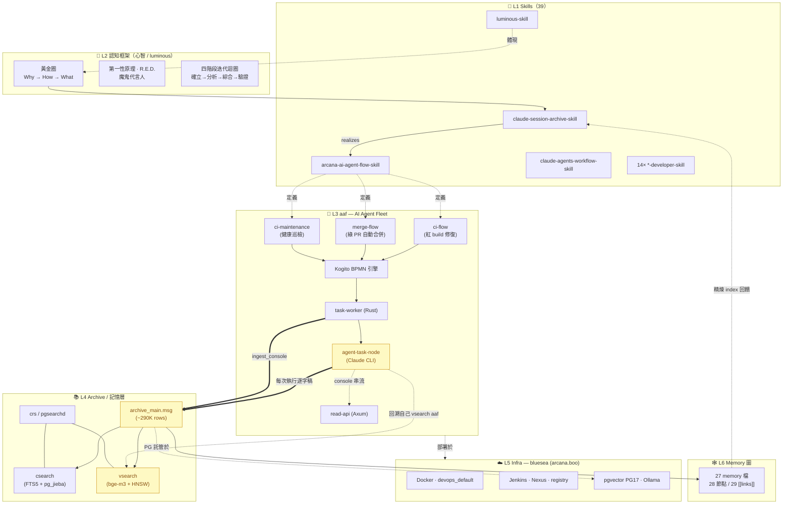

# 🜂 Arcana 元系統知識圖譜

> 由 `knowledge-graph-skill` 從 Claude session archive 自動抽取(project `ai` + `aaf` + arcana-skills repo + memory `[[links]]`)。這是「產生這些圖譜的那套系統」本身 —— 一個 **6 層自指(self-referential)元系統**。snapshot,非 live state。

```markmap
---
markmap:
  initialExpandLevel: 3
  colorFreezeLevel: 2
  maxWidth: 320
  spacingVertical: 6
---
# 🜂 Arcana 元系統
## 🧩 L1 Skills（39）
- 編排基礎
  - claude-session-archive-skill
  - arcana-ai-agent-flow-skill（**AAF**）
  - claude-agents-workflow-skill
- 開發框架 ×14（rust/go/angular/…）
- 認知/知識
  - luminous-skill
  - knowledge-graph-skill
## 🧠 L2 認知框架
- 黃金圈 Why→How→What
- 第一性原理 · R.E.D. · 魔鬼代言人
- 四階段迭代迴圈
## 🤖 L3 AAF（AI Agent Fleet）
- ci-flow：修紅 build（Triage→Fix×3→Decide）
- merge-flow：自動合綠 PR（Merge→Release）
- ci-maintenance：健康巡檢
- 引擎棧
  - Kogito BPMN
  - task-worker（Rust）
  - agent-task-node（Claude CLI）
  - read-api（Axum）
## 📚 L4 Archive 記憶層
- csearch（FTS5 + pg_jieba）
- vsearch（bge-m3 + HNSW）
- crs / pgsearchd
- archive_main.msg（~290K）
## ☁️ L5 Infra（bluesea / arcana.boo）
- Docker · Jenkins · Nexus
- pgvector PG17 · Ollama
## 🕸️ L6 Memory 圖
- 27 檔 · 28 節點 · 29 [[links]]
```

## 名詞:AAF 是什麼?

**AAF = arcana-ai-agent-flow** —— Arcana 的**自動化執行層**:一套 BPMN 驅動的 AI agent 工作流平台。

- **它做什麼**:Jenkins build 事件觸發 → 單一 **Kogito BPMN 引擎**跑對應流程 → 流程裡的「AI 節點」交給 **agent-task-node**(內含 Claude CLI)實際執行(診斷/修復/合併/巡檢)→ **read-api** 把過程即時呈現在 dashboard。
- **三條流程**:`ci-flow`(CI 紅 build 自動診斷+修復,修不了 park 給人)、`merge-flow`(fleet 綠 PR 自動 squash-merge + release-please 發版)、`ci-maintenance`(每 3600s 唯讀巡檢 + AI 健康分析)。
- **關鍵角色**:`task-worker`(Rust,把 BPMN 任務派給對的 agent)、`agent-task-node`(跑 headless Claude,逐字稿串流)。
- **為何重要(自指)**:每個 AI 節點的**完整對話逐字稿**會寫進 L4 archive(`project='aaf'`),下一輪 agent 再用 `vsearch ... aaf` 召回自己過去怎麼解的 —— 系統把自己的執行歷史變成可檢索的學習素材。

## 分層架構



> 🟡 黃色節點 = **自指迴圈**:agent 每次執行的完整逐字稿(含它自己的 `vsearch`)→ archive → 下一輪 agent 再 `vsearch` 召回 → 系統照鏡子、被動學習(不靠 fine-tune,只靠檢索)。

## 各層實體

### L1 Skills（39，分 4 群）
| 群 | 代表 skill | 角色 |
|---|---|---|
| AI-agent 編排基礎 | claude-session-archive-skill / arcana-ai-agent-flow-skill / claude-agents-workflow-skill / daily-ci-agent-skill | fleet 與記憶的底座 |
| 開發框架族（14） | arcana-{android,angular,go,rust,python,react,vue,nodejs,springboot,ios,esp32,stm32,harmonyos,windows}-developer-skill | 各語言工具鏈,受 arcana-devops-skill 調度 |
| 應用/規範 | app-requirements-skill / app-uiux-designer-skill / arch-qube-skill | IEC 62304 產規 → UI |
| 知識/認知 | luminous-skill / doc-indexer-skill / **knowledge-graph-skill** | 後設思維 + 知識組織 |

### L2 認知框架（心智 / luminous-skill）
| 概念節點 | 內容 |
|---|---|
| 黃金圈 | Why(目的) → How(過程) → What(產出) |
| 批判引擎 | 第一性原理解構 · R.E.D.(辨識-評估-導出) · 魔鬼代言人 |
| 東方對話 | 因明學(因果鏈) · 禪宗(大疑情) · 道家(反向/心齋) |
| 角色策略 | Architect(挑戰假設) → Engineer(優化流程) → Critic(防群體迷思) |

### L3 aaf — AI Agent Fleet
| 流程 | 觸發 | 節點序列 | AI 任務 |
|---|---|---|---|
| ci-flow | Jenkins 紅 build | Triage→Build→[Fix ⟲×3]→Decide→endGate(修不了 park humanFixTask) | /task/diagnose,fix,decide |
| merge-flow | fleet 綠 PR | Merge→Release→End(Release 決定論,無 AI) | /task/merge,release |
| ci-maintenance | 每 3600s cron | Scan→Analyze→Remediate→Verify(唯讀 probe) | /task/analyze |

引擎棧:單一 **Kogito BPMN**(Quarkus,2026-06 退掉 SonataFlow)· Data Index(PG CQRS + kafka)· **task-worker**(Rust,dispatch 9 task)· **agent-task-node**(Claude CLI,session 持久)· **read-api**(Axum 唯讀,bpmn-js)。

### L4 Archive / 記憶層
| 元件 | 模式 | 技術 |
|---|---|---|
| csearch | 詞彙 FTS(always on) | sqlite FTS5 / PG GIN + pg_jieba(v1.24 中文) |
| vsearch | 語義 KNN | bge-m3 1024d + HNSW cosine(hybrid RRF) |
| crs / pgsearchd | 5MB Rust binary / r2d2 pool | 本機 sqlite 或遠端 PG+pgvector |
| ingest | 每 15min | crs build 掃 JSONL;aaf 由 worker hook 逐字 INSERT |

### L5 Infra — bluesea
arcana.boo(Oracle Cloud aarch64, Rocky 9)· Docker `devops_default`(與 Jenkins/SonarQube/Prometheus/Grafana/Loki 同網)· 持久化 `/opt/arcana-state/*`、`/data/projects/*`· **Mac-first 開發**:Mac docker-compose 跑通 → `docker save→scp→load` 上 bluesea。

### L6 Memory 圖
27 檔 / 28 節點 / 29 `[[links]]`(稀疏 DAG)。最高入度:`aaf-green-pr-automerge`(4)。聚類:Green-PR 自動化 · CI 陷阱(buildx/renovate/kogito)· 嵌入式(esp32/harmonyos)· 身份(resume/job-search)。

## 跨層關係（圖的真正價值）
- **realizes**:L2 信念 → L1 skills → L3 fleet(認知框架被工具化、再被執行)
- **observes-via-archive**:L3 每個 AI-task → console → L4 archive(100% 可審計逐字稿)
- **self-referential**:agent `vsearch ... aaf` → 召回自己過去的推理(含人手動修法的思路)
- **gated-by-infra**:L3 部署、L4 PG 全託管於 L5 bluesea

## 覆蓋度 scorecard（archive/repo)
| 層 | 覆蓋 | 評分 |
|---|---|---|
| L1 Skills | 完整(39 目錄 + README) | 9/10 |
| L2 認知框架 | 完整(缺實踐案例追蹤) | 9/10 |
| L3 aaf | 完整(architecture.md + 6 memory) | 9.5/10 |
| L4 Archive | 完整(skill + crs source) | 8.5/10 |
| L5 Infra | 完整(bluesea runbook) | 8/10 |
| L6 Memory | 完整(純手作,缺自動 ontology) | 8.5/10 |
| **整體** | — | **8.6/10** |

> ⚠️ snapshot(2026-06);憑證/`.crs_pg_url`/密碼一律不入此圖。生成端在有 archive 存取處(Mac/agent),此頁為靜態產出。
