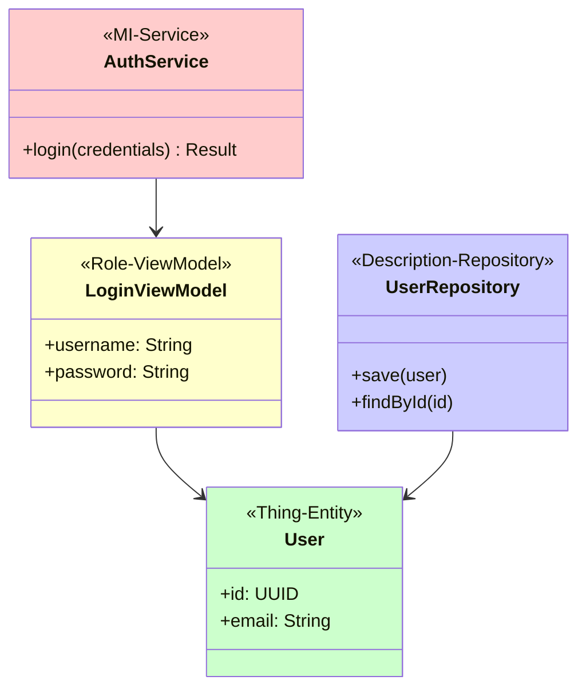
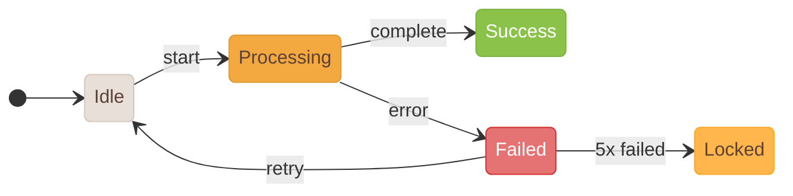

# Medical Device Software Requirements Gathering and Documentation Skill

This Skill provides comprehensive medical software development support: from requirements gathering, IEC 62304 document generation, to design asset management.

---

## 🧠 Psychology Auto-Application Workflow (Must Read Before Execution)

**When this Skill is triggered, the following steps must be automatically executed:**

### Step 1: Read Psychology Guides

```
Before any document operation, automatically read the following files:

📖 Design Psychology：
   cat ~/.claude/skills/medical-software-requirements-skill/references/design-psychology.md

📖 Cognitive Psychology：
   cat ~/.claude/skills/medical-software-requirements-skill/references/cognitive-psychology.md

📖 Document Layout Psychology：
   cat ~/.claude/skills/medical-software-requirements-skill/references/document-layout-psychology.md
```

### Step 2: Apply Psychology Based on Task Type

| Task Type | Design Psychology | Cognitive Psychology | Document Layout Psychology |
|---------|:----------:|:----------:|:--------------:|
| Generate/Modify SRS | ✅ | ✅ | ✅ |
| Generate/Modify SDD | ✅ | ✅ | ✅ |
| Generate/Modify SWD | - | ✅ | ✅ |
| Generate/Modify STP/STC | - | - | ✅ |
| Review/Audit Documents | ✅ | ✅ | ✅ |
| Generate DOCX | - | - | ✅ |

### Step 3: Output Psychology Compliance Report

After document operation is complete, output a brief psychology compliance review:

```markdown
## Psychology Compliance Review

### Design Psychology ✅/⚠️/❌
- [ ] Cognitive Load:...
- [ ] Progressive Disclosure:...
- [ ] Prerequisites:...

### Cognitive Psychology ✅/⚠️/❌
- [ ] Mental Model:...
- [ ] Working Memory Limit:...
- [ ] Error Prevention:...

### Document Layout Psychology ✅/⚠️/❌
- [ ] Reader Role Optimization:...
- [ ] ID Coding Consistency:...
- [ ] Trace Field Completeness:...
```

---

## Complete Workflow

```
[Phase 1: Requirements]    [Phase 2: Documents]    [Phase 3: Assets]    [Phase 4: UI/UX Psychology]   [Phase 5：Document Layout Psychology]
1. Project Vision ──┐  ┌→ SRS Requirements ──┐  ┌→ UI/UX Design Tools   ┌→ Cognitive Load Analysis      ┌→ Reader Role Analysis (SA/SD/PG/QA)
2. Stakeholder Analysis ┼→ ┼→ SDD Design Spec ──┼→ ┼→ UI/UX Screenshots → ┼→ Progressive Flow    ├→ F-pattern Layout
3. Functional Reqs ──┤  ├→ SWD Detailed Design ────┤  ├→ Icons/Images     ├→ Prerequisite Design      ├→ Visual Hierarchy
4. Non-Functional Reqs ┤  ├→ STP/STC Testing ────┤  ├→ App Icons        ├→ Dashboard Orientation    ├→ Cognitive Load Optimization
5. Safety Class Eval ──┘  ├→ SVV Verification ────┤  └→ Android/iOS     └→ User Flow Optimization    ├→ Section Structure Optimization
                     └→ RTM Traceability ────┘                                         └→ Table/Diagram Readability
```

> ### ⚠️ 100% Traceability Completeness Requirement
>
> **This Skill requires all document traceability must achieve 100%:**
>
> | Traceability Direction | Requirement |
> |---------|------|
> | SRS → SDD | 100% |
> | SRS → SWD | 100% |
> | SRS → STC | 100% |
> | SRS → UI (SCR) | 100% |
> | SDD → SWD | 100% |
> | SWD → STC | 100% |
>
> **RTM must show all traceability directions have reached 100%, otherwise the document is considered incomplete.**

> ### ⚠️ MD/DOCX Document Synchronization Requirement
>
> **All IEC 62304 documents must maintain both Markdown (.md) and Word (.docx) formats:**
>
> | Document | .md | .docx | Sync Rule |
> |------|-----|-------|---------|
> | SRS | ✓ | ✓ | When updating MD, must regenerate DOCX |
> | SDD | ✓ | ✓ | When updating MD, must regenerate DOCX |
> | SWD | ✓ | ✓ | When updating MD, must regenerate DOCX |
> | STP | ✓ | ✓ | When updating MD, must regenerate DOCX |
> | STC | ✓ | ✓ | When updating MD, must regenerate DOCX |
> | SVV | ✓ | ✓ | When updating MD, must regenerate DOCX |
> | RTM | ✓ | ✓ | When updating MD, must regenerate DOCX |
>
> **When checking document completeness, must simultaneously validate MD and DOCX existence and sync status.**
>
> **Sync check method:** Compare modification times of .md and .docx, regenerate .docx if .md is newer.

> ### ⚠️ UI Image Embedding SDD Requirement
>
> **SDD Document's UI/UX design section must directly embed UI design images, not just reference external links:**
>
> | Content Type | Requirement | Format |
> |---------|------|------|
> | UI Screen Design | Must embed image | **SVG** (Mandatory) or PNG |
> | Screen Flow Diagram | Must embed image | **SVG** (Mandatory) |
> | Interaction Description | Can include image annotations | **SVG** + Text Description |
> | State Transitions | Recommend embedding state diagrams | **SVG** (Mandatory) or PNG |
> | Mermaid Diagrams | Auto-render | **SVG** (Default) |
>
> **⚠️ Mandatory Specification: DOCX Image Format Must Prioritize SVG**
>
> **Image Specifications:**
> - **Format: SVG (Mandatory Priority)**, vector format ensures lossless scaling
> - Resolution: SVG is vector format, automatically adapts to any resolution
> - Fallback: Use PNG @2x/@3x only when SVG unavailable
> - Naming:`SCR-{Module}-{Number}-{Description}.svg` (Example: `SCR-AUTH-001-login.svg`)
> - Storage location:`02-design/SDD/images/` or `03-assets/ui-screens/`
>
> **SVG Advantages:**
> - ✅ Vector format, lossless scaling
> - ✅ Smaller file size, reduces DOCX file size
> - ✅ Can be edited later (draw.io/Inkscape/Figma)
> - ✅ Best print quality, suitable for IEC 62304 review documents
>
> **Markdown Embedding Syntax:**
> ```markdown
> 
> ```
>
> **During DOCX conversion, SVG images will be auto-embedded to ensure document independence and vector quality.**

> ### ⚠️ Mermaid Diagrams Adaptive Specification (Applies to all Diagrams)
>
> **All Mermaid diagrams must follow the "Adaptive Line-Breaking" principle to avoid excessive horizontal width causing small fonts or diagram compression.**
>
> #### Basic Rule: ASCII Art Diagrams Prohibited
>
> | Diagram Type | Correct Format | Prohibited Format |
> |---------|---------|---------|
> | Flowchart | Mermaid `flowchart` | ASCII Arrows `-->`, `├──`, `└──` |
> | Sequence Diagram | Mermaid `sequenceDiagram` | ASCII Timeline |
> | State Diagram | Mermaid `stateDiagram-v2` | ASCII State Boxes |
> | Class Diagram | Mermaid `classDiagram` | ASCII Class Boxes |
> | ER Diagram | Mermaid `erDiagram` | ASCII Relationship Lines |
> | Architecture Diagram | Mermaid `flowchart` / `C4Context` | ASCII Block Diagrams |
>
> #### Adaptive Line-Breaking Principles (Core Rules)
>
> | Principle | Description |
> |------|------|
> | **Node Quantity Limit** | Max 3-4 nodes per line, must break if exceeded |
> | **Vertical Priority** | Prioritize `flowchart TB` (Top-Bottom), avoid `LR` (Left-Right) |
> | **Layered subgraph** | Group related nodes with subgraph, each group on separate layer |
> | **Concise Text** | Node text should be brief (< 15 characters), detailed descriptions in tables |
> | **Block Connections** | Use `-->` to connect subgraphs instead of internal elements |
> | **Avoid Nesting** | Don't put all elements in single subgraph |
>
> #### Adaptive Guidelines by Diagram Type
>
> **1. Flowchart (flowchart) - ComponentStructure Diagram、Architecture Diagram**
>
> ~~~markdown
> ❌ Wrong: Excessive horizontal width (LR + multiple nodes)
> ```mermaid
> flowchart LR
>     A[AppBar] --> B[Counter] --> C[Animation] --> D[Progress] --> E[Segment] --> F[Hint] --> G[Character]
> ```
>
> ✅ Correct: Vertical layering + subgraph
> ```mermaid
> flowchart TB
>     subgraph Header["Header Section"]
>         A[AppBar<br/>Back+Title]
>     end
>
>     subgraph Content["Content Section"]
>         B[Counter<br/>Counter]
>         C[Animation<br/>Animation Component]
>     end
>
>     subgraph Progress["Progress Section"]
>         D[ProgressBar<br/>Overall Progress]
>         E[SegmentView<br/>Segment Progress]
>     end
>
>     subgraph Footer["Footer Section"]
>         F[HintText<br/>Hint Text]
>         G[Character<br/>Character Bubble]
>     end
>
>     Header --> Content
>     Content --> Progress
>     Progress --> Footer
> ```
> ~~~
>
> **2. Sequence Diagram (sequenceDiagram) - Interaction Flow**
>
> ~~~markdown
> ❌ Wrong: Too many participants spread horizontally
> ```mermaid
> sequenceDiagram
>     participant U as User
>     participant A as App
>     participant B as BLE
>     participant D as Device
>     participant S as Server
>     participant DB as Database
>     U->>A: Operation
>     A->>B: Connection
>     B->>D: Send
>     D->>S: Upload
>     S->>DB: Save
> ```
>
> ✅ Correct: Grouped box + simplified participants
> ```mermaid
> sequenceDiagram
>     box User Side
>         participant U as User
>         participant A as App
>     end
>     box Device Layer
>         participant D as Device
>     end
>     box Server Side
>         participant S as Server
>     end
>
>     U->>A: Operation
>     A->>D: BLE Connection
>     D->>S: Upload Data
>     S-->>A: Confirm
> ```
> ~~~
>
> **3. State Diagram (stateDiagram-v2) - Screen States**
>
> ~~~markdown
> ❌ Wrong: States arranged horizontally
> ```mermaid
> stateDiagram-v2
>     direction LR
>     [*] --> Idle --> Loading --> Playing --> Paused --> Completed --> [*]
> ```
>
> ✅ Correct: Vertical arrangement + grouping
> ```mermaid
> stateDiagram-v2
>     direction TB
>     [*] --> Idle
>
>     state "Initial Phase" as Init {
>         Idle --> Loading: Start
>     }
>
>     state "Execution Phase" as Running {
>         Loading --> Playing: Loading Complete
>         Playing --> Paused: Paused
>         Paused --> Playing: Resume
>     }
>
>     state "End Phase" as End {
>         Playing --> Completed: Complete
>         Completed --> [*]
>     }
> ```
> ~~~
>
> **4. Class Diagram (classDiagram) - Data Model**
>
> ~~~markdown
> ❌ Wrong: Classes arranged horizontally
> ```mermaid
> classDiagram
>     direction LR
>     User --> Profile
>     Profile --> Settings
>     Settings --> Preferences
>     Preferences --> Theme
> ```
>
> ✅ Correct: Vertical arrangement + namespace grouping
> ```mermaid
> classDiagram
>     direction TB
>     namespace User Module {
>         class User {
>             +id: String
>             +name: String
>         }
>         class Profile {
>             +avatar: URL
>         }
>     }
>     namespace Settings Module {
>         class Settings {
>             +theme: Theme
>         }
>         class Preferences {
>             +language: String
>         }
>     }
>     User --> Profile
>     Profile --> Settings
>     Settings --> Preferences
> ```
> ~~~
>
> **5. ER Diagram (erDiagram) - Database Relationships**
>
> ~~~markdown
> ✅ ER diagrams auto-adjust but need simplified fields
> ```mermaid
> erDiagram
>     USER ||--o{ SESSION : has
>     USER ||--o{ TRAINING : performs
>     SESSION ||--|{ TRAINING_DATA : Include
>
>     USER {
>         string id PK
>         string name
>     }
>     SESSION {
>         string id PK
>         date startTime
>     }
> ```
> ~~~
>
> #### Node Text Specifications
>
> | Situation | Recommendation |
> |------|------|
> | Node Label | Maximum 15 Chinese characters or 30 English characters |
> | Need line break | Use `<br/>` line break (Example: `A[Title<br/>Subtitle]`) |
> | Detailed Description | Node only shows ID, detailed descriptions use tables as supplement |
>
> ~~~markdown
> ✅ Recommended: Concise nodes + table supplement
> ```mermaid
> flowchart TB
>     A[SCR-TRAIN-001] --> B[SCR-TRAIN-002]
> ```
>
> | Screen ID | Screen Name | Description |
> |---------|---------|------|
> | SCR-TRAIN-001 | Training Home | Display training list and progress |
> | SCR-TRAIN-002 | Training In Progress | Real-time training screen |
> ~~~
>
> #### Exceptions
>
> - Simple bullet lists (`-`, `*`, `1.`）Can use
> - Tables use Markdown TablesSyntax（`| col |`）
> - Code BlockinOutputExamplesCan contain ASCII
>
> #### Reason
>
> - Vertical layering keeps diagrams narrow, fonts clear and readable in DOCX
> - **Mermaid Diagrams auto-render as SVG Embed DOCX** (Vector quality)
> - ASCII art diagrams cause alignment issues in DOCX due to font problems
> - **SVG Vector Format ensures lossless scaling，Appropriateclose IEC 62304 Review Document**

---

# Phase 1: Requirements Gathering

## Phase 1.1: Project Vision Interview

Collect core information for medical software project:

**Required Questions:**
1. What clinical problem does this medical software solve?
2. Who are the expected users? (Medical staff/Patients/Managers)
3. What medical setting will the software be used in? (Hospital/Clinic/Home)
4. What regulatory requirements exist? (TFDA/FDA/CE)
5. What harm could software failure cause? (For safety classification)
6. What are the expected benefits and success metrics?

**Output:** Project vision statement + Initial safety classification assessment

## Phase 1.2: Stakeholder Analysis

Medical software-specific stakeholders:

| Category | Role Examples | Focus Areas |
|------|----------|----------|
| Clinical Users | Physicians, Nurses, Technicians | Clinical workflow, Usability |
| Patients | End Users | Privacy, Safety, Accessibility |
| Managers | Hospital IT, Supervisors | Integration, Reports, Cost |
| Regulatory | QA、RA | IEC 62304 Compliance, Traceability |
| Technical Team | Development, Operations | Maintainability, Security |

## Phase 1.3: Functional Requirements Collection

Use FURPS+ Model，with medical-specific considerations：

**F - Functionality**
- Clinical functions: Diagnosis, Monitoring, Treatment support
- Data management: Medical records, Test Results, Orders
- Safety functions: Alerts, Interlocks, Dosage checks

**U - Usability**
- Clinical EnvironmentSuitability (Glove Operation、Emergency Situation)
- Accessibility requirements (Visual impairment, Hearing impairment)
- Multi-language support

**R - Reliability**
- Critical function availability targets
- Data integrity
- Error handling and recovery

**P - Performance**
- response time in clinical scenariosRequirement
- Large data processing capability

**S - Supportability**
- Maintainability and update mechanisms
- Audit Log Requirements

**+ Medical-Specific Considerations**
- Interoperability (HL7 FHIR, DICOM)
- Privacy protection (Personal Data Protection Law, HIPAA)
- Cybersecurity (Medical Device Cybersecurity)

## Phase 1.4: Non-Functional Requirements Analysis

Detailed medical NFR checklist see [references/medical-nfr-checklist.md](references/medical-nfr-checklist.md)

## Phase 1.5: Software Safety Classification Assessment

According to IEC 62304, assess potential harm from software failure:

| Classification | Harm Level | Examples | DocumentRequirement |
|-----|---------|------|---------|
| Class A | No harm | Administrative software | Basic |
| Class B | Possible non-serious injury | General monitoring software | Complete |
| Class C | MayCausedeathor serious injury | Diagnostic/Therapeutic software | Most Stringent |

**Safety Classification Decision Tree：**
```
Could software failure directlyor indirectly cause harm？
├── No → Class A
└── Yes → Could the injury be serious?
         ├── No → Class B
         └── Is → Class C
```

---

# Phase 2：DocumentOutput

## ID Numbering System

AllHaveDocument ItemsUseUnified's ID NumberingFormat，ensure **100% Traceability**：

| Document Type | ID Prefix | Format Examples | Traceability Requirement |
|---------|--------|---------|---------|
| Software RequirementsSpecification | SRS | SRS-{MODULE}-001 | Source：UserRequirement |
| Software DesignSpecification | SDD | SDD-{MODULE}-001 | **Must correspond to SRS (100%)** |
| softwareDetailed Design | SWD | SWD-{MODULE}-001 | **Must correspond to SDD (100%)** |
| ScreenDesign | SCR | SCR-{MODULE}-001 | **Must correspond to SRS (100%)** |
| softwareTest Plan | STP | STP-001 | Cover all requirements |
| softwareTest Cases | STC | STC-{MODULE}-001 | **Must correspond to SRS (100%)** |
| Verification & Validation | SVV | SVV-001 | Consolidate all Verification Results |

**ID Rules:**
- Format: `[Prefix]-[Module]-[three-digit number]` (Example: `SRS-AUTH-001`, `SDD-TRAIN-002`)
- Sub-items: `SRS-AUTH-001.1`, `SRS-AUTH-001.2`
- Cross-Document Reference: Use Complete ID
- **Each SRS item must have corresponding SDD, SWD, STC, SCR (UI) items**

**Module Code Examples：**
- AUTH: Authentication Module
- ONBOARD: Onboarding flow
- TRAIN: Training Function
- REPORT: Report Function
- DEVICE: DeviceConnection
- REWARD: Reward System
- SETTING: Settings Function
- NFR: Non-Functional Requirements

## Unified Document Format Specification

> ### ⚠️ AllHave IEC 62304 Documents must use unified format
>
> AllHaveDocument (SRS/SDD/SWD/STP/STC/SVV/RTM) MustUse same cover and Revision History Format，Ensure document consistency。

### Standard Cover Format

AllHaveDocument's Markdown cover must use the following format：

```markdown
# {Document Title}
## For {Project Name}

Version {X.X}
Prepared by {Author}
{Organization}
{Date}

## Table of Contents
<!-- TOC -->
* [1. Introduction](#1-introduction)
* [2. ...](#2-...)
<!-- TOC -->

## Revision History

| Name | Date | Reason For Changes | Version |
|------|------|--------------------|---------|
|      |      |                    |         |

---
```

**Standard Title for Each Document：**

| Document | Title |
|------|------|
| SRS | `# Software Requirements Specification` |
| SDD | `# Software Design Description` |
| SWD | `# Software Detailed Design` |
| STP | `# Software Test Plan` |
| STC | `# Software Test Cases` |
| SVV | `# Software Verification & Validation Report` |
| RTM | `# Requirements Traceability Matrix` |

### Revision History Format

**Unified Field Order:**

| Name | Date | Reason For Changes | Version |
|------|------|--------------------|---------|

**Prohibited Old Formats：**
- ❌ `| Version | Date | Changes | Author |`
- ❌ `| Version | Date | Author | Change Description |`
- ❌ Table Format Cover（Document Informationrmation Tables）
- ❌ `## Directory (Details)` or any duplicateDirectory Block
- ❌ `## 1. Document Informationrmation` Table Format Document Informationrmation Block

### Mandatory Format Elements (Mandatory Format Elements)

> **Important：** AllHaveDocumentmust strictly follow the following format，Cannot omitorChange order：

1. **Standard Cover** - Must include：
   - H1 Title (`# {Document Title}`)
   - H2 project name (`## For {Project Name}`)
   - Version information (Version X.X)
   - Author (Prepared by)
   - Organization name
   - Date (YYYY-MM-DD)

2. **Table of Contents** - Must:
   - Use `## Table of Contents` Title
   - Use `<!-- TOC -->` markers to surround
   - List all main sections

3. **Revision History** - Must:
   - Use `## Revision History` Title
   - Field order:`Name | Date | Reason For Changes | Version`
   - UseSeparator lines `---` End block

4. **Body Sections** - Start from `## 1. Introduction` or `## 1. Introduction` Start

### Internal Font Settings

DOCX output font settings:

| Character Type | Font |
|---------|------|
| English/Half-width (ascii) | Arial |
| Chinese/Full-width (eastAsia) | PingFang TC |
| Title | Arial + PingFang TC (Mixed) |
| Code | Consolas |

### Code BlockFormattransform

DOCX output code blocks have the following features:

| Function | Description |
|------|------|
| **Line Numbers** | Show line numbers on left for easy code location |
| **Zebra Striped Background** | Odd rows white (FFFFFF)，Even rows light gray (F5F5F5) |
| **Fixed Line Height** | 14pt Line height, ensure neat alignment |
| **Syntax Highlighting** | Based on VSCode Light+ Color scheme |
| **Fixed Table Layout** | Use `layout: fixed` Prevent column width readjustment |
| **Explicit Column Width** | Line number column 720 DXA，Code column 8640 DXA |
| **Text Direction Lock** | `textDirection: lrTb` Ensure horizontal text flow |

> **⚠️ Google Drive Edit Compatibility Note**
>
> When DOCX is edited directly in Google Drive, code blocks may display vertically.
> This is due to Google Docs compatibility limitations with Word table formats.
>
> **Solutions:**
> 1. Use the latest `md-to-docx.js` to regenerate DOCX (fixed table layout added)
> 2. Download DOCX and use Microsoft Word to edit, avoid using Google Docs
> 3. If online collaboration is needed, edit MD files and reconvert

#### SyntaxhighlightingcolorStandard (VSCode Light+ Theme)

| Token Type | Color | Examples |
|-----------|------|------|
| Keywords | `#0000FF` Blue | `class`, `func`, `if`, `return` |
| Strings | `#A31515` Dark red | `"Hello"`, `'text'` |
| Comments | `#008000` Green | `// comment`, `/* block */` |
| Numbers | `#098658` Dark cyan | `123`, `3.14` |
| Types | `#267F99` Cyan blue | `String`, `Int`, `Bool` |
| Decorators | `#AF00DB` Purple | `@State`, `@Published` |
| Default (default) | `#000000` Black | Other identifiers |

#### Support'sProgramLanguage

- Swift / Kotlin / Java (Mobile)
- Python / JavaScript / TypeScript (Backend/Frontend)
- HTML / CSS / SQL

### Class Diagram ColorStandard (Peter Coad Color UML)

Mermaid Class Diagram Use **Peter Coad four-colorarchetype** performvisualClassification：

| Archetype | Color | Purpose | Mermaid Style |
|-----------|------|------|---------------|
| **MI (Moment-Interval)** | Pink `#FFCCCC` | Service, UseCase, Transaction | `style XXXService fill:#FFCCCC` |
| **Role** | Yellow `#FFFFCC` | ViewModel, Presenter, Controller | `style XXXViewModel fill:#FFFFCC` |
| **Thing (Party/Place/Thing)** | Green `#CCFFCC` | Entity、Model、Domain Object | `style XXXEntity fill:#CCFFCC` |
| **Description** | Blue `#CCCCFF` | Repository、DTO、Configuration | `style XXXRepository fill:#CCCCFF` |

#### Class Diagram coloringExamples



### State Machine ColorStandard

Mermaid State Diagram uses the following color standards to classify State Types:

| State Type | Color | Hex Code | Text Color | Purpose |
|---------|------|----------|--------|------|
| **Initial/Inactive** | Warm beige gray | `#E8E0D8` | `#5D4037` | Not yet started status (Idle, Disconnected) |
| **Processing/In Progress** | Warm golden yellow | `#F4A940` | `#5D4037` | Currently in progress/transition status (Processing, Scanning) |
| **Success/Complete** | Grass green | `#8BC34A` | `#fff` | SuccessComplete'sStatus (Authenticated, Connected) |
| **Error/Failed** | Warm coral | `#E57373` | `#fff` | Error states (Failed, Error) |
| **Warning/Locked** | Amber yellow | `#FFB74D` | `#5D4037` | Warning states requiring attention (Locked, Timeout) |

#### State Machine coloringExamples



### C4 Model Architecture DiagramColorStandard

Context View、Container View etcArchitecture DiagramUse **Warm color scheme** (Warm and friendly style)：

| Element Type | Color | Hex Code | Text Color | Purpose |
|---------|------|----------|--------|------|
| **Person** | Deep brown orange | `#A1664A` | `#fff` | User、Role |
| **Software System** | Orange | `#E67E22` | `#fff` | Main system (currently developing) |
| **Container** | Warm golden yellow | `#F4A940` | `#5D4037` | App、Database、Server |
| **Component** | Light apricot | `#FDEBD0` | `#5D4037` | Internal components |
| **External System** | Warm gray brown | `#8D7B6B` | `#fff` | External systems, Third-party services |

---

## SDD StandardScreenFlowSpecification

> ### ⚠️ Important: SDD module design must follow standard screen flow
>
> AllHave SDD Document'sModuledesign section must follow**industryStandard App NavigationFlow**Organization，
> ensuring developers can read and implement in logical order.

### Design PsychologyPrinciple (Design Psychology)

> ### ⚠️ UI/UX DesignMustfollowDesign PsychologyPrinciple
>
> AllHaveScreenFlow design must considerUserpsychologicalfactors，ensuregood'sUseexperience。

#### coreDesign PsychologyPrinciple

| Principle | Description | Application Scenario |
|------|------|---------|
| **Cognitive Load Theory** | Avoid presenting too much information at once, reduce user cognitive burden | Dashboard design, Function layering |
| **Progressive Disclosure** | Gradually guide users deeper, not showing all functions at once | Login→Overview→Select Function→Operation |
| **Spatial Orientation** | letUserknow「Where am I」、「CangoWhere」 | Navigation design, Dashboard mental map |
| **Fitts' Law** | Larger and closer targets are easier to click | Button size, Touch area design |
| **Hick's Law** | More options, longer decision time | OptionsClassification、reducedecisionfatigue |
| **Achievement Psychology** | Progress visualization enhances motivation | Gamification, Progress bars, Badge system |

#### FlowDesign PsychologyCheckList

When designing App flow, must answer the following questions:

| Phase | Psychology Question | Design Response |
|------|-----------|---------|
| After Login | UserNeed「bufferSection」CreatepsychologicalModel | Must have Dashboard, cannot jump directly to function modules |
| Main Screen | Users want to know "where am I, what's completed, what's next" | Dashboard shows progress, status, next step guidance |
| Function Entry | UserNeedknow「Prerequisites」IsNosatisfied | CheckdeviceConnection、Permissionstate before allowing entry |
| Before Training | User may be frustrated due to device not connecting | Device pairing must be before training function |
| CompleteAfter | Useneed positive feedback to reinforce behavior | Success animation, Rewards, Encouragement messages |

#### Prerequisite Designpattern

> **Important:** Functions with hardware dependencies must design prerequisite check mechanisms.

```
When entering function module:
├── Check necessary prerequisites
│   ├── Conditions met → Allow entry
│   └── Conditions not met → Guide to settings page
│       ├── Show friendly hint message
│       ├── Provide "Go to Settings" button
│       └── CompleteSettingsAfterAutoreturnreturn
```

**Examples：trainingModulePrerequisites**

| Training Type | Prerequisites | Handle When Not Met |
|---------|---------|-------------|
| Airtight Training | iNAP DevicealreadyConnection | Hint「pleaseFirstconnect iNAP Device」→ GuideToDevicepairing |
| DeviceInteractiontraining | Training device paired | Prompt "Please pair training device first" → Guide to device settings |
| Tutorial Videos | No hardware required | Allow offline viewing |
| Muscle Function Training | No hardware required | Allow some independent usage |

---

### Cognitive PsychologyPrinciple (Cognitive Psychology)

> ### ⚠️ UI/UX DesignMustfollowCognitive PsychologyPrinciple
>
> Cognitive PsychologyStudy how humans perceive、attention、Memory、thinkandlearning。
> Good UI design must align with how human cognition works.

#### coreCognitive PsychologyPrinciple

| Principle | Description | Application Scenario |
|------|------|---------|
| **Mental Model** (Mental Model) | User's mental expectation of system operation | Design aligned with user's expected interaction methods |
| **Attention** (Attention) | User can process limited information at the same time | Highlight important information, reduce interference |
| **Working Memory** (Working Memory) | Short-term memory capacity approximately 4±1 items | Steps not exceeding 4-5, reducing memory burden |
| **Long-term Memory** (Long-term Memory) | Strengthen memory through repetition and association | ConsistencyDesign、Canidentify'sIcon |
| **Perception** (Perception) | How humans interpret visual information | Gestalt Principle, visual hierarchy |
| **Affordance** (Affordance) | Object suggests its usage method | Button looks like it can be clicked |
| **Signifier** (Signifier) | Explicit instruction on how to operate | Icon, Label, Hint Text |

#### PerceptionandGestaltPrinciple (Gestalt Principles)

| Principle | Description | UI ShouldUse |
|------|------|---------|
| **Proximity** (Proximity) | Elements close together are viewed as a group | Related buttons placed together |
| **Similarity** (Similarity) | Elements with similar appearance are viewed as a group | Same category functions use same style |
| **continuity** (Continuity) | Eye movement follows lines or curves | Layout design guiding eye movement |
| **closure** (Closure) | Brain automatically completes inComplete'sshape | simplifyIconDesign |
| **Figure-Ground** (Figure-Ground) | Distinguish foreground and background | Dialog and mask layer |
| **common fate** (Common Fate) | Elements moving in the same direction are viewed as a group | AnimationDesign |

#### Memory and Learning Design

**Working Memory Limitation (Miller's Law: 7±2 → Current research: 4±1)**

| DesignItems | Recommendationquantity | Reason |
|---------|---------|------|
| Navigation Tab quantity | 4-5 piece | ExceedWilladdSelectdifficulty |
| Form Fields Group | Every group 3-4 fields | Reduce cognitive load |
| Steps Flow | Maximum 5 steps | Avoid forgetting progress |
| DropdownOptions | 7 pieceWithinside | ExceedNeedClassificationorSearch |

**Long-term MemoryreinforceDesign**

| policySlightly | Description | Examples |
|------|------|------|
| **Consistency** | SameFunctionSameappearance | AllHave「Save」ButtonallIsBlue |
| **metaphor** | Usefamiliar'sconceptual | trash canIconreplaceTableDelete |
| **chunking** (Chunking) | Organize information into meaningful groups | Phone numbers displayed in segments |
| **Repeated exposure** | Important functions appear multiple times | Frequently used functions placed at multiple entry points |

#### Affordance and Signifier Design (Norman's Design Principles)

| Principle | Description | good'sDesign | difference'sDesign |
|------|------|---------|---------|
| **Affordance** | What the object suggests can be done | raised'sButtonsuggestCanpress | flatTextNonemethodidentifyIsNoCanA bit |
| **Signifier** | Explicit instruction on how to operate | Button has icon + text | Only has mysterious icon |
| **Mapping** | Correspondence between control and result | Swipe up to move content up | Counter-intuitive operation |
| **Feedback** | Immediate feedback after operation | Has animation/sound after click | Click has no feedback |
| **conceptualModel** | Systemoperation'sexplain | Progress BarShowetcstayin | NoneStatusinstruction |
| **Constraint** | Prevent error operation | Disabled invalid options | Allow invalid operation then show error |

#### Error PreventionandProcess

| Principle | Description | Implementationway |
|------|------|---------|
| **preventionwinIntreatment** | Design to prevent errors from occurring | Disable invalid buttons, limit input format |
| **Confirm Important Operation** | Confirm before irreversible operations | Show confirm dialog before delete |
| **Allow Undo** | Provide undo function | Undoable delete (soft delete) |
| **Friendly Error Message** | Describe problem and solution method | "Password needs to include numbers and characters" rather than "Format Error" |
| **i.e.TimeValidate** | inputTimei.e.TimeCheck | input Email Timei.e.TimeValidateFormat |

#### Reading Psychology (Reading Psychology)

> **Medical software particularly important：** Critical information must be easy to read, avoid misreading causing medical errors。

| Principle | Description | Implementationway |
|------|------|---------|
| **F typeReading Mode** | Users tend to start from upper left, scanning in F-pattern | Place important information in upper left |
| **Visual Hierarchy** | Create hierarchy through size, color, spacing | Title large, content medium, description small |
| **Line Length Limit** | 45-75 characters per line most readable | Limit text block width |
| **Line Height** | Line height approximately 1.4-1.6 times font size | Avoid lines too close together |
| **Contrast Ratio** | Text and background contrast ratio at least 4.5:1 | WCAG AA Standard |
| **Font Selection** | Sans-serif fonts are easier to read on screen | iOS: SF Pro, Android: Roboto |

**countCharactersandunitShow**

| Scenario | RecommendationFormat | Reason |
|------|---------|------|
| Large Numbers | 1,234,567 | Thousands separator for readability |
| Time | 7h 32m | Clear units |
| Percentage | 85% | Clear symbol |
| Medical Values | 98.6°F / 37°C | MustShowunit |

#### Cognitive PsychologyCheckList

existreview UI DesignTime，MustConfirm：

| CheckCategory | CheckItems | Pass Criteria |
|---------|---------|---------|
| **Mental Model** | OperationwayalignUserexpected？ | NoneNeedDescriptioni.e.CanUnderstand |
| **Attention** | Is important information highlighted enough? | Can find critical information within 3 seconds |
| **Memory Load** | Is the number of steps reasonable? | Single flow no more than 5 steps |
| **Perception** | Are visual groups clear? | Related elements clearly grouped |
| **Affordance** | Are interactive elements obvious? | Button looks like it can be clicked |
| **Feedback** | Do all operations have feedback? | Click has visual/tactile feedback |
| **Error Prevention** | Has error-proof design? | Invalid operations are disabled |
| **Readability** | Is text easy to read? | Contrast ratio ≥ 4.5:1 |

---

### techniqueDocument Layout Psychology (Document Layout Psychology)

> ### ⚠️ AllHavetechniqueDocumentMustfollowDocument Layout PsychologyPrinciple
>
> IEC 62304 Document (SRS/SDD/SWD/STP/STC/SVV/RTM) 's writing and layout must consider different readersRole'sreadingRequirement，
> Ensure documents are easy to read, understand and use, improving development efficiency。

#### Reader Role Analysis (Reader Role Analysis)

NotsameRolereadingtechniqueDocument have different needs and focus points：

| Role | Abbreviation | Reading Purpose | Main Focus Sections | Reading Mode |
|------|------|---------|-------------|---------|
| **System Analyst** | SA | Understand requirement sources, acceptance criteria | SRS full text、RTM | Comprehensive reading |
| **SystemDesigner** | SD | UnderstandArchitecture、Design Patterns | SRS Requirement、SDD Architecture | structuretransformreading |
| **Programmer** | PG | Implementation details, API specifications | SDD Detailed Design、SWD | Jump-style reference |
| **Quality Engineer** | QA | Test Cases, Validation Method | SRS AC, STC, SVV | Traceability-style reading |
| **Regulatory Specialist** | RA | Traceability Completeness, compliance evidence | RTM, SVV | Audit-style check |

#### DocumentreadingFlowDesign (Document Reading Flow)

```
Reader's mental model when reading technical documents:

SRS Requirements                 SDD Design Spec                 SWD Detailed Design
┌─────────────┐              ┌─────────────┐              ┌─────────────┐
│ 1. OverviewSummary  │              │ 1. ArchitectureOverview  │              │ 1. ModuleOverview  │
│    ↓        │              │    ↓        │              │    ↓        │
│ 2. ModuleList  │  ───────→    │ 2. ModuleDesign  │  ───────→    │ 2. CategoryDesign  │
│    ↓        │  (SD Need     │    ↓        │  (PG Need    │    ↓        │
│ 3. Detailed Requirements  │   Architecture context) │ 3. Interface Design  │   Implementation details)  │ 3. Method details  │
│    ↓        │              │    ↓        │              │    ↓        │
│ 4. Traceability Info  │              │ 4. Data Design  │              │ 4. Algorithm method    │
└─────────────┘              └─────────────┘              └─────────────┘
      │                            │                            │
      └────────────────────────────┴────────────────────────────┘
                                   │
                                   ▼
                            RTM Traceability
                        (RA/QA AuditValidate)
```

#### Document LayoutcorePrinciple

| Principle | Description | Implementationway |
|------|------|---------|
| **F-Pattern Layout** | Place important information in upper left | Requirement ID, Module Name at beginning of line |
| **Visual Hierarchy** | Title size distinguishes levels | H1 > H2 > H3 explicit hierarchy |
| **Chunking Presentation** | Group related information | Tables, text blocks, separator lines |
| **Progressive Disclosure** | Overview first, details later | Each chapter starts with summary table, then detailed sections |
| **Consistency** | Unified format and terminology | ID encoding, field order consistent |
| **Scannability** | Support quick search | Tables、List、Bold key characters |

#### SRS Document LayoutGuide

**structureDesignPrinciple：**

| Section | Reader Focus | Arrangement Technique |
|------|---------|---------|
| **1. Introduction** | SA/SD/RA | 2-3 page overview, create overall mental model |
| **2. Overall Description** | SA/SD | Context diagram, user role table |
| **3. Functional Requirements** | SD/PG | Module → Requirement Items → AC, progressive reveal |
| **4. Non-Functional Requirements** | SD/QA | Tables format, measurable metrics |

**RequirementItemsarrange：**

```markdown
##### REQ-XXX-001 RequirementName

**Statement:** [One sentence description, not exceeding 50 characters]

**Rationale:**
- [psychology/techniqueReason 1]
- [psychology/techniqueReason 2]

**Acceptance Criteria:**
- AC1: When [condition], [action], and [expected results] - [Design basis]
- AC2: ...

**Verification Method:** Test | Inspection | Demonstration | Analysis
```

**Rationale psychologyannotationFormat：**

Requirement's Rationale ShouldIncludepsychologyAccording to（IfAppropriateUse）：

| Rationale Type | Annotation Format | Examples |
|---------------|---------|------|
| Cognitive Load | **Cognitive Load Theory**: ... | Dashboard Chunking to reduce cognitive load |
| Memory Limitation | **Working Memory Limitation**: ... | Steps not exceed 5 steps |
| Visual Perception | **F-pattern Reading**: ... | Important information placed in upper left |
| Usability | **Fitts' Law**: ... | Button size ≥44pt |
| Decision Optimization | **Hick's Law**: ... | Options ≤5 items |
| Error Prevention | **Error Prevention**: ... | Prerequisites Check |

#### SDD Document Layout Guide

**Structure Design Principles:**

| Section | Reader Focus | Arrangement Technique |
|------|---------|---------|
| **1. Introduction** | SD | Design Principles, Architecture Overview |
| **2. System Architecture** | SD/PG | Layered Architecture Diagram, Technology Selection Table |
| **3. Module Design** | PG | Each Module: Overview Table → Architecture → Screen |
| **4. Data Design** | PG | ER Diagram, Entity definition |
| **5. Interface Design** | PG | API specification、UI Screen |

**Moduleinternalarrange：**

```markdown
### 3.X Module Name (MODULE_CODE)

| Design ID | Name | CorrespondingRequirement | CorrespondingScreen | Description |
|---------|------|---------|----------|------|
| SDD-XXX-001 | ... | REQ-XXX-001 | SCR-XXX-001 | ... |

← First present overview table, let reader create mental model

#### 3.X.1 ModuleArchitecture Design
← ThenExpandArchitecturedetails (SD/PG Need)

#### 3.X.2 ScreenDesign：SCR-XXX-001
← MostAfterDetailsScreen (PG Need)
```

#### SWD Document LayoutGuide

**PG readingOptimization：**

| Arrangement Technique | Description | Examples |
|---------|------|------|
| **Category Overview Table** | Each module first lists all categories | Category name, responsibility, dependency |
| **Method Signature Priority** | First present API, then describe logic | `func login() -> Result` |
| **Code Block** | Key algorithms directly display | Pseudocode or actual code |
| **Sequence Diagram** | Complex flow use diagram description | Mermaid sequence diagram |

#### TablesDesignReadability

**TablesarrangePrinciple：**

| Principle | Description | Implementation |
|------|------|------|
| **Field Order** | ID → Name → Details → Traceability | Align reading habits |
| **Column Width Ratio** | ID narrow, Description wide | Content decides column width |
| **Table Header Bold** | Distinguish table header and content | Markdown `**Bold**` |
| **Zebra Stripes** | Large tables alternate background color | DOCX Style Settings |
| **Not exceed 7 fields** | Avoid horizontal scrolling | Split or simplify |

**ID FieldsNotLine breakrules：**

```markdown
<!-- correct：ID maintainsimplerows -->
| SRS-AUTH-001 | UserLoginFunction，Support Email、Google、Apple Loginway |

<!-- Error: ID truncated -->
| SRS-AUTH- | UserLoginFunction |
| 001       |               |
```

#### DiagramsReadability

**Mermaid Diagramsarrange：**

| Diagram Type | DirectionRecommendation | Reason |
|---------|---------|------|
| Flowchart | TB (upTolower) | alignreadingDirection |
| Sequence Diagram | Group box | Reduce participant quantity |
| State Diagram | TB + Group | Avoid horizontal direction too wide |
| Class Diagram | TB + namespace | logicalGroup |

**Diagramssizecontrol：**

```markdown
<!-- UI Wireframe (block-beta)：narrowWidth -->
Maximum width: 500px (Appropriate for mobile screen)

<!-- otherDiagrams：StandardWidth -->
MostlargeWidth: 1200px (Appropriateclose A4 print)
```

#### Document LayoutCheckList

| CheckCategory | CheckItems | Pass Criteria |
|---------|---------|---------|
| **structure** | each chapterHaveOverviewTable？ | Overview first, details later |
| **Level** | TitleLevelcorrect？ | H1→H2→H3 deliveradvance |
| **ID** | ID NotLine break？ | simplerowsShow |
| **Tables** | Is field order reasonable? | ID in first column |
| **Diagrams** | DiagramsDirectioncorrect？ | TB Priority |
| **Traceability** | Traceability ID CanClick？ | SupportsuperLink |
| **Terminology** | Terminology consistent? | Unified vocabulary |
| **Format** | MD/DOCX Synchronized? | Timestamp check |

---

### Standard App NavigationFlowArchitecture

```
┌─────────────────────────────────────────────────────────────────┐
│                    Standard App NavigationFlow                              │
├─────────────────────────────────────────────────────────────────┤
│                                                                 │
│  1. Splash Screen (StartScreen)                                     │
│         │                                                       │
│         ▼                                                       │
│  2. AuthenticateCheck ─────┬─── alreadyLogin ──────► directlyenter Dashboard          │
│         │        │                                              │
│         │        └─── notLogin ──────► Login Screen                    │
│         │                            ├─ Register                    │
│         │                            ├─ Forgot password                │
│         │                            └─ Social login(Google/Apple)  │
│         │                                                       │
│         ▼                                                       │
│  3. First timeUseCheck ───┬─── First time ──────► Onboarding flow            │
│         │          │                 (3-6 pieceGuideScreen)            │
│         │          │                                            │
│         │          └─── NotFirst time ────► Dashboard (mainpage)            │
│         │                                                       │
│         ▼                                                       │
│  4. Dashboard (main page/home page)                                        │
│         │                                                       │
│         ▼                                                       │
│  5. Tab Navigation (bottomNavigation)                                    │
│     ┌──────┬──────┬──────┬──────┬──────┐                        │
│     │ Home │ Tab2 │ Tab3 │ Tab4 │Setting│                       │
│     └──────┴──────┴──────┴──────┴──────┘                        │
│                                                                 │
└─────────────────────────────────────────────────────────────────┘
```

### SDD Moduledesign section order specification

Module design section must follow the following order organization, aligned with App actual navigation flow and **Design Psychology Principle**:

| Order | Module | MandatoryScreen | Description | psychologyAccording to |
|------|------|---------|------|-----------|
| 1 | **AUTH (Authenticate)** | Login → Register → Forgot Password → Social Login → Profile Selection | First step of app entry | Create sense of security |
| 2 | **ONBOARD (Guide)** | Welcome → Feature Introduction → Settings Guide → Complete | First-time user onboarding flow | Progressive Disclosure |
| 3 | **DASHBOARD (Main Screen)** | Status Overview → Progress → Today's Tasks → Navigation Entry | **Psychological buffer section, creates orientation** | Cognitive Load、Spatial Orientation |
| 4 | **DEVICE (Device)** | Device List→Connection→Pairing→Status | **Must be completed before training** | Prerequisite Design |
| 5 | **Core Function Module** (such as TRAIN) | Prerequisites Check→Function Flow | Main business function | Hardware dependency design |
| 6 | **REPORT (Report)** | Data Overview → Detailed Reports → Export | Data presentation | Achievement psychology design |
| 7 | **REWARD (Reward)** | Achievements → Badges → Collection | Gamification elements (when appropriate) | Achievement psychology design |
| 8 | **SETTING (Settings)** | Profile→Notification→Language→Logout | Always placed at the end | Hick's Law |
| 9 | **PLATFORM (Cloud Platform)** | Backend Service Design | Not App UI, place last | - |

> **⚠️ ImportantOrderPrinciple：**
> 1. **Dashboard must appear immediately after authentication** - Acts as psychological buffer section, cannot skip
> 2. **Device module must exist before training module** - Hardware dependency function's prerequisites
> 3. **Settings module always placed at the end** - Align with user psychological expectation

### ModuleinternalstructureSpecification

Each module must follow the following order to organize subsections:

```markdown
### 3.X Module Name (MODULE_CODE)

| Design ID | Name | CorrespondingRequirement | CorrespondingScreen | Description |
|---------|------|---------|----------|------|
| SDD-XXX-001 | ... | SRS-XXX-001 | SCR-XXX-001 | ... |

#### 3.X.1 Module Architecture Design
- State Machine (State Machine)
- Service Interface (Service Interface)
- Data Flow (Data Flow)

#### 3.X.2 Screen Design: SCR-XXX-001 First Screen
- Screen Property Table
- Wireframe (Mermaid block-beta)
- Interaction Behavior Table

#### 3.X.3 Screen Design: SCR-XXX-002 Second Screen
...
```

### AUTH ModuleStandardstructure (Examples)

```markdown
### 3.1 Authentication Module (AUTH)

#### 3.1.1 Authentication Service Architecture Design
- Authentication Flow State Machine
- Authentication Service Interface (AuthService)

#### 3.1.2 Screen Design: SCR-AUTH-001 Login Screen
#### 3.1.3 Screen Design: SCR-AUTH-002 Register Screen
#### 3.1.4 Screen Design: SCR-AUTH-003 Forgot Password
#### 3.1.5 Social Login Integration Design
#### 3.1.6 Child Profile Management Design (if appropriate)
#### 3.1.7 Screen Design: SCR-AUTH-004 Profile Select
#### 3.1.8 Screen Design: SCR-AUTH-005 Profile Edit
```

### ScreenDesignsectionsStandardFormat

```markdown
#### 3.X.N ScreenDesign：SCR-XXX-NNN Screen Name

| Items | Content |
|------|------|
| Screen ID | SCR-XXX-NNN |
| CorrespondingDesign | SDD-XXX-NNN |
| CorrespondingRequirement | SRS-XXX-NNN |

**Wireframe**

\`\`\`mermaid
block-beta
    columns 1

    block:header:1
        columns 1
        title["ScreenTitle"]
    end

    block:content:1
        columns 1
        element["mainContent"]
    end

    block:actions:1
        columns 1
        button["[ mainButton ]"]
    end
\`\`\`

**Interaction Behavior**

| Element | Behavior | Result |
|------|------|------|
| Button | Click | Navigate to next screen |
```

### prohibited'sModulestructure

- ❌ Authentication ModuledirectlyFrom Profile Start，SkipTooLogin/Register
- ❌ Screendesign scattered across different sections
- ❌ ModuleinsideonlyHaveArchitecture DesignNoScreenDesign
- ❌ ScreenOrder does not match actual navigation flow
- ❌ Repeated'ssectionsNumbering (such astwopiece 3.3.1)

---

## Documenttemplate

### SRS Software RequirementsSpecification

**Complete template (contains writing guide):**
- [srs-template/srs-template.md](srs-template/srs-template.md) - SRS Complete template, includes 💬 Description, ➥ Guide, 💡 Hint
- [srs-template/req-template.md](srs-template/req-template.md) - Single requirement item template, includes writing guide

**Simplified template (structure only):**
- [srs-template/srs-template-bare.md](srs-template/srs-template-bare.md) - SRS simplified version, only retains section structure
- [srs-template/req-template-bare.md](srs-template/req-template-bare.md) - Requirement items simplified version

**Traditional template (compatible with old version):**
- [references/srs-template.md](references/srs-template.md) - Old version SRS template

### SDD Software DesignSpecification

**Complete template (contains writing guide):**
- [sdd-template/sdd-template.md](sdd-template/sdd-template.md) - SDD Complete template, includes 15 design viewpoints (Context, Composition, Logical, Physical, Structure, Dependency, Information, Interface, Interaction, Algorithm, State Dynamics, Concurrency, Patterns, Deployment, Resources)
- [sdd-template/view-template.md](sdd-template/view-template.md) - Single design view template, includes writing guide

**Simplified template (structure only):**
- [sdd-template/sdd-template-bare.md](sdd-template/sdd-template-bare.md) - SDD simplified version, only retains section structure
- [sdd-template/view-template-bare.md](sdd-template/view-template-bare.md) - Design view simplified version

**Traditional template (compatible with old version):**
- [references/sdd-template.md](references/sdd-template.md) - Old version SDD template

**SDD must include sections:**
1. System Architecture Design - Layered Architecture, technology selection
2. Module Design - Class Diagram, Sequence Diagram, State Machine
3. Data Design - Database Schema, Entity definition
4. Interface Design - **internalInterface (API)** and **externalInterface (BLE/hardware)**

> **⚠️ technology selection (Technology Stack) writeFlow：**
>
> write SDD's technology selection section must first read the corresponding platform's developer Skill, ensuring technology stack aligns with Arcana Architecture：
>
> ```bash
> # Before writing, first read corresponding Skill
> cat ~/.claude/skills/android-developer-skill/SKILL.md   # Android App
> cat ~/.claude/skills/ios-developer-skill/SKILL.md       # iOS App
> cat ~/.claude/skills/python-developer-skill/SKILL.md    # Python Backend
> cat ~/.claude/skills/nodejs-developer-skill/SKILL.md    # Node.js Backend
> cat ~/.claude/skills/angular-developer-skill/SKILL.md   # Angular Web
> cat ~/.claude/skills/react-developer-skill/SKILL.md     # React Web
> ```
>
> **technology selectionTablesExamples (reference Skill Afterwrite)：**
>
> | Platform | reference Skill | coretechnique |
> |------|-----------|---------|
> | Android App | android-developer-skill | Kotlin, Jetpack Compose, Hilt, Room, Coroutines |
> | iOS App | ios-developer-skill | Swift, SwiftUI, SwiftData, Combine, async/await |
> | Python Backend | python-developer-skill | Python 3.11+, Flask, gRPC, SQLAlchemy, Clean Architecture |
> | Node.js Backend | nodejs-developer-skill | Node.js 20+, Express, Prisma, InversifyJS, gRPC |
> | Angular Web | angular-developer-skill | Angular 17+, Signals, NgRx, Angular Material |
> | React Web | react-developer-skill | React 19, Zustand, TanStack Query, Tailwind CSS |
5. **Screen Design (UI/UX)** - ⭐ **Mandatory section, cannot be omitted**
   - ScreenFlow (Navigation Flow)
   - Screen StatesDesign (Screen States)
   - ScreenDetailsspecification (Layout, Component, Interaction)
   - Design System (color、Font、togetherUseComponent)
   - AnimationandturnfieldDesign
   - Accessibility Design
6. safetyDesignconsider

> **Importantreminder：** SDD 's「Interface Design」sectionsShould include both backend API Design and frontend UI/UX Design, both are essential。

### SWD softwareDetailed Design
template: [references/swd-template.md](references/swd-template.md)

### STP softwareTest Plan
template: [references/stp-template.md](references/stp-template.md)

### STC softwareTest Cases
template: [references/stc-template.md](references/stc-template.md)

### SVV softwareVerification & ValidationReport
template: [references/svv-template.md](references/svv-template.md)

### RTM RequirementTraceability Matrix
template: [references/rtm-template.md](references/rtm-template.md)

---

## MD turn DOCX SynchronizationGenerate

**everytimeUpdate Markdown DocumentTime，MustSynchronizationGenerateCorresponding's DOCX Document。**

### SynchronizationCheckFlow

```
1. Check .md and .docx ModifyTime
   │
   ├── .docx NotExistence → MustGenerate
   │
   └── .docx Existence → compareMoreTime戳record
           │
           ├── .md Morenew → Mustre-Generate .docx
           │
           └── .docx Newer or same → Already synchronized, no action needed
```

### DOCX Generateway

This skill provides unified MD to DOCX converter, supporting all document types (SRS/SDD/SWD etc).

#### Converter (md-to-docx.js) ⭐

**Converter Location:** `~/.claude/skills/medical-software-requirements-skill/md-to-docx.js`

```bash
# Install dependencies (first time use)
cd ~/.claude/skills/medical-software-requirements-skill
npm install docx
npm install -g @mermaid-js/mermaid-cli  # If need to render Mermaid diagrams

# Convert document
node ~/.claude/skills/medical-software-requirements-skill/md-to-docx.js <input.md> [output.docx]

# Usage examples
node ~/.claude/skills/medical-software-requirements-skill/md-to-docx.js SRS-SomniLand-1.0.md
node ~/.claude/skills/medical-software-requirements-skill/md-to-docx.js SDD-Project-1.0.md
```

**Converter Functions:**
- ✅ Auto-parse Markdown document structure (supports Chinese/English titles)
- ✅ **Auto-render Mermaid diagrams as SVG** (Vector format, default) ⭐
- ✅ **SVG images auto-embed in DOCX** document and **center display**
- ✅ Support tables, code blocks, title hierarchy
- ✅ Auto-generate cover, table of contents, header/footer
- ✅ **Smart table column width**: Auto-adjust according to column count and content
- ✅ **Chinese character optimization**: Chinese characters occupy 2 units for column width calculation
- ✅ **ID fields no line break**: Auto-detect ID fields (SRS-XXX-NNN, SDD-XXX-NNN etc) and prevent line breaks
- ✅ **Smart diagram sizing**: block-beta (UI wireframe) uses narrow width (500px), other diagrams use standard width (1200px)
- ✅ **Requirement items table format**: Auto-convert requirement blocks to structured tables
- ✅ **Title auto-numbering** ⭐: DOCX auto-generates hierarchical numbering (1., 1.1, 1.1.1, 1.1.1.1, 1.1.1.1.1)
- ✅ **Code block formatting** ⭐: Line numbers, zebra stripe background, fixed 12pt line height
- ✅ **Syntax Highlighting** ⭐: Based on VSCode Light+ color palette, supports many languages (Swift/Kotlin/Python/JS/TS)
- ✅ **Title not separated (keepNext)**: Bold sub-titles auto-bind with following content, avoid orphan titles
- ✅ **Peter Coad four-color archetype**: Class diagrams colored by MI/Role/Thing/Description classification
- ✅ **State machine color standard**: State machines colored by state type (Initial/Processing/Success/Failed/Warning)
- ✅ **C4 Model architecture diagram color**: Context/Container view uses C4 official colors (Person/System/Container)
- ✅ **Local image embed** ⭐: Support `` syntax, auto-embed PNG/JPEG images
- ✅ **Image size auto-adjustment**: Read actual image size, proportionally scale to maximum width 500px
- ✅ **Screen design auto-pagination** ⭐: Titles containing `Screen Design:` or `SCR-` auto-start from new page

**⚠️ Image Format Mandatory Specification:**
| Image Type | Format | Description |
|---------|------|------|
| Mermaid Diagrams | **SVG** (Mandatory) | Vector format, lossless scaling |
| UI Screen Design | **PNG/JPEG** | Use `` syntax to embed |
| Local Image | **PNG/JPEG** | Auto-read size, proportionally scale, center display |
| External Import Image | **SVG** (Priority) | Or high-resolution PNG |

**Font Settings (IEC 62304 Readability Optimization):**
| Element | Size | Description |
|------|------|------|
| H1 | 18pt | Main title |
| H2 | 16pt | Large sections |
| H3 | 14pt | Small sections |
| H4 | 13pt | Sub-sections |
| H5 | 12pt | Details |
| Body Text | 11pt | Default text |
| Tables | 11pt | Table content and title |
| Footer | 9pt | Page number |

**Title Auto-Numbering Settings:** ⭐

When DOCX document is output, titles will auto-generate hierarchical numbering, no need for manual numbering in Markdown.

**IEC 62304 DocumentTitleLevelCorresponding：**

| MD Syntax | Purpose | DOCX Numbering | Examples |
|---------|------|----------|------|
| `#` | CoverTitle | (NotNumbering) | Software Requirements Specification |
| `##` | mainsections | 1., 2., 3. | 1. Introduction |
| `###` | subsections | 1.1, 1.2 | 1.1 Document Purpose |
| `####` | subsubsections | 1.1.1 | 1.1.1 User Interfaces |
| `#####` | detailssections | 1.1.1.1 | 1.1.1.1 REQ-INT-001 |

> **⚠️ MD Title Format Specification (Important! Avoid Numbering Duplication):**
>
> **Problem Description:** If MD file already has manual numbering (such as `## 1. Introduction`), converting to DOCX will generate duplicated numbering (such as `1.1 1. Introduction`).
>
> **Solutions:**
> - **MD file must not include manual numbering**
> - Converter will auto-generate correct hierarchical numbering in DOCX
> - Use `remove-heading-numbers.sh` script to remove existing manual numbering in MD file
>
> **correct vs ErrorFormat Examples：**
>
> | Format | MD Titlewritemethod | DOCX Output |
> |------|------------|----------|
> | ✅ correct | `## Introduction` | 1. Introduction |
> | ✅ correct | `### Document Purpose` | 1.1 Document Purpose |
> | ❌ Error | `## 1. Introduction` | 1.1 1. Introduction (Repeated!) |
> | ❌ Error | `### 1.1 Document Purpose` | 1.1.1 1.1 Document Purpose (Repeated!) |
>
> **Remove existing manual numbering:**
>
> ```bash
> # Method 1: Use sed command (recommended)
> sed -E -i.bak '
>   s/^(#{1,6}) ([0-9]+\.) /\1 /
>   s/^(#{1,6}) ([0-9]+\.[0-9]+) /\1 /
>   s/^(#{1,6}) ([0-9]+\.[0-9]+\.[0-9]+) /\1 /
>   s/^(#{1,6}) ([0-9]+\.[0-9]+\.[0-9]+\.[0-9]+) /\1 /
> ' your-document.md
>
> # Method 2: Use utility script
> bash ~/.claude/skills/medical-software-requirements-skill/remove-heading-numbers.sh <input.md>
> ```
>
> **Rules when generating MD:** When writing or generating MD document, titles should not include any manual numbering prefix.

**NotAutoNumbering'sTitleType：**
| TitleType | Description |
|---------|------|
| Table of Contents | DirectoryTitle |
| Revision History | revisionhistoryTitle |
| CoverTitle | Software Requirements Specification etc |
| Requirement ID Title | REQ-FUNC-001、SRS-AUTH-001 etc |

**SVG Image Settings (A4 Optimization):**
- **Format: SVG (Vector, mandatory default)** - Ensure lossless scaling
- **PDF→SVG workflow** - First generate PDF, then use mutool to convert to SVG (text converted to vector paths)
- DOCX display: Maximum width 550px (~6 inches, appropriate for A4)
- Height limitation: Maximum 600px (prevent overflow from page)
- Minimum size: 200px (avoid too small images)
- All images auto-centered

> **⚠️ SVG Text Rendering Description:**
>
> Mermaid defaults to using `foreignObject` to embed HTML text, which Word/Inkscape cannot render correctly.
> Converter uses **PDF→SVG workflow**:
> 1. Use `mmdc` to generate Mermaid as PDF (text already embedded)
> 2. Use `mutool draw -F svg` to convert PDF to SVG (text converted to vector paths)
>
> This solution ensures all text displays correctly in Word, regardless of original Mermaid diagram label format.
>
> **Dependencies：** `brew install mupdf-tools` (provide mutool command)
>
> reference：[mermaid-js/mermaid#2688](https://github.com/mermaid-js/mermaid/issues/2688)

**Table Column Width Smart Allocation:**
| Column Count | Minimum Column Width | Maximum Column Width | Description |
|------|---------|---------|------|
| 2 fields | 2000 | 7000 | Wider fields |
| 3-4 fields | 1500 | 5000 | Medium width |
| 5+ fields | 1000 | 3500 | Narrower fields |

**OutputExamples：**
```
Converting SDD-SomniLand-1.0.md...
Created SDD-SomniLand-1.0.docx (6541 KB)
```

**Notes:**
- Mermaid diagrams with syntax errors will fallback to code block display
- Supports Chinese section titles (such as `## Directory`, `## Revision History`)
- Cover information supports Chinese/English fields

**Detailed Descriptionsee：** [references/md-to-docx-converter.md](references/md-to-docx-converter.md)

### Document Completeness CheckList

When performing document completeness check, must confirm:

| Check Item | Validation Method |
|---------|---------|
| MD Document Existence | Check `{DOC}-{PROJECT}-{VER}.md` file |
| DOCX Document Existence | Check `{DOC}-{PROJECT}-{VER}.docx` file |
| Timestamp Synchronization | `.docx` modification time >= `.md` modification time |
| Content Synchronization | DOCX content reflects latest MD version |

**If MD is newer but DOCX is not updated, must immediately regenerate DOCX.**

---

**RTM 100% Traceability Validation List:**

After completing all documents, RTM must show the following coverage:

| Traceability Direction | Must Reach | Validation Method |
|---------|---------|---------|
| SRS → SDD | 100% | Each SRS has corresponding SDD ID |
| SRS → SWD | 100% | Each SRS has corresponding SWD ID |
| SRS → STC | 100% | Each SRS has corresponding STC ID |
| SRS → UI (SCR) | 100% | Each functional SRS has corresponding SCR ID |
| SDD → SWD | 100% | Every SDD item has detailed design |
| SWD → STC | 100% | Every SWD item has test coverage |

**If any traceability direction is lower than 100%, must supplement missing items until complete traceability is achieved.**

## Document Requirements by Classification

| Activity | Class A | Class B | Class C | Traceability Requirement |
|-----|---------|---------|---------|---------|
| Software Requirements Analysis (SRS) | ✓ | ✓ | ✓ | Source traceability |
| Software Architecture Design (SDD) | ✓ | ✓ | ✓ | **100% Corresponding SRS** |
| Software Detailed Design (SWD) | ✓ | ✓ | ✓ | **100% Corresponding SDD** |
| Screen Design (UI/SCR) | ✓ | ✓ | ✓ | **100% Corresponding SRS** |
| Software Unit Testing | ✓ | ✓ | ✓ | Corresponding SWD |
| Software Integration Test | ✓ | ✓ | ✓ | Corresponding SDD |
| Software System Test (STC) | ✓ | ✓ | ✓ | **100% Corresponding SRS** |
| Requirement Traceability Matrix (RTM) | ✓ | ✓ | ✓ | **All directions 100%** |

> **Note:**
> - All documents and test activities are listed as required outputs, exceeding IEC 62304 minimum requirements
> - **All traceability directions must reach 100% coverage**
> - RTM is the final validation document, must prove complete traceability chain

---

## Requirement Writing Specification

Each requirement must comply with SMART Principle:

- **S**pecific (Specific): Explicit description, no vague terms
- **M**easurable (Measurable): Has clear acceptance criteria
- **A**chievable (Achievable): Technically feasible
- **R**elevant (Relevant): Related to project goals
- **T**raceable (Traceable): Has unique numbering, can be tracked

**Requirement Statement Template:**
```
[SRS-XXX] [Requirement Name]
Description: System should/must [action] [object] [condition/limitation]
Priority: Mandatory/Important/Optional
Safety Classification: Class A/B/C
Source: [stakeholders]
Acceptance criteria：
  - AC1: Given [Prerequisites], When [action], Then [expectedResults]
```

## Acceptance Criteria Writing

Use Given-When-Then Format:

```
Given [Prerequisites/Scenario]
When [Trigger action]
Then [Expected results]
```

**Medical Software Example:**
```
SRS-001 Patient Identity Confirmation
Description: System must confirm patient identity before performing any medical operation
Priority: Mandatory
Safety Classification: Class B

Acceptance Criteria:
AC1: Given nurse selects medication administration operation
     When system prompts to scan patient wristband barcode
     Then system displays patient name, medical record number for confirmation

AC2: Given scanned barcode and medical order patient do not match
     When system verifies identity
     Then system shows warning and blocks operation from continuing
```

---

## SDD Design Phase: UI/UX Design and AI Assets Generation

In SDD (Software Design Specification) phase, simultaneously perform UI/UX design and visual assets generation.

### Supported UI/UX Design Tools

This skill supports various UI/UX design tools, not limited to specific platforms:

| Design Tool | Export Format | Appropriate Use Scenario |
|---------|---------|---------|
| **Figma** | PNG, SVG, PDF | Team collaboration, prototype design |
| **Sketch** | PNG, SVG, PDF | macOS design team |
| **Adobe XD** | PNG, SVG, PDF | Adobe ecosystem integration |
| **Penpot** | PNG, SVG | Open source alternative |
| **Axure RP** | PNG, HTML | High-fidelity prototype |
| **InVision** | PNG | Prototype presentation |
| **Zeplin** | PNG, SVG | Design handoff |
| **Hand-drawn/Mockup** | PNG, JPG | Quick prototype |

**Key Requirement:** Regardless of which design tool is used, must export UI screens as image files (PNG/JPG) and embed in SDD document.

### DesignworkFlow

```
SRS Requirement ──→ SDD Design Specification
                 │
                 ├──→ Screenplan (SCR-*)
                 │       │
                 │       ├──→ UI/UX Design Tools (Figma/Sketch/XD/other)
                 │       │       │
                 │       │       └──→ Export PNG/JPG Image
                 │       │               │
                 │       │               └──→ Embed SDD Document
                 │       │
                 │       └──→ AI Image Generation (Optional)
                 │
                 └──→ Design System
                         │
                         ├──→ Design Tokens
                         ├──→ App Icon
                         └──→ UI Components
```

### UI Image Embed in SDD Flow

```
1. Use UI/UX design tools to create screen design
              │
              ▼
2. Export screen as PNG/JPG image
   - Resolution: @2x or @3x (Recommend @2x)
   - Format: PNG (recommended) or JPG
   - Naming: SCR-{Module}-{Number}-{Description}.png
              │
              ▼
3. Place image in project directory
   - Location: 02-design/SDD/images/
   - Or: 03-assets/ui-screens/
              │
              ▼
4. Embed image in SDD Markdown
   - Syntax: 
              │
              ▼
5. Auto-embed image when generating DOCX
   - md-to-docx converter supports image embedding
```

### Design System Creation

**Design Tokens (Design variables)**

Use JSON format definition, ensure cross-platform consistency:

```json
{
  "color": {
    "primary": { "500": "#2196F3", "700": "#1976D2" },
    "semantic": { "success": "#4CAF50", "error": "#F44336" },
    "clinical": { "critical": "#D32F2F", "normal": "#4CAF50" }
  },
  "typography": {
    "fontFamily": { "ios": "SF Pro Text", "android": "Roboto" },
    "fontSize": { "headlineLarge": 32, "bodyMedium": 14 }
  }
}
```

Detailed token templates see:
- [assets/colors.json](assets/colors.json) - Color system
- [assets/typography.json](assets/typography.json) - Font and spacing

### AI Image Generation

Use AI tools (Midjourney, DALL-E, Stable Diffusion) to generate design assets.

**App Icon Prompt Examples (medical category):**

```
Professional medical healthcare app icon,
minimalist heart with pulse line design,
inside a rounded shield shape,
primary color #2196F3 (blue),
secondary color #FFFFFF (white),
clean flat design style,
no text no letters,
1024x1024 resolution,
centered composition,
suitable for iOS and Android app stores
```

**UI Screen Prompt Example:**

```
Mobile app login screen UI/UX design,
modern minimal style,
top: company logo placeholder,
center: email and password input fields,
primary action button "Sign In",
social login options (Google, Apple),
bottom: forgot password and sign up links,
blue #2196F3 accent color,
white background,
iPhone 14 Pro frame,
high fidelity mockup
```

**Medical-Specific Icon Prompt:**

```
Medical vital signs icon set,
heart rate, blood pressure, temperature, SpO2,
line icon style, 2px stroke weight,
single color #2196F3,
24x24 size each,
medical dashboard icons,
transparent background
```

Detailed prompt templates see [references/ai-prompt-templates.md](references/ai-prompt-templates.md)

### Assets Export Scripts

Provides Python scripts to auto-export multi-size assets:

| Script | Purpose |
|------|------|
| `app_icon_export.py` | 1024x1024 → Android mipmap + iOS AppIcon |
| `image_export.py` | @3x Image → Android drawable-* + iOS @1x/@2x/@3x |
| `svg_to_png.py` | SVG → Multiple size PNG |
| `batch_export.py` | Batch process entire folder |

Detailed scripts see [references/asset-scripts.md](references/asset-scripts.md)

**Quick Usage:**

```bash
# Install dependencies
pip install Pillow cairosvg

# App Icon Export
python app_icon_export.py ./app-icon-1024.png ./03-assets/app-icons/

# Image multi-size export
python image_export.py ./bg_login@3x.png ./03-assets/images/ 360 640
```

---

# Phase 3: Design Assetsmanagement

## projectDirectorystructure

When creating new project, use standardized directory structure to ensure requirements, design, and assets have complete traceability:

DetailsDirectorystructuresee [assets/project-template/PROJECT_STRUCTURE.md](assets/project-template/PROJECT_STRUCTURE.md)

```
{project-name}/
├── 01-requirements/        # RequirementDocument
│   ├── SRS/               # Software RequirementsSpecification
│   ├── interviews/        # Interview records
│   └── analysis/          # Analysis documents (risk, safety classification)
│
├── 02-design/             # DesignDocument
│   ├── SDD/               # Software DesignSpecification
│   ├── SWD/               # Detailed Design
│   ├── architecture/      # Architecture Design
│   └── ui-ux/             # UI/UX DesignDescription
│
├── 03-assets/             # Designassets ⭐
│   ├── design-tokens/     # Design Token (colors, typography)
│   ├── icons/             # Icons (SVG → Android/iOS)
│   ├── app-icons/         # App Icons (each size)
│   ├── images/            # Image resources
│   ├── splash/            # Splash screen
│   └── screenshots/       # Screenshots
│
├── 04-testing/            # TestDocument (STP, STC)
├── 05-validation/         # ValidateDocument (SVV, RTM)
└── 06-regulatory/         # RegulatoryDocument
```

## design assets and requirements traceability

### Traceability Completeness Requirement (100%)

> **⚠️ Important: All traceability must achieve 100% completeness**
>
> According to IEC 62304 requirements, the following traceability directions all need to reach **100% coverage**:

| Traceability Direction | Required Coverage | Description |
|---------|-----------|------|
| SRS → SDD | **100%** | Each requirement must have corresponding architecture design |
| SRS → SWD | **100%** | Each requirement must have corresponding detailed design |
| SRS → STC | **100%** | Each requirement must have corresponding test cases |
| SRS → UI (SCR) | **100%** | Each functional requirement must have corresponding screen design |
| SDD → SWD | **100%** | Every architecture design must have detailed design implementation |
| SWD → STC | **100%** | Every detailed design must have test validation |

**RTM (Requirement Traceability Matrix) must show all traceability directions are 100%, otherwise the document is considered incomplete.**

### Traceability Chain

```
SRS-001 (Requirement) ─────────────────────────────────────────┐
    │                                                    │
    ├── SDD-001 (Architecture Design) ← Must 100% Corresponding              │
    │       │                                            │
    │       └── SWD-001 (Detailed Design) ← Must 100% Corresponding      │
    │               │                                    │
    │               └── SCR-AUTH-001 (Screen) ← Must 100%  │
    │                       ├── Figma Frame              │
    │                       └── Assets: icons/, images/  │
    │                                                    │
    └── STC-001 (Test Cases) ← Must 100% Corresponding ─────────────┘
```

### ScreenNumberingrules

```
SCR-{Module}-{Number}

Module Code:
- AUTH: Authentication Module
- HOME: Home page
- PAT:  Patient
- CLN:  Clinical
- SET:  Settings
```

DetailsCorrespondingTablesee [references/screen-requirement-mapping.md](references/screen-requirement-mapping.md)

## UI/UX Design Toolsintegrate

### Design Project Structure (Applicable to all design tools)

Regardless of using Figma, Sketch, Adobe XD or other tools, recommend using the following structure:

```
{project} - Medical App
├── Design System          # Colors, fonts, shared components
├── App Icons             # App icon design
├── Authentication        # SCR-AUTH-* Screen
├── Home & Dashboard      # SCR-HOME-* Screen
├── Patient Management    # SCR-PAT-* Screen
└── Clinical Features     # SCR-CLN-* Screen
```

### Naming Specification

```
Screen/Frame:  SCR-{Module}-{Number} - {Screen Name}
Component:     {Category}/{Name}/{Status}
Export File:   SCR-{Module}-{Number}-{Description}.png

Example:
Screen:        SCR-AUTH-001 - Login Screen
Component:     Button/Primary/Default
Export File:   SCR-AUTH-001-login.png
```

### Design Tool Export Guide

| Design Tool | Export Method | Recommended Settings |
|---------|---------|---------|
| **Figma** | Export → PNG @2x | Include background, compression quality 100% |
| **Sketch** | Export → PNG @2x | Include background color |
| **Adobe XD** | Export Selected → PNG | Scale 2x |
| **Penpot** | Export → PNG | Resolution 2x |

Detailed design tool integration guide see [references/figma-integration.md](references/figma-integration.md) (applicable to all tools)

## Assets Export Specification

### App Icon size

**Android (mipmap):**
- mdpi: 48×48, hdpi: 72×72, xhdpi: 96×96
- xxhdpi: 144×144, xxxhdpi: 192×192
- Play Store: 512×512

**iOS (AppIcon.appiconset):**
- @2x: 40, 58, 80, 120px
- @3x: 60, 87, 120, 180px
- App Store: 1024×1024

### Icons Export

```
icons/
├── svg/                   # Original SVG
├── android/drawable/      # Vector Drawable (.xml)
└── ios/Icons.xcassets/    # iOS Asset Catalog
```

### Images Export

```
images/
├── source/                # Original files
├── android/drawable-*/    # mdpi ~ xxxhdpi
└── ios/Images.xcassets/   # @1x, @2x, @3x
```

---

## Resources

### srs-template/ (SRS Template Directory)

| File | Description |
|------|------|
| `srs-template.md` | SRS complete template (contains 💬 Description, ➥ Guide, 💡 Hint) |
| `srs-template-bare.md` | SRS simplified template (structure only) |
| `req-template.md` | Single requirement item template (contains writing guide) |
| `req-template-bare.md` | Requirement items simplified template |

### sdd-template/ (SDD Template Directory)

| File | Description |
|------|------|
| `sdd-template.md` | SDD complete template (contains 15 design viewpoints, writing guide) |
| `sdd-template-bare.md` | SDD simplified template (structure only) |
| `view-template.md` | Single design view template (contains writing guide) |
| `view-template-bare.md` | Design view simplified template |

### references/

**Requirements Gathering:**
- `medical-nfr-checklist.md` - Medical software non-functional requirements checklist
- `interview-questions.md` - Medical software requirements interview question bank

**IEC 62304 Document Templates (Traditional Version):**
- `srs-template.md` - SRS Software Requirements Specification template (old version, recommend using srs-template/ directory)
- `sdd-template.md` - SDD Software Design Specification template (old version, recommend using sdd-template/ directory)
- `swd-template.md` - SWD Software Detailed Design template
- `stp-template.md` - STP Software Test Plan template
- `stc-template.md` - STC Software Test Cases template
- `svv-template.md` - SVV Software Verification & Validation Report template
- `rtm-template.md` - RTM Requirement Traceability Matrix template

**Document Synchronization Tool:**
- `md-to-docx.js` - **Unified MD to DOCX converter** ⭐ (supports all document types, auto-render Mermaid as **SVG**, title auto-numbering)
- `remove-heading-numbers.js` - **MD title numbering removal tool** ⭐ (remove manual numbering, works with DOCX auto-numbering)
- `md-to-docx-with-mermaid.js` - (already integrated into md-to-docx.js, retained for backward compatibility)
- `md-to-docx-converter.md` - MD to DOCX converter detailed description and implementation reference

> **⚠️ Important:** All IEC 62304 documents use unified `md-to-docx.js` for conversion, image format must be SVG, title auto-numbering.

**UI/UX Design and Assets:**
- `figma-integration.md` - UI/UX design tools integration and design asset management guide (applicable to Figma/Sketch/XD etc)
- `screen-requirement-mapping.md` - Screen and requirement mapping table
- `asset-specifications.md` - Android/iOS assets size specification
- `ai-prompt-templates.md` - AI image generation prompt template library
- `ui-components-prompts.md` - UI component prompt templates
- `design-tokens-template.md` - Design token JSON template
- `app-icon-export.md` - App icon export guide
- `asset-scripts.md` - Assets processing Python scripts
- `ui-image-embedding.md` - UI image embedding in SDD specification

**Design Psychology:**
- `design-psychology.md` - **Design Psychology Principle Guide** ⭐
  - Cognitive Load Theory (Cognitive Load Theory)
  - Progressive Disclosure (Progressive Disclosure)
  - Spatial Orientation (Spatial Orientation)
  - Fitts' Law & Hick's Law
  - Prerequisite Designpattern
  - Dashboard DesignSpecification

**Cognitive Psychology:**
- `cognitive-psychology.md` - **Cognitive PsychologyPrincipleGuide** ⭐
  - Mental Model (Mental Model)
  - Attention (Attention) - Select性、分散、continueattention
  - Memory (Memory) - Working Memory、Long-term Memory、Miller's Law
  - Perception (Perception) - GestaltPrinciple (Gestalt Principles)
  - AffordanceandSignifier (Affordance & Signifier) - Norman's Principles
  - Error PreventionandProcess (Error Prevention)
  - Reading Psychology (Reading Psychology) - F -pattern scan、Readability
  - Learnability (Learnability)
  - Cognitive PsychologyreviewList

**Document Layout Psychology:**
- `document-layout-psychology.md` - **techniqueDocument Layout PsychologyGuide** ⭐ (NEW)
  - Reader Role Analysis (SA/SD/PG/QA/RA)
  - DocumentreadingFlowDesign
  - F -pattern layout and visual hierarchy
  - SRS/SDD/SWD arrangeGuide
  - Rationale psychologyannotationFormat
  - TablesandDiagramsReadability
  - Document LayoutCheckList

### assets/
- `project-template/PROJECT_STRUCTURE.md` - projectDirectorystructuretemplate (contain Android/iOS Directory)
- `colors.json` - medical App color Token
- `typography.json` - FontandSpacing Token
