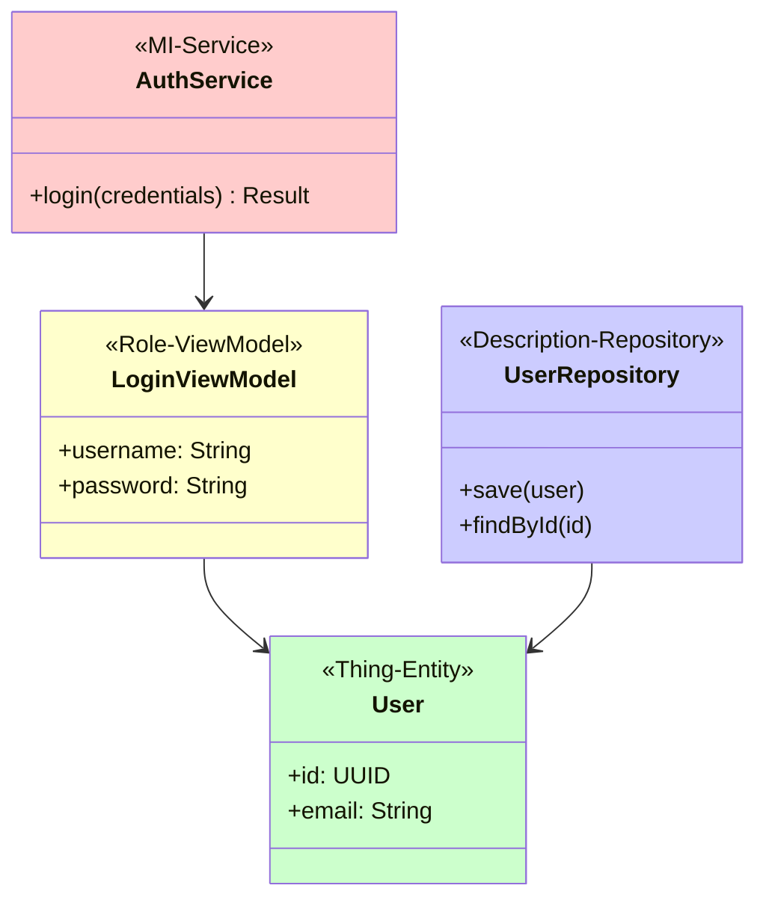
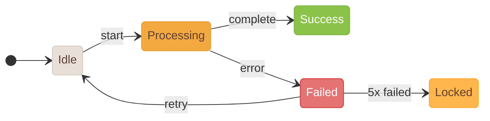

# 醫療器材軟體需求收集與文件產出 Skill

本 Skill 提供完整的醫療軟體開發支援：從需求收集、IEC 62304 文件產出、到設計資產管理。

---

## 🧠 心理學自動套用流程 (執行時必讀)

**當此 Skill 被觸發時，Claude 必須自動執行以下步驟：**

### Step 1: 讀取心理學指南

```
在進行任何文件操作前，自動讀取以下檔案：

📖 設計心理學：
   cat ~/.claude/skills/medical-software-requirements-skill/references/design-psychology.md

📖 認知心理學：
   cat ~/.claude/skills/medical-software-requirements-skill/references/cognitive-psychology.md

📖 文件編排心理學：
   cat ~/.claude/skills/medical-software-requirements-skill/references/document-layout-psychology.md
```

### Step 2: 根據任務類型套用心理學

| 任務類型 | 設計心理學 | 認知心理學 | 文件編排心理學 |
|---------|:----------:|:----------:|:--------------:|
| 產出/修改 SRS | ✅ | ✅ | ✅ |
| 產出/修改 SDD | ✅ | ✅ | ✅ |
| 產出/修改 SWD | - | ✅ | ✅ |
| 產出/修改 STP/STC | - | - | ✅ |
| 檢視/審查文件 | ✅ | ✅ | ✅ |
| 產生 DOCX | - | - | ✅ |

### Step 3: 輸出心理學檢視報告

在文件操作完成後，輸出簡要的心理學符合度檢視：

```markdown
## 心理學符合度檢視

### 設計心理學 ✅/⚠️/❌
- [ ] 認知負荷：...
- [ ] 漸進式揭露：...
- [ ] 前置條件：...

### 認知心理學 ✅/⚠️/❌
- [ ] 心智模型：...
- [ ] 工作記憶限制：...
- [ ] 錯誤預防：...

### 文件編排心理學 ✅/⚠️/❌
- [ ] 讀者角色優化：...
- [ ] ID 編碼一致性：...
- [ ] Trace 欄位完整性：...
```

---

## 完整工作流程

```
[第一階段：需求收集]    [第二階段：文件產出]    [第三階段：設計資產]    [第四階段：UI/UX心理學]   [第五階段：文件編排心理學]
1. 專案願景訪談 ──┐  ┌→ SRS 需求規格書 ──┐  ┌→ UI/UX 設計工具   ┌→ 認知負荷分析      ┌→ 讀者角色分析 (SA/SD/PG/QA)
2. 利害關係人分析 ┼→ ┼→ SDD 設計規格書 ──┼→ ┼→ UI/UX 畫面圖片 → ┼→ 流程漸進式揭露    ├→ F型閱讀模式排版
3. 功能需求收集 ──┤  ├→ SWD 詳細設計 ────┤  ├→ Icons/Images     ├→ 前置條件設計      ├→ 視覺層級設計
4. 非功能需求分析 ┤  ├→ STP/STC 測試 ────┤  ├→ App Icons        ├→ Dashboard 定向    ├→ 認知負荷優化
5. 安全分類評估 ──┘  ├→ SVV 驗證報告 ────┤  └→ Android/iOS     └→ 使用者流程優化    ├→ 章節結構優化
                     └→ RTM 追溯矩陣 ────┘                                         └→ 表格/圖表可讀性
```

> ### ⚠️ 100% 追溯完整度要求
>
> **本 Skill 要求所有文件追溯必須達到 100%：**
>
> | 追溯方向 | 要求 |
> |---------|------|
> | SRS → SDD | 100% |
> | SRS → SWD | 100% |
> | SRS → STC | 100% |
> | SRS → UI (SCR) | 100% |
> | SDD → SWD | 100% |
> | SWD → STC | 100% |
>
> **RTM 必須顯示所有追溯方向均達 100%，否則視為文件不完整。**

> ### ⚠️ MD/DOCX 文件同步要求
>
> **所有 IEC 62304 文件必須同時維護 Markdown (.md) 與 Word (.docx) 兩種格式：**
>
> | 文件 | .md | .docx | 同步規則 |
> |------|-----|-------|---------|
> | SRS | ✓ | ✓ | 更新 MD 時必須重新產生 DOCX |
> | SDD | ✓ | ✓ | 更新 MD 時必須重新產生 DOCX |
> | SWD | ✓ | ✓ | 更新 MD 時必須重新產生 DOCX |
> | STP | ✓ | ✓ | 更新 MD 時必須重新產生 DOCX |
> | STC | ✓ | ✓ | 更新 MD 時必須重新產生 DOCX |
> | SVV | ✓ | ✓ | 更新 MD 時必須重新產生 DOCX |
> | RTM | ✓ | ✓ | 更新 MD 時必須重新產生 DOCX |
>
> **檢查文件完整性時，必須同時驗證 MD 與 DOCX 的存在與同步狀態。**
>
> **同步檢查方式：** 比較 .md 與 .docx 的修改時間，若 .md 較新則需重新產生 .docx。

> ### ⚠️ UI 圖片嵌入 SDD 要求
>
> **SDD 文件的 UI/UX 設計章節必須直接嵌入 UI 設計圖片，而非僅參考外部連結：**
>
> | 內容類型 | 要求 | 格式 |
> |---------|------|------|
> | UI 畫面設計 | 必須嵌入圖片 | **SVG** (強制) 或 PNG |
> | 畫面流程圖 | 必須嵌入圖片 | **SVG** (強制) |
> | 互動說明 | 可包含圖片標註 | **SVG** + 文字說明 |
> | 狀態切換 | 建議嵌入各狀態圖 | **SVG** (強制) 或 PNG |
> | Mermaid 圖表 | 自動渲染 | **SVG** (預設) |
>
> **⚠️ 強制規範：DOCX 圖片格式必須優先使用 SVG**
>
> **圖片規範：**
> - **格式：SVG (強制優先)**，向量格式確保任意縮放不失真
> - 解析度：SVG 為向量格式，自動適應任何解析度
> - Fallback：僅當 SVG 不可用時，使用 PNG @2x/@3x
> - 命名：`SCR-{模組}-{序號}-{描述}.svg` (例: `SCR-AUTH-001-login.svg`)
> - 存放位置：`02-design/SDD/images/` 或 `03-assets/ui-screens/`
>
> **SVG 優勢：**
> - ✅ 向量格式，無限縮放不失真
> - ✅ 檔案較小，DOCX 檔案體積更小
> - ✅ 可後續編輯 (draw.io/Inkscape/Figma)
> - ✅ 列印品質最佳，適合 IEC 62304 審查文件
>
> **Markdown 嵌入語法：**
> ```markdown
> 
> ```
>
> **DOCX 轉換時會自動嵌入 SVG 圖片，確保文件獨立完整性與向量品質。**

> ### ⚠️ Mermaid 圖表自適應規範 (適用所有圖表)
>
> **所有 Mermaid 圖表必須遵循「自適應分行」原則，避免水平過寬導致字體過小或圖表被壓縮。**
>
> #### 基本規則：禁止 ASCII 製圖
>
> | 圖表類型 | 正確格式 | 禁止格式 |
> |---------|---------|---------|
> | 流程圖 | Mermaid `flowchart` | ASCII 箭頭 `-->`, `├──`, `└──` |
> | 序列圖 | Mermaid `sequenceDiagram` | ASCII 時序線 |
> | 狀態圖 | Mermaid `stateDiagram-v2` | ASCII 狀態框 |
> | 類別圖 | Mermaid `classDiagram` | ASCII 類別框 |
> | ER 圖 | Mermaid `erDiagram` | ASCII 關聯線 |
> | 架構圖 | Mermaid `flowchart` / `C4Context` | ASCII 方塊圖 |
>
> #### 自適應分行原則 (核心規則)
>
> | 原則 | 說明 |
> |------|------|
> | **節點數量限制** | 單行最多 3-4 個節點，超過必須換行 |
> | **垂直優先** | 優先使用 `flowchart TB` (Top-Bottom)，避免 `LR` (Left-Right) |
> | **分層 subgraph** | 相關節點用 subgraph 分組，每組獨立一層 |
> | **精簡文字** | 節點文字簡短 (< 15 字)，詳細說明放表格 |
> | **區塊連結** | 使用 `-->` 連結 subgraph 而非內部元素 |
> | **避免嵌套** | 不要將所有元素放在單一 subgraph 內 |
>
> #### 各圖表類型自適應指引
>
> **1. 流程圖 (flowchart) - 元件結構圖、架構圖**
>
> ~~~markdown
> ❌ 錯誤：水平過寬 (LR + 多節點)
> ```mermaid
> flowchart LR
>     A[AppBar] --> B[Counter] --> C[Animation] --> D[Progress] --> E[Segment] --> F[Hint] --> G[Character]
> ```
>
> ✅ 正確：垂直分層 + subgraph
> ```mermaid
> flowchart TB
>     subgraph Header["Header 區"]
>         A[AppBar<br/>返回+標題]
>     end
>
>     subgraph Content["內容區"]
>         B[Counter<br/>計數器]
>         C[Animation<br/>動畫元件]
>     end
>
>     subgraph Progress["進度區"]
>         D[ProgressBar<br/>整體進度]
>         E[SegmentView<br/>分段進度]
>     end
>
>     subgraph Footer["Footer 區"]
>         F[HintText<br/>提示文字]
>         G[Character<br/>角色泡泡]
>     end
>
>     Header --> Content
>     Content --> Progress
>     Progress --> Footer
> ```
> ~~~
>
> **2. 序列圖 (sequenceDiagram) - 互動流程**
>
> ~~~markdown
> ❌ 錯誤：參與者過多橫向展開
> ```mermaid
> sequenceDiagram
>     participant U as User
>     participant A as App
>     participant B as BLE
>     participant D as Device
>     participant S as Server
>     participant DB as Database
>     U->>A: 操作
>     A->>B: 連線
>     B->>D: 傳送
>     D->>S: 上傳
>     S->>DB: 儲存
> ```
>
> ✅ 正確：分組 box + 精簡參與者
> ```mermaid
> sequenceDiagram
>     box 使用者端
>         participant U as User
>         participant A as App
>     end
>     box 設備層
>         participant D as Device
>     end
>     box 伺服器端
>         participant S as Server
>     end
>
>     U->>A: 操作
>     A->>D: BLE 連線
>     D->>S: 上傳資料
>     S-->>A: 確認
> ```
> ~~~
>
> **3. 狀態圖 (stateDiagram-v2) - 畫面狀態**
>
> ~~~markdown
> ❌ 錯誤：狀態橫向排列
> ```mermaid
> stateDiagram-v2
>     direction LR
>     [*] --> Idle --> Loading --> Playing --> Paused --> Completed --> [*]
> ```
>
> ✅ 正確：垂直排列 + 分組
> ```mermaid
> stateDiagram-v2
>     direction TB
>     [*] --> Idle
>
>     state "初始階段" as Init {
>         Idle --> Loading: 開始
>     }
>
>     state "執行階段" as Running {
>         Loading --> Playing: 載入完成
>         Playing --> Paused: 暫停
>         Paused --> Playing: 繼續
>     }
>
>     state "結束階段" as End {
>         Playing --> Completed: 完成
>         Completed --> [*]
>     }
> ```
> ~~~
>
> **4. 類別圖 (classDiagram) - 資料模型**
>
> ~~~markdown
> ❌ 錯誤：類別橫向排列
> ```mermaid
> classDiagram
>     direction LR
>     User --> Profile
>     Profile --> Settings
>     Settings --> Preferences
>     Preferences --> Theme
> ```
>
> ✅ 正確：垂直排列 + namespace 分組
> ```mermaid
> classDiagram
>     direction TB
>     namespace 使用者模組 {
>         class User {
>             +id: String
>             +name: String
>         }
>         class Profile {
>             +avatar: URL
>         }
>     }
>     namespace 設定模組 {
>         class Settings {
>             +theme: Theme
>         }
>         class Preferences {
>             +language: String
>         }
>     }
>     User --> Profile
>     Profile --> Settings
>     Settings --> Preferences
> ```
> ~~~
>
> **5. ER 圖 (erDiagram) - 資料庫關聯**
>
> ~~~markdown
> ✅ ER 圖本身會自動調整，但需精簡欄位
> ```mermaid
> erDiagram
>     USER ||--o{ SESSION : has
>     USER ||--o{ TRAINING : performs
>     SESSION ||--|{ TRAINING_DATA : contains
>
>     USER {
>         string id PK
>         string name
>     }
>     SESSION {
>         string id PK
>         date startTime
>     }
> ```
> ~~~
>
> #### 節點文字規範
>
> | 情況 | 建議 |
> |------|------|
> | 節點標籤 | 最多 15 個中文字或 30 個英文字 |
> | 需要換行 | 使用 `<br/>` 換行 (例: `A[標題<br/>副標題]`) |
> | 詳細說明 | 節點只放 ID，詳細說明用表格補充 |
>
> ~~~markdown
> ✅ 推薦：節點精簡 + 表格補充
> ```mermaid
> flowchart TB
>     A[SCR-TRAIN-001] --> B[SCR-TRAIN-002]
> ```
>
> | 畫面 ID | 畫面名稱 | 說明 |
> |---------|---------|------|
> | SCR-TRAIN-001 | 訓練首頁 | 顯示訓練列表與進度 |
> | SCR-TRAIN-002 | 訓練進行 | 即時訓練畫面 |
> ~~~
>
> #### 例外情況
>
> - 簡單的項目符號列表（`-`, `*`, `1.`）可使用
> - 表格使用 Markdown 表格語法（`| col |`）
> - 程式碼區塊內的輸出範例可包含 ASCII
>
> #### 理由
>
> - 垂直分層讓圖表維持窄寬度，在 DOCX 中字體清晰可讀
> - **Mermaid 圖表自動渲染為 SVG 嵌入 DOCX** (向量品質)
> - ASCII 製圖在 DOCX 中會因字型問題導致對齊錯亂
> - **SVG 向量格式確保任意縮放不失真，適合 IEC 62304 審查文件**

---

# 第一階段：需求收集

## 階段 1.1：專案願景訪談

收集醫療軟體專案的核心資訊：

**必問問題清單：**
1. 這個醫療軟體要解決什麼臨床問題？
2. 預期使用者是誰？(醫護人員/病患/管理者)
3. 軟體將用於哪種醫療場域？(醫院/診所/居家)
4. 有哪些法規要求？(TFDA/FDA/CE)
5. 軟體失效可能造成什麼危害？(用於安全分類)
6. 專案的預期效益與成功指標是什麼？

**輸出：** 專案願景陳述 + 初步安全分類評估

## 階段 1.2：利害關係人分析

醫療軟體特定的利害關係人：

| 類別 | 角色範例 | 關注重點 |
|------|----------|----------|
| 臨床使用者 | 醫師、護理師、技術員 | 臨床工作流程、易用性 |
| 病患 | 終端使用者 | 隱私、安全、無障礙 |
| 管理者 | 醫院資訊室、主管 | 整合性、報表、成本 |
| 法規單位 | QA、RA | IEC 62304 合規、追溯性 |
| 技術團隊 | 開發、維運 | 可維護性、安全性 |

## 階段 1.3：功能需求收集

使用 FURPS+ 模型，加入醫療特定考量：

**F - Functionality (功能性)**
- 臨床功能：診斷、監測、治療支援
- 資料管理：病歷、檢驗結果、醫令
- 安全功能：警示、互鎖、劑量檢查

**U - Usability (易用性)**
- 臨床環境適用性 (手套操作、緊急情況)
- 無障礙需求 (視障、聽障)
- 多語系支援

**R - Reliability (可靠性)**
- 關鍵功能可用性目標
- 資料完整性
- 錯誤處理與復原

**P - Performance (效能)**
- 臨床情境的回應時間要求
- 大量資料處理能力

**S - Supportability (可支援性)**
- 可維護性與更新機制
- 稽核日誌要求

**+ 醫療特定考量**
- 互通性 (HL7 FHIR、DICOM)
- 隱私保護 (個資法、HIPAA)
- 網路安全 (醫療設備網安)

## 階段 1.4：非功能需求分析

詳細醫療 NFR 檢核清單見 [references/medical-nfr-checklist.md](references/medical-nfr-checklist.md)

## 階段 1.5：軟體安全分類評估

根據 IEC 62304，評估軟體失效可能造成的危害：

| 分類 | 危害程度 | 範例 | 文件要求 |
|-----|---------|------|---------|
| Class A | 不會造成傷害 | 行政管理軟體 | 基本 |
| Class B | 可能造成非嚴重傷害 | 一般監測軟體 | 完整 |
| Class C | 可能造成死亡或嚴重傷害 | 診斷/治療軟體 | 最嚴格 |

**安全分類決策樹：**
```
軟體失效是否可能直接或間接造成傷害？
├── 否 → Class A
└── 是 → 傷害是否可能嚴重？
         ├── 否 → Class B
         └── 是 → Class C
```

---

# 第二階段：文件產出

## ID 編號系統

所有文件項目使用統一的 ID 編號格式，確保 **100% 可追溯性**：

| 文件類型 | ID 前綴 | 格式範例 | 追溯要求 |
|---------|--------|---------|---------|
| 軟體需求規格書 | SRS | SRS-{MODULE}-001 | 來源：使用者需求 |
| 軟體設計規格書 | SDD | SDD-{MODULE}-001 | **必須對應 SRS (100%)** |
| 軟體詳細設計書 | SWD | SWD-{MODULE}-001 | **必須對應 SDD (100%)** |
| 畫面設計 | SCR | SCR-{MODULE}-001 | **必須對應 SRS (100%)** |
| 軟體測試計畫 | STP | STP-001 | 涵蓋所有需求 |
| 軟體測試案例 | STC | STC-{MODULE}-001 | **必須對應 SRS (100%)** |
| 驗證與確認 | SVV | SVV-001 | 彙整所有驗證結果 |

**ID 規則：**
- 格式: `[前綴]-[模組]-[三位數字]` (例: `SRS-AUTH-001`, `SDD-TRAIN-002`)
- 子項目: `SRS-AUTH-001.1`, `SRS-AUTH-001.2`
- 跨文件參考: 使用完整 ID
- **每個 SRS 項目必須有對應的 SDD、SWD、STC、SCR (UI) 項目**

**模組代碼範例：**
- AUTH: 認證模組
- ONBOARD: 引導流程
- TRAIN: 訓練功能
- REPORT: 報告功能
- DEVICE: 設備連線
- REWARD: 獎勵系統
- SETTING: 設定功能
- NFR: 非功能需求

## 統一文件格式規範

> ### ⚠️ 所有 IEC 62304 文件必須採用統一格式
>
> 所有文件 (SRS/SDD/SWD/STP/STC/SVV/RTM) 必須使用相同的封面與 Revision History 格式，確保文件一致性。

### 標準封面格式

所有文件的 Markdown 封面必須採用以下格式：

```markdown
# {Document Title}
## For {Project Name}

Version {X.X}
Prepared by {Author}
{Organization}
{Date}

## Table of Contents
<!-- TOC -->
* [1. Introduction](#1-introduction)
* [2. ...](#2-...)
<!-- TOC -->

## Revision History

| Name | Date | Reason For Changes | Version |
|------|------|--------------------|---------|
|      |      |                    |         |

---
```

**各文件標準標題：**

| 文件 | 標題 |
|------|------|
| SRS | `# Software Requirements Specification` |
| SDD | `# Software Design Description` |
| SWD | `# Software Detailed Design` |
| STP | `# Software Test Plan` |
| STC | `# Software Test Cases` |
| SVV | `# Software Verification & Validation Report` |
| RTM | `# Requirements Traceability Matrix` |

### Revision History 格式

**統一欄位順序：**

| Name | Date | Reason For Changes | Version |
|------|------|--------------------|---------|

**禁止使用的舊格式：**
- ❌ `| 版本 | 日期 | 修改內容 | 作者 |`
- ❌ `| 版本 | 日期 | 作者 | 變更說明 |`
- ❌ 表格式封面（文件資訊表格）
- ❌ `## 目錄 (詳細)` 或任何重複的目錄區塊
- ❌ `## 1. 文件資訊` 表格式文件資訊區塊

### 必要格式要素 (Mandatory Format Elements)

> **重要：** 所有文件必須嚴格遵守以下格式，不得省略或更改順序：

1. **標準封面** - 必須包含：
   - H1 標題 (`# {Document Title}`)
   - H2 專案名稱 (`## For {Project Name}`)
   - 版本資訊 (Version X.X)
   - 作者 (Prepared by)
   - 組織名稱
   - 日期 (YYYY-MM-DD)

2. **Table of Contents** - 必須：
   - 使用 `## Table of Contents` 標題
   - 使用 `<!-- TOC -->` 標記包圍
   - 列出所有主要章節

3. **Revision History** - 必須：
   - 使用 `## Revision History` 標題
   - 欄位順序：`Name | Date | Reason For Changes | Version`
   - 使用分隔線 `---` 結束區塊

4. **正文章節** - 從 `## 1. 簡介` 或 `## 1. Introduction` 開始

### 中文字型設定

DOCX 輸出時，字型設定如下：

| 字元類型 | 字型 |
|---------|------|
| 英文/半形 (ascii) | Arial |
| 中文/全形 (eastAsia) | 微軟正黑體 |
| 標題 | Arial + 微軟正黑體 (混合) |
| 程式碼 | Consolas |

### 程式碼區塊格式化

DOCX 輸出的程式碼區塊具備以下特性：

| 功能 | 說明 |
|------|------|
| **行號顯示** | 左側顯示行號，方便定位程式碼位置 |
| **斑馬紋背景** | 奇數行白色 (FFFFFF)，偶數行淺灰 (F5F5F5) |
| **固定行高** | 12pt 行高，確保對齊整齊 |
| **語法高亮** | 基於 VSCode Light+ 配色方案 |

#### 語法高亮色彩標準 (VSCode Light+ Theme)

| Token 類型 | 顏色 | 範例 |
|-----------|------|------|
| 關鍵字 (keyword) | `#0000FF` 藍色 | `class`, `func`, `if`, `return` |
| 字串 (string) | `#A31515` 深紅色 | `"Hello"`, `'text'` |
| 註解 (comment) | `#008000` 綠色 | `// comment`, `/* block */` |
| 數字 (number) | `#098658` 深青色 | `123`, `3.14` |
| 型別 (type) | `#267F99` 青藍色 | `String`, `Int`, `Bool` |
| 裝飾器 (decorator) | `#AF00DB` 紫色 | `@State`, `@Published` |
| 預設 (default) | `#000000` 黑色 | 其他識別字 |

#### 支援的程式語言

- Swift / Kotlin / Java (行動端)
- Python / JavaScript / TypeScript (後端/前端)
- HTML / CSS / SQL

### Class Diagram 顏色標準 (Peter Coad Color UML)

Mermaid Class Diagram 使用 **Peter Coad 四色原型** 進行視覺分類：

| Archetype | 顏色 | 用途 | Mermaid Style |
|-----------|------|------|---------------|
| **MI (Moment-Interval)** | 粉紅色 `#FFCCCC` | Service、UseCase、Transaction | `style XXXService fill:#FFCCCC` |
| **Role** | 黃色 `#FFFFCC` | ViewModel、Presenter、Controller | `style XXXViewModel fill:#FFFFCC` |
| **Thing (Party/Place/Thing)** | 綠色 `#CCFFCC` | Entity、Model、Domain Object | `style XXXEntity fill:#CCFFCC` |
| **Description** | 藍色 `#CCCCFF` | Repository、DTO、Configuration | `style XXXRepository fill:#CCCCFF` |

#### Class Diagram 著色範例



### State Machine 顏色標準

Mermaid State Diagram 使用以下顏色標準區分狀態類型：

| 狀態類型 | 顏色 | Hex Code | 文字色 | 用途 |
|---------|------|----------|--------|------|
| **初始/未啟用** | 暖米灰 | `#E8E0D8` | `#5D4037` | 尚未開始的狀態 (Idle, Disconnected) |
| **處理中/進行中** | 暖金黃 | `#F4A940` | `#5D4037` | 正在執行的過渡狀態 (Processing, Scanning) |
| **成功/完成** | 草綠 | `#8BC34A` | `#fff` | 成功完成的狀態 (Authenticated, Connected) |
| **錯誤/失敗** | 暖珊瑚 | `#E57373` | `#fff` | 發生錯誤的狀態 (Failed, Error) |
| **警告/鎖定** | 琥珀黃 | `#FFB74D` | `#5D4037` | 需要注意的警告狀態 (Locked, Timeout) |

#### State Machine 著色範例



### C4 Model 架構圖顏色標準

Context View、Container View 等架構圖使用 **暖色系配色** (溫暖友善風格)：

| 元素類型 | 顏色 | Hex Code | 文字色 | 用途 |
|---------|------|----------|--------|------|
| **Person** | 深棕橘 | `#A1664A` | `#fff` | 使用者、角色 |
| **Software System** | 橘色 | `#E67E22` | `#fff` | 主系統 (當前開發中) |
| **Container** | 暖金黃 | `#F4A940` | `#5D4037` | App、Database、Server |
| **Component** | 淺杏色 | `#FDEBD0` | `#5D4037` | 內部元件 |
| **External System** | 暖灰棕 | `#8D7B6B` | `#fff` | 外部系統、第三方服務 |

---

## SDD 標準畫面流程規範

> ### ⚠️ 重要：SDD 模組設計必須遵循標準畫面流程
>
> 所有 SDD 文件的模組設計章節必須依照**業界標準 App 導航流程**組織，
> 確保開發者能夠按照邏輯順序閱讀與實作。

### 設計心理學原則 (Design Psychology)

> ### ⚠️ UI/UX 設計必須遵循設計心理學原則
>
> 所有畫面流程設計必須考量使用者心理因素，確保良好的使用體驗。

#### 核心設計心理學原則

| 原則 | 說明 | 應用場景 |
|------|------|---------|
| **認知負荷理論** (Cognitive Load Theory) | 避免一次呈現過多資訊，減輕使用者認知負擔 | Dashboard 設計、功能分層 |
| **漸進式揭露** (Progressive Disclosure) | 逐步引導使用者深入，不一次展示所有功能 | 登入→總覽→選擇功能→操作 |
| **空間定向** (Spatial Orientation) | 讓使用者知道「我在哪」、「能去哪」 | 導航設計、Dashboard 心理地圖 |
| **Fitts' Law** | 目標越大越近，越容易點擊 | 按鈕尺寸、觸控區域設計 |
| **Hick's Law** | 選項越多，決策時間越長 | 選項分類、減少決策疲勞 |
| **成就感設計** (Achievement Psychology) | 進度可視化增強動機 | 遊戲化、進度條、徽章系統 |

#### 流程設計心理學檢查清單

在設計 App 流程時，必須回答以下問題：

| 階段 | 心理學問題 | 設計對應 |
|------|-----------|---------|
| 登入後 | 使用者需要「緩衝區」建立心理模型 | 必須有 Dashboard，不可直接跳入功能模組 |
| 主畫面 | 使用者想知道「我在哪、完成什麼、下一步」 | Dashboard 顯示進度、狀態、下一步引導 |
| 功能入口 | 使用者需要知道「前置條件」是否滿足 | 檢查裝置連線、權限狀態後才允許進入 |
| 訓練前 | 使用者可能因裝置未連線而挫折 | 裝置配對必須在訓練功能之前 |
| 完成後 | 使用者需要正向回饋強化行為 | 成功動畫、獎勵、鼓勵訊息 |

#### 前置條件設計模式

> **重要：** 具有硬體依賴的功能，必須設計前置條件檢查機制。

```
進入功能模組時：
├── 檢查必要前置條件
│   ├── 條件已滿足 → 允許進入
│   └── 條件未滿足 → 引導至設定頁面
│       ├── 顯示友善提示訊息
│       ├── 提供「前往設定」按鈕
│       └── 完成設定後自動返回
```

**範例：訓練模組前置條件**

| 訓練類型 | 前置條件 | 未滿足時處理 |
|---------|---------|-------------|
| 氣密訓練 | iNAP 設備已連線 | 提示「請先連接 iNAP 設備」→ 引導至設備配對 |
| 設備互動訓練 | 訓練裝置已配對 | 提示「請先配對訓練裝置」→ 引導至裝置設定 |
| 教學影片 | 無硬體需求 | 允許離線觀看 |
| 肌功能訓練 | 無硬體需求 | 允許離線使用 |

---

### 認知心理學原則 (Cognitive Psychology)

> ### ⚠️ UI/UX 設計必須遵循認知心理學原則
>
> 認知心理學研究人類如何感知、注意、記憶、思考與學習。
> 良好的 UI 設計必須符合人類認知運作方式。

#### 核心認知心理學原則

| 原則 | 說明 | 應用場景 |
|------|------|---------|
| **心智模型** (Mental Model) | 使用者對系統運作的內心預期 | 設計符合使用者預期的互動方式 |
| **注意力** (Attention) | 使用者能同時處理的資訊有限 | 突顯重要資訊、減少干擾 |
| **工作記憶** (Working Memory) | 短期記憶容量約 4±1 項目 | 步驟不超過 4-5 步、減少記憶負擔 |
| **長期記憶** (Long-term Memory) | 透過重複與關聯強化記憶 | 一致性設計、可辨識的圖示 |
| **感知** (Perception) | 人如何解讀視覺資訊 | 格式塔原則、視覺層級 |
| **可供性** (Affordance) | 物件暗示的使用方式 | 按鈕看起來可點擊 |
| **訊號** (Signifier) | 明確指示如何操作 | 圖示、標籤、提示文字 |

#### 感知與格式塔原則 (Gestalt Principles)

| 原則 | 說明 | UI 應用 |
|------|------|---------|
| **接近性** (Proximity) | 靠近的元素被視為一組 | 相關按鈕放在一起 |
| **相似性** (Similarity) | 相似外觀的元素被視為一組 | 同類功能使用相同樣式 |
| **連續性** (Continuity) | 視線會沿著線條或曲線移動 | 引導視線的佈局設計 |
| **封閉性** (Closure) | 大腦會自動補齊不完整的形狀 | 簡化圖示設計 |
| **圖地關係** (Figure-Ground) | 區分前景與背景 | 對話框與遮罩層 |
| **共同命運** (Common Fate) | 同方向移動的元素被視為一組 | 動畫設計 |

#### 記憶與學習設計

**工作記憶限制 (Miller's Law: 7±2 → 現代研究: 4±1)**

| 設計項目 | 建議數量 | 原因 |
|---------|---------|------|
| 導航 Tab 數量 | 4-5 個 | 超過會增加選擇困難 |
| 表單欄位分組 | 每組 3-4 欄 | 減少認知負荷 |
| 步驟流程 | 最多 5 步 | 避免忘記進度 |
| 下拉選單選項 | 7 個以內 | 超過需分類或搜尋 |

**長期記憶強化設計**

| 策略 | 說明 | 範例 |
|------|------|------|
| **一致性** | 相同功能相同外觀 | 所有「儲存」按鈕都是藍色 |
| **隱喻** | 使用熟悉的概念 | 垃圾桶圖示代表刪除 |
| **分塊** (Chunking) | 將資訊組織成有意義的群組 | 電話號碼分段顯示 |
| **重複曝光** | 重要功能多次出現 | 常用功能放在多個入口 |

#### 可供性與訊號設計 (Norman's Design Principles)

| 原則 | 說明 | 好的設計 | 差的設計 |
|------|------|---------|---------|
| **可供性** | 物件暗示可做什麼 | 凸起的按鈕暗示可按 | 平面文字無法辨識是否可點 |
| **訊號** | 明確指示如何操作 | 按鈕有圖示+文字 | 只有神秘圖示 |
| **映射** | 控制與結果的對應關係 | 向上滑動內容向上移 | 違反直覺的操作 |
| **回饋** | 操作後的即時反應 | 點擊後有動畫/聲音 | 點擊無反應 |
| **概念模型** | 系統運作的解釋 | 進度條顯示等待中 | 無狀態指示 |
| **限制** | 防止錯誤操作 | 禁用無效選項 | 允許無效操作後報錯 |

#### 錯誤預防與處理

| 原則 | 說明 | 實作方式 |
|------|------|---------|
| **預防勝於治療** | 設計上避免錯誤發生 | 禁用無效按鈕、限制輸入格式 |
| **確認重要操作** | 不可逆操作前確認 | 刪除前顯示確認對話框 |
| **允許復原** | 提供 Undo 功能 | 可復原的刪除（軟刪除） |
| **友善錯誤訊息** | 說明問題與解決方法 | 「密碼需包含數字」而非「格式錯誤」 |
| **即時驗證** | 輸入時即時檢查 | 輸入 Email 時即時驗證格式 |

#### 閱讀心理學 (Reading Psychology)

> **醫療軟體特別重要：** 關鍵資訊必須易於閱讀，避免誤讀導致醫療錯誤。

| 原則 | 說明 | 實作方式 |
|------|------|---------|
| **F 型閱讀模式** | 使用者傾向從左上角開始，呈 F 型掃描 | 重要資訊放左上角 |
| **視覺層級** | 透過大小、顏色、粗細建立層級 | 標題大、內文中、說明小 |
| **行長限制** | 每行 45-75 字元最易閱讀 | 限制文字區塊寬度 |
| **行高** | 行高約 1.4-1.6 倍字體大小 | 避免行距過窄 |
| **對比度** | 文字與背景對比度至少 4.5:1 | WCAG AA 標準 |
| **字體選擇** | 無襯線字體較易螢幕閱讀 | iOS: SF Pro, Android: Roboto |

**數字與單位顯示**

| 情境 | 建議格式 | 原因 |
|------|---------|------|
| 大數字 | 1,234,567 | 千分位分隔易讀 |
| 時間 | 7h 32m | 明確單位 |
| 百分比 | 85% | 符號明確 |
| 醫療數值 | 98.6°F / 37°C | 必須顯示單位 |

#### 認知心理學檢查清單

在審查 UI 設計時，必須確認：

| 檢查類別 | 檢查項目 | 通過標準 |
|---------|---------|---------|
| **心智模型** | 操作方式符合使用者預期？ | 無需說明即可理解 |
| **注意力** | 重要資訊夠突顯？ | 3 秒內能找到關鍵資訊 |
| **記憶負荷** | 步驟數量合理？ | 單一流程不超過 5 步 |
| **感知** | 視覺分組清楚？ | 相關元素明顯成組 |
| **可供性** | 可互動元素明顯？ | 按鈕看起來可點擊 |
| **回饋** | 所有操作有回饋？ | 點擊有視覺/觸覺反應 |
| **錯誤預防** | 有防呆設計？ | 無效操作被禁用 |
| **閱讀性** | 文字易讀？ | 對比度 ≥ 4.5:1 |

---

### 技術文件編排心理學 (Document Layout Psychology)

> ### ⚠️ 所有技術文件必須遵循文件編排心理學原則
>
> IEC 62304 文件 (SRS/SDD/SWD/STP/STC/SVV/RTM) 的撰寫與編排必須考量不同讀者角色的閱讀需求，
> 確保文件易於閱讀、理解與使用，提升開發效率。

#### 讀者角色分析 (Reader Role Analysis)

不同角色閱讀技術文件時有不同的需求與關注點：

| 角色 | 縮寫 | 閱讀目的 | 主要關注章節 | 閱讀模式 |
|------|------|---------|-------------|---------|
| **系統分析師** | SA | 了解需求來源、驗收標準 | SRS 全文、RTM | 全面閱讀 |
| **系統設計師** | SD | 理解架構、設計模式 | SRS 需求、SDD 架構 | 結構化閱讀 |
| **程式設計師** | PG | 實作細節、API 規格 | SDD 詳細設計、SWD | 跳躍式查閱 |
| **品質工程師** | QA | 測試案例、驗證方法 | SRS AC、STC、SVV | 追溯式閱讀 |
| **法規專員** | RA | 追溯完整性、合規證據 | RTM、SVV | 稽核式檢查 |

#### 文件閱讀流程設計 (Document Reading Flow)

```
讀者閱讀技術文件時的心智模型：

SRS 需求規格書                 SDD 設計規格書                 SWD 詳細設計
┌─────────────┐              ┌─────────────┐              ┌─────────────┐
│ 1. 總覽摘要  │              │ 1. 架構總覽  │              │ 1. 模組總覽  │
│    ↓        │              │    ↓        │              │    ↓        │
│ 2. 模組清單  │  ───────→    │ 2. 模組設計  │  ───────→    │ 2. 類別設計  │
│    ↓        │  (SD 需要     │    ↓        │  (PG 需要    │    ↓        │
│ 3. 詳細需求  │   架構上下文) │ 3. 介面設計  │   實作細節)  │ 3. 方法細節  │
│    ↓        │              │    ↓        │              │    ↓        │
│ 4. 追溯資訊  │              │ 4. 資料設計  │              │ 4. 演算法    │
└─────────────┘              └─────────────┘              └─────────────┘
      │                            │                            │
      └────────────────────────────┴────────────────────────────┘
                                   │
                                   ▼
                            RTM 追溯矩陣
                        (RA/QA 稽核驗證)
```

#### 文件編排核心原則

| 原則 | 說明 | 實作方式 |
|------|------|---------|
| **F 型排版** | 重要資訊置於左上角 | 需求 ID、模組名稱放在行首 |
| **視覺層級** | 標題大小區分層級 | H1 > H2 > H3 明確層級 |
| **分塊呈現** | 相關資訊群組化 | 表格、區塊引用、分隔線 |
| **漸進式揭露** | 先總覽後詳細 | 每章先總表，再分節詳述 |
| **一致性** | 統一格式與術語 | ID 編碼、欄位順序一致 |
| **可掃描性** | 支援快速查找 | 表格、清單、粗體關鍵字 |

#### SRS 文件編排指南

**結構設計原則：**

| 章節 | 讀者關注 | 編排技巧 |
|------|---------|---------|
| **1. 簡介** | SA/SD/RA | 2-3 段總覽，建立整體心智模型 |
| **2. 總體描述** | SA/SD | 上下文圖、使用者角色表 |
| **3. 功能需求** | SD/PG | 模組→需求項目→AC，遞進揭露 |
| **4. 非功能需求** | SD/QA | 表格化，量化指標 |

**需求項目編排：**

```markdown
##### REQ-XXX-001 需求名稱

**Statement:** [一句話描述，不超過 50 字]

**Rationale:**
- [心理學/技術原因 1]
- [心理學/技術原因 2]

**Acceptance Criteria:**
- AC1: 當 [條件]，[動作]，並 [預期結果] - [設計依據]
- AC2: ...

**Verification Method:** Test | Inspection | Demonstration | Analysis
```

**Rationale 心理學標註格式：**

需求的 Rationale 應包含心理學依據（若適用）：

| Rationale 類型 | 標註格式 | 範例 |
|---------------|---------|------|
| 認知負荷 | **認知負荷理論**：... | Dashboard 分塊降低認知負擔 |
| 記憶限制 | **工作記憶限制**：... | 步驟不超過 5 步 |
| 視覺感知 | **F 型閱讀**：... | 重要資訊置於左上 |
| 可用性 | **Fitts' Law**：... | 按鈕尺寸 ≥44pt |
| 決策優化 | **Hick's Law**：... | 選項 ≤5 個 |
| 錯誤預防 | **錯誤預防**：... | 前置條件檢查 |

#### SDD 文件編排指南

**結構設計原則：**

| 章節 | 讀者關注 | 編排技巧 |
|------|---------|---------|
| **1. 簡介** | SD | 設計原則、架構概述 |
| **2. 系統架構** | SD/PG | 分層架構圖、技術選型表 |
| **3. 模組設計** | PG | 每模組：總覽表→架構→畫面 |
| **4. 資料設計** | PG | ER 圖、Entity 定義 |
| **5. 介面設計** | PG | API 規格、UI 畫面 |

**模組內部編排：**

```markdown
### 3.X 模組名稱 (MODULE_CODE)

| 設計 ID | 名稱 | 對應需求 | 對應畫面 | 說明 |
|---------|------|---------|----------|------|
| SDD-XXX-001 | ... | REQ-XXX-001 | SCR-XXX-001 | ... |

← 先呈現總覽表，讓讀者建立心智模型

#### 3.X.1 模組架構設計
← 再展開架構細節 (SD/PG 需要)

#### 3.X.2 畫面設計：SCR-XXX-001
← 最後詳細畫面 (PG 需要)
```

#### SWD 文件編排指南

**PG 閱讀優化：**

| 編排技巧 | 說明 | 範例 |
|---------|------|------|
| **類別總覽表** | 每模組先列出所有類別 | 類別名、職責、依賴 |
| **方法簽名優先** | 先呈現 API，再說明邏輯 | `func login() -> Result` |
| **程式碼區塊** | 關鍵演算法直接展示 | Pseudocode 或實際程式碼 |
| **序列圖** | 複雜流程用圖說明 | Mermaid sequenceDiagram |

#### 表格設計可讀性

**表格編排原則：**

| 原則 | 說明 | 實作 |
|------|------|------|
| **欄位順序** | ID → 名稱 → 詳細 → 追溯 | 符合閱讀習慣 |
| **欄寬比例** | ID 窄、說明寬 | 內容決定欄寬 |
| **表頭加粗** | 區分表頭與內容 | Markdown `**粗體**` |
| **斑馬條紋** | 大表格交替背景色 | DOCX 樣式設定 |
| **不超過 7 欄** | 避免水平滾動 | 拆分或簡化 |

**ID 欄位不換行規則：**

```markdown
<!-- 正確：ID 保持單行 -->
| SRS-AUTH-001 | 使用者登入功能，支援 Email、Google、Apple 登入方式 |

<!-- 錯誤：ID 被截斷 -->
| SRS-AUTH- | 使用者登入功能 |
| 001       |               |
```

#### 圖表可讀性

**Mermaid 圖表編排：**

| 圖表類型 | 方向建議 | 原因 |
|---------|---------|------|
| 流程圖 | TB (上到下) | 符合閱讀方向 |
| 序列圖 | 分組 box | 減少參與者數量 |
| 狀態圖 | TB + 分組 | 避免橫向過寬 |
| 類別圖 | TB + namespace | 邏輯分組 |

**圖表尺寸控制：**

```markdown
<!-- UI Wireframe (block-beta)：窄寬度 -->
最大寬度: 500px (適合手機畫面)

<!-- 其他圖表：標準寬度 -->
最大寬度: 1200px (適合 A4 列印)
```

#### 文件編排檢查清單

| 檢查類別 | 檢查項目 | 通過標準 |
|---------|---------|---------|
| **結構** | 每章有總覽表？ | 先總覽後詳細 |
| **層級** | 標題層級正確？ | H1→H2→H3 遞進 |
| **ID** | ID 不換行？ | 單行顯示 |
| **表格** | 欄位順序合理？ | ID 在首欄 |
| **圖表** | 圖表方向正確？ | TB 優先 |
| **追溯** | 追溯 ID 可點擊？ | 支援超連結 |
| **術語** | 術語一致？ | 統一用詞 |
| **格式** | MD/DOCX 同步？ | 時間戳記檢查 |

---

### 標準 App 導航流程架構

```
┌─────────────────────────────────────────────────────────────────┐
│                    標準 App 導航流程                              │
├─────────────────────────────────────────────────────────────────┤
│                                                                 │
│  1. Splash Screen (啟動畫面)                                     │
│         │                                                       │
│         ▼                                                       │
│  2. 認證檢查 ─────┬─── 已登入 ──────► 直接進入 Dashboard          │
│         │        │                                              │
│         │        └─── 未登入 ──────► 登入畫面                    │
│         │                            ├─ 註冊                    │
│         │                            ├─ 忘記密碼                │
│         │                            └─ 社群登入(Google/Apple)  │
│         │                                                       │
│         ▼                                                       │
│  3. 首次使用檢查 ───┬─── 首次 ──────► Onboarding Flow            │
│         │          │                 (3-6 個引導畫面)            │
│         │          │                                            │
│         │          └─── 非首次 ────► Dashboard (主頁)            │
│         │                                                       │
│         ▼                                                       │
│  4. Dashboard (主頁/首頁)                                        │
│         │                                                       │
│         ▼                                                       │
│  5. Tab Navigation (底部導航)                                    │
│     ┌──────┬──────┬──────┬──────┬──────┐                        │
│     │ Home │ Tab2 │ Tab3 │ Tab4 │Setting│                       │
│     └──────┴──────┴──────┴──────┴──────┘                        │
│                                                                 │
└─────────────────────────────────────────────────────────────────┘
```

### SDD 模組設計章節順序規範

模組設計章節必須按照以下順序組織，符合 App 實際導航流程與**設計心理學原則**：

| 順序 | 模組 | 必要畫面 | 說明 | 心理學依據 |
|------|------|---------|------|-----------|
| 1 | **AUTH (認證)** | 登入→註冊→忘記密碼→社群登入→Profile選擇 | 進入 App 的第一關 | 安全感建立 |
| 2 | **ONBOARD (引導)** | 歡迎頁→功能介紹→設定引導→完成 | 首次使用者引導流程 | 漸進式揭露 |
| 3 | **DASHBOARD (主畫面)** | 狀態總覽→進度→今日任務→導航入口 | **心理緩衝區，建立定向感** | 認知負荷、空間定向 |
| 4 | **DEVICE (設備)** | 設備列表→連線→配對→狀態 | **必須在訓練前完成** | 前置條件設計 |
| 5 | **核心功能模組** (如 TRAIN) | 前置條件檢查→功能流程 | 主要業務功能 | 依硬體依賴設計 |
| 6 | **REPORT (報告)** | 數據總覽→詳細報告→匯出 | 數據呈現 | 成就感設計 |
| 7 | **REWARD (獎勵)** | 成就→徽章→收集 | 遊戲化元素 (如適用) | 成就感設計 |
| 8 | **SETTING (設定)** | 個人資料→通知→語言→登出 | 永遠放在最後 | Hick's Law |
| 9 | **PLATFORM (雲平台)** | 後端服務設計 | 非 App UI，放最後 | - |

> **⚠️ 重要順序原則：**
> 1. **Dashboard 必須在認證後立即出現** - 作為心理緩衝區，不可跳過
> 2. **設備模組必須在訓練模組之前** - 硬體依賴功能的前置條件
> 3. **設定模組永遠放在最後** - 符合使用者心理預期

### 模組內部結構規範

每個模組必須按照以下順序組織子章節：

```markdown
### 3.X 模組名稱 (MODULE_CODE)

| 設計 ID | 名稱 | 對應需求 | 對應畫面 | 說明 |
|---------|------|---------|----------|------|
| SDD-XXX-001 | ... | SRS-XXX-001 | SCR-XXX-001 | ... |

#### 3.X.1 模組架構設計
- 狀態機 (State Machine)
- 服務介面 (Service Interface)
- 資料流 (Data Flow)

#### 3.X.2 畫面設計：SCR-XXX-001 第一個畫面
- 畫面屬性表
- Wireframe (Mermaid block-beta)
- 互動行為表

#### 3.X.3 畫面設計：SCR-XXX-002 第二個畫面
...
```

### AUTH 模組標準結構 (範例)

```markdown
### 3.1 認證模組 (AUTH)

#### 3.1.1 認證服務架構設計
- 認證流程狀態機
- 認證服務介面 (AuthService)

#### 3.1.2 畫面設計：SCR-AUTH-001 登入畫面
#### 3.1.3 畫面設計：SCR-AUTH-002 註冊畫面
#### 3.1.4 畫面設計：SCR-AUTH-003 忘記密碼
#### 3.1.5 社群登入整合設計
#### 3.1.6 兒童 Profile 管理設計 (如適用)
#### 3.1.7 畫面設計：SCR-AUTH-004 Profile 選擇
#### 3.1.8 畫面設計：SCR-AUTH-005 Profile 編輯
```

### 畫面設計章節標準格式

```markdown
#### 3.X.N 畫面設計：SCR-XXX-NNN 畫面名稱

| 項目 | 內容 |
|------|------|
| 畫面 ID | SCR-XXX-NNN |
| 對應設計 | SDD-XXX-NNN |
| 對應需求 | SRS-XXX-NNN |

**Wireframe**

\`\`\`mermaid
block-beta
    columns 1

    block:header:1
        columns 1
        title["畫面標題"]
    end

    block:content:1
        columns 1
        element["主要內容"]
    end

    block:actions:1
        columns 1
        button["[ 主要按鈕 ]"]
    end
\`\`\`

**互動行為**

| 元素 | 行為 | 結果 |
|------|------|------|
| 按鈕 | 點擊 | 導向下一個畫面 |
```

### 禁止的模組結構

- ❌ 認證模組直接從 Profile 開始，跳過登入/註冊
- ❌ 畫面設計散落在不同章節
- ❌ 模組內只有架構設計沒有畫面設計
- ❌ 畫面順序與實際導航流程不符
- ❌ 重複的章節編號 (如兩個 3.3.1)

---

## 文件範本

### SRS 軟體需求規格書

**完整模板 (含撰寫指引)：**
- [srs-template/srs-template.md](srs-template/srs-template.md) - SRS 完整範本，包含 💬 說明、➥ 指引、💡 提示
- [srs-template/req-template.md](srs-template/req-template.md) - 單一需求項目範本，包含撰寫指引

**精簡模板 (僅結構)：**
- [srs-template/srs-template-bare.md](srs-template/srs-template-bare.md) - SRS 精簡版，僅保留章節結構
- [srs-template/req-template-bare.md](srs-template/req-template-bare.md) - 需求項目精簡版

**傳統模板 (相容舊版)：**
- [references/srs-template.md](references/srs-template.md) - 舊版 SRS 範本

### SDD 軟體設計規格書

**完整模板 (含撰寫指引)：**
- [sdd-template/sdd-template.md](sdd-template/sdd-template.md) - SDD 完整範本，包含 15 種設計觀點 (Context, Composition, Logical, Physical, Structure, Dependency, Information, Interface, Interaction, Algorithm, State Dynamics, Concurrency, Patterns, Deployment, Resources)
- [sdd-template/view-template.md](sdd-template/view-template.md) - 單一設計視圖範本，包含撰寫指引

**精簡模板 (僅結構)：**
- [sdd-template/sdd-template-bare.md](sdd-template/sdd-template-bare.md) - SDD 精簡版，僅保留章節結構
- [sdd-template/view-template-bare.md](sdd-template/view-template-bare.md) - 設計視圖精簡版

**傳統模板 (相容舊版)：**
- [references/sdd-template.md](references/sdd-template.md) - 舊版 SDD 範本

**SDD 必須包含的章節：**
1. 系統架構設計 - 分層架構、技術選型
2. 模組設計 - 類別圖、序列圖、狀態機
3. 資料設計 - 資料庫 Schema、Entity 定義
4. 介面設計 - **內部介面 (API)** 與 **外部介面 (BLE/硬體)**

> **⚠️ 技術選型 (Technology Stack) 撰寫流程：**
>
> 撰寫 SDD 的技術選型章節時，必須先讀取對應平台的開發者 Skill，確保技術堆疊與 Arcana 架構一致：
>
> ```bash
> # 撰寫前先讀取對應 Skill
> cat ~/.claude/skills/android-developer-skill/SKILL.md   # Android App
> cat ~/.claude/skills/ios-developer-skill/SKILL.md       # iOS App
> cat ~/.claude/skills/python-developer-skill/SKILL.md    # Python Backend
> cat ~/.claude/skills/nodejs-developer-skill/SKILL.md    # Node.js Backend
> cat ~/.claude/skills/angular-developer-skill/SKILL.md   # Angular Web
> cat ~/.claude/skills/react-developer-skill/SKILL.md     # React Web
> ```
>
> **技術選型表格範例 (參考 Skill 後撰寫)：**
>
> | 平台 | 參考 Skill | 核心技術 |
> |------|-----------|---------|
> | Android App | android-developer-skill | Kotlin, Jetpack Compose, Hilt, Room, Coroutines |
> | iOS App | ios-developer-skill | Swift, SwiftUI, SwiftData, Combine, async/await |
> | Python Backend | python-developer-skill | Python 3.11+, Flask, gRPC, SQLAlchemy, Clean Architecture |
> | Node.js Backend | nodejs-developer-skill | Node.js 20+, Express, Prisma, InversifyJS, gRPC |
> | Angular Web | angular-developer-skill | Angular 17+, Signals, NgRx, Angular Material |
> | React Web | react-developer-skill | React 19, Zustand, TanStack Query, Tailwind CSS |
5. **畫面設計 (UI/UX)** - ⭐ **必要章節，不可遺漏**
   - 畫面流程 (Navigation Flow)
   - 畫面狀態設計 (Screen States)
   - 畫面詳細規格 (Layout, 元件, 互動)
   - Design System (色彩、字型、共用元件)
   - 動畫與轉場設計
   - 無障礙設計
6. 安全設計考量

> **重要提醒：** SDD 的「介面設計」章節應同時包含後端 API 設計與前端 UI/UX 設計，兩者缺一不可。

### SWD 軟體詳細設計書
範本: [references/swd-template.md](references/swd-template.md)

### STP 軟體測試計畫
範本: [references/stp-template.md](references/stp-template.md)

### STC 軟體測試案例
範本: [references/stc-template.md](references/stc-template.md)

### SVV 軟體驗證與確認報告
範本: [references/svv-template.md](references/svv-template.md)

### RTM 需求追溯矩陣
範本: [references/rtm-template.md](references/rtm-template.md)

---

## MD 轉 DOCX 同步產生

**每次更新 Markdown 文件時，必須同步產生對應的 DOCX 文件。**

### 同步檢查流程

```
1. 檢查 .md 與 .docx 修改時間
   │
   ├── .docx 不存在 → 必須產生
   │
   └── .docx 存在 → 比較時間戳記
           │
           ├── .md 較新 → 必須重新產生 .docx
           │
           └── .docx 較新或相同 → 已同步，無需動作
```

### DOCX 產生方式

本 Skill 提供統一的 MD 轉 DOCX 轉換器，支援所有文件類型（SRS/SDD/SWD 等）。

#### 轉換器 (md-to-docx.js) ⭐

**轉換器位置：** `~/.claude/skills/medical-software-requirements-skill/md-to-docx.js`

```bash
# 安裝依賴 (首次使用)
cd ~/.claude/skills/medical-software-requirements-skill
npm install docx
npm install -g @mermaid-js/mermaid-cli  # 若需渲染 Mermaid 圖表

# 轉換文件
node ~/.claude/skills/medical-software-requirements-skill/md-to-docx.js <input.md> [output.docx]

# 使用範例
node ~/.claude/skills/medical-software-requirements-skill/md-to-docx.js SRS-SomniLand-1.0.md
node ~/.claude/skills/medical-software-requirements-skill/md-to-docx.js SDD-Project-1.0.md
```

**轉換器功能：**
- ✅ 自動解析 Markdown 文件結構（支援中英文標題）
- ✅ **自動渲染 Mermaid 圖表為 SVG** (向量格式，預設) ⭐
- ✅ **SVG 圖片自動嵌入 DOCX** 文件並**置中顯示**
- ✅ 支援表格、程式碼區塊、標題階層
- ✅ 自動產生封面、目錄、頁首頁尾
- ✅ **智慧表格欄寬**：根據欄數與內容自動調整
- ✅ **中文字元優化**：中文字佔用 2 個單位計算欄寬
- ✅ **ID 欄位不換行**：自動偵測 ID 欄位 (SRS-XXX-NNN, SDD-XXX-NNN 等) 並防止換行
- ✅ **智慧圖表尺寸**：block-beta (UI wireframe) 使用窄寬度 (500px)，其他圖表使用標準寬度 (1200px)
- ✅ **需求項目表格化**：自動將需求區塊轉為結構化表格
- ✅ **標題自動編號** ⭐：DOCX 自動產生階層式編號 (1., 1.1, 1.1.1, 1.1.1.1, 1.1.1.1.1)
- ✅ **程式碼區塊格式化** ⭐：行號、斑馬紋背景、固定 12pt 行高
- ✅ **語法高亮** ⭐：基於 VSCode Light+ 配色，支援多語言 (Swift/Kotlin/Python/JS/TS)
- ✅ **標題不分離 (keepNext)**：粗體子標題自動與後續內容綁定，避免孤立標題
- ✅ **Peter Coad 四色原型**：Class Diagram 依 MI/Role/Thing/Description 分類著色
- ✅ **狀態機顏色標準**：State Machine 依狀態類型著色 (初始/處理中/成功/失敗/警告)
- ✅ **C4 Model 架構圖顏色**：Context/Container View 依 C4 官方色彩 (Person/System/Container)

**⚠️ 圖片格式強制規範：**
| 圖片類型 | 格式 | 說明 |
|---------|------|------|
| Mermaid 圖表 | **SVG** (強制) | 向量格式，無限縮放不失真 |
| UI 畫面設計 | **SVG** (優先) | 或 PNG @2x/@3x |
| 外部匯入圖片 | **SVG** (優先) | 或高解析度 PNG |

**字型設定 (IEC 62304 可讀性優化)：**
| 元素 | 大小 | 說明 |
|------|------|------|
| H1 | 18pt | 主標題 |
| H2 | 16pt | 大章節 |
| H3 | 14pt | 小節 |
| H4 | 13pt | 子節 |
| H5 | 12pt | 細節 |
| 內文 | 11pt | 段落文字 |
| 表格 | 11pt | 表格內容與標題 |
| 頁尾 | 9pt | 頁碼 |

**標題自動編號設定：** ⭐

DOCX 文件輸出時，標題會自動產生階層式編號，無需在 Markdown 中手動編號。

**IEC 62304 文件標題層級對應：**

| MD 語法 | 用途 | DOCX 編號 | 範例 |
|---------|------|----------|------|
| `#` | 封面標題 | (不編號) | Software Requirements Specification |
| `##` | 主章節 | 1., 2., 3. | 1. Introduction |
| `###` | 子章節 | 1.1, 1.2 | 1.1 Document Purpose |
| `####` | 子子章節 | 1.1.1 | 1.1.1 User Interfaces |
| `#####` | 細節章節 | 1.1.1.1 | 1.1.1.1 REQ-INT-001 |

> **⚠️ MD 標題格式規範 (重要！避免編號重複)：**
>
> **問題描述：** 若 MD 檔案中已有手動編號（如 `## 1. Introduction`），轉換為 DOCX 時會產生重複編號（如 `1.1 1. Introduction`）。
>
> **解決方案：**
> - **MD 檔案中禁止包含手動編號**
> - 轉換器會自動在 DOCX 中產生正確的階層編號
> - 使用 `remove-heading-numbers.sh` 腳本移除既有 MD 檔案中的手動編號
>
> **正確 vs 錯誤格式範例：**
>
> | 格式 | MD 標題寫法 | DOCX 輸出 |
> |------|------------|----------|
> | ✅ 正確 | `## Introduction` | 1. Introduction |
> | ✅ 正確 | `### Document Purpose` | 1.1 Document Purpose |
> | ❌ 錯誤 | `## 1. Introduction` | 1.1 1. Introduction (重複!) |
> | ❌ 錯誤 | `### 1.1 Document Purpose` | 1.1.1 1.1 Document Purpose (重複!) |
>
> **移除既有手動編號：**
>
> ```bash
> # 方法 1: 使用 sed 命令 (推薦)
> sed -E -i.bak '
>   s/^(#{1,6}) ([0-9]+\.) /\1 /
>   s/^(#{1,6}) ([0-9]+\.[0-9]+) /\1 /
>   s/^(#{1,6}) ([0-9]+\.[0-9]+\.[0-9]+) /\1 /
>   s/^(#{1,6}) ([0-9]+\.[0-9]+\.[0-9]+\.[0-9]+) /\1 /
> ' your-document.md
>
> # 方法 2: 使用工具腳本
> bash ~/.claude/skills/medical-software-requirements-skill/remove-heading-numbers.sh <input.md>
> ```
>
> **產生 MD 時的規則：** 撰寫或產生 MD 文件時，標題不應包含任何手動編號前綴。

**不自動編號的標題類型：**
| 標題類型 | 說明 |
|---------|------|
| Table of Contents | 目錄標題 |
| Revision History | 修訂歷史標題 |
| 封面標題 | Software Requirements Specification 等 |
| 需求 ID 標題 | REQ-FUNC-001、SRS-AUTH-001 等 |

**SVG 圖片設定 (A4 優化)：**
- **格式：SVG (向量，強制預設)** - 確保任意縮放不失真
- **PDF→SVG 工作流程** - 先產生 PDF，再用 mutool 轉換為 SVG (文字轉為向量路徑)
- DOCX 顯示：最大寬度 550px (~6 吋，適合 A4)
- 高度限制：最大 600px (防止溢出頁面)
- 最小尺寸：200px (避免過小圖片)
- 所有圖片自動置中

> **⚠️ SVG 文字渲染說明：**
>
> Mermaid 預設使用 `foreignObject` 內嵌 HTML 文字，Word/Inkscape 無法正確渲染。
> 轉換器採用 **PDF→SVG 工作流程**：
> 1. 使用 `mmdc` 將 Mermaid 產生為 PDF (文字已嵌入)
> 2. 使用 `mutool draw -F svg` 將 PDF 轉換為 SVG (文字轉為向量路徑)
>
> 此方案確保所有文字在 Word 中正確顯示，無論原始 Mermaid 圖表使用何種標籤格式。
>
> **相依性：** `brew install mupdf-tools` (提供 mutool 指令)
>
> 參考：[mermaid-js/mermaid#2688](https://github.com/mermaid-js/mermaid/issues/2688)

**表格欄寬智慧分配：**
| 欄數 | 最小欄寬 | 最大欄寬 | 說明 |
|------|---------|---------|------|
| 2 欄 | 2000 | 7000 | 較寬的欄位 |
| 3-4 欄 | 1500 | 5000 | 適中 |
| 5+ 欄 | 1000 | 3500 | 較窄的欄位 |

**輸出範例：**
```
Converting SDD-SomniLand-1.0.md...
Created SDD-SomniLand-1.0.docx (6541 KB)
```

**注意事項：**
- Mermaid 圖表語法錯誤時會 fallback 為程式碼區塊顯示
- 支援中文章節標題（如 `## 目錄`、`## 修訂歷史`）
- 封面資訊支援中英文欄位

**詳細說明見：** [references/md-to-docx-converter.md](references/md-to-docx-converter.md)

### 文件完整性檢查清單

執行文件完整性檢查時，必須確認：

| 檢查項目 | 驗證方式 |
|---------|---------|
| MD 文件存在 | 檢查 `{DOC}-{PROJECT}-{VER}.md` 檔案 |
| DOCX 文件存在 | 檢查 `{DOC}-{PROJECT}-{VER}.docx` 檔案 |
| 時間戳記同步 | `.docx` 修改時間 >= `.md` 修改時間 |
| 內容同步 | DOCX 內容反映最新 MD 版本 |

**若發現 MD 較新但 DOCX 未更新，必須立即重新產生 DOCX。**

---

**RTM 100% 追溯驗證清單：**

在完成所有文件後，RTM 必須顯示以下覆蓋率：

| 追溯方向 | 必須達成 | 驗證方式 |
|---------|---------|---------|
| SRS → SDD | 100% | 每條 SRS 都有對應 SDD ID |
| SRS → SWD | 100% | 每條 SRS 都有對應 SWD ID |
| SRS → STC | 100% | 每條 SRS 都有對應 STC ID |
| SRS → UI (SCR) | 100% | 每條功能性 SRS 都有對應 SCR ID |
| SDD → SWD | 100% | 每項 SDD 都有詳細設計 |
| SWD → STC | 100% | 每項 SWD 都有測試覆蓋 |

**若任一追溯方向低於 100%，必須補充缺少的項目直到達成完整追溯。**

## 各分類文件要求

| 活動 | Class A | Class B | Class C | 追溯要求 |
|-----|---------|---------|---------|---------|
| 軟體需求分析 (SRS) | ✓ | ✓ | ✓ | 來源追溯 |
| 軟體架構設計 (SDD) | ✓ | ✓ | ✓ | **100% 對應 SRS** |
| 軟體詳細設計 (SWD) | ✓ | ✓ | ✓ | **100% 對應 SDD** |
| 畫面設計 (UI/SCR) | ✓ | ✓ | ✓ | **100% 對應 SRS** |
| 軟體單元驗證 | ✓ | ✓ | ✓ | 對應 SWD |
| 軟體整合測試 | ✓ | ✓ | ✓ | 對應 SDD |
| 軟體系統測試 (STC) | ✓ | ✓ | ✓ | **100% 對應 SRS** |
| 需求追溯矩陣 (RTM) | ✓ | ✓ | ✓ | **所有方向 100%** |

> **注意：**
> - 所有文件與測試活動已列為必要產出，超越 IEC 62304 最低要求
> - **所有追溯方向必須達到 100% 覆蓋率**
> - RTM 是最終驗證文件，必須證明完整追溯鏈

---

## 需求撰寫規範

每條需求必須符合 SMART 原則：

- **S**pecific (具體)：明確描述，無模糊詞彙
- **M**easurable (可衡量)：有明確的驗收標準
- **A**chievable (可達成)：技術上可行
- **R**elevant (相關)：與專案目標相關
- **T**raceable (可追溯)：有唯一編號，可追蹤

**需求陳述模板：**
```
[SRS-XXX] [需求名稱]
描述：系統應該/必須 [動作] [對象] [條件/限制]
優先級：必要/重要/期望
安全分類：Class A/B/C
來源：[利害關係人]
驗收標準：
  - AC1: Given [前置條件], When [動作], Then [預期結果]
```

## 驗收標準撰寫

使用 Given-When-Then 格式：

```
Given [前置條件/情境]
When [觸發動作]
Then [預期結果]
```

**醫療軟體範例：**
```
SRS-001 病患身份確認
描述：系統必須在執行任何醫療處置前確認病患身份
優先級：必要
安全分類：Class B

驗收標準：
AC1: Given 護理師選擇執行給藥作業
     When 系統提示掃描病患手環條碼
     Then 系統顯示病患姓名、病歷號供確認

AC2: Given 掃描的條碼與醫令病患不符
     When 系統比對身份
     Then 系統顯示警告並阻止作業繼續
```

---

## SDD 設計階段：UI/UX 設計與 AI 資產產生

在 SDD (軟體設計規格書) 階段，同步進行 UI/UX 設計與視覺資產產生。

### 支援的 UI/UX 設計工具

本 Skill 支援各種 UI/UX 設計工具，不限於特定平台：

| 設計工具 | 匯出格式 | 適用情境 |
|---------|---------|---------|
| **Figma** | PNG, SVG, PDF | 團隊協作、原型設計 |
| **Sketch** | PNG, SVG, PDF | macOS 設計團隊 |
| **Adobe XD** | PNG, SVG, PDF | Adobe 生態系整合 |
| **Penpot** | PNG, SVG | 開源替代方案 |
| **Axure RP** | PNG, HTML | 高保真原型 |
| **InVision** | PNG | 原型展示 |
| **Zeplin** | PNG, SVG | 設計交付 |
| **手繪/Mockup** | PNG, JPG | 快速原型 |

**關鍵要求：** 不論使用何種設計工具，最終必須將 UI 畫面匯出為圖片檔 (PNG/JPG)，嵌入 SDD 文件中。

### 設計工作流程

```
SRS 需求 ──→ SDD 設計規格
                 │
                 ├──→ 畫面規劃 (SCR-*)
                 │       │
                 │       ├──→ UI/UX 設計工具 (Figma/Sketch/XD/其他)
                 │       │       │
                 │       │       └──→ 匯出 PNG/JPG 圖片
                 │       │               │
                 │       │               └──→ 嵌入 SDD 文件
                 │       │
                 │       └──→ AI 圖像產生 (可選)
                 │
                 └──→ Design System
                         │
                         ├──→ Design Tokens
                         ├──→ App Icon
                         └──→ UI Components
```

### UI 圖片嵌入 SDD 流程

```
1. 使用 UI/UX 設計工具建立畫面設計
              │
              ▼
2. 匯出畫面為 PNG/JPG 圖片
   - 解析度：@2x 或 @3x (建議 @2x)
   - 格式：PNG (推薦) 或 JPG
   - 命名：SCR-{模組}-{序號}-{描述}.png
              │
              ▼
3. 將圖片放入專案目錄
   - 位置：02-design/SDD/images/
   - 或：03-assets/ui-screens/
              │
              ▼
4. 在 SDD Markdown 中嵌入圖片
   - 語法：
              │
              ▼
5. 產生 DOCX 時自動嵌入圖片
   - md-to-docx 轉換器支援圖片嵌入
```

### Design System 建立

**Design Tokens (設計變數)**

使用 JSON 格式定義，確保跨平台一致性：

```json
{
  "color": {
    "primary": { "500": "#2196F3", "700": "#1976D2" },
    "semantic": { "success": "#4CAF50", "error": "#F44336" },
    "clinical": { "critical": "#D32F2F", "normal": "#4CAF50" }
  },
  "typography": {
    "fontFamily": { "ios": "SF Pro Text", "android": "Roboto" },
    "fontSize": { "headlineLarge": 32, "bodyMedium": 14 }
  }
}
```

詳細 Token 範本見:
- [assets/colors.json](assets/colors.json) - 色彩系統
- [assets/typography.json](assets/typography.json) - 字型與間距

### AI 圖像產生

使用 AI 工具 (Midjourney, DALL-E, Stable Diffusion) 產生設計資產。

**App Icon Prompt 範例 (醫療類):**

```
Professional medical healthcare app icon,
minimalist heart with pulse line design,
inside a rounded shield shape,
primary color #2196F3 (blue),
secondary color #FFFFFF (white),
clean flat design style,
no text no letters,
1024x1024 resolution,
centered composition,
suitable for iOS and Android app stores
```

**UI 畫面 Prompt 範例:**

```
Mobile app login screen UI/UX design,
modern minimal style,
top: company logo placeholder,
center: email and password input fields,
primary action button "Sign In",
social login options (Google, Apple),
bottom: forgot password and sign up links,
blue #2196F3 accent color,
white background,
iPhone 14 Pro frame,
high fidelity mockup
```

**醫療專用圖標 Prompt:**

```
Medical vital signs icon set,
heart rate, blood pressure, temperature, SpO2,
line icon style, 2px stroke weight,
single color #2196F3,
24x24 size each,
medical dashboard icons,
transparent background
```

詳細 Prompt 範本庫見 [references/ai-prompt-templates.md](references/ai-prompt-templates.md)

### 資產匯出腳本

提供 Python 腳本自動化匯出多尺寸資產：

| 腳本 | 用途 |
|------|------|
| `app_icon_export.py` | 1024x1024 → Android mipmap + iOS AppIcon |
| `image_export.py` | @3x 圖片 → Android drawable-* + iOS @1x/@2x/@3x |
| `svg_to_png.py` | SVG → 多尺寸 PNG |
| `batch_export.py` | 批次處理整個資料夾 |

詳細腳本見 [references/asset-scripts.md](references/asset-scripts.md)

**快速使用:**

```bash
# 安裝依賴
pip install Pillow cairosvg

# App Icon 匯出
python app_icon_export.py ./app-icon-1024.png ./03-assets/app-icons/

# 圖片多尺寸匯出
python image_export.py ./bg_login@3x.png ./03-assets/images/ 360 640
```

---

# 第三階段：設計資產管理

## 專案目錄結構

建立新專案時，使用標準化目錄結構確保需求、設計、資產可完整追溯：

詳細目錄結構見 [assets/project-template/PROJECT_STRUCTURE.md](assets/project-template/PROJECT_STRUCTURE.md)

```
{project-name}/
├── 01-requirements/        # 需求文件
│   ├── SRS/               # 軟體需求規格書
│   ├── interviews/        # 訪談紀錄
│   └── analysis/          # 分析文件 (風險、安全分類)
│
├── 02-design/             # 設計文件
│   ├── SDD/               # 軟體設計規格書
│   ├── SWD/               # 詳細設計書
│   ├── architecture/      # 架構設計
│   └── ui-ux/             # UI/UX 設計說明
│
├── 03-assets/             # 設計資產 ⭐
│   ├── design-tokens/     # 設計 Token (colors, typography)
│   ├── icons/             # 圖標 (SVG → Android/iOS)
│   ├── app-icons/         # App 圖標 (各尺寸)
│   ├── images/            # 圖片資源
│   ├── splash/            # 啟動畫面
│   └── screenshots/       # 螢幕截圖
│
├── 04-testing/            # 測試文件 (STP, STC)
├── 05-validation/         # 驗證文件 (SVV, RTM)
└── 06-regulatory/         # 法規文件
```

## 設計資產與需求追溯

### 追溯完整度要求 (100%)

> **⚠️ 重要：所有追溯必須達到 100% 完整度**
>
> 根據 IEC 62304 要求，以下追溯方向均需達到 **100% 覆蓋**：

| 追溯方向 | 要求覆蓋率 | 說明 |
|---------|-----------|------|
| SRS → SDD | **100%** | 每條需求必須有對應架構設計 |
| SRS → SWD | **100%** | 每條需求必須有對應詳細設計 |
| SRS → STC | **100%** | 每條需求必須有對應測試案例 |
| SRS → UI (SCR) | **100%** | 每條功能需求必須有對應畫面設計 |
| SDD → SWD | **100%** | 每項架構設計必須有詳細設計實作 |
| SWD → STC | **100%** | 每項詳細設計必須有測試驗證 |

**RTM (需求追溯矩陣) 必須顯示所有追溯方向均為 100%，否則視為文件不完整。**

### 追溯鏈

```
SRS-001 (需求) ─────────────────────────────────────────┐
    │                                                    │
    ├── SDD-001 (架構設計) ← 必須 100% 對應              │
    │       │                                            │
    │       └── SWD-001 (詳細設計) ← 必須 100% 對應      │
    │               │                                    │
    │               └── SCR-AUTH-001 (畫面) ← 必須 100%  │
    │                       ├── Figma Frame              │
    │                       └── Assets: icons/, images/  │
    │                                                    │
    └── STC-001 (測試案例) ← 必須 100% 對應 ─────────────┘
```

### 畫面編號規則

```
SCR-{模組}-{序號}

模組代碼:
- AUTH: 認證模組
- HOME: 首頁
- PAT:  病患
- CLN:  臨床
- SET:  設定
```

詳細對應表見 [references/screen-requirement-mapping.md](references/screen-requirement-mapping.md)

## UI/UX 設計工具整合

### 設計專案結構 (適用於各種設計工具)

不論使用 Figma、Sketch、Adobe XD 或其他工具，建議採用以下結構：

```
{專案} - Medical App
├── Design System          # 色彩、字型、共用元件
├── App Icons             # App 圖標設計
├── Authentication        # SCR-AUTH-* 畫面
├── Home & Dashboard      # SCR-HOME-* 畫面
├── Patient Management    # SCR-PAT-* 畫面
└── Clinical Features     # SCR-CLN-* 畫面
```

### 命名規範

```
畫面/Frame:  SCR-{模組}-{序號} - {畫面名稱}
元件:        {類別}/{名稱}/{狀態}
匯出檔案:    SCR-{模組}-{序號}-{描述}.png

範例:
畫面:        SCR-AUTH-001 - Login Screen
元件:        Button/Primary/Default
匯出檔案:    SCR-AUTH-001-login.png
```

### 各設計工具匯出指南

| 設計工具 | 匯出方式 | 建議設定 |
|---------|---------|---------|
| **Figma** | Export → PNG @2x | Include background, 壓縮品質 100% |
| **Sketch** | Export → PNG @2x | Background color 包含 |
| **Adobe XD** | Export Selected → PNG | Scale 2x |
| **Penpot** | Export → PNG | 解析度 2x |

詳細設計工具整合指南見 [references/figma-integration.md](references/figma-integration.md) (適用於各種工具)

## 資產匯出規格

### App Icon 尺寸

**Android (mipmap):**
- mdpi: 48×48, hdpi: 72×72, xhdpi: 96×96
- xxhdpi: 144×144, xxxhdpi: 192×192
- Play Store: 512×512

**iOS (AppIcon.appiconset):**
- @2x: 40, 58, 80, 120px
- @3x: 60, 87, 120, 180px
- App Store: 1024×1024

### Icons 匯出

```
icons/
├── svg/                   # 原始 SVG
├── android/drawable/      # Vector Drawable (.xml)
└── ios/Icons.xcassets/    # iOS Asset Catalog
```

### Images 匯出

```
images/
├── source/                # 原始檔
├── android/drawable-*/    # mdpi ~ xxxhdpi
└── ios/Images.xcassets/   # @1x, @2x, @3x
```

---

## 資源

### srs-template/ (SRS 模板目錄)

| 檔案 | 說明 |
|------|------|
| `srs-template.md` | SRS 完整範本 (含 💬 說明、➥ 指引、💡 提示) |
| `srs-template-bare.md` | SRS 精簡範本 (僅結構) |
| `req-template.md` | 單一需求項目範本 (含撰寫指引) |
| `req-template-bare.md` | 需求項目精簡範本 |

### sdd-template/ (SDD 模板目錄)

| 檔案 | 說明 |
|------|------|
| `sdd-template.md` | SDD 完整範本 (含 15 種設計觀點、撰寫指引) |
| `sdd-template-bare.md` | SDD 精簡範本 (僅結構) |
| `view-template.md` | 單一設計視圖範本 (含撰寫指引) |
| `view-template-bare.md` | 設計視圖精簡範本 |

### references/

**需求收集:**
- `medical-nfr-checklist.md` - 醫療軟體非功能需求檢核清單
- `interview-questions.md` - 醫療軟體需求訪談問題庫

**IEC 62304 文件範本 (傳統版本):**
- `srs-template.md` - SRS 軟體需求規格書範本 (舊版，建議使用 srs-template/ 目錄)
- `sdd-template.md` - SDD 軟體設計規格書範本 (舊版，建議使用 sdd-template/ 目錄)
- `swd-template.md` - SWD 軟體詳細設計書範本
- `stp-template.md` - STP 軟體測試計畫範本
- `stc-template.md` - STC 軟體測試案例範本
- `svv-template.md` - SVV 軟體驗證與確認報告範本
- `rtm-template.md` - RTM 需求追溯矩陣範本

**文件同步工具:**
- `md-to-docx.js` - **統一 MD 轉 DOCX 轉換器** ⭐ (支援所有文件類型，自動渲染 Mermaid 為 **SVG**，標題自動編號)
- `remove-heading-numbers.js` - **MD 標題編號移除工具** ⭐ (移除手動編號，配合 DOCX 自動編號使用)
- `md-to-docx-with-mermaid.js` - (已整合至 md-to-docx.js，保留供向下相容)
- `md-to-docx-converter.md` - MD 轉 DOCX 轉換器詳細說明與實作參考

> **⚠️ 重要：** 所有 IEC 62304 文件轉換統一使用 `md-to-docx.js`，圖片格式強制為 SVG，標題自動編號。

**UI/UX 設計與資產:**
- `figma-integration.md` - UI/UX 設計工具整合與設計資產管理指南 (適用 Figma/Sketch/XD 等)
- `screen-requirement-mapping.md` - 畫面與需求對應表
- `asset-specifications.md` - Android/iOS 資產尺寸規格
- `ai-prompt-templates.md` - AI 圖像產生 Prompt 範本庫
- `ui-components-prompts.md` - UI 元件 Prompt 範本
- `design-tokens-template.md` - Design Token JSON 範本
- `app-icon-export.md` - App Icon 匯出指南
- `asset-scripts.md` - 資產處理 Python 腳本
- `ui-image-embedding.md` - UI 圖片嵌入 SDD 規範

**設計心理學:**
- `design-psychology.md` - **設計心理學原則指南** ⭐
  - 認知負荷理論 (Cognitive Load Theory)
  - 漸進式揭露 (Progressive Disclosure)
  - 空間定向 (Spatial Orientation)
  - Fitts' Law & Hick's Law
  - 前置條件設計模式
  - Dashboard 設計規範

**認知心理學:**
- `cognitive-psychology.md` - **認知心理學原則指南** ⭐
  - 心智模型 (Mental Model)
  - 注意力 (Attention) - 選擇性、分散、持續注意
  - 記憶 (Memory) - 工作記憶、長期記憶、Miller's Law
  - 感知 (Perception) - 格式塔原則 (Gestalt Principles)
  - 可供性與訊號 (Affordance & Signifier) - Norman's Principles
  - 錯誤預防與處理 (Error Prevention)
  - 閱讀心理學 (Reading Psychology) - F 型掃描、可讀性
  - 可學習性 (Learnability)
  - 認知心理學審查清單

**文件編排心理學:**
- `document-layout-psychology.md` - **技術文件編排心理學指南** ⭐ (NEW)
  - 讀者角色分析 (SA/SD/PG/QA/RA)
  - 文件閱讀流程設計
  - F 型排版與視覺層級
  - SRS/SDD/SWD 編排指南
  - Rationale 心理學標註格式
  - 表格與圖表可讀性
  - 文件編排檢查清單

### assets/
- `project-template/PROJECT_STRUCTURE.md` - 專案目錄結構範本 (含 Android/iOS 目錄)
- `colors.json` - 醫療 App 色彩 Token
- `typography.json` - 字型與間距 Token
