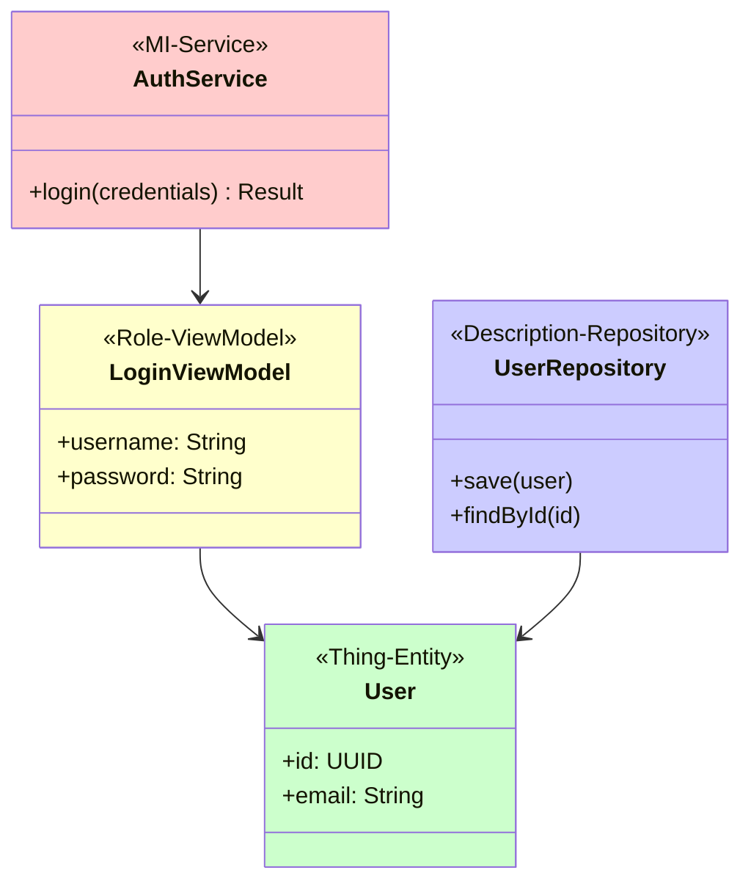
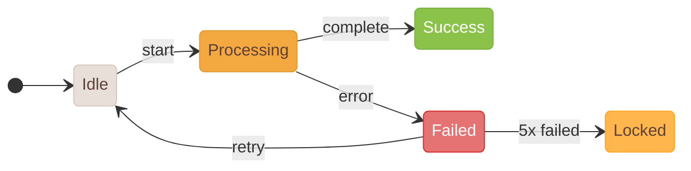

# Diagram Color Standards / 圖表顏色標準

Consistent color usage across all IEC 62304 documentation diagrams.

## Code Syntax Highlighting (VSCode Light+ Theme)

| Token Type | Color | Example |
|------------|-------|---------|
| Keyword | `#0000FF` Blue | `class`, `func`, `if`, `return` |
| String | `#A31515` Dark Red | `"Hello"`, `'text'` |
| Comment | `#008000` Green | `// comment`, `/* block */` |
| Number | `#098658` Dark Cyan | `123`, `3.14` |
| Type | `#267F99` Cyan Blue | `String`, `Int`, `Bool` |
| Decorator | `#AF00DB` Purple | `@State`, `@Published` |
| Default | `#000000` Black | Other identifiers |

### Supported Languages
- Swift / Kotlin / Java (Mobile)
- Python / JavaScript / TypeScript (Backend/Frontend)
- HTML / CSS / SQL

---

## Class Diagram Colors (Peter Coad Color UML)

Mermaid Class Diagrams use **Peter Coad's Four-Color Archetype** for visual classification:

| Archetype | Color | Hex | Usage | Mermaid Style |
|-----------|-------|-----|-------|---------------|
| **MI (Moment-Interval)** | Pink | `#FFCCCC` | Service, UseCase, Transaction | `style XXXService fill:#FFCCCC` |
| **Role** | Yellow | `#FFFFCC` | ViewModel, Presenter, Controller | `style XXXViewModel fill:#FFFFCC` |
| **Thing (Party/Place/Thing)** | Green | `#CCFFCC` | Entity, Model, Domain Object | `style XXXEntity fill:#CCFFCC` |
| **Description** | Blue | `#CCCCFF` | Repository, DTO, Configuration | `style XXXRepository fill:#CCCCFF` |

### Class Diagram Example

---

## State Machine Colors

Mermaid State Diagrams use these colors to distinguish state types:

| State Type | Color | Hex Code | Text Color | Usage |
|------------|-------|----------|------------|-------|
| **Initial/Inactive** | Warm Gray | `#E8E0D8` | `#5D4037` | Not started (Idle, Disconnected) |
| **Processing/In Progress** | Warm Gold | `#F4A940` | `#5D4037` | Executing transition (Processing, Scanning) |
| **Success/Complete** | Grass Green | `#8BC34A` | `#fff` | Successfully completed (Authenticated, Connected) |
| **Error/Failed** | Warm Coral | `#E57373` | `#fff` | Error occurred (Failed, Error) |
| **Warning/Locked** | Amber Yellow | `#FFB74D` | `#5D4037` | Needs attention (Locked, Timeout) |

### State Machine Example

---

## C4 Model Architecture Colors

Context View, Container View use **warm color palette** (friendly style):

| Element Type | Color | Hex Code | Text Color | Usage |
|--------------|-------|----------|------------|-------|
| **Person** | Deep Brown-Orange | `#A1664A` | `#fff` | Users, Roles |
| **Software System** | Orange | `#E67E22` | `#fff` | Main system (current development) |
| **Container** | Warm Gold | `#F4A940` | `#5D4037` | App, Database, Server |
| **Component** | Light Apricot | `#FDEBD0` | `#5D4037` | Internal components |
| **External System** | Warm Gray-Brown | `#8D7B6B` | `#fff` | External systems, third-party services |
