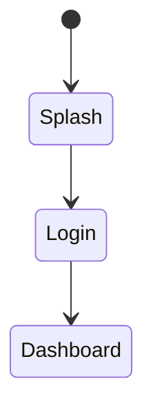

# Document Layout Psychology

This document defines layout principles for IEC 62304 technical documents (SRS/SDD/SWD/STP/STC/SVV/RTM),
ensuring documents are easy to read, understand, and use, improving development efficiency for different roles.

## Core Concepts

Technical documents are not only carriers for recording requirements and design, but also communication media for teams.
Good document layout should consider:

1. **Reader Diversity**: SA/SD/PG/QA/RA each have different reading objectives
2. **Cognitive Load**: Avoid information overload, Progressive Disclosure
3. **Reading Efficiency**: Support both quick scanning and deep reading patterns
4. **Traceability**: Clear ID system, complete traceability chain

---

## 1. Reader Role Analysis (Reader Role Analysis)

### 1.1 Reading Characteristics by Role

| Role | Abbreviation | Reading Objective | Main Focus Document/Sections | Reading Pattern |
|------|------|---------|------------------|---------|
| **System Analyst** | SA | Confirm requirement completeness | SRS full text, interview records | Comprehensive reading |
| **System Designer** | SD | Understand architecture and patterns | SRS Functional Requirements, SDD Architecture | Structural transformation reading |
| **Programmer** | PG | Implementation details, API | SDD Module Design, SWD Class | Jump-style reference |
| **Quality Engineer** | QA | Test cases, validation | SRS AC, STC, SVV | Traceability-style reading |
| **Regulatory Specialist** | RA | Compliance evidence, traceability | RTM, SVV, all document covers | Audit-style check |

### 1.2 Reading Pattern Description

| Reading Pattern | Description | Document Layout Support |
|---------|------|------------|
| **Comprehensive reading** | Read from beginning to end | Logical section order, clear table of contents |
| **Structural transformation reading** | Read by architecture level | Explicit hierarchy, module transformation organization |
| **Jump-style reference** | Quickly find specific information | Clear IDs, searchable tables |
| **Traceability-style reading** | From requirement tracking to test | Traceability IDs, hyperlinks |
| **Audit-style check** | Validate completeness and compliance | Overview tables, statistical summary |

---

## 2. Document Reading Flow Design

### 2.1 Document Reading Order

```
Typical development team reading paths:

SA reading path:
Interview records → SRS full text → RTM (validate completeness)

SD reading path:
SRS (Functional Requirements) → SDD (Architecture Design) → SDD (Module Design)

PG reading path:
SDD (Module Overview) → SDD (Detailed Design) → SWD (Class Design) → API specification

QA reading path:
SRS (AC) → STC (Test Cases) → SVV (Validation Results) → RTM (Traceability validation)

RA reading path:
RTM → All document covers → SVV → Spot check each document
```

### 2.2 Single Document Reading Flow

```
Reader's mental model when reading a single document:

1. Cover/Table of Contents ─→ Create overall cognition (What is this document about?)
       │
       ▼
2. Introduction/Overview ─→ Understand context (Why do we need this document?)
       │
       ▼
3. Overview Tables ──→ Grasp the full picture (What items exist? How many items?)
       │
       ▼
4. Detailed Content ──→ Deeper understanding (Details of each item)
       │
       ▼
5. Traceability/Appendix ─→ Validate completeness (Is everything covered?)
```

---

## 3. Document Layout Core Principles

### 3.1 F-Pattern Reading Mode (F-Pattern Reading)

When users read web pages/documents, their eye movement follows an F-pattern:
- First scan horizontally across the top
- Move down vertically, then scan horizontally again
- Scan down along the leftmost vertical edge

**Layout Should Use:**

| Position | Content to Place | Example |
|------|----------|------|
| Upper left corner | Most important identification information | Document title, ID |
| Top horizontal | Critical summary information | Version, date, status |
| Leftmost vertical | Navigation elements | Section titles, ID fields |

### 3.2 visualLevel (Visual Hierarchy)

```
H1 (18pt) ─────────────── Document Title
    │
    ├── H2 (16pt) ──────── largesections
    │       │
    │       ├── H3 (14pt) ─ subsections
    │       │       │
    │       │       └── H4 (13pt) ─ sub-subsections
    │       │               │
    │       │               └── body text (11pt)
    │       │
    │       └── Tables (11pt)
    │
    └── page footer (9pt)
```

### 3.3 Progressive Disclosure (Progressive Disclosure)

**Principle:** Overview first, details later

```markdown
## 3. Module Design

### Module Overview Table ← First layer: Readers grasp the full picture first

| Module | Design ID count | Corresponding Requirement count | Description |
|------|----------|----------|------|
| AUTH | 5 | 7 | Authentication Module |
| TRAIN | 8 | 12 | Training Module |

### 3.1 Authentication Module (AUTH) ← Second layer: Module Overview

| Design ID | Name | Corresponding Requirement |
|---------|------|---------|
| SDD-AUTH-001 | ... | REQ-AUTH-001 |

#### 3.1.1 Authentication Architecture Design ← Third layer: Detailed Content

[Detailed Design Content]
```

### 3.4 Chunking Presentation (Chunking)

**Miller's Law:** Human short-term memory capacity is approximately 7±2 (current research: 4±1) items

| Application Scenario | Recommended quantity | Arrangement |
|---------|---------|---------|
| Section count | 5-7 chapters | Exceeding items split into sub-documents |
| Table column count | ≤7 fields | Exceeding items split tables |
| List items | 3-5 items | Exceeding items group |
| Step count | ≤5 steps | Exceeding items split into phases |

### 3.5 Consistency (Consistency)

**Unified Format Specification:**

| Items | Specification |
|------|------|
| ID Format | `{Document}-{Module}-{three-digit-number}` |
| Date Format | YYYY-MM-DD |
| Version Format | X.Y (major version.minor version) |
| Technical terms | Unified technical terms table |
| Table fields | Fixed field order |

---

## 4. SRS Document Layout Guide

### 4.1 Section Structure

```
SRS Standard Structure (Optimized for different readers)

## 1. Introduction ← SA/SD/RA: Create context
   - Document objective
   - Scope
   - Technical terms definition

## 2. Overall Description ← SA/SD: Understand system overview
   - Product perspective (context diagram)
   - User characteristics (role table)
   - Constraints and assumptions

## 3. Functional Requirements ← SD/PG: Implementation basis
   ### 3.1 Module Overview Table ← First grasp the full picture
   ### 3.2 Module A
       #### REQ-A-001 ← Detailed requirement
   ### 3.3 Module B
       #### REQ-B-001

## 4. Non-Functional Requirements ← SD/QA: Quality indicators
   - Performance requirements (measurable)
   - Security requirements
   - Usability requirements

## 5. Appendix ← RA: Traceability validation
   - Technical terms table
   - Abbreviation table
```

### 4.2 Requirement Item Layout

```markdown
##### REQ-AUTH-001 User Login ← ID + Name (quick identification)

**Statement:** ← One sentence description
The system shall provide user login functionality, supporting email and third-party login.

**Rationale:** ← Why is this needed (including psychology basis)
- **Security**: Ensure only authorized users can access the system
- **Convenience**: Third-party login reduces memory burden (Cognitive Load theory)

**Acceptance Criteria:** ← Acceptance standard (QA focus)
- AC1: When user inputs correct credentials, click login, and system navigates to home page
- AC2: When 5 consecutive login failures occur, system locks account for 15 minutes - Error Prevention

**Verification Method:** Test ← Validation method

**Trace:** ← Traceability information (RA focus)
- SDD: SDD-AUTH-001
- STC: STC-AUTH-001
```

### 4.3 Rationale Psychology Annotation

| Psychology Principle | Annotation Format | Usage Timing |
|-----------|---------|---------|
| Cognitive Load | **Cognitive Load theory**: ... | Information presentation, step design |
| Working Memory | **Working Memory limitation**: ... | Step count, options count |
| F-pattern reading | **F-pattern reading**: ... | Information position |
| Fitts' Law | **Fitts' Law**: ... | Button size, position |
| Hick's Law | **Hick's Law**: ... | Options quantity |
| Error Prevention | **Error Prevention**: ... | Error-proof design |
| Progressive Disclosure | **Progressive Disclosure**: ... | Flow design |
| Spatial Orientation | **Spatial Orientation**: ... | Navigation design |

---

## 5. SDD Document Layout Guide

### 5.1 Section Structure

```
SDD Standard Structure (SD/PG Optimization)

## 1. Introduction ← SD: Design principles
   - Design principles (including psychology principles)
   - Architecture overview

## 2. System Architecture ← SD: Overall architecture
   - Layered architecture diagram (Mermaid)
   - Technology selection table

## 3. Module Design ← PG: Implementation reference
   ### 3.1 Module Overview ← First grasp the full picture
   ### 3.2 Authentication Module (AUTH)
       #### 3.2.1 Architecture Design ← Module-level architecture
       #### 3.2.2 Screen Design ← UI implementation reference

## 4. Data Design ← PG: Database
   - ER Diagram
   - Entity definition

## 5. Interface Design ← PG: API specification
   - API specification (backend)
   - UI Screen (frontend)
```

### 5.2 Module Internal Layout

```markdown
### 3.2 Authentication Module (AUTH)

| Design ID | Name | Corresponding Requirement | Corresponding Screen | Description |
|---------|------|---------|----------|------|
| SDD-AUTH-001 | Authentication Architecture | REQ-AUTH-001~003 | SCR-AUTH-001 | Authentication Flow |
| SDD-AUTH-002 | Token Management | REQ-AUTH-002 | - | JWT Process |

↑ Overview Table: Let PG quickly grasp the module overview

#### 3.2.1 Authentication Architecture Design

**State Machine Design**



↑ Diagram: Visualize complex logic

**Service Interface**

```dart
abstract class AuthService {
  Future<Result> login(String email, String password);
}
```

↑ Code: PG directly reference

#### 3.2.2 Screen Design: SCR-AUTH-001 Login Screen

| Items | Content |
|------|------|
| Screen ID | SCR-AUTH-001 |
| Corresponding Design | SDD-AUTH-001 |
| Corresponding Requirement | REQ-AUTH-001 |

↑ Property Table: Quick reference

**Wireframe**


↑ Wireframe: UI structure reference
```

---

## 6. SWD Document Layout Guide

### 6.1 PG Navigation Layout

```
SWD Standard Structure (PG Optimization)

## 1. Module Overview ← Quick locate

| Module | Class count | Main responsibility |
|------|--------|---------|
| Auth | 5 | Authentication logic |

## 2. Authentication Module (AUTH)
   ### 2.1 Class Overview Table ← First list all classes
   ### 2.2 AuthService Class ← Detailed Design
       - Class diagram
       - Method signature
       - Logic description
       - Code example
```

### 6.2 Class Design Layout

```markdown
### 2.2 AuthService Class

**Class Information**

| Items | Content |
|------|------|
| Class Name | AuthService |
| Responsibility | Process user authentication logic |
| Corresponding Design | SDD-AUTH-001 |
| Dependencies | UserRepository, TokenManager |

**Method Overview** ← PG quick reference API

| Method | Parameters | Return | Description |
|------|------|------|------|
| login | email, password | Result<User> | User login |
| logout | - | void | Logout |

**Method Detailed Design**

#### login(email: String, password: String): Result<User>

**Logic Flow:**

```mermaid
sequenceDiagram
    Client->>AuthService: login(email, pwd)
    AuthService->>Repository: findByEmail(email)
    ...
```

**Code Example:**

```dart
Future<Result<User>> login(String email, String password) async {
  // Implementation logic
}
```
```

---

## 7. Table Design Readability

### 7.1 Table Layout Principles

| Principle | Description | Implementation method |
|------|------|---------|
| **Field order** | ID → Name → Details → Traceability | Align with F-pattern reading |
| **Column width ratio** | ID fixed narrow, description variable wide | Adjust according to content |
| **Table header style** | Bold, background color | Separate header and content |
| **Zebra stripes** | Large tables alternate background color | Improve readability |
| **Column count limitation** | ≤7 fields | Avoid horizontal scrolling |
| **ID no line break** | ID fields maintain single row | Ensure copyable |

### 7.2 Commonly Used Table Formats

**Requirement Overview Table:**

| Requirement ID | Requirement Name | Priority Level | Status |
|---------|---------|--------|------|

**Design Traceability Table:**

| Design ID | Name | Corresponding Requirement | Corresponding Screen | Description |
|---------|------|---------|----------|------|

**Test Traceability Table:**

| Test ID | Test Name | Corresponding Requirement | Results |
|---------|---------|---------|------|

---

## 8. Diagram Readability

### 8.1 Mermaid Diagram Direction

| Diagram Type | Recommended Direction | Reason |
|---------|---------|------|
| Flowchart | TB (top to bottom) | Align with reading habits |
| Architecture diagram | TB | Layering clear |
| Sequence diagram | Group box | Reduce horizontal width |
| State diagram | TB + Group | Avoid too loose |
| Class diagram | TB + namespace | Logical grouping |
| ER Diagram | Auto | ER diagram will auto-adjust |

### 8.2 Diagram Size Guide

| Purpose | Render size | Display max width | Description |
|------|---------|-------------|------|
| UI Wireframe | 800px | 500px | Suitable for mobile screen |
| Flowchart/Architecture diagram | 1200px | 600px | Suitable for A4 |
| Sequence diagram | 1200px | 600px | Suitable for A4 |
| ER Diagram | 1200px | 600px | Suitable for A4 |

### 8.3 Diagram Title Specification

```markdown
**Figure 3.1: Authentication Flow State Machine**


↑ Diagram title placed above diagram, including numbering
```

---

## 9. Document Layout Checklist

### 9.1 Structure Check

| Check Items | Meets Standard | Note |
|---------|---------|------|
| Cover complete? | Include title, version, date, author | |
| Directory exists? | List all main sections | |
| Introduction section? | Document objective and scope | |
| Overview tables? | Every major chapter has overview table | Progressive Disclosure |
| Hierarchy correct? | H1→H2→H3 progression | Visual hierarchy |

### 9.2 Format Check

| Check Items | Meets Standard | Note |
|---------|---------|------|
| ID format unified? | `{DOC}-{MOD}-{NNN}` | |
| ID no line break? | Single row display | |
| Date format? | YYYY-MM-DD | |
| Table field order? | ID in first column | F-pattern reading |
| Table column count? | ≤7 fields | |
| Diagram direction? | TB priority | |

### 9.3 Traceability Check

| Check Items | Meets Standard | Note |
|---------|---------|------|
| Traceability ID exists? | Every item has traceability fields | |
| Traceability ID correct? | Can correspond to target document | |
| Traceability 100%? | RTM shows all coverage | |

### 9.4 Readability Check

| Check Items | Meets Standard | Note |
|---------|---------|------|
| Technical terms consistent? | Unified terminology | |
| Sentence length? | Simple sentence ≤50 characters | |
| Paragraph length? | Simple paragraph ≤5 sentences | |
| Emphasis indicator? | Critical characters bold | |
| Diagrams clear? | Text readable, not too small | |

---

## 10. Reference Resources

### Academic Literature
- Nielsen, J. (2006). F-Shaped Pattern For Reading Web Content
- Miller, G. A. (1956). The Magical Number Seven, Plus or Minus Two
- Krug, S. (2014). Don't Make Me Think, Revisited

### Related Standards
- IEC 62304:2015 - Medical Device Software Life Cycle
- IEEE 1016:2009 - Software Design Description
- IEEE 830:1998 - Software Requirements Specification

### Related Skill Documents
- [design-psychology.md](design-psychology.md) - Design psychology principles
- [cognitive-psychology.md](cognitive-psychology.md) - Cognitive psychology principles
