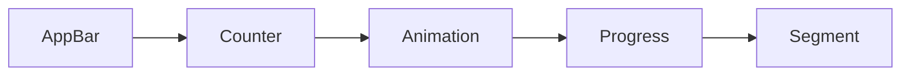
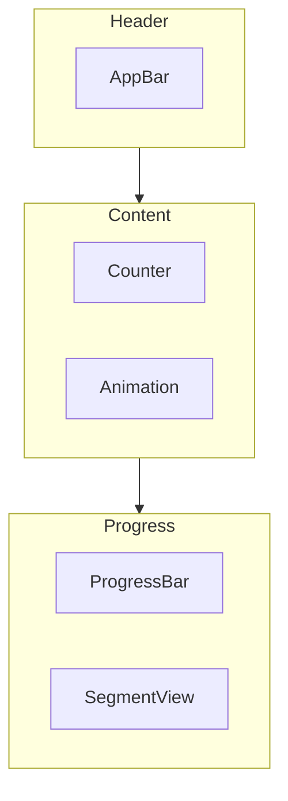
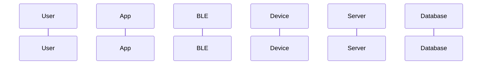
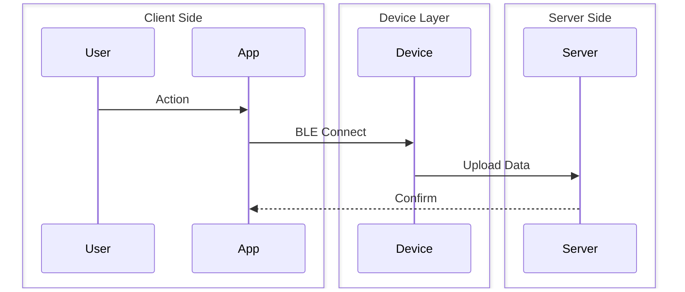
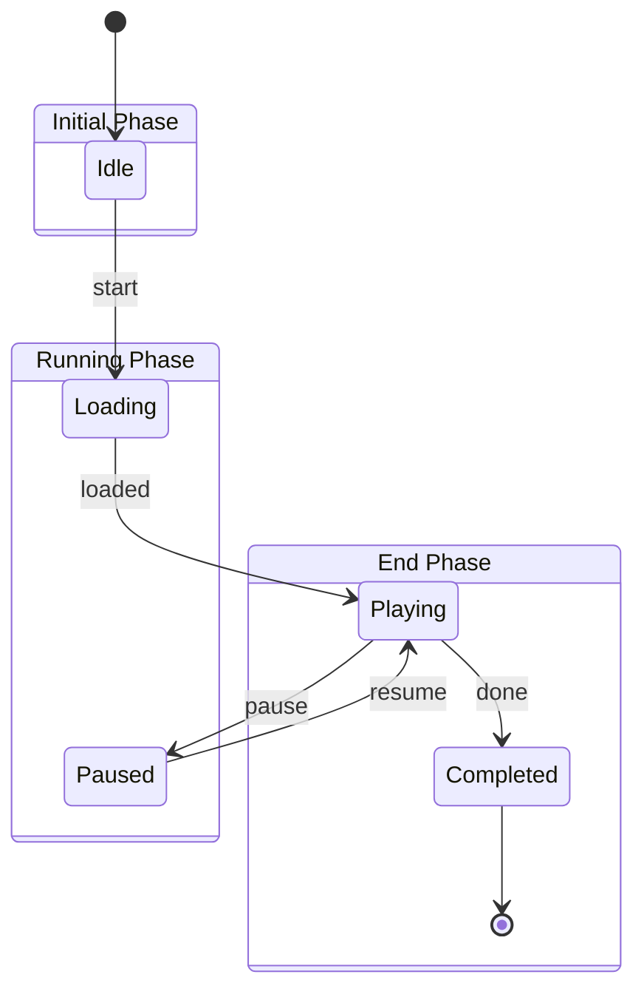
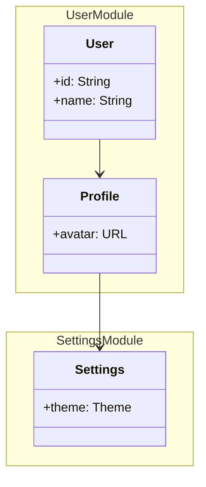
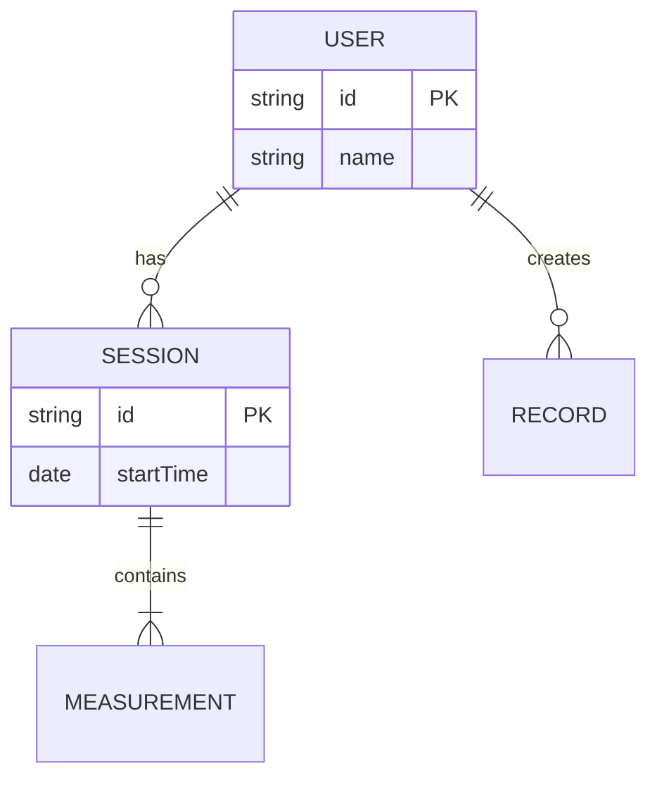
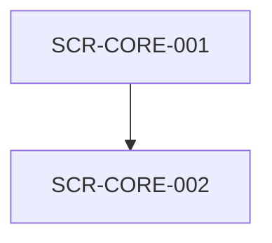

# Mermaid Diagram Guidelines / Mermaid 圖表規範

All diagrams in IEC 62304 documents must use Mermaid syntax for consistency and DOCX conversion compatibility.

## Basic Rules: No ASCII Art / 基本規則：禁止 ASCII 製圖

| Diagram Type | Correct Format | Forbidden Format |
|--------------|----------------|------------------|
| Flowchart | Mermaid `flowchart` | ASCII arrows `-->`, `├──`, `└──` |
| Sequence | Mermaid `sequenceDiagram` | ASCII timeline |
| State | Mermaid `stateDiagram-v2` | ASCII state boxes |
| Class | Mermaid `classDiagram` | ASCII class boxes |
| ER | Mermaid `erDiagram` | ASCII relation lines |
| Architecture | Mermaid `flowchart` / `C4Context` | ASCII block diagrams |

## Adaptive Layout Principles / 自適應分行原則

| Principle | Description |
|-----------|-------------|
| **Node Limit** | Max 3-4 nodes per row, wrap if more |
| **Vertical First** | Prefer `flowchart TB` (Top-Bottom) over `LR` (Left-Right) |
| **Subgraph Layers** | Group related nodes in subgraphs, one layer each |
| **Concise Text** | Node text < 15 chars, details in tables |
| **Block Links** | Connect subgraphs, not internal elements |
| **Avoid Nesting** | Don't put everything in a single subgraph |

## Diagram Type Guidelines

### 1. Flowchart - Component Structure / Architecture

~~~markdown
❌ Wrong: Too wide (LR + many nodes)


✅ Correct: Vertical layers + subgraph

~~~

### 2. Sequence Diagram - Interaction Flow

~~~markdown
❌ Wrong: Too many participants horizontally


✅ Correct: Box groups + fewer participants

~~~

### 3. State Diagram - Screen States

~~~markdown
❌ Wrong: Horizontal state layout
```mermaid
stateDiagram-v2
    direction LR
    [*] --> Idle --> Loading --> Playing --> Paused --> Completed --> [*]
```

✅ Correct: Vertical layout + groups

~~~

### 4. Class Diagram - Data Models

~~~markdown
❌ Wrong: Horizontal class layout
```mermaid
classDiagram
    direction LR
    User --> Profile --> Settings --> Preferences
```

✅ Correct: Vertical layout + namespace groups

~~~

### 5. ER Diagram - Database Relations

~~~markdown
✅ ER diagrams auto-adjust, but keep fields concise

~~~

## Node Text Guidelines / 節點文字規範

| Situation | Recommendation |
|-----------|----------------|
| Node labels | Max 15 Chinese chars or 30 English chars |
| Line breaks | Use `<br/>` (e.g., `A[Title<br/>Subtitle]`) |
| Details | Put only ID in node, details in table |

### Example: Concise Nodes + Table Details

~~~markdown


| Screen ID | Screen Name | Description |
|-----------|-------------|-------------|
| SCR-CORE-001 | Feature List | Display feature list and status |
| SCR-CORE-002 | Feature Detail | Show detailed view |
~~~

## Exceptions

- Simple bullet lists (`-`, `*`, `1.`) are allowed
- Tables use Markdown syntax (`| col |`)
- Code block output examples may contain ASCII

## Why These Rules?

- Vertical layout keeps diagrams narrow, readable in DOCX
- **Mermaid diagrams auto-render to SVG** (vector quality)
- ASCII art breaks alignment in DOCX due to font issues
- **SVG ensures scalability for IEC 62304 audit documents**
