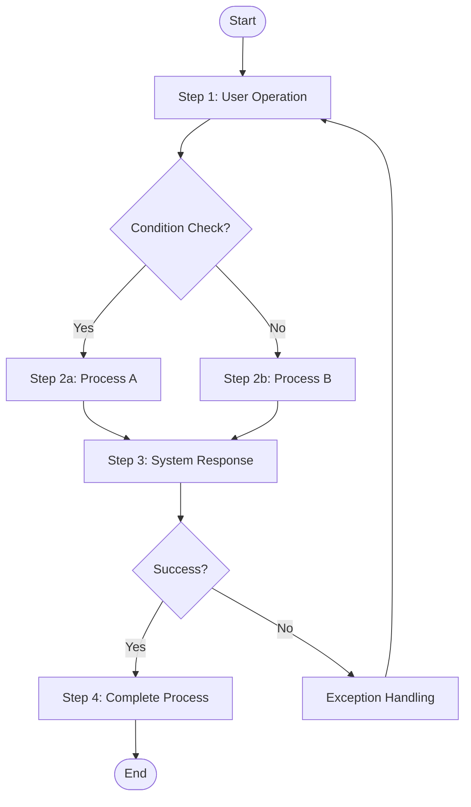

# SDD Software Design Specification Template
## Software Design Description Template

Aligned with IEC 62304 Standard

---

## Directory

1. [Document Information](#1-document-Information)
2. [Use Case Design](#2-use-case-design)
3. [System Architecture Design](#3-system-architecture-design)
4. [Module Design](#4-module-design)
5. [Data Design](#5-data-design)
6. [Interface Design](#6-Interface-design)
7. [Common Design Elements](#7-common-design-elements)
8. [Safety Design Considerations](#8-safety-design-considerations)
9. [Appendix](#9-appendix)

---

## 1. Document Information

| Items | Content |
|-----|------|
| Document Number | SDD-[projectCode]-[Version] |
| Document Name | [Product Name] Software Design Specification |
| Version | [X.X] |
| Creation Date | [YYYY-MM-DD] |
| Last Modified Date | [YYYY-MM-DD] |
| Author | [Name] |
| Reviewer | [Name] |
| Approver | [Name] |

### 1.1 Version History

| Version | Date | Changes | Author |
|-----|------|---------|------|
| 1.0 | [YYYY-MM-DD] | Initial Version Created | [Name] |

### 1.2 Reference Documents

| Document Number | Document Name | Version |
|---------|---------|------|
| SRS-xxx | Software Requirements Specification | [Version] |

### 1.3 Requirement Traceability Table

| Design Item ID | Corresponding Requirement ID |
|------------|------------|
| SDD-001 | SRS-001 |
| SDD-002 | SRS-002 |

---

## 2. Use Case Design (Use Case Specifications)

> **Description**: This section defines the system's use case Specifications, including use case descriptions, basic flow, alternative flows, and activity diagrams.
> Each use case should correspond to functional Requirements in the SRS.

### 2.1 Use Case Overview

| Use Case ID | Use Case Name | Actors | Corresponding Requirement | Priority Level |
|--------|---------|--------|---------|--------|
| UC-001 | [Use Case Name] | [Actors] | SRS-xxx | P1 |
| UC-002 | [Use Case Name] | [Actors] | SRS-xxx | P2 |

### 2.2 Use Case Details Specification

---

#### UC-001 [Use Case Name]

| Property | Content |
|-----|------|
| **Use Case ID** | UC-001 |
| **Use Case Name** | [Use Case Name] |
| **Actors** | [Primary actor] |
| **Corresponding Requirement** | SRS-xxx, SRS-xxx |
| **Priority Level** | P1 |

**Use Case Brief Description**:
[One paragraph describing this use case's purpose and Expected results, approximately 2-3 sentences]

**Preconditions**:
1. [Precondition 1]
2. [Precondition 2]

**Postconditions**:
1. [Postcondition 1: System state upon success]
2. [Postcondition 2]

**Basic Flow**:

| Step | Actor Action | System Response |
|-----|-----------|---------|
| 1 | [User operation] | [System process and response] |
| 2 | [User operation] | [System process and response] |
| 3 | [User operation] | [System process and response] |
| 4 | - | [System completes process] |

**Alternative Flows**:

| Flow ID | Branch Point | Condition | Steps |
|--------|--------|-----|------|
| A1 | Step 2 | [Condition description] | [Alternative steps description] |
| A2 | Step 3 | [Condition description] | [Alternative steps description] |

**Exception Flows**:

| Flow ID | Branch Point | Error Condition | Handling Method |
|--------|--------|---------|---------|
| E1 | Step 2 | [Error condition] | [Error handling and message] |
| E2 | Step 3 | [Error condition] | [Error handling and message] |

**Activity Diagram**:



**Supplementary Description**:
- [Other needed description items]
- [Business rules or limitations]

---

## 3. System Architecture Design

### 3.1 Architecture Overview

[Describe overall system architecture design concept]

### 3.2 Architecture Diagram

```
┌─────────────────────────────────────────────────────────┐
│                    Presentation Layer                    │
│  ┌─────────────┐  ┌─────────────┐  ┌─────────────┐     │
│  │    View     │  │  Controller │  │   ViewModel │     │
│  └─────────────┘  └─────────────┘  └─────────────┘     │
├─────────────────────────────────────────────────────────┤
│                    Business Layer                        │
│  ┌─────────────┐  ┌─────────────┐  ┌─────────────┐     │
│  │   Service   │  │   UseCase   │  │   Handler   │     │
│  └─────────────┘  └─────────────┘  └─────────────┘     │
├─────────────────────────────────────────────────────────┤
│                    Data Layer                            │
│  ┌─────────────┐  ┌─────────────┐  ┌─────────────┐     │
│  │ Repository  │  │    DAO      │  │   Entity    │     │
│  └─────────────┘  └─────────────┘  └─────────────┘     │
└─────────────────────────────────────────────────────────┘
```

### 3.3 Layer Description

| Level | Name | Responsibility | Main Components |
|-----|------|------|---------|
| 1 | Presentation Layer | UI Presentation and User Interaction | View, Controller |
| 2 | Business Layer | Business Logic Processing | Service, UseCase |
| 3 | Data Layer | Data Storage and Management | Repository, DAO |

### 3.4 Software Unit Architecture

| Unit ID | Unit Name | Layer | Safety Classification |
|--------|---------|---------|---------|
| SDD-UNIT-001 | [Unit Name] | [Level] | [A/B/C] |

---

## 4. Module Design

> **Description**: Each module design includes function description, processing logic, and related screen design (UI/UX),
> which integrates design and screens together to completely understand module functionality.

### 4.1 Module Overview

| ID | Module Name | Corresponding Requirement | Safety Classification | Description |
|----|---------|---------|---------|------|
| SDD-001 | [Module Name] | SRS-001 | [A/B/C] | [Brief description] |
| SDD-002 | [Module Name] | SRS-002 | [A/B/C] | [Brief description] |

---

### 4.2 SDD-001 [Module Name]

| Property | Content |
|-----|------|
| **ID** | SDD-001 |
| **Name** | [Module Name] |
| **Corresponding Requirement** | SRS-001, SRS-002 |
| **Safety Classification** | [Class A/B/C] |
| **Layer** | [LayerName] |
| **Responsibility** | [Description of Module Responsibility] |

#### 4.2.1 Function Description

[Description of this module's main function and business logic]

#### 4.2.2 Input/Output

**input**：
| Parameters | Type | Description |
|-----|------|------|
| [Parameter Name] | [Type] | [Description] |

**Output**：
| Parameters | Type | Description |
|-----|------|------|
| [Parameter Name] | [Type] | [Description] |

#### 4.2.3 Processing Logic

1. [Step 1]
2. [Step 2]
3. [Step 3]

#### 4.2.4 Dependent Modules

- SDD-002: [Dependency description]

#### 4.2.5 Error Handling

| Error Code | Error Description | Handling Method |
|--------|---------|---------|
| [Code] | [Description] | [Handling Method] |

#### 4.2.6 Screen Design

##### SCR-XXX-001 [Screen Name]

| Property | Content |
|-----|------|
| **Screen ID** | SCR-XXX-001 |
| **Screen Name** | [Screen Name] |
| **Corresponding Requirement** | SRS-001 |
| **Figma Link** | [Link]() |

**1. Implementation Interface**

```
┌────────────────────────────────────────────────┐
│                   [Title Bar]                       │
├────────────────────────────────────────────────┤
│                                                │
│   ┌────────────────────────────────────┐      │
│   │ [Input Field 1]                        │      │
│   └────────────────────────────────────┘      │
│                                                │
│   ┌────────────────────────────────────┐      │
│   │ [Input Field 2]                        │      │
│   └────────────────────────────────────┘      │
│                                                │
│   ┌────────────────────────────────────┐      │
│   │         [Main button]                  │      │
│   └────────────────────────────────────┘      │
│                                                │
└────────────────────────────────────────────────┘
```

**2. Function Description**

[Description of this screen's main function and operation flow]

- When starting, the system will show existing data in the leftmost list
- After selecting list items, data will automatically show in the right side modify section
- After modifying data, click "Modify" button to save changes
- Click "Delete" button to delete the selected record
- Click "Clear" button to clear the content in the modify section
- In the add section, fill in data and click Add button to add a record

**3. UI Component Specification**

| Component ID | Component Type | Specification | Corresponding Requirement |
|---------|---------|------|----------|
| lst_data | ListView | Show existing data list | SRS-001 |
| txt_field1 | TextField | Input Field 1 | SRS-001 |
| txt_field2 | TextField | Input Field 2 | SRS-001 |
| btn_modify | Button | Modify Button | SRS-001 |
| btn_delete | Button | Delete Button | SRS-001 |
| btn_clear | Button | Clear Button | - |
| btn_add | Button | Add Button | SRS-002 |

**4. Interaction Specification**

| Interaction Event | Trigger Component | Behavior | Animation/Effect |
|---------|---------|------|----------|
| Select List Items | lst_data | Load data to modify section | Highlight selected items |
| ClickModify | btn_modify | Save modifications and update list | Success notification |
| ClickDelete | btn_delete | Delete record and update list | Confirm dialog |
| ClickAdd | btn_add | Add record and update list | Success notification |

**5. Error Handling UI**

| Error Type | Error Message | UI Position | Style |
|---------|---------|---------|------|
| Field is empty | Please fill in required fields | Below field | Red text |
| Data duplicate | This data already exists | Form top | Red warning box |

---

##### SCR-XXX-002 [Another Screen Name]

| Property | Content |
|-----|------|
| **Screen ID** | SCR-XXX-002 |
| **Screen Name** | [Screen Name] |
| **Corresponding Requirement** | SRS-002 |

**1. Implementation Interface**

[Screen layout diagram]

**2. Function Description**

[Function Description]

---

### 4.3 SDD-002 [Another Module Name]

| Property | Content |
|-----|------|
| **ID** | SDD-002 |
| **Name** | [Module Name] |
| **Corresponding Requirement** | SRS-003 |
| **Safety Classification** | [Class A/B/C] |
| **Layer** | [LevelName] |
| **Responsibility** | [DescriptionModuleResponsibility] |

#### 4.3.1 Function Description

[DescriptionthisModule'smainFunction]

#### 4.3.2 input/Output

**input**：
| Parameters | Type | Description |
|-----|------|------|
| [Parameter Name] | [Type] | [Description] |

**Output**：
| Parameters | Type | Description |
|-----|------|------|
| [Parameter Name] | [Type] | [Description] |

#### 4.3.3 Screen Design

[This module's related screen design]

---

## 5. Data Design

### 5.1 Data Model

```
┌─────────────────┐       ┌─────────────────┐
│     Entity A    │       │     Entity B    │
├─────────────────┤       ├─────────────────┤
│ - id: String    │ 1   * │ - id: String    │
│ - name: String  ├───────┤ - entityAId: FK │
│ - createdAt     │       │ - value: Int    │
└─────────────────┘       └─────────────────┘
```

### 5.2 Data Entity Definition

#### 5.2.1 [Entity Name]

| Fields | Type | Required | Description |
|-----|------|------|------|
| id | String | Y | Primary key |
| name | String | Y | Name |
| createdAt | DateTime | Y | Creation time |

### 5.3 Data Flow

```
[Input source] → [Processing module] → [Storage location]
```

### 5.4 Data Security

| Data Type | Sensitivity level | Encryption method | Storage control |
|---------|---------|---------|---------|
| [Type] | [High/Medium/Low] | [Encryption algorithm] | [Control method] |

---

## 6. Interface Design

### 6.1 Internal Interface

#### SDD-INT-001 [Interface Name]

| Property | Content |
|-----|------|
| **ID** | SDD-INT-001 |
| **Name** | [Interface Name] |
| **Type** | [API/Event/Message] |
| **Provider** | [Module ID] |
| **User** | [Module ID] |

**Interface Definition**：
```
Interface [Interface Name] {
    method1(param1: Type): ReturnType
    method2(param2: Type): ReturnType
}
```

### 6.2 External Interface

#### SDD-EXT-001 [External Interface Name]

| Property | Content |
|-----|------|
| **ID** | SDD-EXT-001 |
| **Name** | [Interface Name] |
| **Corresponding Requirement** | SRS-HW-001 |
| **Communication Protocol** | [Protocol Name] |
| **Data Format** | [JSON/XML/Binary] |

**Message Format**：
```json
{
    "field1": "string",
    "field2": 123
}
```

---

## 7. Common Design Elements

> **Description**: This section defines cross-module shared design elements, including color system, font system, common components, animation specifications, etc.

### 7.1 Color System

| Color Name | HEX Value | Purpose |
|---------|--------|------|
| Primary | #[XXXXXX] | Main button, strong accent color |
| Primary Dark | #[XXXXXX] | Pressed state |
| Secondary | #[XXXXXX] | Secondary elements |
| Success | #[XXXXXX] | Success state |
| Warning | #[XXXXXX] | Warning state |
| Error | #[XXXXXX] | Error state |
| Background | #[XXXXXX] | Background color |
| Surface | #[XXXXXX] | Card/Table surface |
| Text Primary | #[XXXXXX] | Main text |
| Text Secondary | #[XXXXXX] | Secondary text |

### 7.2 Font system

| Style Name | Font | Size | Line Height | Font Weight | Purpose |
|---------|------|------|------|------|------|
| Headline Large | [Font] | 32px | 40px | Bold | Page Title |
| Headline Medium | [Font] | 28px | 36px | Bold | Section Title |
| Title Large | [Font] | 22px | 28px | Medium | Card Title |
| Body Large | [Font] | 16px | 24px | Regular | Body text |
| Body Medium | [Font] | 14px | 20px | Regular | Secondary body text |
| Label Large | [Font] | 14px | 20px | Medium | Button Text |
| Caption | [Font] | 12px | 16px | Regular | Helper description |

### 7.3 Common Components Library

| Component Name | Variants | Description |
|---------|------|------|
| Button | Primary, Secondary, Disabled, Loading | Button component |
| TextField | Default, Focused, Error, Disabled | Text input |
| Card | Default, Elevated, Outlined | Card container |
| Alert | Information, Success, Warning, Error | Alert message |
| Loading | Small, Medium, Large | Loading animation |

### 7.4 animationandturnfieldDesign

#### 7.4.1 Pageturnfield

| turnfieldType | animationimitate果 | whenlong | slowmovecurvedLines | Use情boundary |
|---------|---------|------|---------|---------|
| Push | Fromrightsmoothenter | 300ms | ease-out | enterlower一layerPage |
| Pop | directionrightsmoothexit | 250ms | ease-in | returnreturnup一layer |
| Modal | Frombottom彈exit | 300ms | ease-out | 彈exitMenu/Form |
| Fade | blandenterblandexit | 200ms | linear | Tab Transitions |

#### 7.4.2 Componentanimation

| animation ID | animationName | Format | Purpose | Trigger Conditions |
|---------|---------|------|------|---------|
| ANI-001 | loading_spinner | Lottie | Loading | API callcallwhen |
| ANI-002 | success_check | Lottie | OperationSuccess | 提hand overSuccessafter |
| ANI-003 | error_shake | CSS | ErrorHint | ValidateFailedwhen |

### 7.5 ringShouldstyleDesign

| Breakpoint Name | Screen Width | Device Type | Layout Adjustment |
|---------|---------|---------|------------|
| Compact | < 600dp | Phone (portrait) | Single column layout |
| Medium | 600-840dp | Phone (landscape) / Small tablet | Double column optional |
| Expanded | > 840dp | Tablet / Desktop | Multi-column layout |

### 7.6 Accessibility Design

| Items | Requirements | Verification Method |
|-----|------|---------|
| Color contrast | WCAG AA (4.5:1) | Contrast check tool |
| Touch target | Minimum 44×44 pt | Design Review |
| Focus order | Logical order | Keyboard navigation test |
| Alternative text | All images/icons | Code Review |

---

## 8. Safety Design Considerations

### 8.1 Risk Mitigation Design

| Risk ID | Risk Description | Mitigation design | Corresponding module |
|--------|---------|---------|---------|
| RISK-001 | [Risk Description] | [Mitigation measure] | SDD-001 |

### 8.2 Error Handling Policy

| Error Type | Handling Policy | Recovery Mechanism |
|---------|---------|---------|
| [Type] | [Policy] | [Mechanism] |

### 8.3 Safety-Critical Modules

| Module ID | Safety Classification | Safety measure |
|--------|---------|---------|
| SDD-001 | [A/B/C] | [Measure description] |

---

## 9. Appendix

### 9.1 Design Decision Record

| Decision ID | Topic | Decision Content | Rationale | Date |
|--------|------|---------|------|------|
| DEC-001 | [Topic] | [decision] | [Rationale] | [Date] |

### 9.2 Technical Terms Definition

| Technical Term | Definition |
|-----|------|
| [Technical Term] | [Definition] |

### 9.3 Abbreviations

| Abbreviations | Full Name |
|-----|------|
| SDD | Software Design Description |
| DAO | Data Access Object |

---

## Approval

| Role | Name | Signature | Date |
|-----|------|------|------|
| Author | | | |
| Reviewer | | | |
| Approver | | | |
